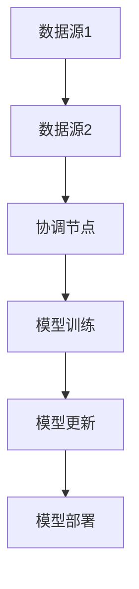
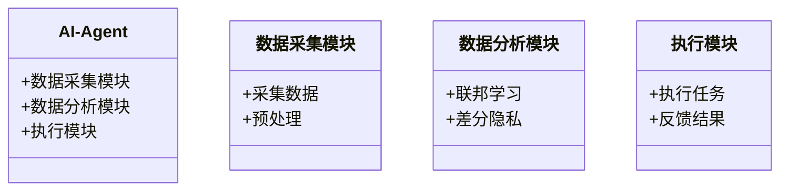
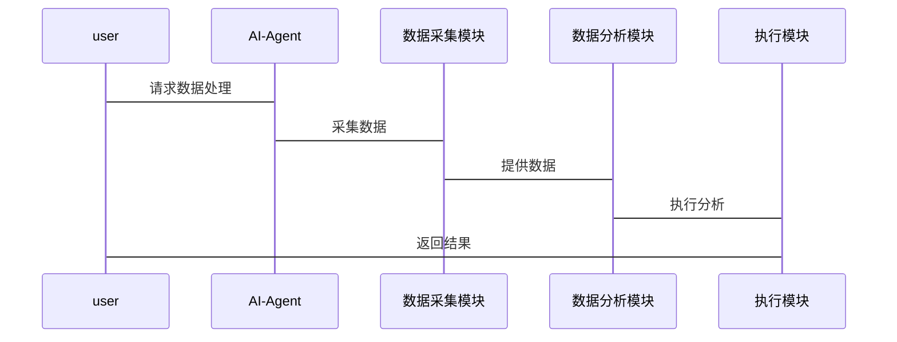

                 


```markdown
# 开发具有隐私保护数据分析能力的AI Agent

> 关键词：AI Agent, 数据隐私保护, 数据分析, 隐私保护, 联邦学习, 差分隐私

> 摘要：本文探讨了开发具有隐私保护数据分析能力的AI Agent的关键技术，涵盖背景、核心概念、算法原理、系统架构和实际案例。通过详细讲解，帮助读者理解如何在AI Agent中实现数据隐私保护。

---

# 第一部分: 开发具有隐私保护数据分析能力的AI Agent基础

# 第1章: 背景介绍

## 1.1 问题背景

### 1.1.1 数据隐私保护的重要性
随着AI技术的快速发展，数据隐私保护变得至关重要。AI Agent需要处理大量敏感数据，如何在不泄露隐私的前提下进行数据分析，成为亟待解决的问题。

### 1.1.2 AI Agent的定义与特点
AI Agent是一种智能代理，能够自主决策和执行任务。它具备自主性、反应性、社交性和持续性等特点，广泛应用于各个领域。

### 1.1.3 隐私保护与数据分析的结合
数据分析是AI Agent的核心功能，但如何在数据分析过程中保护隐私，是当前技术的难点。

## 1.2 核心概念

### 1.2.1 数据隐私保护的核心要素
- 数据机密性：防止未经授权的访问。
- 数据完整性：确保数据准确无误。
- 数据可用性：保证授权用户能访问数据。

### 1.2.2 AI Agent的功能与架构
AI Agent通常包括感知层、决策层和执行层。感知层负责数据采集，决策层进行数据分析，执行层完成任务。

### 1.2.3 问题的边界与外延
数据隐私保护的边界包括数据的生成、传输和存储，外延则涉及法律、伦理和用户隐私等。

## 1.3 本章小结

### 1.3.1 核心概念总结
数据隐私保护是AI Agent设计中的关键部分，需在各个阶段考虑隐私问题。

### 1.3.2 下一章的展望
下一章将详细讲解数据隐私保护的理论基础，包括加密、匿名化和访问控制等技术。

---

# 第2章: 数据隐私保护的理论基础

## 2.1 数据隐私保护的基本原理

### 2.1.1 数据加密与解密
- 加密算法：如AES和RSA。
- 解密过程：需要密钥，确保数据在传输和存储中的安全性。

### 2.1.2 数据匿名化技术
- 数据匿名化：通过技术手段去除或修改数据中的敏感信息，如K-anonymity。

### 2.1.3 数据访问控制机制
- 基于角色的访问控制（RBAC）：根据用户角色分配权限。
- 最细粒度访问控制：按数据粒度分配权限。

## 2.2 数据隐私保护的数学模型

### 2.2.1 数据加密的数学公式
- AES加密：使用置换和线性变换进行数据加密。
- RSA加密：基于大整数分解的公钥加密。

### 2.2.2 数据匿名化的概率模型
- K-anonymity的概率模型：确保数据在匿名化后，个体数据无法被唯一识别。

### 2.2.3 数据访问控制的逻辑模型
- RBAC模型：通过角色和权限矩阵进行访问控制。

## 2.3 本章小结

### 2.3.1 数据隐私保护的关键点
加密、匿名化和访问控制是数据隐私保护的三大核心。

### 2.3.2 下一章的关联
下一章将探讨隐私保护在数据分析中的具体技术，如联邦学习和差分隐私。

---

# 第3章: 隐私保护的数据分析技术

## 3.1 隐私保护数据分析的核心技术

### 3.1.1 联邦学习
- 联邦学习：多个参与方在不共享原始数据的情况下进行模型训练。
- 优点：数据不出域，保护隐私。

### 3.1.2 差分隐私
- 差分隐私：通过添加噪声，确保数据查询结果的隐私性。

### 3.1.3 本地差分隐私
- 本地差分隐私：数据在本地进行处理，保护隐私。

## 3.2 各种技术的对比分析

### 3.2.1 联邦学习与差分隐私的对比
| 技术 | 数据共享 | 数据处理 | 隐私保护 |
|------|----------|----------|----------|
| 联邦学习 | 不共享 | 分散计算 | 高 |
| 差分隐私 | 中央服务器 | 中央计算 | 高 |

### 3.2.2 本地差分隐私与其他技术的对比
本地差分隐私无需中央服务器，适用于边缘计算环境。

## 3.3 本章小结

### 3.3.1 各种技术的优缺点
- 联邦学习：保护隐私，但计算复杂。
- 差分隐私：平衡隐私与数据准确性。

### 3.3.2 下一章的关联
下一章将详细讲解AI Agent的设计与实现，包括隐私保护模块的实现。

---

# 第4章: AI Agent的设计与实现

## 4.1 AI Agent的架构设计

### 4.1.1 分层架构
- 感知层：数据采集。
- 决策层：数据分析。
- 执行层：任务执行。

### 4.1.2 模块化设计
- 数据采集模块：收集数据。
- 数据处理模块：清洗数据。
- 数据分析模块：分析数据。

### 4.1.3 数据流设计
数据从采集到分析的流程，确保每一步都考虑隐私保护。

## 4.2 隐私保护的数据分析模块实现

### 4.2.1 数据预处理
- 数据清洗：去除噪声。
- 数据匿名化：处理敏感信息。

### 4.2.2 数据分析算法选择
- 联邦学习：适用于多方数据。
- 差分隐私：适用于统计分析。

### 4.2.3 结果处理
- 结果匿名化：保护分析结果的隐私。

## 4.3 本章小结

### 4.3.1 架构设计的关键点
分层架构和模块化设计是实现隐私保护的基础。

### 4.3.2 下一章的关联
下一章将详细讲解隐私保护数据的算法实现，包括具体的加密和隐私保护机制。

---

# 第5章: 隐私保护数据分析算法实现

## 5.1 隐私保护数据分析算法的实现

### 5.1.1 联邦学习的实现



### 5.1.2 差分隐私的实现

```python
import numpy as np

def add_noise(data, epsilon):
    noise = np.random.laplace(0, 1/epsilon, len(data))
    return data + noise
```

### 5.1.3 本地差分隐私的实现

```python
def local_anonymization(data):
    # 数据匿名化处理
    return data
```

## 5.2 本章小结

### 5.2.1 各种算法的实现要点
- 联邦学习：数据不共享，模型更新。
- 差分隐私：添加噪声，保护隐私。
- 本地差分隐私：数据本地处理。

### 5.2.2 下一章的关联
下一章将探讨AI Agent的系统架构设计，包括模块划分和接口设计。

---

# 第6章: 系统架构设计

## 6.1 问题场景介绍

### 6.1.1 系统功能设计
- 数据采集模块：收集用户数据。
- 数据分析模块：分析数据，提供隐私保护。

### 6.1.2 系统架构设计



### 6.1.3 系统接口设计
- 数据采集接口：`collect_data()`
- 数据分析接口：`analyze_data()`

### 6.1.4 系统交互设计



## 6.2 本章小结

### 6.2.1 系统架构的关键点
模块化设计和接口设计是实现系统扩展性和维护性的关键。

### 6.2.2 下一章的关联
下一章将详细讲解项目实战，包括环境搭建和代码实现。

---

# 第7章: 项目实战

## 7.1 环境安装

### 7.1.1 安装依赖
```bash
pip install numpy pandas matplotlib
```

### 7.1.2 环境配置
```bash
export PATH=/path/to/python:$PATH
```

## 7.2 系统核心实现源代码

### 7.2.1 数据采集模块

```python
import pandas as pd

def collect_data():
    data = pd.read_csv('data.csv')
    return data
```

### 7.2.2 数据分析模块

```python
def federated_learning(data):
    # 联邦学习实现
    pass
```

### 7.2.3 执行模块

```python
def execute_task(data):
    # 执行数据分析任务
    pass
```

## 7.3 代码应用解读与分析

### 7.3.1 数据采集模块解读
- 读取CSV文件，预处理数据。

### 7.3.2 数据分析模块解读
- 使用联邦学习进行模型训练。

### 7.3.3 执行模块解读
- 执行数据分析任务，并反馈结果。

## 7.4 实际案例分析

### 7.4.1 案例背景
分析用户购买行为，预测销售趋势。

### 7.4.2 数据分析过程
- 数据采集：收集用户数据。
- 数据分析：使用联邦学习训练模型。
- 反馈结果：预测销售趋势。

## 7.5 本章小结

### 7.5.1 项目实战的关键点
代码实现、模块调用和结果分析是项目成功的关键。

### 7.5.2 下一章的关联
下一章将探讨高级主题，如法律和伦理问题。

---

# 第8章: 高级主题与未来趋势

## 8.1 法律法规与伦理问题

### 8.1.1 数据隐私保护的法律框架
- GDPR：欧盟通用数据保护条例。
- CCPA：加州消费者隐私法案。

### 8.1.2 伦理问题
- 数据使用是否符合伦理。
- 隐私保护与数据可用性的平衡。

## 8.2 未来趋势

### 8.2.1 技术发展
- 更先进的加密算法。
- 更高效的隐私保护技术。

### 8.2.2 应用场景扩展
- 更多行业应用隐私保护AI Agent。
- 边缘计算中的隐私保护。

## 8.3 本章小结

### 8.3.1 高级主题的关键点
法律法规和伦理问题是实现隐私保护的重要因素。

### 8.3.2 未来趋势展望
技术进步将推动隐私保护AI Agent的发展。

---

# 作者：AI天才研究院/AI Genius Institute & 禅与计算机程序设计艺术 /Zen And The Art of Computer Programming
```

