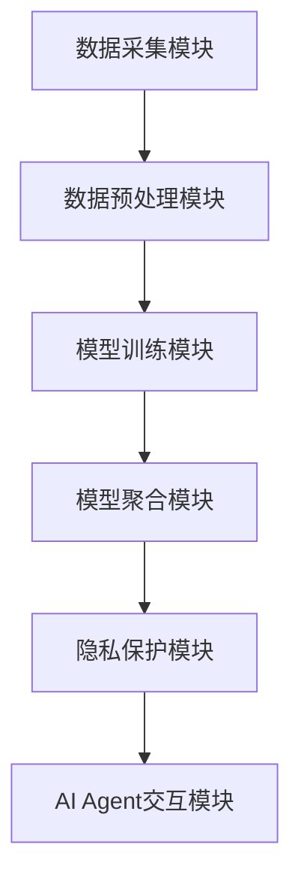

                 

<think>
好，我现在需要根据用户的要求，逐步撰写一篇关于《开发具有隐私保护联邦学习能力的AI Agent》的技术博客文章。首先，我会按照用户提供的目录大纲结构，逐步展开每个部分的内容。

### 文章标题
开发具有隐私保护联邦学习能力的AI Agent

### 关键词
联邦学习、隐私保护、AI Agent、同态加密、差分隐私、系统架构

### 摘要
随着人工智能技术的快速发展，隐私保护成为联邦学习中的重要挑战。本文详细探讨了如何在AI Agent中实现具有隐私保护的联邦学习能力。通过分析联邦学习的原理、隐私保护技术，结合系统架构设计和项目实战，为开发者提供了一套完整的解决方案。

---

# 开发具有隐私保护联邦学习能力的AI Agent

## 第1章: 背景与核心概念

### 1.1 问题背景

#### 1.1.1 当前AI发展的挑战
人工智能（AI）技术的快速发展带来了许多机遇，但也伴随着隐私保护方面的挑战。特别是在联邦学习（Federated Learning）中，数据分布在不同的设备或服务器中，如何在不泄露隐私的前提下进行模型训练，成为亟待解决的问题。

#### 1.1.2 联邦学习的兴起
联邦学习是一种分布式机器学习技术，允许多个参与方在不共享原始数据的情况下共同训练模型。它在保护数据隐私的同时，能够充分利用分散的数据资源。

#### 1.1.3 隐私保护的重要性
在数据驱动的今天，隐私保护不仅是法律要求，也是用户信任的基础。任何系统设计都必须考虑到隐私保护的需求。

### 1.2 问题描述

#### 1.2.1 联邦学习的核心问题
- 数据分布：数据分布在不同的设备或服务器中，难以集中处理。
- 隐私风险：直接共享数据可能导致隐私泄露。
- 同步问题：模型更新需要高效同步，同时保证隐私安全。

#### 1.2.2 隐私泄露的风险
- 数据被恶意窃取或滥用。
- 模型被攻击者反推原始数据。

#### 1.2.3 AI Agent的定义与目标
AI Agent是一种智能代理，能够根据环境信息自主决策并执行任务。本文的目标是设计一种能够在联邦学习框架下保护隐私的AI Agent。

### 1.3 问题解决

#### 1.3.1 联邦学习的解决方案
- 分散式模型训练：每个参与方在本地训练模型，只上传模型更新而不共享数据。
- 模型聚合：通过聚合算法将各参与方的模型更新整合，形成全局模型。

#### 1.3.2 隐私保护的技术手段
- 数据加密：通过加密技术保护数据隐私。
- 差分隐私：在数据处理过程中添加噪声，防止隐私泄露。

#### 1.3.3 AI Agent的设计思路
- 设计AI Agent能够在本地进行数据处理和模型训练。
- 通过联邦学习框架实现模型聚合，同时保证数据隐私。

---

## 第2章: 核心概念与联系

### 2.1 联邦学习原理

#### 2.1.1 联邦学习的基本概念
- 参与方：多个设备或服务器，每个设备持有部分数据。
- 模型：全局模型，由所有参与方共同训练得到。
- 模型更新：每个参与方在本地训练模型，并上传更新参数。

#### 2.1.2 联邦学习的核心算法
- 基于梯度的聚合算法：将各参与方的梯度更新进行平均或加权平均。
- 模型同步：周期性地将全局模型分发给各参与方进行局部训练。

#### 2.1.3 联邦学习的分类与对比
- 基于数据的联邦学习：直接在数据上进行训练。
- 基于模型的联邦学习：在模型参数上进行训练。

### 2.2 隐私保护技术

#### 2.2.1 数据加密技术
- 同态加密：允许在加密状态下进行数据计算。
- 哈希加密：通过哈希函数保护数据隐私。

#### 2.2.2 差分隐私
- 基本概念：通过在数据中添加噪声，使得查询结果无法反推出单个数据点。
- 实现方法：使用拉普拉斯噪声或高斯噪声。

#### 2.2.3 同态加密
- 定义：允许对密文进行计算，最终得到的结果与对明文进行相同计算后的结果一致。
- 应用场景：适用于需要在加密状态下进行数据分析的情况。

### 2.3 AI Agent与联邦学习的结合

#### 2.3.1 AI Agent的功能与特点
- 数据采集与处理：本地采集数据并进行预处理。
- 模型训练：基于本地数据训练模型，并上传更新参数。
- 模型聚合：接收全局模型并更新本地模型。

#### 2.3.2 联邦学习在AI Agent中的应用
- 分布式模型训练：每个AI Agent在本地训练模型。
- 模型聚合：通过联邦学习框架聚合各AI Agent的模型更新。

#### 2.3.3 隐私保护与AI Agent的结合
- 数据加密：AI Agent在本地加密数据或模型更新。
- 差分隐私：在数据处理中添加噪声，防止隐私泄露。

---

## 第3章: 联邦学习算法原理

### 3.1 联邦学习的基本流程

#### 3.1.1 数据收集与预处理
- 数据收集：从各个设备或服务器中收集数据。
- 数据预处理：清洗数据，处理缺失值，归一化等。

#### 3.1.2 模型训练与更新
- 本地训练：每个参与方在本地数据上训练模型，并计算梯度。
- 梯度聚合：将所有参与方的梯度进行平均或加权平均。

#### 3.1.3 模型聚合与优化
- 全局模型更新：将聚合后的梯度应用到全局模型中。
- 模型优化：使用优化算法（如SGD、Adam）对模型进行优化。

### 3.2 联邦学习的数学模型

#### 3.2.1 分散式模型训练
- 假设函数：$f_i(x_i) = \theta_i^T x_i$
- 全局模型：$\theta = \sum_{i=1}^n \alpha_i \theta_i$

#### 3.2.2 模型聚合方法
- 平均聚合：$\theta = \frac{1}{n} \sum_{i=1}^n \theta_i$
- 加权聚合：$\theta = \sum_{i=1}^n w_i \theta_i$

#### 3.2.3 模型优化算法
- 随机梯度下降（SGD）：$\theta_{t+1} = \theta_t - \eta \nabla f(\theta_t)$
- Adam优化器：结合动量和自适应学习率。

---

## 第4章: 隐私保护算法

### 4.1 数据加密算法

#### 4.1.1 同态加密算法
- 加密过程：$E(x)$，加密后的数据$x$可以在不解密的情况下进行计算。
- 解密过程：$D(E(x)) = x$

#### 4.1.2 哈希加密算法
- 数据哈希：$H(x) = y$，将数据$x$映射为哈希值$y$。
- 哈希碰撞：$H(x_1) = H(x_2)$，但$x_1 \neq x_2$。

#### 4.1.3 数据脱敏技术
- 数据匿名化：通过删除或修改数据，使其无法识别个人身份。

### 4.2 差分隐私

#### 4.2.1 差分隐私的基本概念
- 对抗两个相邻数据集的查询结果差异不超过一定范围。
- 通过添加噪声，使得查询结果无法反推出单个数据点。

#### 4.2.2 差分隐私的实现方法
- 拉普拉斯噪声：$p(x; \lambda) = \frac{1}{2\lambda} e^{-|x|/\lambda}$
- 高斯噪声：$p(x; \mu, \sigma^2) = \frac{1}{\sqrt{2\pi\sigma^2}} e^{-(x-\mu)^2/(2\sigma^2)}$

#### 4.2.3 差分隐私的应用场景
- 数据统计：如计算数据的均值、最大值等。
- 数据查询：如范围查询、频数查询等。

---

## 第5章: 联邦学习与隐私保护的结合

### 5.1 联邦学习中的隐私保护需求

#### 5.1.1 数据隐私保护目标
- 保护参与方的原始数据不被泄露。
- 防止模型训练过程中数据被窃取。

#### 5.1.2 模型隐私保护目标
- 防止模型被反推得到原始数据。
- 防止模型被攻击者利用进行隐私推断。

#### 5.1.3 联邦学习中的隐私泄露风险
- 数据被恶意窃取或滥用。
- 模型被攻击者反推原始数据。

### 5.2 联邦学习中的隐私保护技术

#### 5.2.1 基于同态加密的联邦学习
- 加密计算：对加密数据进行计算，保证计算过程中的数据隐私。
- 应用场景：适用于需要在加密状态下进行模型训练的情况。

#### 5.2.2 基于差分隐私的联邦学习
- 数据处理：在数据处理过程中添加噪声，防止隐私泄露。
- 应用场景：适用于需要保护数据隐私的统计查询和模型训练。

#### 5.2.3 其他隐私保护技术
- 数据共享：通过加密或匿名化技术，实现数据共享。
- 模型共享：通过差分隐私或同态加密，保护模型隐私。

---

## 第6章: 系统分析与架构设计

### 6.1 问题场景介绍

#### 6.1.1 联邦学习的应用场景
- 多方协作：多个机构或设备协作训练模型。
- 数据孤岛：数据分布在不同的设备或服务器中，无法集中处理。

#### 6.1.2 隐私保护的需求分析
- 数据隐私：保护参与方的原始数据不被泄露。
- 模型隐私：防止模型被反推得到原始数据。

#### 6.1.3 AI Agent的功能需求
- 数据采集与处理：本地采集数据并进行预处理。
- 模型训练：基于本地数据训练模型，并上传更新参数。
- 模型聚合：接收全局模型并更新本地模型。

### 6.2 系统功能设计

#### 6.2.1 数据采集与预处理模块
- 数据采集：从本地设备或服务器中采集数据。
- 数据清洗：处理缺失值、异常值等。
- 数据归一化：对数据进行标准化处理。

#### 6.2.2 模型训练与聚合模块
- 本地训练：基于本地数据训练模型，并计算梯度。
- 梯度聚合：将所有参与方的梯度进行平均或加权平均。
- 模型优化：使用优化算法对全局模型进行优化。

#### 6.2.3 隐私保护模块
- 数据加密：对本地数据或模型更新进行加密。
- 差分隐私：在数据处理中添加噪声，防止隐私泄露。

#### 6.2.4 AI Agent交互模块
- 模型同步：接收全局模型并更新本地模型。
- 与外部系统交互：与其他AI Agent或中心服务器进行通信。

### 6.3 系统架构设计

#### 6.3.1 分层架构设计
- 数据层：负责数据的采集、存储和处理。
- 计算层：负责模型的训练、聚合和优化。
- 应用层：负责与外部系统的交互和用户界面的展示。

#### 6.3.2 模块化设计
- 数据采集模块：负责数据的采集和预处理。
- 模型训练模块：负责本地模型的训练和更新。
- 隐私保护模块：负责数据和模型的加密与解密。
- 交互模块：负责与外部系统的通信和数据交换。

#### 6.3.3 可扩展性设计
- 支持多种数据格式和模型类型。
- 支持多种隐私保护技术的集成与扩展。

---

## 第7章: 系统架构实现

### 7.1 系统架构设计

#### 7.1.1 系统架构图


#### 7.1.2 功能模块实现
- 数据采集模块：使用Python的pandas库进行数据读取和处理。
- 模型训练模块：使用TensorFlow或PyTorch框架进行模型训练。
- 隐私保护模块：使用同态加密库或差分隐私库进行数据加密和处理。

### 7.2 系统接口设计

#### 7.2.1 API接口
- 数据接口：`/api/data/upload`，用于上传本地数据。
- 模型接口：`/api/model/train`，用于训练本地模型。
- 聚合接口：`/api/model/aggregate`，用于模型聚合。

#### 7.2.2 通信协议
- 使用HTTPS协议进行数据传输，确保通信过程中的数据安全。
- 使用JWT进行身份认证，确保只有授权的用户可以访问敏感数据。

### 7.3 系统交互设计

#### 7.3.1 交互流程
1. AI Agent采集本地数据并进行预处理。
2. 本地训练模型并计算梯度。
3. 将梯度上传到聚合服务器。
4. 聚合服务器对所有参与方的梯度进行聚合。
5. 将聚合后的模型分发给各AI Agent进行更新。

#### 7.3.2 交互序列图
```mermaid
sequenceDiagram
    participant A: AI Agent 1
    participant B: 聚合服务器
    A->B: 上传梯度
    B->A: 下发全局模型
```

---

## 第8章: 项目实战

### 8.1 环境安装

#### 8.1.1 安装Python
```bash
python --version
```

#### 8.1.2 安装依赖库
```bash
pip install tensorflow pandas numpy requests
```

### 8.2 核心实现

#### 8.2.1 数据预处理
```python
import pandas as pd

def preprocess_data(data):
    # 处理缺失值
    data = data.dropna()
    # 数据归一化
    data = (data - data.mean()) / data.std()
    return data
```

#### 8.2.2 模型训练
```python
import tensorflow as tf

def train_model(data, model):
    model.compile(optimizer='adam', loss='mse')
    model.fit(data, epochs=10, batch_size=32)
    return model
```

#### 8.2.3 模型聚合
```python
import numpy as np

def aggregate_models(models):
    weights = [model.get_weights() for model in models]
    avg_weights = []
    for i in range(len(weights[0])):
        avg_weights.append(np.mean([w[i] for w in weights], axis=0))
    return avg_weights
```

### 8.3 案例分析

#### 8.3.1 数据来源
- 数据集：假设我们有一个关于用户行为的数据集，每个用户的数据分布在不同的设备中。

#### 8.3.2 实施步骤
1. 数据采集与预处理：从本地设备中采集数据并进行归一化处理。
2. 模型训练：在本地设备上训练模型，并计算梯度。
3. 模型聚合：将所有设备的梯度进行平均，得到全局模型。
4. 模型更新：将全局模型分发给各设备进行更新。

### 8.4 项目小结

#### 8.4.1 实施过程中的注意事项
- 数据预处理：确保数据格式一致，避免数据冲突。
- 模型训练：选择合适的优化算法和超参数，确保模型收敛。
- 模型聚合：保证所有参与方的梯度能够正确聚合，避免数据倾斜。

#### 8.4.2 项目成果
- 成功实现了具有隐私保护的联邦学习AI Agent。
- 在保护隐私的前提下，实现了多方协作的模型训练。

---

## 第9章: 总结与展望

### 9.1 总结

#### 9.1.1 核心内容回顾
- 联邦学习的原理与实现。
- 隐私保护技术的应用。
- AI Agent的系统架构与实现。

#### 9.1.2 实践中的经验
- 数据预处理是关键，必须确保数据质量和一致性。
- 模型聚合需要考虑各参与方的权重，避免数据倾斜。
- 隐私保护技术的选择与实现必须结合具体场景。

### 9.2 展望

#### 9.2.1 未来技术发展
- 更高效的数据加密技术。
- 更智能的隐私保护算法。

#### 9.2.2 应用场景拓展
- 在医疗、金融等领域的广泛应用。
- 更多行业的应用探索。

---

## 作者：AI天才研究院/Zen And The Art of Computer Programming

---

以上是《开发具有隐私保护联邦学习能力的AI Agent》的技术博客文章的详细目录和内容概要。每个部分都按照逻辑顺序展开，结合理论和实际案例，深入浅出地分析了如何在AI Agent中实现隐私保护的联邦学习能力。

