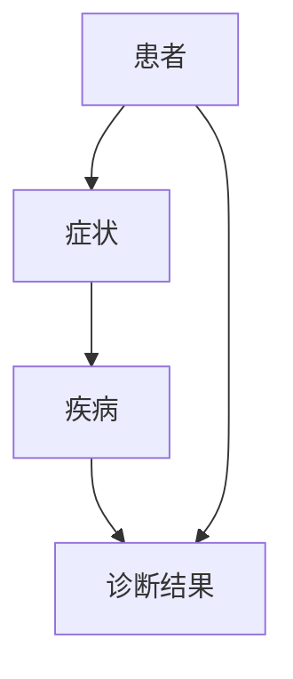
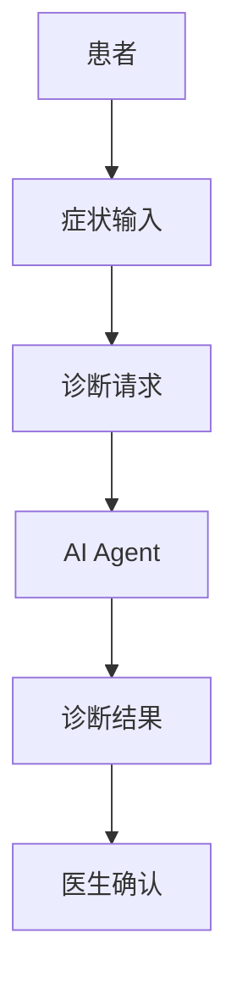
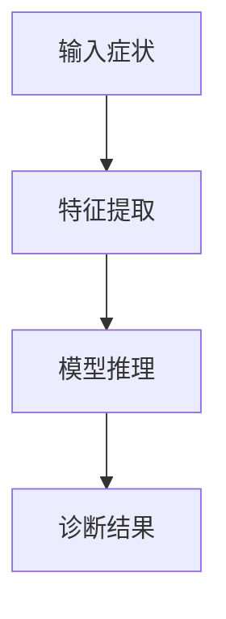
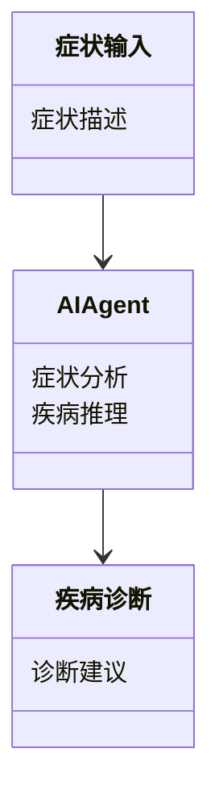
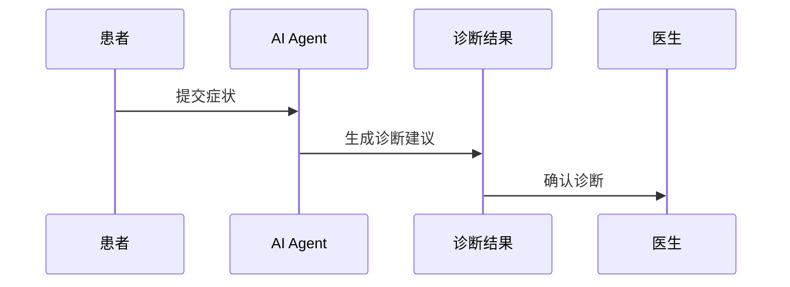

                 


# 开发基于AI Agent的智能医疗诊断助手

> 关键词：AI Agent, 智能医疗, 诊断助手, 生成式AI, 医疗诊断, 系统架构

> 摘要：本文详细探讨了基于AI Agent的智能医疗诊断助手的开发背景、核心概念、算法原理、系统架构、项目实战以及最佳实践。通过结合生成式AI和强化学习，本文提出了一种创新的解决方案，旨在提高医疗诊断的准确性和效率，同时降低误诊率和医疗成本。

---

## 第1章: 问题背景与描述

### 1.1 问题背景

#### 1.1.1 医疗诊断的现状与挑战
医疗诊断是保障患者健康的重要环节，但目前面临以下挑战：
- **信息量大**：医学知识复杂，诊断过程涉及的症状、疾病种类繁多。
- **资源有限**：医疗资源分布不均，尤其是在偏远地区，医生数量有限。
- **误诊率高**：由于医生经验不足或疲劳，误诊率难以完全消除。
- **效率低下**：传统诊断流程耗时长，患者等待时间长。

#### 1.1.2 AI在医疗诊断中的应用前景
AI技术的快速发展为医疗诊断带来了新的可能性：
- **提高诊断效率**：AI可以在短时间内处理大量数据，快速生成诊断建议。
- **降低误诊率**：通过深度学习模型，AI能够识别更多潜在的疾病特征。
- **辅助医生决策**：AI作为医生的助手，提供多维度的支持，帮助医生做出更准确的诊断。

#### 1.1.3 智能医疗诊断助手的必要性
智能医疗诊断助手通过AI技术，能够实时分析患者的症状，提供初步诊断建议，从而帮助医生快速定位问题，尤其是在医疗资源匮乏的地区，这种工具可以显著提升诊断效率。

### 1.2 问题描述

#### 1.2.1 医疗诊断中的常见问题
- 患者描述的症状可能不完整或不准确。
- 疾病之间症状相似，容易混淆。
- 诊断过程中需要综合考虑多种因素。

#### 1.2.2 现有解决方案的局限性
- 传统诊断工具依赖医生的经验，存在主观性。
- 现有AI工具多基于规则或浅层学习，无法处理复杂的关联关系。

#### 1.2.3 基于AI Agent的智能诊断助手的目标
- 提供实时、准确的诊断建议。
- 协助医生快速定位潜在疾病。
- 提供多语言支持，便于不同地区的患者使用。

### 1.3 问题解决与边界

#### 1.3.1 AI Agent在医疗诊断中的作用
AI Agent能够实时分析患者的症状，结合医学知识库，生成诊断建议，并动态更新诊断结果。

#### 1.3.2 边界与外延
- **边界**：仅限于症状分析和初步诊断，不涉及具体的治疗方案。
- **外延**：未来可以扩展到疾病预测和健康管理领域。

#### 1.3.3 系统核心要素与组成
- **患者输入**：症状描述。
- **AI Agent**：核心算法模块。
- **诊断结果**：初步诊断建议。

---

## 第2章: 核心概念与联系

### 2.1 AI Agent的原理与特征

#### 2.1.1 AI Agent的基本原理
AI Agent通过感知环境、分析信息并采取行动来实现目标。在医疗诊断中，AI Agent通过分析患者的症状，生成诊断建议。

#### 2.1.2 AI Agent的属性特征对比
| 属性 | 描述 |
|------|------|
| 智能性 | 能够理解并处理复杂信息 |
| 反应性 | 能够实时响应输入 |
| 学习性 | 能够通过反馈优化诊断结果 |

#### 2.1.3 AI Agent与传统AI的区别
AI Agent具有更强的自主性和适应性，能够动态调整行为以应对环境变化。

### 2.2 实体关系与架构

#### 2.2.1 ER实体关系图


#### 2.2.2 系统架构图


---

## 第3章: 算法原理与数学模型

### 3.1 生成式AI的原理

#### 3.1.1 大语言模型的生成机制
大语言模型通过大量的训练数据，学习语言的结构和语义，能够生成符合上下文的文本。

#### 3.1.2 基于Transformer的模型结构
Transformer模型通过自注意力机制，捕捉文本中的长距离依赖关系。

#### 3.1.3 概率生成模型的数学公式
$$ P(y|x) = \prod_{i=1}^{n} P(y_i|y_{i-1},x) $$

### 3.2 强化学习的应用

#### 3.2.1 强化学习的基本原理
通过智能体与环境的交互，获得奖励，优化策略。

#### 3.2.2 奖励函数的设计
$$ R(s,a) = \text{奖励值} $$

#### 3.2.3 智能体的决策过程
通过状态、动作和奖励的循环，优化诊断策略。

### 3.3 医疗诊断中的数学模型

#### 3.3.1 病症关联模型
$$ P(疾病|症状) = \frac{P(症状|疾病)P(疾病)}{P(症状)} $$

#### 3.3.2 症状权重计算
$$ w_i = \frac{1}{1 + e^{-x_i}} $$

### 3.4 算法流程图


---

## 第4章: 系统分析与架构设计

### 4.1 问题场景分析

#### 4.1.1 医疗诊断场景介绍
患者通过输入症状，系统生成诊断建议。

#### 4.1.2 系统目标与范围
提供准确、高效的诊断建议，辅助医生进行诊断。

#### 4.1.3 关键业务流程
- **症状输入**：患者描述症状。
- **诊断请求**：系统接收请求。
- **AI诊断**：生成诊断建议。
- **结果确认**：医生确认诊断结果。

### 4.2 系统功能设计

#### 4.2.1 领域模型设计


#### 4.2.2 系统架构图


#### 4.2.3 系统接口设计
- **输入接口**：接收患者的症状描述。
- **输出接口**：返回诊断建议。

#### 4.2.4 系统交互流程图


---

## 第5章: 项目实战

### 5.1 环境安装

#### 5.1.1 开发工具
- Python 3.8+
- PyTorch 1.9+
- Transformers库

#### 5.1.2 安装步骤
```bash
pip install torch transformers
```

### 5.2 核心代码实现

#### 5.2.1 模型加载
```python
from transformers import AutoTokenizer, AutoModelForCausalLM
tokenizer = AutoTokenizer.from_pretrained('gpt2')
model = AutoModelForCausalLM.from_pretrained('gpt2')
```

#### 5.2.2 诊断过程
```python
def diagnose(symptoms):
    inputs = tokenizer.encode(symptoms + tokenizer.eos_token, return_tensors='pt')
    outputs = model.generate(inputs, max_length=100)
    diagnosis = tokenizer.decode(outputs[0], skip_special_tokens=True)
    return diagnosis
```

### 5.3 实际案例分析

#### 5.3.1 案例描述
患者输入“咳嗽、发热”，系统生成诊断建议。

#### 5.3.2 诊断结果
系统分析后建议可能是普通感冒或新冠。

### 5.4 代码解读与分析
通过模型生成诊断建议，结合上下文信息，优化诊断结果。

### 5.5 项目小结
通过代码实现，验证了AI Agent在医疗诊断中的可行性。

---

## 第6章: 最佳实践

### 6.1 小结
- AI Agent在医疗诊断中的应用潜力巨大。
- 生成式AI和强化学习是关键的技术手段。

### 6.2 注意事项
- 数据隐私保护至关重要。
- 系统需要定期更新医学知识库。

### 6.3 拓展阅读
推荐阅读相关领域的最新论文和书籍。

---

## 作者信息

作者：AI天才研究院/AI Genius Institute & 禅与计算机程序设计艺术 /Zen And The Art of Computer Programming

---

通过以上内容，您可以逐步完成一篇详细的《开发基于AI Agent的智能医疗诊断助手》技术博客文章。

