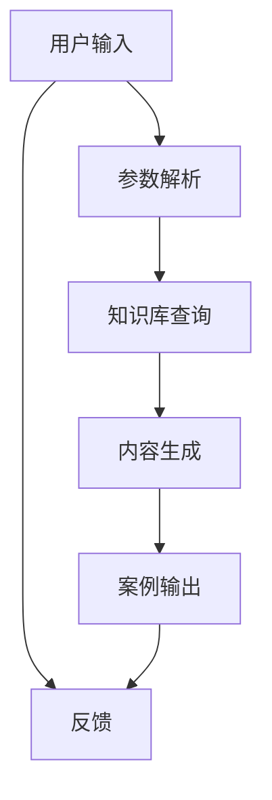

                 

# 开发基于大模型的金融专业教学案例动态生成器

> 关键词：大模型，金融教学，案例生成，动态生成，自然语言处理，深度学习

> 摘要：本文详细探讨了如何利用大模型技术，开发一个能够动态生成金融专业教学案例的系统。通过分析大模型的核心原理、算法实现、系统架构及实际应用案例，展示了如何在金融教育领域中高效利用AI技术生成高质量的教学内容。

---

# 第一部分: 开发背景与核心概念

## 第1章: 背景介绍

### 1.1 问题背景

#### 1.1.1 传统金融教学案例开发的痛点

在传统的金融教育中，教学案例的开发往往依赖于人工编写，这不仅耗时耗力，而且难以满足多样化的教学需求。教师需要投入大量时间收集数据、设计场景、撰写内容，并不断调整以适应不同学生的学习水平和教学目标。这种模式不仅效率低下，还容易受到主观因素的限制，难以保证案例的多样性和创新性。

此外，金融市场环境瞬息万变，新的金融产品、政策法规和市场趋势层出不穷。传统的静态案例难以跟上时代的步伐，导致教学内容与实际市场脱节，影响教学效果。

#### 1.1.2 大模型技术的引入及其优势

随着自然语言处理（NLP）技术的飞速发展，大模型（如GPT、BERT等）展现了强大的文本生成能力。这些模型能够通过大量数据的训练，理解复杂的金融概念，并自动生成符合教学需求的内容。引入大模型技术，可以显著提升金融教学案例的生成效率和质量，同时降低开发成本。

大模型的优势主要体现在以下几个方面：
1. **高效生成**：通过自动化生成案例内容，节省教师的时间和精力。
2. **多样化输出**：模型可以根据不同的需求生成多种风格和难度的案例，满足个性化教学需求。
3. **动态更新**：基于最新的市场数据和信息，模型可以实时生成与时俱进的案例。

#### 1.1.3 金融专业教学案例动态生成的需求

在金融教育领域，动态生成教学案例的需求主要来源于以下几个方面：
1. **个性化教学**：学生的学习水平和兴趣点各不相同，动态生成案例可以更好地满足个体化需求。
2. **实时性要求**：金融市场信息瞬息万变，教学案例需要及时反映最新的市场动态。
3. **多样化场景**：金融领域涉及的知识点广泛，动态生成可以覆盖更多场景，如风险管理、投资策略、法律法规等。

---

### 1.2 问题描述

#### 1.2.1 金融教学案例的特点与复杂性

金融教学案例具有以下几个特点：
1. **专业性强**：涉及金融学、经济学、法律法规等多个领域。
2. **数据依赖性高**：案例需要基于真实的金融数据和市场信息。
3. **场景多样性**：案例需要涵盖不同的金融场景，如公司财务、投资决策、风险管理等。

#### 1.2.2 动态生成的需求与挑战

动态生成金融教学案例的需求主要体现在以下几个方面：
1. **快速响应**：能够根据输入的参数快速生成案例。
2. **高度定制化**：支持根据具体需求（如难度、知识点）生成案例。
3. **内容准确性**：生成的案例需要符合金融行业的规范和要求。

然而，实现动态生成也面临诸多挑战：
1. **数据质量**：需要高质量的金融数据和案例库支持模型训练。
2. **模型调优**：需要对大模型进行针对性的优化，以确保生成内容的准确性和相关性。
3. **用户反馈**：需要根据用户反馈不断优化生成效果，这是一个持续改进的过程。

#### 1.2.3 边界与外延

动态生成金融教学案例的边界主要在于：
1. **数据范围**：模型只能生成基于训练数据范围内的案例，超出数据范围的内容无法生成。
2. **生成长度**：生成的案例长度和复杂度受到模型计算能力的限制。
3. **实时性**：动态生成需要依赖实时数据更新，否则生成的内容可能过时。

从外延角度看，动态生成技术可以扩展到其他领域，如法律文书生成、医疗案例分析等，但本文主要聚焦于金融教学场景。

---

### 1.3 问题解决

#### 1.3.1 大模型在案例生成中的作用

大模型在金融教学案例生成中的作用主要体现在以下几个方面：
1. **内容生成**：通过自然语言生成技术，自动生成高质量的教学案例。
2. **数据整合**：将分散的金融数据和知识整合到生成的案例中。
3. **个性化调整**：根据用户需求（如难度、知识点）动态调整生成内容。

#### 1.3.2 技术实现路径

实现基于大模型的金融教学案例动态生成器，可以按照以下步骤进行：
1. **数据收集与处理**：收集金融领域的相关数据和案例，进行清洗和标注。
2. **模型选择与训练**：选择合适的模型架构（如GPT），并基于收集的数据进行微调。
3. **接口开发**：开发用户友好的接口，方便教师和学生使用。
4. **生成与优化**：根据用户输入生成案例，并根据反馈不断优化生成效果。

#### 1.3.3 应用场景与目标

动态生成器的应用场景主要包括：
1. **教学辅助**：帮助教师快速生成教学案例。
2. **学生自学**：学生可以通过输入特定知识点生成自学案例。
3. **培训材料**：为企业培训提供定制化的金融案例。

其目标是通过自动化生成高质量的金融教学案例，提升教学效率和效果，同时降低开发成本。

---

### 1.4 核心概念与联系

#### 1.4.1 核心概念原理

动态生成器的核心概念包括：
1. **自然语言生成**：通过大模型生成符合语法和语义的文本。
2. **金融知识库**：存储金融领域的专业知识和数据。
3. **动态调整机制**：根据用户需求动态调整生成内容。

#### 1.4.2 核心概念属性特征对比表格

| 概念          | 特性                     | 优势                           |
|---------------|--------------------------|--------------------------------|
| 自然语言生成  | 基于大模型的文本生成技术 | 高效生成复杂文本               |
| 金融知识库    | 专业的金融数据和案例     | 确保生成内容的专业性和准确性     |
| 动态调整机制  | 根据输入参数动态生成内容 | 高度定制化，满足个性化需求     |

#### 1.4.3 ER实体关系图架构（Mermaid流程图）

---

## 总结

通过以上背景介绍，我们明确了开发基于大模型的金融专业教学案例动态生成器的必要性及其核心概念。接下来，我们将深入探讨大模型的核心原理、算法实现以及系统架构设计。

