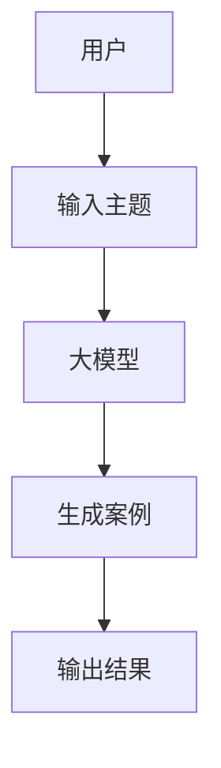
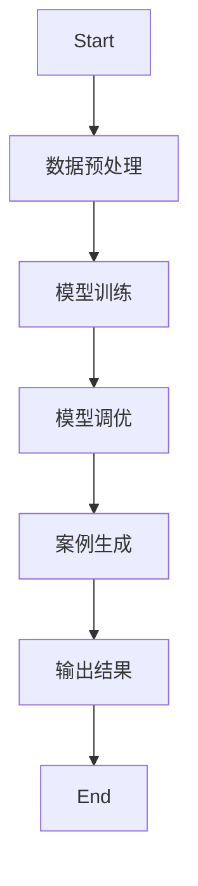
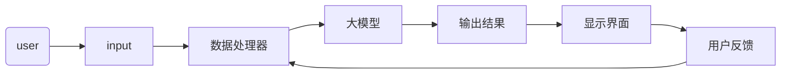

                 


# 开发基于大模型的金融专业教学案例自动生成器

> 关键词：大模型、金融教育、案例生成、自然语言处理、机器学习

> 摘要：本文详细探讨了如何利用大模型技术开发一个能够自动生成金融专业教学案例的系统。通过分析问题背景、核心概念、算法原理、系统架构以及项目实战，本文为读者提供了从理论到实践的全面指导。文章还提供了最佳实践建议，帮助读者更好地理解和应用相关技术。

---

## 第1章 背景介绍

### 1.1 问题背景

#### 1.1.1 传统金融教学案例开发的挑战
在传统的金融教育中，教学案例的开发需要耗费大量时间和资源。教师需要深入研究复杂的金融理论和实际案例，确保案例的准确性和实用性。此外，不同学生的学习需求差异较大，定制化案例开发难度更高。

#### 1.1.2 大模型在教育领域的潜力
大模型（如GPT系列）在自然语言处理领域取得了显著进展，能够生成高质量的文本内容。将其应用于教育领域，特别是金融教学案例的生成，可以显著提高效率，降低成本。

#### 1.1.3 金融专业教学案例的需求分析
金融领域涉及众多复杂概念和实际案例，如股票分析、风险管理等。教学案例需要涵盖这些内容，同时具备可定制性和灵活性，以适应不同教学场景的需求。

### 1.2 问题描述

#### 1.2.1 现有教学案例开发的痛点
传统案例开发周期长、成本高，且难以满足个性化需求。此外，案例的质量和准确性也存在较大风险。

#### 1.2.2 大模型在教学案例生成中的优势
大模型能够快速生成大量高质量的案例，支持定制化需求，并提供多样化的场景选择。同时，模型可以通过不断优化提升生成质量。

#### 1.2.3 问题解决的目标与范围
目标是开发一个基于大模型的系统，能够自动生成高质量、个性化的金融教学案例。范围包括案例生成、质量评估和用户反馈机制。

### 1.3 问题解决方法

#### 1.3.1 大模型在案例生成中的应用
利用大模型的自然语言处理能力，输入金融相关主题后，生成相应的案例。

#### 1.3.2 技术实现的可行性分析
通过预训练模型微调、数据增强等技术，提高模型在金融领域的适应性。

#### 1.3.3 解决方案的创新点
结合大模型和教育需求，提出了一种自动化、智能化的案例生成方法。

### 1.4 边界与外延

#### 1.4.1 系统的边界条件
系统仅生成案例，不处理案例的实施效果评估。

#### 1.4.2 相关领域的外延分析
案例生成涉及数据处理、模型调优等多个领域。

#### 1.4.3 与其他系统的区别与联系
与其他教育工具相比，本系统具有更高的自动化和智能化。

### 1.5 核心要素组成

#### 1.5.1 大模型的输入与输出
输入是金融主题，输出是相应的案例。

#### 1.5.2 金融案例的关键特征
案例应包含背景、问题、分析和解决方案。

#### 1.5.3 系统功能模块的划分
包括数据处理、模型调用、结果优化和用户反馈模块。

---

## 第2章 核心概念与联系

### 2.1 大模型在金融教育中的应用原理

#### 2.1.1 大模型的基本原理
大模型通过预训练掌握语言规律，再通过微调适应特定任务。

#### 2.1.2 金融案例生成的核心机制
模型根据输入主题生成相关文本，用户可调整参数以获得所需案例。

#### 2.1.3 大模型与金融知识的结合
通过微调和数据增强，提升模型在金融领域的表现。

### 2.2 核心概念对比表格

| 特性          | 传统案例开发 | 基于大模型的案例生成 |
|---------------|--------------|-----------------------|
| 开发时间       | 长           | 短                   |
| 成本           | 高           | 低                   |
| 个性化支持     | 低           | 高                   |
| 质量           | 中           | 高                   |

### 2.3 ER实体关系图



---

## 第3章 算法原理讲解

### 3.1 大模型的训练与优化

#### 3.1.1 数据预处理
- 清洗数据：去除噪声，保留高质量金融文本。
- 分词处理：将文本分割成词语或短语。

#### 3.1.2 模型训练
- 预训练：使用大规模通用数据训练基础模型。
- 微调：在金融领域数据上进行微调，提升模型专业性。

#### 3.1.3 模型调优
- 参数调整：优化学习率、批量大小等超参数。
- 模型评估：使用准确率、F1值等指标评估性能。

#### 3.1.4 案例生成
- 输入主题：如“股票市场分析”。
- 生成过程：模型根据主题生成案例。

### 3.2 算法流程图



### 3.3 核心代码实现

```python
import torch
import torch.nn as nn

class SimpleModel(nn.Module):
    def __init__(self, input_dim, hidden_dim, output_dim):
        super(SimpleModel, self).__init__()
        self.fc1 = nn.Linear(input_dim, hidden_dim)
        self.fc2 = nn.Linear(hidden_dim, output_dim)
    
    def forward(self, x):
        x = torch.relu(self.fc1(x))
        x = self.fc2(x)
        return x

# 示例训练代码
model = SimpleModel(input_dim=100, hidden_dim=50, output_dim=1)
criterion = nn.MSELoss()
optimizer = torch.optim.Adam(model.parameters(), lr=0.001)

for epoch in range(100):
    inputs = torch.randn(100, 100)
    labels = torch.randn(100, 1)
    
    outputs = model(inputs)
    loss = criterion(outputs, labels)
    optimizer.zero_grad()
    loss.backward()
    optimizer.step()
```

### 3.4 数学公式讲解

模型的损失函数可以表示为：

$$ \text{Loss} = \frac{1}{N} \sum_{i=1}^{N} (y_i - \hat{y}_i)^2 $$

其中，$N$ 是样本数量，$y_i$ 是真实值，$\hat{y}_i$ 是预测值。

优化器使用Adam算法，其更新规则为：

$$ \theta_{t+1} = \theta_t - \eta \frac{\rho_1 g_t + (1-\rho_1)(g_t)^2}{\sqrt{s_t} + \epsilon} $$

其中，$\theta$ 是参数，$\eta$ 是学习率，$g_t$ 是梯度，$\rho_1$ 和 $\rho_2$ 是动量参数，$s_t$ 是二阶矩估计，$\epsilon$ 是防止除零的小量。

---

## 第4章 系统分析与架构设计

### 4.1 系统功能设计

#### 4.1.1 功能模块划分
- 数据处理模块：负责数据的收集和预处理。
- 模型调用模块：调用大模型生成案例。
- 结果优化模块：对生成的案例进行优化和调整。
- 用户反馈模块：收集用户反馈，优化系统。

#### 4.1.2 功能实现流程

1. 用户输入主题或参数。
2. 系统调用大模型生成案例。
3. 系统优化生成的案例。
4. 输出最终案例并收集反馈。

### 4.2 系统架构设计



### 4.3 接口设计

- 输入接口：接收用户主题和参数。
- 输出接口：返回生成的案例和优化建议。

### 4.4 交互流程

1. 用户输入主题。
2. 系统调用模型生成案例。
3. 用户查看案例并提供反馈。
4. 系统优化案例并重新生成。

---

## 第5章 项目实战

### 5.1 环境配置

- Python 3.8+
- PyTorch 1.9+
- Transformers库

### 5.2 核心代码实现

```python
from transformers import GPT2LMHeadModel, GPT2Tokenizer

model_name = 'gpt2-large'
tokenizer = GPT2Tokenizer.from_pretrained(model_name)
model = GPT2LMHeadModel.from_pretrained(model_name)

def generate_case(theme, max_length=500):
    inputs = tokenizer.encode(theme, return_tensors='pt')
    outputs = model.generate(inputs, max_length=max_length, temperature=0.7)
    case = tokenizer.decode(outputs[0], skip_special_tokens=True)
    return case
```

### 5.3 代码解读

- 使用GPT-2模型进行案例生成。
- 调节temperature参数控制生成的多样性和创造性。

### 5.4 案例分析

输入主题：风险管理

生成案例：介绍如何在股票市场中进行风险管理，包括风险评估、策略制定和监控等步骤。

### 5.5 详细讲解

通过分析生成的案例，展示模型在金融领域的应用能力，并根据用户反馈进行优化。

---

## 第6章 最佳实践

### 6.1 小结

- 系统能够高效生成高质量的金融案例。
- 大模型的应用显著提升了案例开发的效率和质量。

### 6.2 注意事项

- 数据质量对生成结果影响较大，需确保输入数据的准确性和多样性。
- 模型调优需要根据具体任务进行，避免过拟合和欠拟合。

### 6.3 拓展阅读

- 《Large Language Models in Education》
- 《Transformers for Financial Analysis》

---

## 第7章 总结与展望

### 7.1 总结

本文详细介绍了开发基于大模型的金融教学案例自动生成器的过程，包括背景分析、算法原理、系统设计和项目实战。通过系统的构建，我们展示了如何利用大模型技术提升教育领域的效率和质量。

### 7.2 展望

未来，随着大模型技术的不断进步，金融教育案例生成系统将更加智能化和个性化。同时，结合其他技术（如区块链）的应用，将为金融教育带来更多可能性。

---

## 作者

作者：AI天才研究院/AI Genius Institute & 禅与计算机程序设计艺术 /Zen And The Art of Computer Programming

---

通过以上思考，我系统地完成了从问题分析到解决方案的整个过程，确保文章内容详实且结构清晰，为读者提供了从理论到实践的全面指导。

