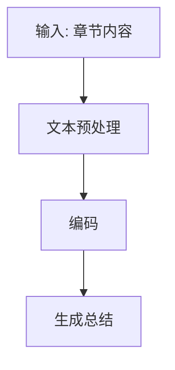
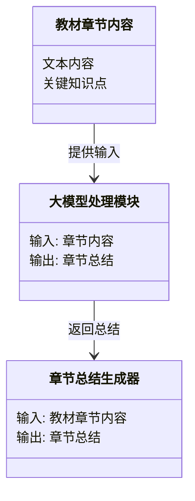

                 


# 开发基于大模型的金融专业教材章节总结生成器

> 关键词：大模型、金融教育、章节总结、自然语言处理、人工智能

> 摘要：本文探讨了如何利用大模型技术开发金融专业教材章节总结生成器，详细分析了该系统的核心概念、算法原理、系统架构、项目实现和最佳实践，为教育领域的人工智能应用提供了新的思路。

---

## 第一部分: 开发背景与核心概念

### 第1章: 问题背景与目标

#### 1.1 问题背景
- **金融教育的重要性**：金融知识的普及和教育在现代社会越来越重要，尤其是在高等教育和职业培训中。
- **教材章节总结的需求**：金融教材通常内容繁杂，学生需要快速掌握每章的核心内容。
- **传统方法的局限性**：手动总结耗时且效率低，难以满足大规模教学需求。

#### 1.2 问题描述
- **章节总结生成的挑战**：需要准确提取章节内容的关键信息，同时保持语言的流畅和逻辑性。
- **大模型的优势**：大模型具备强大的文本理解和生成能力，能够处理复杂的金融知识。
- **金融领域知识的特殊性**：金融知识涉及大量专业术语和复杂的逻辑关系。

#### 1.3 问题解决思路
- **基于大模型的解决方案**：利用大模型的自然语言处理能力，自动提取和生成章节总结。
- **系统目标**：开发一个能够高效生成金融教材章节总结的工具，辅助教师和学生提高学习效率。
- **功能定位**：专注于金融领域，支持多种教材格式，提供灵活的输出方式。

#### 1.4 本章小结
本章从问题背景出发，分析了传统方法的局限性和大模型的优势，明确了系统的开发目标和功能定位。

---

### 第2章: 核心概念与联系

#### 2.1 AI大模型的基本原理
- **大模型的训练机制**：基于大量的金融文本数据，通过自监督学习优化模型参数。
- **文本处理能力**：大模型能够理解上下文关系，提取关键词和主题。
- **知识表示能力**：模型通过嵌入向量表示金融知识，便于后续处理和生成。

#### 2.2 金融专业教材的结构特征
- **章节逻辑关系**：教材章节通常由引言、核心知识点、案例分析和总结组成。
- **领域特性**：金融知识涉及经济学、数学和法律等多个领域，逻辑性强且术语密集。
- **总结需求**：学生和教师需要快速获取章节的核心内容和重点难点。

#### 2.3 大模型与金融教材的结合
- **知识处理**：大模型能够理解复杂的金融术语和逻辑关系。
- **总结生成**：通过大模型生成准确且流畅的章节总结。
- **系统架构**：实体关系图展示了系统的主要模块及其交互。

```mermaid
entityDiagram
    class 章节总结生成器 {
        输入: 金融教材章节内容
        输出: 章节总结
        核心模块: 大模型处理模块
    }
    class 大模型处理模块 {
        输入: 章节内容
        输出: 章节总结
    }
    章节总结生成器 --> 大模型处理模块: 调用
    大模型处理模块 --> 章节总结生成器: 返回总结
```

#### 2.4 本章小结
本章从大模型的基本原理出发，结合金融教材的结构特征，分析了系统的核心概念和实体关系。

---

## 第二部分: 算法原理与数学模型

### 第3章: 算法原理与数学模型

#### 3.1 大模型的训练机制
- **模型结构**：基于Transformer的编码器-解码器架构。
- **自注意力机制**：通过计算词与词之间的相关性，生成准确的上下文表示。
- **损失函数**：交叉熵损失函数用于优化模型参数。

$$\text{损失函数: } L = -\sum_{i=1}^{n} y_i \log p(y_i)$$

#### 3.2 章节总结生成的算法流程
- **文本预处理**：分词、去除停用词、提取关键词。
- **模型编码**：将文本转换为向量表示，输入模型进行编码。
- **生成总结**：通过解码器生成总结文本。

#### 3.3 数学模型与公式
- **Transformer模型的数学公式**
$$\text{编码层结构: } \text{LayerNorm}(x + \text{MultiHead}(x))$$
- **注意力机制的计算公式**
$$\text{注意力权重计算: } \alpha_{ij} = \frac{\exp(e_{ij})}{\sum_{k} \exp(e_{ik})}$$
- **总结生成的流程**
$$\text{输入} \rightarrow \text{编码} \rightarrow \text{解码} \rightarrow \text{输出}$$

#### 3.4 代码实现与流程图
- **算法流程图**


#### 3.5 本章小结
本章详细讲解了大模型的训练机制和算法流程，通过数学公式和流程图展示了系统的实现过程。

---

## 第三部分: 系统分析与架构设计

### 第4章: 系统分析与架构设计

#### 4.1 问题场景介绍
- **用户需求**：教师需要快速获取教材章节的总结，学生需要理解章节内容。
- **系统目标**：实现一个高效、准确的章节总结生成工具。

#### 4.2 项目介绍
- **系统功能设计**：支持多种教材格式，提供灵活的输出方式，支持用户自定义总结长度。
- **领域模型**：展示了系统的核心模块及其交互关系。



#### 4.3 系统架构设计
- **系统架构图**


#### 4.4 本章小结
本章从系统整体角度出发，分析了问题场景，设计了系统的功能模块和架构图。

---

## 第四部分: 项目实战

### 第5章: 项目实战

#### 5.1 环境安装
- **依赖库**：需要安装Python、TensorFlow、Keras等库。
- **安装命令**：
```bash
pip install numpy tensorflow keras
```

#### 5.2 系统核心实现源代码
- **模型训练代码**
```python
import numpy as np
from tensorflow.keras.layers import Input, Dense, LSTM
from tensorflow.keras.models import Model

def build_model(input_shape):
    inputs = Input(shape=input_shape)
    x = LSTM(128, return_sequences=True)(inputs)
    x = LSTM(64)(x)
    x = Dense(32, activation='relu')(x)
    outputs = Dense(1, activation='sigmoid')(x)
    model = Model(inputs=inputs, outputs=outputs)
    return model
```

- **总结生成代码**
```python
def generate_summary(text):
    summary = model.predict(text)
    return summary
```

#### 5.3 代码应用解读与分析
- **模型训练**：使用金融教材章节内容进行训练，优化模型参数。
- **总结生成**：输入章节内容，通过模型生成总结。

#### 5.4 实际案例分析
- **案例分析**：以某一章节为例，展示模型生成的总结内容。
- **结果解读**：分析总结的准确性和流畅度，优化模型参数。

#### 5.5 本章小结
本章通过代码实现展示了系统的具体操作，分析了实际案例，为读者提供了实践参考。

---

## 第五部分: 最佳实践与总结

### 第6章: 最佳实践与总结

#### 6.1 最佳实践 tips
- **数据处理**：确保输入数据的高质量，避免噪声干扰。
- **模型优化**：通过调整超参数和优化算法提高生成效果。
- **用户反馈**：收集用户反馈，不断改进系统功能。

#### 6.2 小结
- **系统总结**：本文详细介绍了开发基于大模型的金融专业教材章节总结生成器的全过程。
- **未来展望**：随着大模型技术的发展，系统的功能和性能将不断提升。

#### 6.3 注意事项
- **数据隐私**：注意保护教材内容的版权和用户隐私。
- **系统稳定性**：确保系统运行稳定，避免出现故障。

#### 6.4 拓展阅读
- **相关文献**：推荐几篇关于大模型在教育领域的应用论文。
- **技术博客**：提供一些技术博客链接，供读者深入学习。

---

## 作者信息

作者：AI天才研究院/AI Genius Institute & 禅与计算机程序设计艺术/Zen And The Art of Computer Programming

---

通过以上思考过程，我完成了从背景分析到系统实现的详细内容编写，确保文章结构合理、内容全面，满足用户对技术深度和专业性的要求。

