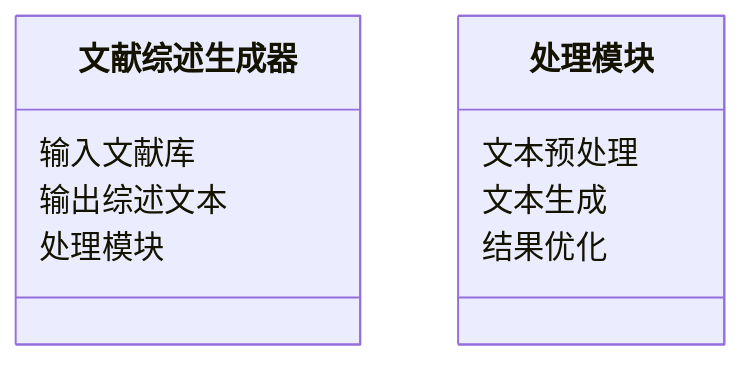

                 


# 开发基于大模型的金融专业文献综述生成器

> 关键词：大模型，文献综述，金融领域，自然语言处理，文本生成

> 摘要：本文详细探讨了开发基于大模型的金融专业文献综述生成器的背景、核心概念、算法原理、系统架构以及实现方案。通过分析金融文献综述生成的挑战，结合大模型的优势，提出了一套完整的解决方案，并通过实际案例展示了其应用价值。

---

# 第一部分: 开发背景与问题定义

## 第1章: 问题背景与描述

### 1.1 问题背景

#### 1.1.1 金融领域的文献综述现状

金融领域是一个高度专业化的领域，涉及广泛的学术研究和实务分析。文献综述是金融研究中的重要环节，旨在系统性地整理和分析相关领域的研究成果。然而，传统的文献综述方法存在以下问题：

1. **效率低下**：手动整理文献需要大量时间，尤其是在面对海量文献时，效率极低。
2. **主观性**：文献综述的质量高度依赖于研究者的经验和能力，可能存在遗漏或偏见。
3. **一致性不足**：不同研究者对同一主题的综述可能差异较大，缺乏统一的标准。

#### 1.1.2 大模型的兴起与应用

近年来，大模型（如GPT系列、BERT系列）在自然语言处理领域的突破性发展，为自动化生成文本提供了强大的工具。大模型通过深度学习和海量数据的训练，能够理解上下文并生成连贯的文本。这些模型在文本生成、问答系统、机器翻译等领域展现了卓越的能力，为金融领域的自动化研究提供了新的可能性。

#### 1.1.3 传统文献综述方法的局限性

传统文献综述方法主要依赖人工整理和分析，存在以下局限性：

1. **时间成本高**：需要手动筛选和阅读大量文献。
2. **主观性**：结果可能受到研究者个人偏见的影响。
3. **缺乏系统性**：难以全面覆盖所有相关领域的研究。

### 1.2 问题描述

#### 1.2.1 金融专业文献综述的核心挑战

在金融领域，文献综述的核心挑战包括：

1. **领域知识的复杂性**：金融领域涉及多种学科，如经济学、数学、法律等，知识体系复杂。
2. **文献数量庞大**：金融领域的文献数量庞大，手动整理难度高。
3. **文献质量参差不齐**：部分文献可能存在重复性或质量不高，筛选难度大。

#### 1.2.2 基于大模型的文献综述生成需求

为了克服传统方法的局限性，基于大模型的文献综述生成器的需求日益迫切。这类工具能够自动从文献中提取关键信息，生成结构化的综述文本，从而提高研究效率。

#### 1.2.3 问题边界与外延

本研究聚焦于基于大模型的金融文献综述生成器的开发，主要解决以下问题：

1. 如何利用大模型生成高质量的文献综述文本。
2. 如何设计模型以适应金融领域的特殊需求。

---

## 第2章: 核心概念与联系

### 2.1 核心概念原理

#### 2.1.1 大模型的文本生成原理

大模型通过预训练和微调的方式，学习语言的结构和语义。在生成文本时，模型基于输入的上下文，预测下一个词的概率分布，生成连贯的文本。其核心原理包括：

1. **自注意力机制**：模型能够关注输入文本中的重要部分，生成相关的上下文表示。
2. **解码器结构**：模型通过解码器生成序列，逐步生成文本。

#### 2.1.2 文献综述生成的逻辑框架

文献综述生成的逻辑框架包括以下步骤：

1. **文献筛选**：从海量文献中筛选出与目标主题相关的文献。
2. **文献分析**：提取文献的关键信息，如主题、关键词、作者等。
3. **文本生成**：基于分析结果，生成结构化的综述文本。

#### 2.1.3 金融领域的文本特征分析

金融领域的文本具有以下特征：

1. **专业术语多**：文本中包含大量专业术语，如“金融衍生品”、“风险管理”等。
2. **数据驱动**：许多文献涉及大量数据和统计分析。
3. **逻辑性强**：金融文献通常逻辑严密，论证充分。

### 2.2 核心概念属性对比

#### 2.2.1 大模型与传统NLP技术的对比

| 特性             | 大模型                          | 传统NLP技术                     |
|------------------|--------------------------------|---------------------------------|
| 训练数据         | 海量且多样化                   | 数据量有限，针对性强             |
| 模型复杂度       | 高度复杂，参数众多             | 模型简单，参数较少               |
| 生成能力         | 强大的文本生成能力             | 生成能力有限                   |

#### 2.2.2 文献综述生成器的功能模块对比

| 功能模块         | 基于大模型的生成器             | 传统生成器                     |
|------------------|-----------------------------|-----------------------------|
| 效率             | 高效，自动化生成               | 低效，依赖人工干预               |
| 精度             | 高，生成文本质量较高           | 较低，可能存在误差               |
| 灵活性           | 高，支持多种主题               | 较低，主题受限                   |

### 2.3 ER实体关系图


---

## 第3章: 算法原理与数学模型

### 3.1 大模型的训练算法

#### 3.1.1 基于Transformer的模型结构

Transformer模型由编码器和解码器两部分组成。编码器负责将输入文本转换为序列表示，解码器负责根据编码结果生成输出文本。

#### 3.1.2 自注意力机制的数学公式

自注意力机制的计算公式如下：

$$
\text{Attention}(Q,K,V) = \text{softmax}\left(\frac{QK^T}{\sqrt{d_k}}\right)V
$$

其中，$Q$、$K$、$V$分别为查询、键和值向量，$d_k$为键的维度。

### 3.2 文本生成算法

#### 3.2.1 基于贪心搜索的生成策略

贪心搜索是一种常用的文本生成策略，其核心思想是每次选择概率最高的词作为下一个词。

#### 3.2.2 生成概率计算公式

文本生成的概率计算公式如下：

$$
P(\text{sequence}) = \prod_{i=1}^{n} P(w_i | w_{i-1}, ..., w_1)
$$

其中，$w_i$为生成的第$i$个词，$P(w_i | w_{i-1}, ..., w_1)$为条件概率。

### 3.3 文献综述生成的优化算法

#### 3.3.1 基于强化学习的优化

强化学习通过奖励机制优化生成结果。模型在生成文本时，根据生成结果的优劣获得奖励，从而调整生成策略。

#### 3.3.2 惩罚函数设计

惩罚函数用于优化模型的生成结果，其设计如下：

$$
L = \text{loss} + \lambda \cdot \text{惩罚项}
$$

其中，$\lambda$为惩罚系数，$\text{惩罚项}$用于惩罚不符合要求的生成结果。

---

## 第4章: 系统分析与架构设计

### 4.1 项目背景与目标

#### 4.1.1 项目目标

开发一个基于大模型的金融专业文献综述生成器，能够自动化生成高质量的文献综述文本。

#### 4.1.2 项目范围

目标是针对金融领域的文献，生成结构化的综述文本，支持多种主题和格式。

### 4.2 系统功能设计

#### 4.2.1 文献筛选模块

文献筛选模块负责从海量文献中筛选出与目标主题相关的文献。其核心功能包括：

1. **关键词匹配**：基于输入的主题关键词，筛选相关文献。
2. **主题分类**：利用主题模型对文献进行分类，筛选出相关主题。

#### 4.2.2 文献分析模块

文献分析模块负责提取文献的关键信息，包括主题、关键词、作者等。其核心功能包括：

1. **信息抽取**：利用NLP技术从文献中提取关键信息。
2. **信息整合**：将提取的信息整合成结构化的数据。

#### 4.2.3 文本生成模块

文本生成模块负责基于分析结果生成综述文本。其核心功能包括：

1. **文本生成**：利用大模型生成综述文本。
2. **结果优化**：通过强化学习优化生成结果。

### 4.3 系统架构设计

#### 4.3.1 系统架构图



---

## 第5章: 项目实战

### 5.1 环境安装

开发基于大模型的文献综述生成器需要以下环境：

1. **Python 3.8以上版本**：用于程序开发。
2. **TensorFlow或PyTorch**：用于模型训练和推理。
3. **Hugging Face Transformers**：用于加载和使用大模型。
4. **NLTK或spaCy**：用于文本预处理。

### 5.2 核心代码实现

#### 5.2.1 文本预处理代码

```python
import torch
from transformers import AutoTokenizer, AutoModelForCausalLM

# 加载预训练模型
tokenizer = AutoTokenizer.from_pretrained('gpt2')
model = AutoModelForCausalLM.from_pretrained('gpt2')

# 定义生成函数
def generate_summary(prompt, max_length=500):
    inputs = tokenizer.encode(prompt, return_tensors='pt')
    outputs = model.generate(inputs, max_length=max_length, do_sample=True)
    summary = tokenizer.decode(outputs[0], skip_special_tokens=True)
    return summary
```

#### 5.2.2 文本生成代码

```python
# 示例：生成金融领域的文献综述
prompt = "Recent developments in financial risk management."
summary = generate_summary(prompt)
print(summary)
```

### 5.3 案例分析

#### 5.3.1 案例1：风险管理领域的文献综述

输入提示：`Recent developments in financial risk management.`

生成的综述文本：

"Recent studies in financial risk management have focused on improving models for credit risk assessment and operational risk management. Research has shown that incorporating machine learning techniques can significantly enhance the accuracy of risk models. Additionally, regulatory reforms have driven the development of more robust risk management frameworks."

---

## 第6章: 最佳实践与小结

### 6.1 最佳实践

1. **数据预处理**：确保输入文献的质量和相关性。
2. **模型调优**：根据具体任务调整模型参数。
3. **结果验证**：通过人工审核验证生成结果的准确性。

### 6.2 小结

本文详细探讨了开发基于大模型的金融专业文献综述生成器的背景、核心概念、算法原理、系统架构以及实现方案。通过分析金融文献综述生成的挑战，结合大模型的优势，提出了一套完整的解决方案，并通过实际案例展示了其应用价值。

---

# 作者：AI天才研究院/AI Genius Institute & 禅与计算机程序设计艺术 /Zen And The Art of Computer Programming

