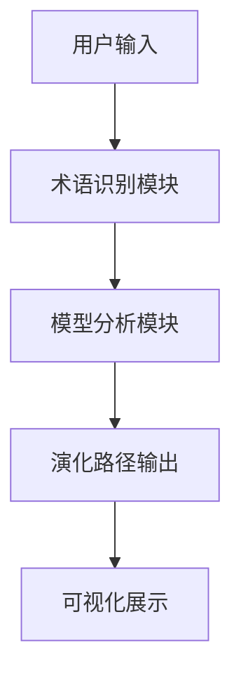
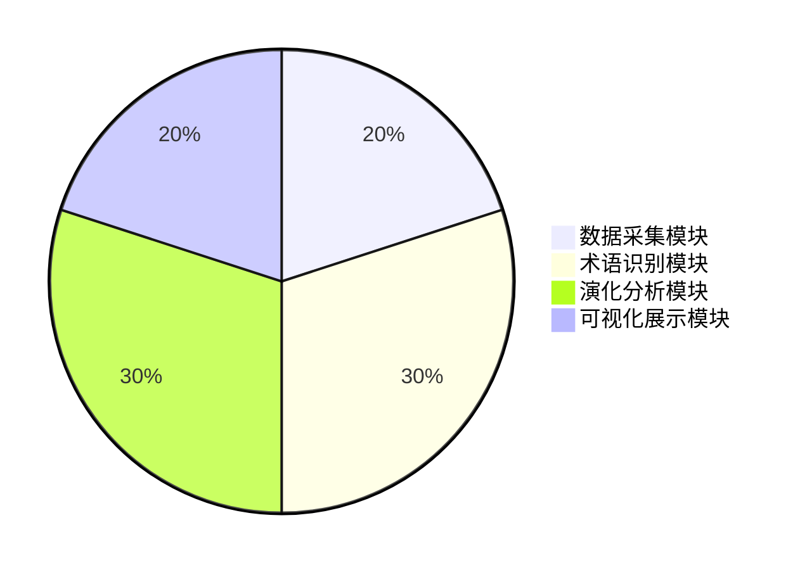
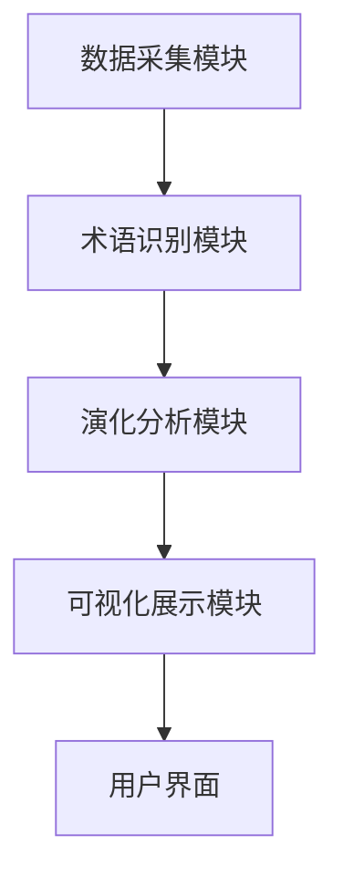
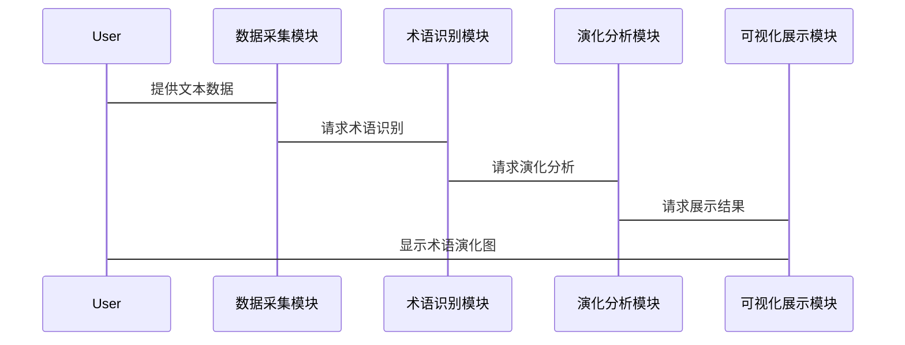

                 


# 开发基于大模型的金融专业术语演化跟踪器

> 关键词：金融专业术语、大模型、术语演化跟踪、自然语言处理、系统架构设计

> 摘要：随着金融领域的不断发展，专业术语的演变更加频繁，传统的术语管理方式已难以满足需求。本文将详细探讨如何基于大模型开发金融专业术语演化跟踪器，涵盖问题背景、核心算法、系统架构设计、项目实战以及最佳实践等内容，帮助读者深入了解并实现这一系统。

---

# 第一部分: 问题背景与需求分析

# 第1章: 金融专业术语的演化问题

## 1.1 问题背景

### 1.1.1 金融术语的重要性
- 金融术语是金融领域知识的载体，是理解和交流的基础。
- 术语的准确性直接影响金融交易、投资决策和风险管理。

### 1.1.2 术语演化的需求
- 金融术语随着市场变化不断演化，如“DeFi”从新兴概念到主流术语的变化。
- 术语的演化反映了金融领域的创新和发展。

### 1.1.3 当前术语管理的痛点
- 传统术语管理依赖人工梳理，效率低且容易遗漏。
- 缺乏动态更新机制，难以跟踪术语的实时变化。

## 1.2 问题定义

### 1.2.1 术语演化跟踪的目标
- 实时捕捉和记录金融术语的变化。
- 分析术语的演化趋势，挖掘其背后的意义。

### 1.2.2 核心问题
- 如何利用自然语言处理技术自动识别术语。
- 如何跟踪术语的演化路径并预测其未来变化。

## 1.3 概念模型与核心要素

### 1.3.1 核心概念的定义与属性
| 核心概念 | 定义 | 属性 |
|----------|------|------|
| 术语     | 金融领域的专业词汇 | 独特性、动态性、领域相关性 |
| 演化路径 | 术语随时间的变化轨迹 | 时间维度、语义变化、使用频率 |

### 1.3.2 实体关系图（ER图）
```mermaid
er
  actor: User
  entity: Term
  entity: EvolutionPath
  entity: SemanticRelation
  entity: FrequencyChange
  actor:--创建--> entity:Term
  entity:Term--> entity:EvolutionPath
  entity:Term--> entity:SemanticRelation
  entity:Term--> entity:FrequencyChange
```

---

# 第2章: 基于大模型的术语演化跟踪原理

## 2.1 大模型的基本原理

### 2.1.1 大模型的定义与特点
- 大模型：基于深度学习的大型神经网络模型，如GPT、BERT等。
- 特点：强大的上下文理解和生成能力，能够处理复杂文本数据。

### 2.1.2 大模型在NLP中的应用
- 语言模型：理解文本语义，生成自然语言文本。
- 文本分类、实体识别、关系抽取等任务。

### 2.1.3 大模型与金融术语的结合
- 通过预训练模型理解金融术语的语义。
- 利用模型的生成能力预测术语的演化。

## 2.2 术语演化跟踪的核心算法

### 2.2.1 算法原理概述
- 使用大模型进行术语识别和演化分析。
- 基于上下文关系和语义变化，推断术语的演化路径。

### 2.2.2 算法实现流程图


### 2.2.3 算法的数学模型
#### 语言模型的概率分布公式
$$ P(w_{i}) = \frac{N_{w_{i}}}{N} $$
其中，$N_{w_{i}}$ 是词 $w_{i}$ 的出现次数，$N$ 是总词数。

#### 语义相似度计算公式
$$ S(w_{i}, w_{j}) = \frac{\sum_{k=1}^{n} \cos(\theta_{i,k}, \theta_{j,k})}{n} $$
其中，$\theta_{i,k}$ 和 $\theta_{j,k}$ 是词 $w_{i}$ 和 $w_{j}$ 的第 $k$ 个词向量。

---

# 第3章: 术语演化跟踪系统的架构设计

## 3.1 系统功能设计

### 3.1.1 数据采集模块
- 从金融新闻、学术论文、行业报告中提取术语。
- 数据清洗与预处理。

### 3.1.2 术语识别模块
- 使用大模型识别文本中的金融术语。
- 基于上下文关系提取术语。

### 3.1.3 演化分析模块
- 分析术语的演化路径和语义变化。
- 预测未来术语的可能变化。

### 3.1.4 可视化展示模块
- 展示术语的演化趋势图。
- 提供交互式界面供用户查询。

## 3.2 系统架构设计

### 3.2.1 分层架构图


### 3.2.2 模块交互流程图


## 3.3 接口设计与交互流程

### 3.3.1 数据接口规范
- 输入：文本数据或数据库查询。
- 输出：术语列表或演化路径。

### 3.3.2 用户交互流程图


---

# 第4章: 项目实战与实现

## 4.1 环境搭建与数据准备

### 4.1.1 开发环境安装
- Python 3.8+
- PyTorch或TensorFlow
- Hugging Face Transformers库

### 4.1.2 数据集的获取与预处理
- 数据来源：爬取金融新闻、学术论文。
- 数据清洗：去除噪声，提取术语。

## 4.2 核心算法实现

### 4.2.1 模型训练代码
```python
from transformers import AutoTokenizer, AutoModelForCausalLM
import torch

model_name = "gpt2"
tokenizer = AutoTokenizer.from_pretrained(model_name)
model = AutoModelForCausalLM.from_pretrained(model_name)
```

### 4.2.2 术语识别代码
```python
def extract_terms(text):
    inputs = tokenizer.encode(text, return_tensors="pt")
    outputs = model.generate(inputs, max_length=50)
    terms = tokenizer.decode(outputs[0].tolist())
    return terms
```

### 4.2.3 演化分析代码
```python
def analyze_evolution(terms):
    # 计算术语的语义相似度
    similarities = {}
    for i in range(len(terms)):
        for j in range(i+1, len(terms)):
            similarities[(terms[i], terms[j])] = cosine_similarity(...)
    return similarities
```

## 4.3 系统实现与测试

### 4.3.1 系统功能测试
- 测试术语识别的准确率。
- 测试演化分析的正确性。

### 4.3.2 性能优化与调优
- 使用更高效的大模型。
- 并行处理数据。

### 4.3.3 测试案例分析
- 输入：某金融术语。
- 输出：演化路径和语义变化。

---

# 第5章: 最佳实践与注意事项

## 5.1 开发过程中的注意事项

### 5.1.1 数据质量的重要性
- 数据来源的可靠性。
- 数据清洗的彻底性。

### 5.1.2 模型调优的技巧
- 使用更大的模型。
- 调整训练参数。

### 5.1.3 系统性能的优化
- 优化数据处理流程。
- 使用分布式计算。

## 5.2 项目小结与未来展望

### 5.2.1 项目总结
- 成功实现了基于大模型的金融术语演化跟踪系统。
- 提供了动态更新术语的能力。

### 5.2.2 未来研究方向
- 更精准的术语识别算法。
- 更高效的演化路径预测模型。

### 5.2.3 对读者的建议
- 持续关注金融领域的最新动态。
- 深入学习大模型的优化方法。

## 5.3 拓展阅读与学习资源

### 5.3.1 推荐书籍与论文
- 《深度学习入门》
- 《自然语言处理实战》

### 5.3.2 在线课程与社区资源
- Coursera上的相关课程。
- GitHub上的开源项目。

### 5.3.3 开源项目与工具推荐
- Hugging Face Transformers库。
- PyTorch框架。

---

# 作者：AI天才研究院/AI Genius Institute & 禅与计算机程序设计艺术 /Zen And The Art of Computer Programming

