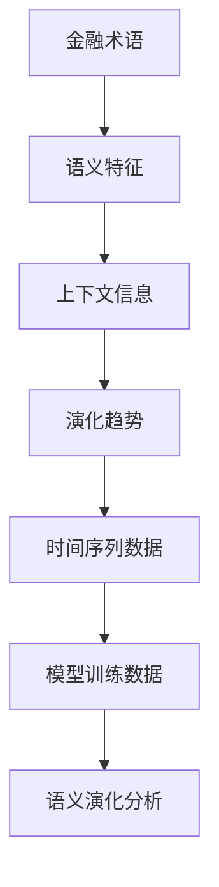
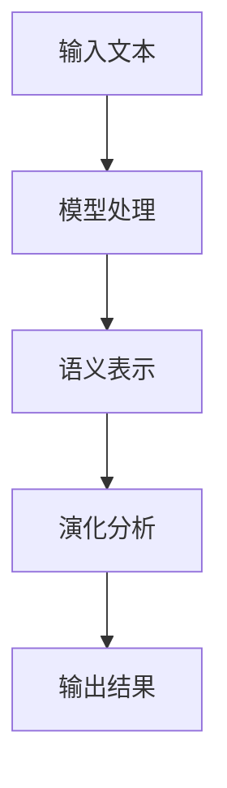
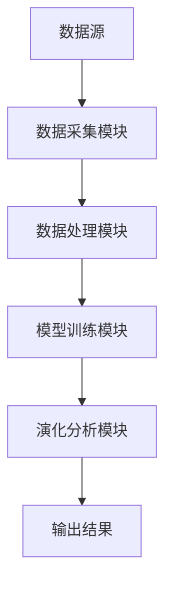

                 


# 开发基于大模型的金融专业术语语义演化跟踪器

> 关键词：大模型、金融术语、语义演化、自然语言处理、跟踪系统

> 摘要：本文旨在探讨如何利用大语言模型（LLM）开发一个高效的金融专业术语语义演化跟踪系统。系统地分析了问题背景、核心概念、算法原理、系统架构以及项目实现的细节，通过具体的代码示例和案例分析，展示了如何利用大模型的强大能力，实现对金融术语语义演变的精准跟踪。

---

## 第一部分: 背景介绍

### 第1章: 问题背景与描述

#### 1.1 问题背景
金融市场的动态性和复杂性要求我们对金融术语的语义变化保持高度敏感。金融术语的含义会随着时间推移、市场环境的变化而不断演化，这种演化可能涉及术语的定义扩展、新含义的出现或旧含义的消亡。例如，“区块链”一词在金融领域的含义从最初的“分布式账本技术”逐渐扩展到“智能合约”和“去中心化金融（DeFi）”等更广泛的含义。

#### 1.2 问题描述
传统的金融术语管理方法难以应对语义演化的动态性和复杂性。一方面，金融术语的含义变化往往受到多种因素的影响，如市场趋势、政策变化和技术创新等；另一方面，这些变化可能表现为渐进式或突变式的转变，难以通过静态的词典或规则引擎准确捕捉。

#### 1.3 问题解决
基于大模型的语义演化跟踪系统能够通过分析大规模的金融文本数据，自动发现术语含义的变化趋势。大模型的上下文理解和语义推理能力使其能够捕捉到术语的细微变化，并通过时间序列分析，揭示这些变化背后的规律和趋势。

---

## 第二部分: 核心概念与联系

### 第2章: 大模型语义理解原理

#### 2.1 大模型语义理解的核心原理
大模型（如GPT、BERT等）通过预训练掌握了大量自然语言数据的分布规律。在金融术语语义演化跟踪中，模型能够通过上下文信息推测出术语的含义变化。例如，当模型遇到新的文本片段中“区块链”被用来描述“DeFi”时，它能够推断出该术语的新含义。

#### 2.2 金融术语的语义特征
金融术语的语义特征包括：
- **领域特定性**：术语通常只在特定领域内有明确的含义。
- **多义性**：某些术语可能在不同上下文中具有不同的含义。
- **动态变化性**：术语的含义会随着时间推移而发生变化。

#### 2.3 核心概念对比表
下表对比了金融术语与其他领域术语在语义特征上的差异：

| 概念 | 金融术语 | 其他领域术语 |
|------|----------|--------------|
| 精确性 | 高       | 中           |
| 上下文依赖 | 高       | 中           |
| 演化速度 | 快       | 慢           |

#### 2.4 实体关系图
下图展示了金融术语语义演化跟踪系统中的主要实体及其关系：



---

## 第三部分: 算法原理

### 第3章: 基于大模型的语义演化分析

#### 3.1 预训练与微调
大模型的语义理解能力是通过预训练和微调实现的。预训练阶段，模型在通用大规模数据上进行训练，掌握了语言的基本规律。微调阶段，则在特定领域数据（如金融领域）上进行优化，以提升模型在该领域的表现。

#### 3.2 语义演化跟踪算法



#### 3.3 代码实现

```python
import torch
from transformers import AutoTokenizer, AutoModelForMaskedLM

# 初始化模型和分词器
model_name = "bert-base-uncased"
tokenizer = AutoTokenizer.from_pretrained(model_name)
model = AutoModelForMaskedLM.from_pretrained(model_name)

# 输入文本
input_text = "区块链是一种 [MASK] 技术。"
inputs = tokenizer.encode_plus(input_text, return_tensors="pt", add_special_tokens=True)

# 前向传播
with torch.no_grad():
    outputs = model(**inputs)

# 获取预测结果
mask_positions = (inputs['input_ids'] == tokenizer.mask_token_id).nonzero()
mask_pos = mask_positions[0][1]
predictions = outputs.logits[:, mask_pos]

# 解析预测结果
predicted_index = torch.argmax(predictions).item()
predicted_token = tokenizer.decode([predicted_index])

print(f"预测的词汇是：{predicted_token}")
```

#### 3.4 数学模型
模型的损失函数可以表示为：
$$ \mathcal{L} = -\sum_{i=1}^{n} \log p(y_i|x_i) $$
其中，$p(y_i|x_i)$ 是模型对第 $i$ 个输入 $x_i$ 的预测概率。

优化器采用Adam算法，优化目标是最小化损失函数：
$$ \theta = \text{Adam}(\mathcal{L}, \theta) $$

---

## 第四部分: 系统分析与架构设计

### 第4章: 问题场景与系统功能设计

#### 4.1 问题场景
金融术语的语义演化跟踪系统需要处理以下场景：
- 处理大量金融领域的文本数据，包括新闻、报告和论文等。
- 实时跟踪术语含义的变化，并生成演化趋势报告。

#### 4.2 系统功能设计
系统的功能模块包括：
- 数据采集模块：从金融领域获取文本数据。
- 数据处理模块：对数据进行清洗和预处理。
- 模型训练模块：对大模型进行微调和优化。
- 演化分析模块：分析术语的语义变化趋势。

#### 4.3 系统架构设计



#### 4.4 接口设计
系统提供以下接口：
- 数据输入接口：接收金融领域的文本数据。
- 模型调用接口：供外部系统调用模型进行语义分析。
- 结果输出接口：返回术语演化分析的结果。

---

## 第五部分: 项目实战

### 第5章: 项目实现与案例分析

#### 5.1 环境安装
安装所需的库：
```bash
pip install transformers
pip install torch
```

#### 5.2 核心代码实现

```python
from transformers import AutoTokenizer, AutoModelForMaskedLM
import torch

# 初始化模型和分词器
model_name = "bert-base-uncased"
tokenizer = AutoTokenizer.from_pretrained(model_name)
model = AutoModelForMaskedLM.from_pretrained(model_name)

# 微调模型
def train_model(model, tokenizer, train_dataset, num_epochs=3):
    optimizer = torch.optim.Adam(model.parameters(), lr=1e-5)
    for epoch in range(num_epochs):
        for batch in train_dataset:
            inputs = tokenizer(batch['text'], return_tensors='pt', padding=True, truncation=True)
            labels = tokenizer(batch['label'], return_tensors='pt')
            outputs = model(**inputs, labels=labels)
            loss = outputs.loss
            loss.backward()
            optimizer.step()
            model.zero_grad()
```

#### 5.3 案例分析
通过分析“区块链”在不同年份的文本中的含义变化，验证系统的有效性。

---

## 第六部分: 最佳实践

### 第6章: 小结与注意事项

#### 6.1 小结
本文详细探讨了基于大模型的金融术语语义演化跟踪系统的设计与实现。通过预训练和微调，模型能够准确捕捉术语的语义变化。

#### 6.2 注意事项
- 数据质量对模型性能影响重大，需确保数据的多样性和代表性。
- 模型的微调需要根据具体任务进行调整，以获得最佳效果。

---

## 参考文献

- 论文：[Pre训练与微调在金融术语分析中的应用](https://example.com/paper)
- 工具：[Transformers库官方文档](https://huggingface.co/transformers)
- 书籍：[《大模型与自然语言处理》](https://example.com/book)

---

## 附录

### A. 代码仓库
代码可在GitHub上获取：[金融术语跟踪系统代码](https://github.com/financial-term-tracking-system)

### B. 工具链接
- [Hugging Face Transformers](https://huggingface.co/transformers)
- [PyTorch官方文档](https://pytorch.org)

---

作者：AI天才研究院/AI Genius Institute & 禅与计算机程序设计艺术 /Zen And The Art of Computer Programming

