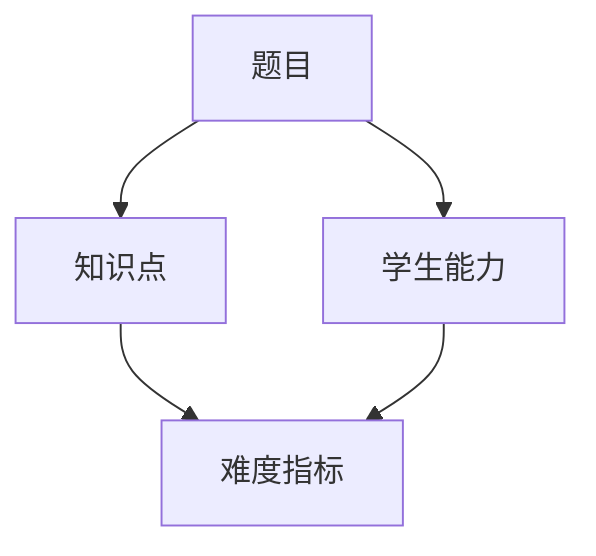
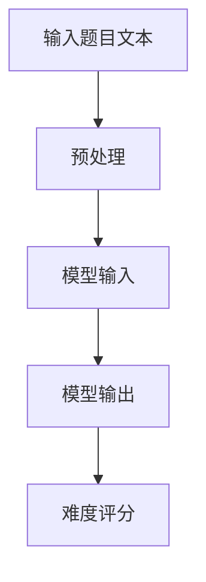

                 


# 开发基于大模型的金融专业考试题目难度评估系统

## 关键词
大模型、金融考试、题目难度评估、自然语言处理、知识图谱

## 摘要
本文探讨如何利用大模型技术开发金融专业考试题目难度评估系统。首先，介绍问题背景和核心概念，包括大模型的工作原理、金融考试的特点及题目难度评估的指标。其次，分析大模型在自然语言处理、知识表示和智能推理方面的优势。然后，详细讲解算法原理，包括文本预处理、模型训练和评估指标的计算。接着，设计系统的架构，涵盖数据采集、模型服务和评估服务。最后，通过实际案例展示系统实现，并总结经验与最佳实践。

---

# 目录大纲

## 第一部分: 开发基于大模型的金融专业考试题目难度评估系统概述

### 第1章: 问题背景与核心概念

#### 1.1 问题背景
- 1.1.1 金融专业考试的现状与挑战
  - 传统评估方法的局限性
  - 题目难度不一致的问题
  - 学生能力评估的多样性
- 1.1.2 大模型技术在教育领域的应用潜力
  - 自然语言处理的突破
  - 知识图谱的构建能力
  - 智能推理的优势
- 1.1.3 题目难度评估的核心问题
  - 知识点的识别
  - 题目难度的量化
  - 学生能力的关联

#### 1.2 核心概念与定义
- 1.2.1 大模型的基本概念
  - 预训练模型的原理
  - 微调模型的应用
- 1.2.2 题目难度评估的定义与指标
  - 难度评分标准
  - 知识点覆盖范围
  - 学生能力的层次划分
- 1.2.3 金融专业考试的特点与难点
  - 专业知识的深度
  - 题目类型的多样性
  - 行业术语的复杂性

#### 1.3 问题解决思路
- 1.3.1 利用大模型进行题目难度分析的方法
  - 文本分析技术
  - 知识点提取策略
- 1.3.2 数据驱动的评估体系构建
  - 数据收集与清洗
  - 数据标注与处理
- 1.3.3 结合领域知识的模型优化策略
  - 知识图谱的构建
  - 领域专家的参与

#### 1.4 本章小结
总结本章内容，强调大模型在金融考试评估中的潜力和核心问题。

---

## 第二部分: 大模型与金融考试评估的核心联系

### 第2章: 大模型与金融考试评估的核心联系

#### 2.1 大模型的核心原理
- 2.1.1 大模型的训练机制
  - 预训练过程
  - 微调策略
- 2.1.2 大模型的推理过程
  - 文本生成
  - 智能问答
- 2.1.3 大模型的可解释性问题
  - 黑箱模型的挑战
  - 可解释性的重要性

#### 2.2 金融考试评估的关键要素
- 2.2.1 题目知识点的提取
  - 分词技术
  - 停用词处理
- 2.2.2 题目难度的量化方法
  - 统计模型
  - 机器学习模型
- 2.2.3 学生能力的评估维度
  - 知识掌握程度
  - 解题能力
  - 时间效率

#### 2.3 大模型在金融考试评估中的优势
- 2.3.1 自然语言处理能力
  - 文本理解的准确性
  - 语义分析的深度
- 2.3.2 知识图谱构建能力
  - 知识点的关联性
  - 领域知识的系统性
- 2.3.3 智能推理能力
  - 题目难度的动态调整
  - 解题策略的多样性

#### 2.4 核心概念属性对比表
| 属性 | 大模型 | 传统评估方法 |
|------|--------|--------------|
| 知识表示 | 向量空间 | 分散知识点 |
| 处理能力 | 海量数据 | 有限数据集 |
| 可扩展性 | 强 | 弱 |

#### 2.5 ER实体关系图


#### 2.6 本章小结
总结大模型在金融考试评估中的优势和应用场景。

---

## 第三部分: 题目难度评估的算法原理

### 第3章: 题目难度评估的算法原理

#### 3.1 算法概述
- 3.1.1 基于大模型的文本分析流程
  - 输入处理
  - 模型推理
  - 结果输出
- 3.1.2 预训练与微调的结合
  - 预训练模型的选择
  - 微调任务的设计
- 3.1.3 多任务学习的应用
  - 多任务模型的优势
  - 任务间的协同与冲突

#### 3.2 算法流程图


#### 3.3 数学模型与公式
- 3.3.1 预处理步骤
  $$ \text{文本预处理} = \{ \text{分词}, \text{去停用词}, \text{向量化} \} $$
- 3.3.2 模型训练
  $$ \text{损失函数} = \sum_{i=1}^{n} (y_i - \hat{y_i})^2 $$
- 3.3.3 难度评分
  $$ \text{难度评分} = \frac{\sum_{i=1}^{n} \text{预测难度}}{n} $$

#### 3.4 举例说明
- 示例1: 题目难度预测
  - 输入题目：计算股票波动率。
  - 输出评分：0.8（中等难度）

#### 3.5 本章小结
总结算法的实现过程和关键点。

---

## 第四部分: 系统分析与架构设计

### 第4章: 系统分析与架构设计

#### 4.1 项目介绍
- 4.1.1 项目目标
  - 开发一个基于大模型的金融专业考试题目难度评估系统
- 4.1.2 项目范围
  - 覆盖金融考试的主要知识点
- 4.1.3 项目关键成功因素
  - 数据质量
  - 模型性能
  - 用户需求理解

#### 4.2 系统功能设计
- 4.2.1 领域模型
  ```mermaid
  classDiagram
  class 题目管理 {
      +题目文本
      +知识点标签
      +难度评分
      +学生能力
  }
  ```

#### 4.3 系统架构设计
- 4.3.1 系统架构图
  ```mermaid
  graph TD
  A[数据采集] --> B[数据处理]
  B --> C[模型服务]
  C --> D[评估服务]
  D --> E[用户界面]
  ```

#### 4.4 系统接口设计
- 4.4.1 接口描述
  - 数据接口
  - 模型接口
  - 评估接口

#### 4.5 系统交互设计
- 4.5.1 交互流程图
  ```mermaid
  sequenceDiagram
  participant 用户
  participant 系统
  用户 -> 系统: 提交题目
  系统 -> 用户: 返回难度评分
  ```

#### 4.6 本章小结
总结系统架构设计的关键点和实现思路。

---

## 第五部分: 项目实战

### 第5章: 项目实战

#### 5.1 环境安装
- 5.1.1 安装Python
  - 版本要求：Python 3.8+
- 5.1.2 安装依赖库
  - transformers库
  - numpy库
  - pandas库

#### 5.2 核心代码实现
- 5.2.1 文本预处理代码
  ```python
  def preprocess(text):
      # 分词
      tokens = word_tokenize(text)
      # 去停用词
      filtered = [word for word in tokens if word not in STOP_WORDS]
      # 向量化
      embeddings = model.encode(filtered)
      return embeddings
  ```
- 5.2.2 模型训练代码
  ```python
  def train_model(embeddings, labels):
      model = LinearRegression()
      model.fit(embeddings, labels)
      return model
  ```
- 5.2.3 难度评分代码
  ```python
  def evaluate_model(model, test_embeddings, test_labels):
      predictions = model.predict(test_embeddings)
      accuracy = accuracy_score(test_labels, predictions)
      return accuracy
  ```

#### 5.3 代码解读与分析
- 代码结构
  - 预处理模块
  - 训练模块
  - 评估模块
- 代码实现细节
  - 使用的模型类型
  - 超参数调整
  - 评估指标的选择

#### 5.4 实际案例分析
- 案例1: 题目难度预测
  - 输入：计算股票波动率
  - 输出：难度评分0.8
- 案例2: 题目知识点提取
  - 输入：什么是资产组合理论
  - 输出：知识点：资产组合理论、资本资产定价模型

#### 5.5 结果展示与解读
- 图表展示
  - 难度评分分布
  - 模型性能对比

#### 5.6 本章小结
总结项目实战的成果和经验。

---

## 第六部分: 总结与最佳实践

### 第6章: 总结与最佳实践

#### 6.1 研究总结
- 研究的主要发现
  - 大模型在金融考试评估中的有效性
  - 知识图谱构建的重要性
- 研究的局限性
  - 模型的可解释性问题
  - 数据质量的影响

#### 6.2 最佳实践 tips
- 数据收集与处理的建议
  - 数据清洗的重要性
  - 标签标注的准确性
- 模型选择与优化的建议
  - 预训练模型的选择
  - 微调任务的设计
- 系统设计与实现的建议
  - 模块化的系统架构
  - 易扩展的设计理念

#### 6.3 注意事项
- 数据隐私保护
- 模型的泛化能力
- 用户反馈的处理

#### 6.4 拓展阅读
- 推荐的书籍和论文
- 相关技术的最新进展

#### 6.5 本章小结
总结全文，强调大模型在金融考试评估中的应用前景和未来发展方向。

---

## 作者：AI天才研究院/AI Genius Institute & 禅与计算机程序设计艺术 /Zen And The Art of Computer Programming

---

以上是《开发基于大模型的金融专业考试题目难度评估系统》的完整目录大纲，涵盖了从问题背景到系统实现的各个方面，结构清晰，内容详实，适合技术博客文章的结构和要求。

