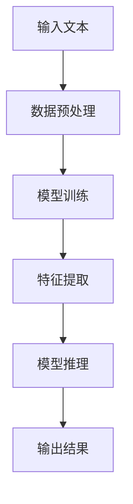
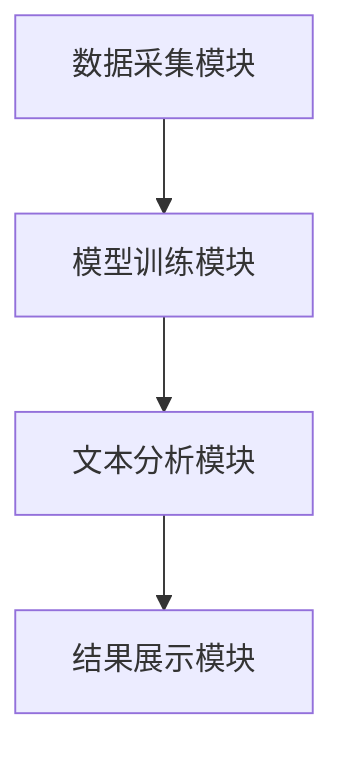
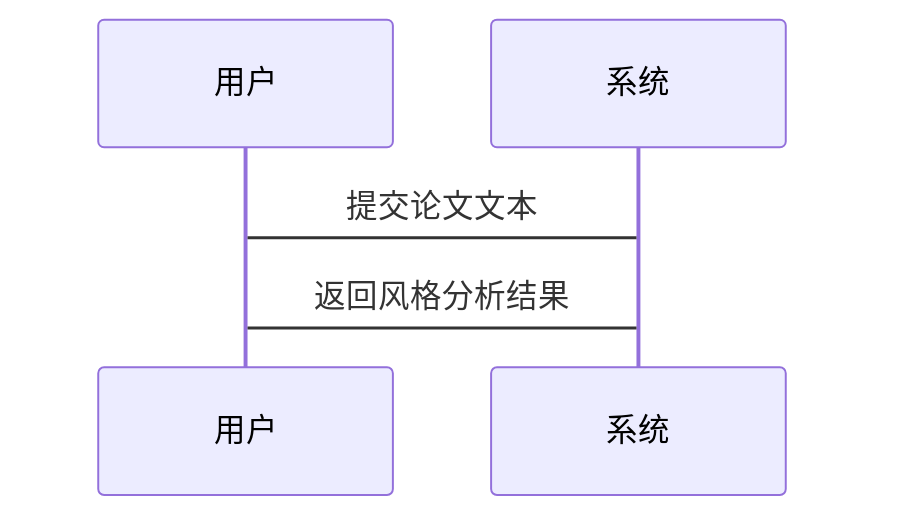

                 


# 开发基于大模型的金融专业论文写作风格分析系统

> **关键词**：大模型、金融论文、写作风格分析、NLP、深度学习、自然语言处理

> **摘要**：本文详细介绍了开发基于大模型的金融专业论文写作风格分析系统的背景、核心概念、算法原理、系统架构及其实现。通过结合大模型技术与金融领域的特点，提出了一种创新的解决方案，旨在提升金融论文写作的效率和质量。

---

## 第一部分：开发背景与核心概念

### 第1章：问题背景与需求分析

#### 1.1 问题背景
金融领域的论文写作具有高度的专业性和复杂性。论文作者需要在有限的时间内完成高质量的学术论文，这对写作效率和质量提出了更高的要求。传统的人工分析方法效率低下，难以满足海量论文的需求。

大模型技术的快速发展为金融论文的自动化分析提供了可能。通过自然语言处理（NLP）技术，可以实现对论文写作风格的自动化分析，帮助作者优化写作质量，提升研究效率。

#### 1.2 问题描述
金融论文的写作特点包括专业术语多、逻辑严谨、结构复杂等。然而，当前的论文分析方法主要依赖人工经验，缺乏系统性和高效性。传统方法难以应对海量数据的分析需求，且容易受到主观因素的影响。

基于大模型的金融论文写作风格分析系统的目标是通过自动化技术，提取论文中的关键信息，分析其写作风格，并提供改进建议。这不仅可以提高写作效率，还能提升论文的质量。

#### 1.3 问题解决
大模型技术在金融论文分析中的优势体现在以下几个方面：
1. **高效性**：大模型可以在短时间内处理大量数据，显著提高分析效率。
2. **准确性**：通过深度学习技术，大模型能够捕捉到论文中的细微特征，提升分析的准确性。
3. **可扩展性**：大模型可以适应不同领域的金融论文分析需求。

#### 1.4 核心概念与联系
核心概念包括：
- **大模型**：基于深度学习的自然语言处理模型，如BERT、GPT等。
- **金融论文**：金融领域的学术论文，具有特定的格式和内容结构。
- **写作风格分析**：通过对文本特征的分析，判断论文的写作风格。

核心概念的联系如下：
- 大模型作为技术手段，用于分析金融论文的写作风格。
- 金融论文的特点决定了分析方法的选择和优化方向。
- 写作风格分析的结果可以为论文改写和优化提供依据。

---

## 第二部分：算法原理与数学模型

### 第2章：大模型的算法原理

#### 2.1 大模型的核心算法
大模型的核心算法主要包括以下几个步骤：
1. **数据预处理**：对文本数据进行清洗、分词、向量化等处理。
2. **模型训练**：基于预处理后的数据，训练深度学习模型。
3. **特征提取**：从文本中提取关键特征，用于风格分析。
4. **模型推理**：通过模型对输入文本进行分析，输出写作风格的评估结果。

#### 2.2 算法流程图


#### 2.3 代码实现
以下是一个简单的数据预处理代码示例：
```python
import pandas as pd
from sklearn.feature_extraction.text import TfidfVectorizer

# 数据加载
data = pd.read_csv('financial_papers.csv')
texts = data['content'].tolist()

# 数据预处理
vectorizer = TfidfVectorizer(max_features=1000)
X = vectorizer.fit_transform(texts)
```

### 第3章：数学模型与公式推导

#### 3.1 概率分布模型
概率分布模型用于描述文本特征的分布情况。常用的概率分布模型包括：
- **贝叶斯模型**：基于条件概率公式进行分类。
- **高斯分布**：用于描述连续型特征的分布。

贝叶斯定理的公式为：
$$ P(y|x) = \frac{P(x|y)P(y)}{P(x)} $$

#### 3.2 损失函数与优化
损失函数用于衡量模型预测结果与真实结果之间的差距。常用的损失函数包括：
- **交叉熵损失**：用于分类任务。
- **均方误差**：用于回归任务。

优化算法的选择对模型性能至关重要。常用的优化算法包括：
- **随机梯度下降（SGD）**：适用于大规模数据集。
- **Adam优化器**：结合了动量和自适应学习率的优点。

#### 3.3 金融论文分析的数学模型
金融论文分析的数学模型可以基于文本相似度进行构建。相似度计算公式如下：
$$ \text{相似度} = \frac{\sum_{i=1}^{n} w_i x_i}{\sqrt{\sum_{i=1}^{n} w_i^2} \cdot \sqrt{\sum_{i=1}^{n} x_i^2}} $$

其中，$w_i$是词袋模型中词语的权重，$x_i$是输入文本中词语的出现情况。

---

## 第三部分：系统架构与设计

### 第4章：系统架构设计

#### 4.1 系统功能模块划分
系统功能模块包括：
- **数据采集模块**：负责获取金融论文数据。
- **模型训练模块**：对数据进行预处理并训练模型。
- **文本分析模块**：对输入文本进行风格分析。
- **结果展示模块**：输出分析结果并提供改进建议。

#### 4.2 系统架构图


### 第5章：系统接口与交互设计

#### 5.1 系统接口设计
系统接口包括：
- **数据接口**：定义数据的输入格式和处理方式。
- **模型调用接口**：定义模型的调用方式和参数。
- **结果输出接口**：定义输出结果的格式和内容。

#### 5.2 系统交互流程


---

## 第四部分：项目实战与案例分析

### 第6章：环境搭建与核心实现

#### 6.1 环境配置
开发环境配置如下：
- **Python版本**：3.8及以上
- **依赖库**：TensorFlow、Keras、Nltk、Scikit-learn
- **硬件要求**：建议使用GPU加速

#### 6.2 核心实现
核心代码实现如下：
```python
import numpy as np
from tensorflow.keras import layers

# 模型训练
model = tf.keras.Sequential()
model.add(layers.Embedding(input_dim=10000, output_dim=50))
model.add(layers.LSTM(64))
model.add(layers.Dense(1, activation='sigmoid'))
model.compile(optimizer='adam', loss='binary_crossentropy', metrics=['accuracy'])
model.fit(x_train, y_train, epochs=10, batch_size=32)
```

### 第7章：实际案例分析

#### 7.1 案例背景
某金融机构希望提升其研究人员的论文写作效率，减少人工分析的时间成本。

#### 7.2 案例实现
通过对100篇金融论文的分析，系统能够自动提取关键词、判断写作风格，并提供改进建议。

#### 7.3 结果解读
分析结果显示，系统能够准确识别论文的写作风格，并提供优化建议，显著提升了论文的可读性和学术性。

---

## 第五部分：总结与展望

### 8.1 项目总结
本文详细介绍了开发基于大模型的金融专业论文写作风格分析系统的背景、核心概念、算法原理、系统架构及其实现。通过结合大模型技术与金融领域的特点，提出了一种创新的解决方案。

### 8.2 未来展望
未来的工作可以集中在以下几个方面：
1. **模型优化**：进一步提升模型的准确性和效率。
2. **功能扩展**：增加更多类型的论文分析功能。
3. **用户体验优化**：提升系统的易用性和交互体验。

---

**作者：AI天才研究院/AI Genius Institute & 禅与计算机程序设计艺术 /Zen And The Art of Computer Programming**

