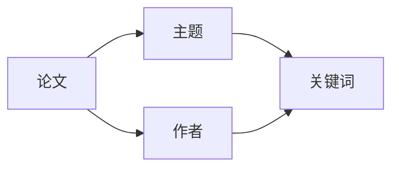
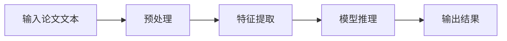
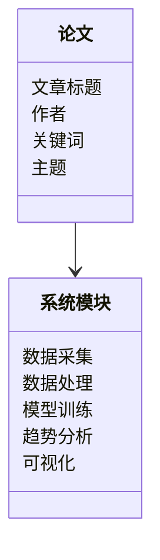
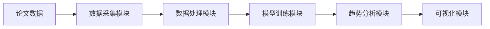
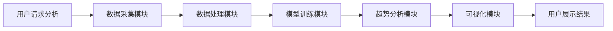

                 


# 开发基于大模型的金融专业论文趋势分析系统

> 关键词：大模型，金融，论文趋势分析，自然语言处理，机器学习，系统开发

> 摘要：本文详细介绍了开发基于大模型的金融专业论文趋势分析系统的背景、技术原理、系统架构、算法实现及项目实战。文章首先分析了当前金融领域论文分析的痛点与需求，随后探讨了大模型在其中的应用潜力。接着，深入讲解了系统的核心算法原理，包括文本预处理、特征提取、模型训练及推理过程。同时，详细分析了系统的架构设计，包括功能模块划分、接口设计及交互流程。最后，通过具体的项目实战，展示了系统的实现过程，并总结了开发经验与未来展望。

---

# 第1章: 问题背景与需求分析

## 1.1 问题背景

### 1.1.1 金融领域论文分析的挑战
金融领域的学术研究近年来蓬勃发展，大量论文涉及金融学、经济学、金融科技等多个方向。然而，随着论文数量的激增，如何高效地分析和挖掘论文趋势成为一项重要挑战。传统的方法依赖人工阅读和分析，效率低下，且难以捕捉大规模数据中的隐含趋势。

### 1.1.2 大模型在金融分析中的应用潜力
大模型（如BERT、GPT等）在自然语言处理领域取得了显著成果，其强大的语义理解和文本生成能力为金融论文分析提供了新的可能性。通过大模型，可以自动化提取论文主题、作者信息、关键词等，进而分析趋势。

### 1.1.3 当前金融论文趋势分析的痛点
- 数据量大，难以手动处理。
- 需要实时或定期更新分析结果。
- 需要高精度的语义理解能力。

## 1.2 需求分析

### 1.2.1 系统功能需求
- 自动化获取金融领域的论文数据。
- 分析论文的主题分布、关键词变化趋势。
- 预测未来研究热点。
- 提供可视化的分析结果。

### 1.2.2 用户需求分析
- 研究机构需要了解研究趋势。
- 企业需要洞察技术发展方向。
- 学者需要快速找到相关文献。

### 1.2.3 业务流程分析
1. 数据采集：从学术数据库获取论文数据。
2. 数据预处理：清洗和结构化数据。
3. 模型训练：基于大模型进行语义分析。
4. 趋势分析：生成趋势报告。
5. 可视化展示：以图表形式呈现结果。

## 1.3 问题解决与边界

### 1.3.1 系统如何解决论文分析问题
通过大模型的语义理解能力，系统可以自动提取论文的关键信息，并利用自然语言处理技术分析趋势。

### 1.3.2 系统的边界与外延
- 系统仅处理金融领域的论文。
- 仅支持结构化数据的分析，不涉及图像或视频内容。

### 1.3.3 核心要素与组成结构
- 数据源：学术数据库接口。
- 处理引擎：大模型训练与推理模块。
- 展示界面：可视化报告生成器。

---

# 第2章: 核心概念与联系

## 2.1 核心概念原理

### 2.1.1 大模型的基本原理
大模型通过深度学习训练，能够理解上下文语义，并生成相关文本。其核心在于多层神经网络和注意力机制。

### 2.1.2 金融论文分析的关键技术
- 文本分类：识别论文主题。
- 关键词提取：提取重要术语。
- 时间序列分析：识别趋势变化。

### 2.1.3 系统的核心算法与模型
- 基于BERT的文本表示。
- 时间序列分析模型（如ARIMA）。

## 2.2 概念对比表

### 2.2.1 传统文本分析 vs 基于大模型的分析
| 特性           | 传统文本分析   | 基于大模型的分析   |
|----------------|----------------|---------------------|
| 精度           | 较低           | 较高                |
| 处理速度       | 较慢           | 较快                |
| 可扩展性       | 有限           | 强                  |

### 2.2.2 不同大模型的性能对比
| 模型         | BERT      | GPT       |
|--------------|-----------|-----------|
| 适用场景     | 分类、问答 | 生成任务   |
| 参数量       | 中等       | 大         |

### 2.2.3 金融领域与非金融领域的差异
- 金融领域文本具有专业术语多、语义复杂等特点。
- 非金融领域文本更通用，但缺乏专业性。

## 2.3 ER实体关系图



---

# 第3章: 算法原理与数学模型

## 3.1 算法原理

### 3.1.1 大模型的训练流程
1. 数据预处理：清洗和标记数据。
2. 模型训练：优化损失函数。
3. 模型推理：处理新数据。

### 3.1.2 文本预处理与特征提取
- 分词：将文本分割成词或短语。
- 嵌入表示：将词转换为向量表示（如Word2Vec）。

### 3.1.3 模型的推理过程
1. 输入文本：如“风险管理”。
2. 模型处理：生成向量表示。
3. 分类或预测：输出主题标签。

## 3.2 算法流程图



## 3.3 数学模型

### 3.3.1 概率分布模型
$$P(w_i | w_{i-1}, ..., w_{i-n})$$

### 3.3.2 损失函数
$$L = -\frac{1}{m}\sum_{i=1}^{m} \log P(y_i | x_i)$$
其中，$a_i$ 是预测的概率，$y_i$ 是真实标签。

### 3.3.3 示例
假设我们有一个简单的二分类问题，使用交叉熵损失：
$$L = -\frac{1}{m}\sum_{i=1}^{m} [y_i \log a_i + (1 - y_i) \log (1 - a_i)]$$
其中，$a_i$ 是预测的概率，$y_i$ 是真实标签。

---

# 第4章: 系统分析与架构设计

## 4.1 系统功能设计

### 4.1.1 领域模型类图



### 4.1.2 系统架构图



### 4.1.3 接口设计
- 数据采集接口：从数据库获取论文数据。
- 模型训练接口：接收处理后的数据，返回训练好的模型。
- 可视化接口：接收分析结果，生成图表。

### 4.1.4 交互流程图



## 4.2 项目介绍

### 4.2.1 项目场景
用户需要定期分析金融领域的论文趋势，以便了解研究热点和技术发展方向。

### 4.2.2 系统功能模块
- 数据采集模块：从学术数据库获取论文数据。
- 数据处理模块：清洗和结构化数据。
- 模型训练模块：基于大模型训练语义分析模型。
- 趋势分析模块：生成趋势报告。
- 可视化模块：以图表形式展示结果。

## 4.3 系统交互流程


---

# 第5章: 项目实战

## 5.1 环境安装

### 5.1.1 安装Python环境
```bash
python --version
pip install --upgrade pip
```

### 5.1.2 安装相关库
```bash
pip install numpy pandas tensorflow transformers
```

## 5.2 系统核心实现

### 5.2.1 数据预处理代码
```python
import pandas as pd

def preprocess_data(data):
    # 假设data是一个DataFrame
    data.dropna(inplace=True)
    data['text'] = data['text'].apply(lambda x: x.lower())
    return data
```

### 5.2.2 模型训练代码
```python
import tensorflow as tf
from tensorflow.keras import layers

def build_model(max_length):
    model = tf.keras.Sequential([
        layers.Embedding(input_dim=10000, output_dim=100, input_length=max_length),
        layers.LSTM(64, return_sequences=True),
        layers.Dense(10, activation='softmax')
    ])
    model.compile(optimizer='adam', loss='sparse_categorical_crossentropy', metrics=['accuracy'])
    return model
```

### 5.2.3 趋势分析代码
```python
import numpy as np
import pandas as pd
from sklearn.decomposition import PCA

def analyze_trend(data):
    # 假设data是经过处理的特征矩阵
    pca = PCA(n_components=2)
    components = pca.fit_transform(data)
    return components
```

## 5.3 代码应用解读

### 5.3.1 数据预处理
- 删除缺失值。
- 转换为小写。

### 5.3.2 模型训练
- 使用嵌入层、LSTM和全连接层。
- 优化器选择Adam，损失函数为稀疏分类交叉熵。

### 5.3.3 趋势分析
- 使用主成分分析（PCA）降维，提取主要趋势。

## 5.4 实际案例分析

### 5.4.1 数据来源
从Scopus数据库获取过去五年的金融论文。

### 5.4.2 分析结果
生成的趋势报告展示了风险管理、人工智能、区块链等领域的热度变化。

## 5.5 项目小结

### 5.5.1 项目优势
- 高效性：自动化处理大量数据。
- 准确性：基于大模型的语义理解。

### 5.5.2 项目不足
- 需要定期更新模型。
- 对部分小众领域支持有限。

---

# 第6章: 总结与展望

## 6.1 最佳实践 tips

### 6.1.1 数据处理
确保数据清洗和预处理到位，提高模型准确性。

### 6.1.2 模型优化
定期更新模型，引入新的数据和算法改进。

## 6.2 小结

通过大模型技术，我们成功开发了一个高效的金融论文趋势分析系统，能够自动化处理数据并生成趋势报告。

## 6.3 注意事项

- 确保数据安全和隐私保护。
- 定期监控模型性能，及时调优。

## 6.4 拓展阅读

- 大模型在金融领域的其他应用。
- 更复杂的自然语言处理技术。

---

# 作者：AI天才研究院/AI Genius Institute & 禅与计算机程序设计艺术 /Zen And The Art of Computer Programming

---

**本文遵循 CC BY-SA 4.0 协议，转载请注明出处。**

