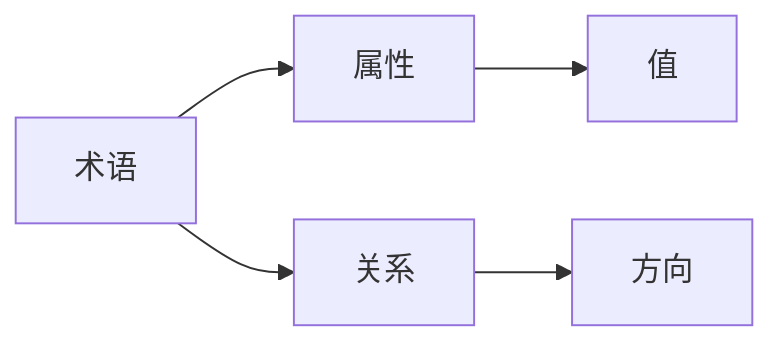
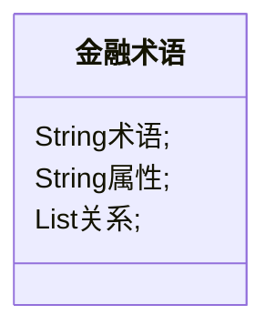

                 


```markdown
# 开发基于大模型的金融专业词汇网络构建器

> 关键词：大模型，金融，词汇网络，构建器，NLP，知识图谱

> 摘要：本文详细探讨了如何利用大模型构建金融专业词汇网络，解决金融领域术语管理的难题。通过分析大模型的原理，结合实际案例，阐述了构建词汇网络的步骤、方法及优化策略，展示了其在金融领域的广泛应用前景。

---

## 第一部分: 开发基于大模型的金融专业词汇网络构建器概述

### 第1章: 背景介绍

#### 1.1 问题背景
- **1.1.1 金融领域的复杂性与专业性**：金融领域术语繁多，涵盖股票、债券、基金等，术语间关系复杂。
- **1.1.2 传统金融词汇管理的局限性**：传统方法难以处理术语间的深层关系，导致信息孤岛。
- **1.1.3 大模型在金融领域的应用潜力**：大模型擅长处理海量数据，适合构建复杂的词汇网络。

#### 1.2 问题描述
- **1.2.1 金融专业词汇的多样性与复杂性**：术语多样，关系复杂。
- **1.2.2 信息孤岛与知识碎片化问题**：术语分散，难以系统管理。
- **1.2.3 专业词汇网络构建的必要性**：整合术语，便于知识检索和应用。

#### 1.3 问题解决
- **1.3.1 大模型在金融词汇处理中的优势**：能自动提取术语关系，构建网络。
- **1.3.2 通过大模型构建专业词汇网络的解决方案**：利用NLP技术处理文本，提取术语及关系。
- **1.3.3 专业词汇网络构建的目标与意义**：整合术语，提升知识管理效率。

#### 1.4 边界与外延
- **1.4.1 专业词汇网络的边界定义**：仅限于金融领域术语。
- **1.4.2 与相关领域的区别与联系**：与其他领域术语网络有相似性，但具体术语和关系不同。
- **1.4.3 专业词汇网络的外延扩展**：未来可扩展至多语言或多领域。

#### 1.5 核心要素组成
- **1.5.1 词汇网络的基本构成单元**：术语及其属性。
- **1.5.2 词汇之间的关系类型**：同义词、反义词、上下位关系等。
- **1.5.3 网络构建的核心要素与逻辑关系**：术语、属性、关系三者交互构成网络。

---

### 第2章: 核心概念与联系

#### 2.1 大模型的基本原理
- **2.1.1 大模型的定义与特点**：基于深度学习，参数众多，擅长处理复杂任务。
- **2.1.2 预训练与微调的核心原理**：预训练模型在通用数据上训练，微调在特定任务上优化。
- **2.1.3 大模型在金融领域的应用优势**：能处理复杂文本，提取深层信息。

#### 2.2 金融专业词汇网络的构建方法
- **2.2.1 词汇网络的构建步骤**：数据收集、术语提取、关系挖掘、网络构建。
- **2.2.2 基于大模型的特征提取与关系挖掘**：利用模型提取术语特征，挖掘关系。
- **2.2.3 专业词汇网络的优化与评估**：通过反馈优化网络结构，评估准确率和覆盖率。

#### 2.3 核心概念对比表
| 比较维度 | 传统词汇管理 | 基于大模型的词汇网络 |
|----------|--------------|----------------------|
| 管理方式 | 手动整理     | 自动提取与构建       |
| 处理效率 | 低效         | 高效                 |
| 知识深度 | 浅层         | 深层                 |

#### 2.4 ER实体关系图


---

## 第三部分: 算法原理讲解

### 第3章: 算法原理

#### 3.1 大模型训练流程


#### 3.2 代码实现
```python
from transformers import AutoModelForMaskedLM, AutoTokenizer

model_name = "bert-base-uncased"
model = AutoModelForMaskedLM.from_pretrained(model_name)
tokenizer = AutoTokenizer.from_pretrained(model_name)
```

#### 3.3 数学模型
- **损失函数**：$$L = -\sum_{i=1}^{n} \log p(w_i)$$
- **注意力机制**：$$\text{Attention}(Q, K, V) = \text{softmax}\left(\frac{QK^T}{\sqrt{d_k}}\right)V$$

---

## 第四部分: 系统分析与架构设计

### 第4章: 系统分析

#### 4.1 领域模型


#### 4.2 系统架构


---

## 第五部分: 项目实战

### 第5章: 项目实战

#### 5.1 环境安装
```bash
pip install transformers
```

#### 5.2 核心实现
```python
def build_network(terms):
    # 实现构建词汇网络的逻辑
    pass
```

#### 5.3 案例分析
- 分析某金融领域的术语网络，展示其结构和应用。

---

## 第六部分: 总结与展望

### 第6章: 总结与展望

#### 6.1 总结
- 本文详细介绍了基于大模型的金融专业词汇网络构建器，展示了其在金融领域的应用价值。

#### 6.2 未来展望
- 探讨未来可能的改进方向，如多模态网络构建、动态更新等。

---

## 作者

作者：AI天才研究院/AI Genius Institute & 禅与计算机程序设计艺术 /Zen And The Art of Computer Programming
```

