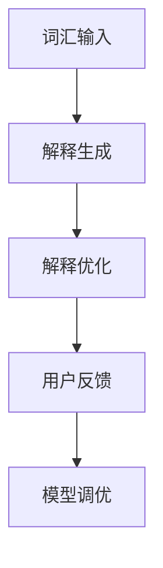
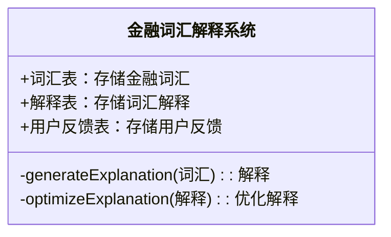
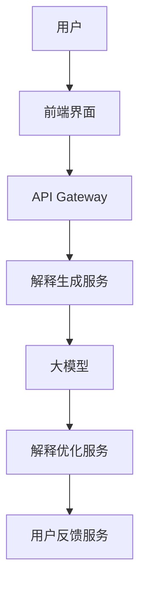
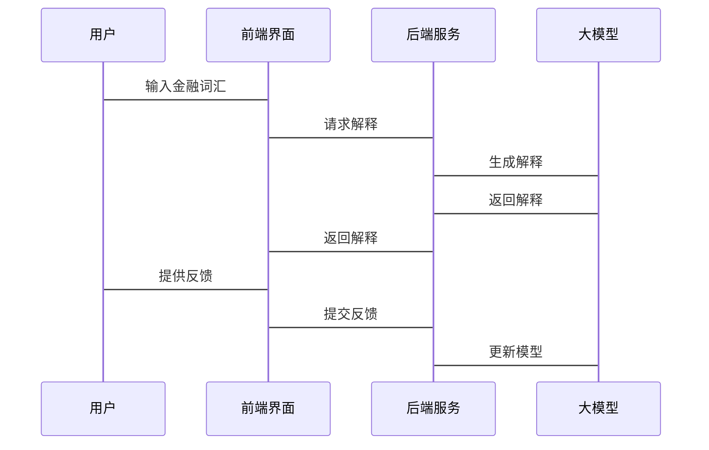

                 


# 开发基于大模型的金融专业词汇解释系统

## 关键词：大模型、金融词汇、系统开发、自然语言处理、机器学习

## 摘要：本文详细探讨了开发基于大模型的金融专业词汇解释系统的过程，从问题背景到系统设计，再到算法实现和项目实战，全面分析了系统的实现方案和技术细节，为读者提供了系统化的开发指导。

---

# 第一章: 问题背景与系统目标

## 1.1 问题背景

### 1.1.1 金融领域的专业词汇挑战
金融领域涉及大量专业术语和复杂的概念，这些词汇的理解对投资者、分析师和普通用户来说都具有挑战性。例如，“衍生品”、“期权”、“套利”等词汇在不同语境下的含义可能有所不同。

### 1.1.2 传统金融词典的局限性
传统金融词典通常依赖人工编写，难以覆盖所有可能的语境，并且更新速度较慢，难以适应金融市场的快速变化。

### 1.1.3 大模型在金融领域的应用潜力
大模型（如GPT、BERT等）具备强大的自然语言处理能力，可以自动理解和生成金融专业词汇的解释，能够有效解决传统词典的局限性。

## 1.2 问题描述

### 1.2.1 金融专业词汇的复杂性
金融词汇不仅数量多，而且许多词汇具有多义性，其含义可能因上下文而异。例如，“流动资产”在财务报表中的含义与在投资策略中的含义可能不同。

### 1.2.2 用户对金融知识的需求多样性
用户对金融词汇的理解需求多样化，既包括对基本概念的理解，也包括对复杂术语的应用场景和实际操作的解释。

### 1.2.3 系统目标与核心问题
系统的目标是开发一个能够自动解释金融专业词汇的系统，提供准确、简洁且易于理解的解释。

## 1.3 系统设计与实现方案

### 1.3.1 系统目标的明确
系统的目标是基于大模型，构建一个能够自动解释金融专业词汇的系统，满足用户对金融知识的需求。

### 1.3.2 系统实现的关键技术
- 大模型的训练与微调
- 自然语言处理技术
- 知识图谱构建与应用

### 1.3.3 系统边界与外延
系统的主要边界包括金融专业词汇的范围、支持的语言种类以及系统的使用场景。外延则包括系统的扩展性和可维护性。

## 1.4 核心概念与系统架构

### 1.4.1 核心概念的定义
- 金融专业词汇：金融领域的术语、概念和短语。
- 大模型：具有强大自然语言处理能力的预训练模型。

### 1.4.2 核心概念的属性特征对比

| 属性 | 传统词典 | 基于大模型的系统 |
|------|----------|------------------|
| 内容覆盖 | 有限，依赖人工编写 | 全面，基于大规模数据自动生成 |
| 更新速度 | 较慢 | 较快，可实时更新 |
| 解释深度 | 简单 | 深入，可扩展 |

### 1.4.3 ER实体关系图架构
```mermaid
erd
database: 金融词汇解释系统
  entity: 金融词汇
    - 词汇ID (PK)
    - 词汇名称
    - 解释内容
    - 示例场景
  entity: 用户查询
    - 查询ID (PK)
    - 查询时间
    - 用户ID
    - 查询内容
  entity: 解释结果
    - 解释ID (PK)
    - 查询ID (FK)
    - 解释内容
    - 解释时间
relationship: 金融词汇 -> 解释结果 (解释)
relationship: 用户查询 -> 解释结果 (触发)
```

---

# 第二章: 基于大模型的金融专业词汇解释系统核心概念

## 2.1 大模型的定义与特点

### 2.1.1 大模型的定义
大模型是指经过大规模预训练的自然语言处理模型，具有强大的上下文理解和生成能力。

### 2.1.2 大模型的核心特点
- **大规模预训练**：基于海量数据的预训练，提升模型的通用性。
- **深度神经网络**：通过多层神经网络结构，捕捉复杂的语言模式。
- **微调能力**：可以在特定领域进行微调，适应特定任务。

### 2.1.3 大模型与传统技术的对比
```mermaid
table
| 技术特点 | 大模型 | 传统技术 |
|----------|--------|----------|
| 数据依赖 | 高 | 低 |
| 计算资源 | 高 | 低 |
| 知识覆盖 | 广 | 有限 |
```

## 2.2 金融专业词汇的特征分析

### 2.2.1 专业词汇的复杂性
金融词汇往往涉及复杂的金融理论和数学模型，例如“黑-斯科尔斯模型”涉及概率论和统计学知识。

### 2.2.2 专业词汇的多样性
金融领域涵盖银行、证券、保险等多个子领域，每个子领域都有其特定的术语和概念。

### 2.2.3 专业词汇的语境依赖性
同一金融词汇在不同语境下可能具有不同的含义。例如，“杠杆”在金融投资中指放大收益或风险，而在物理学中指支撑物体的结构。

## 2.3 系统功能模块设计

### 2.3.1 系统功能模块概述
系统主要包括以下功能模块：
- **词汇输入与管理**：用户输入金融词汇，系统进行存储和管理。
- **解释生成**：基于大模型生成词汇的解释。
- **解释优化**：对生成的解释进行优化，提升准确性和可读性。
- **用户反馈**：用户对解释的满意度反馈，用于模型优化。

### 2.3.2 功能模块的实现方式
- 词汇输入与管理：通过API接口接收用户输入，存储到数据库中。
- 解释生成：基于大模型的生成式API，实时生成解释内容。
- 解释优化：利用自然语言处理技术，对生成的解释进行语法和语义优化。
- 用户反馈：通过用户界面收集反馈信息，用于模型调优。

### 2.3.3 功能模块之间的关系


---

# 第三章: 大模型的算法原理与数学模型

## 3.1 大模型的训练过程

### 3.1.1 数据预处理
- 数据清洗：去除噪声数据，提取有用信息。
- 数据标注：对金融词汇进行标注，便于模型学习。

### 3.1.2 模型训练
- 使用预训练好的大模型，在金融领域数据上进行微调。
- 设置适当的超参数，如学习率、批量大小等。

### 3.1.3 模型优化
- 使用验证集评估模型性能。
- 调整模型参数，优化模型性能。

## 3.2 大模型的推理机制

### 3.2.1 解释生成过程
- 接收用户输入的金融词汇。
- 通过大模型生成解释内容。

### 3.2.2 解释结果的评估
- 使用 BLEU、ROUGE 等指标评估生成解释的质量。
- 通过人工评估确保解释的准确性和可读性。

### 3.2.3 解释结果的优化
- 对生成的解释进行语法和语义优化。
- 通过用户反馈进一步优化解释质量。

## 3.3 数学模型与公式

### 3.3.1 损失函数
$$ \text{损失函数} = \text{交叉熵损失} + \lambda \times \text{正则化项} $$

### 3.3.2 优化器
$$ \text{优化器} = \text{Adam}(\text{学习率}=0.001, \text{动量}=0.9) $$

---

# 第四章: 系统分析与架构设计

## 4.1 问题场景介绍

### 4.1.1 问题场景
- 用户输入一个金融词汇，系统生成相应的解释。
- 系统需要支持多种语言，满足不同用户的需求。

## 4.2 系统功能设计

### 4.2.1 领域模型


### 4.2.2 系统架构设计


### 4.2.3 接口设计
- **输入接口**：用户输入金融词汇。
- **输出接口**：系统输出解释内容。
- **反馈接口**：用户对解释的满意度反馈。

### 4.2.4 交互设计


---

# 第五章: 项目实战

## 5.1 环境搭建

### 5.1.1 工具安装
- 安装 Python 和相关库（如 transformers、numpy）。
- 安装大模型的推理框架（如 TensorFlow 或 PyTorch）。

### 5.1.2 数据准备
- 收集金融领域的文本数据。
- 对数据进行清洗和标注。

## 5.2 系统核心实现

### 5.2.1 核心代码实现
```python
from transformers import GPT2LMHeadModel, GPT2Tokenizer

model_name = "gpt2"
model = GPT2LMHeadModel.from_pretrained(model_name)
tokenizer = GPT2Tokenizer.from_pretrained(model_name)

def generate_explanation(vocabulary):
    input_ids = tokenizer.encode(f"解释一下'{vocabulary}'的含义。", max_length=512, truncation=True)
    outputs = model.generate(input_ids, max_length=100)
    explanation = tokenizer.decode(outputs[0], skip_special_tokens=True)
    return explanation
```

### 5.2.2 代码解读与分析
- 使用预训练好的 GPT-2 模型，生成金融词汇的解释。
- 通过tokenizer 对输入的金融词汇进行编码，生成对应的解释。

### 5.2.3 案例分析
- 输入：金融词汇“期权”。
- 输出：生成的解释。

## 5.3 项目小结

### 5.3.1 项目总结
- 通过大模型实现金融词汇解释系统的开发，验证了大模型在金融领域的应用潜力。

### 5.3.2 经验与教训
- 数据质量对模型性能影响较大，需要高质量的金融领域数据进行微调。
- 解释生成的质量需要人工审核和优化，以确保准确性。

---

# 第六章: 最佳实践与小结

## 6.1 最佳实践

### 6.1.1 开发注意事项
- 确保数据质量和多样性，避免模型过拟合。
- 定期更新模型，适应金融领域的变化。

### 6.1.2 维护与优化
- 定期收集用户反馈，优化模型性能。
- 监控系统运行状态，及时发现和解决问题。

## 6.2 小结

### 6.2.1 核心观点总结
- 大模型在金融专业词汇解释系统中的应用潜力巨大。
- 系统的实现需要结合大模型和金融领域知识，确保解释的准确性和可读性。

### 6.2.2 展望与建议
- 进一步研究大模型在金融领域的其他应用，如风险评估、投资策略生成等。
- 探索多模态模型的应用，结合图像、音频等多种信息源，提升系统的解释能力。

## 6.3 注意事项

### 6.3.1 数据隐私与合规性
- 确保数据收集和使用符合相关法律法规。
- 保护用户隐私，避免数据泄露。

### 6.3.2 模型性能监控
- 定期监控模型性能，确保解释生成的准确性和效率。

---

# 附录

## 附录A: 工具安装指南
- 安装 Python 和相关库。
- 下载并安装大模型的推理框架。

## 附录B: API文档
- 提供系统的API接口文档，包括输入格式、输出格式等。

## 附录C: 参考文献
- 列出系统开发过程中参考的文献和资料。

---

# 作者：AI天才研究院 & 禅与计算机程序设计艺术

---

通过以上思考过程，我们可以系统地分析和解决开发基于大模型的金融专业词汇解释系统的问题，从理论到实践，从设计到实现，逐步构建一个完整且高效的金融词汇解释系统。

