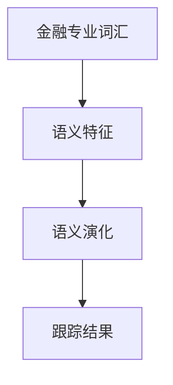
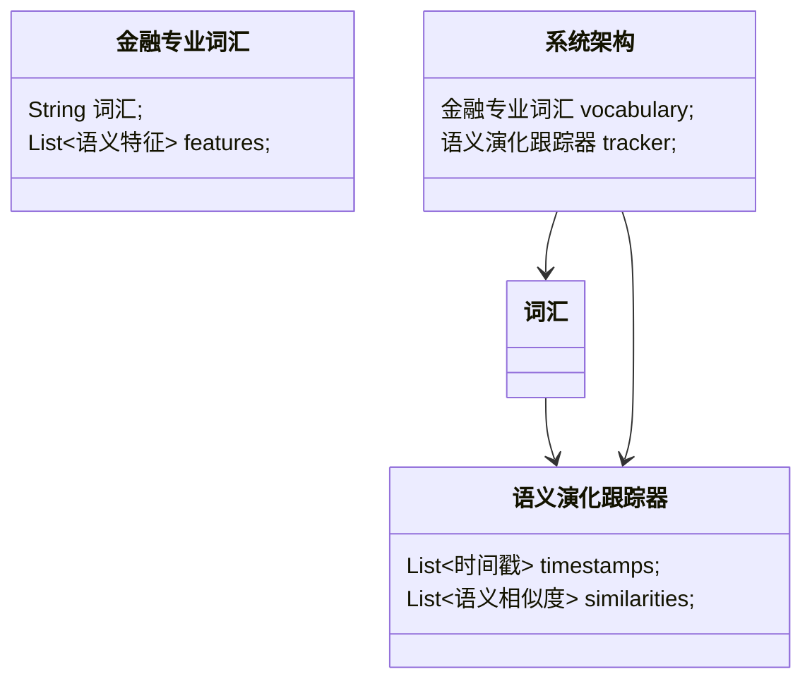
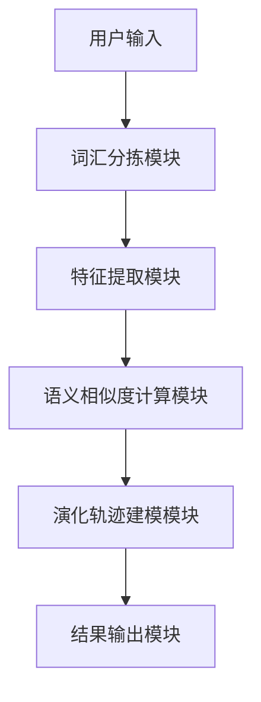

                 


```markdown
# 开发基于大模型的金融专业词汇语义演化跟踪器

> 关键词：金融专业词汇、语义演化、大模型、语义分析、自然语言处理

> 摘要：本文介绍了一种基于大模型的金融专业词汇语义演化跟踪器的开发方法。通过分析金融领域专业词汇的语义演化，结合大模型的自然语言处理能力，设计并实现了一种能够实时跟踪和分析金融词汇语义变化的系统。本文详细探讨了系统设计的核心概念、算法原理、系统架构，并通过实际案例展示了系统的实现过程。

---

## 第一部分: 背景介绍

### 第1章: 问题背景与目标

#### 1.1 问题背景

在金融领域，专业词汇的语义演化是一个复杂而重要的问题。金融市场的动态变化使得某些词汇的含义可能会随着时间推移而发生变化，这种变化可能影响到金融分析、投资决策等多个方面。例如，“区块链”在早期可能仅指一种技术概念，但在后续的金融应用中，其含义逐渐扩展到加密货币、智能合约等领域。

传统的语义分析方法在处理金融专业词汇时存在以下问题：

1. **语义漂移**：传统方法难以捕捉词汇在不同上下文中的细微语义变化。
2. **领域限制**：金融领域的专业词汇具有高度的领域特异性，传统方法难以准确理解其含义。
3. **动态变化**：金融市场信息更新速度快，传统静态语义分析方法难以应对这种动态变化。

#### 1.2 问题描述

语义演化是指词汇在不同时间点上语义的变化过程。金融专业词汇的语义演化具有以下特点：

1. **领域特异性**：金融词汇的语义演化往往与金融领域的特定概念相关。
2. **动态性**：金融市场的变化会导致词汇语义的快速变化。
3. **复杂性**：金融词汇的语义演化可能受到多种因素的影响，如市场趋势、政策变化等。

本研究的目标是设计并实现一个基于大模型的金融专业词汇语义演化跟踪器，能够实时跟踪和分析金融词汇的语义变化，并提供可解释的结果。

#### 1.3 问题解决方法

基于大模型的语义分析方法具有以下优势：

1. **深度语义理解**：大模型能够捕捉词汇在不同上下文中的深度语义信息。
2. **动态适应性**：通过持续学习，大模型可以跟踪词汇语义的动态变化。
3. **领域迁移能力**：大模型在金融领域的迁移能力较强，能够快速适应金融专业词汇的语义特征。

---

### 第2章: 核心概念与联系

#### 2.1 核心概念原理

1. **大模型在语义分析中的作用**：
   - 大模型通过预训练掌握了海量数据中的语义信息，能够理解词汇在不同上下文中的含义。
   - 通过微调，大模型可以适应金融领域的特定需求，提升对金融专业词汇的理解能力。

2. **语义演化的核心算法**：
   - 语义演化跟踪器通过分析词汇在不同时间点的语义相似度，构建词汇的语义演化轨迹。
   - 基于时间序列的建模方法，预测词汇的语义演化趋势。

3. **金融专业词汇的特征提取**：
   - 从金融文本中提取与特定金融概念相关的词汇。
   - 通过领域特定的特征提取方法，增强模型对金融专业词汇的理解能力。

#### 2.2 核心概念对比

| 对比维度       | 金融专业词汇 | 通用词汇 |
|----------------|--------------|----------|
| 领域特异性     | 高           | 低       |
| 语义复杂性     | 高           | 中       |
| 动态变化速度   | 快           | 慢       |

#### 2.3 实体关系图



---

## 第二部分: 大模型与语义演化算法原理

### 第3章: 大模型的语义分析原理

#### 3.1 大模型的基本原理

1. **大模型的训练目标**：
   - 预训练：通过大规模数据的无监督学习，掌握语言的语义结构和上下文关系。
   - 微调：在特定领域数据上进行有监督训练，提升模型在金融领域的表现。

2. **大模型的编码机制**：
   - 模型通过将词汇映射到高维向量空间，捕捉词汇的语义信息。
   - 使用注意力机制，关注词汇在上下文中的重要性。

3. **大模型的语义理解能力**：
   - 模型能够理解词汇在不同语境中的含义，捕捉语义的细微变化。

#### 3.2 语义演化的核心算法

1. **语义相似度计算**：
   - 使用余弦相似度或欧氏距离等方法，计算词汇在不同时间点的语义相似度。
   - 公式：$$ \text{sim}(v_t, v_{t+1}) = \cos(\theta_t, \theta_{t+1}) $$

2. **语义演化轨迹的建模**：
   - 使用时间序列模型（如LSTM、Transformer）建模词汇的语义演化轨迹。
   - 公式：$$ p(v_t | v_{t-1}) = \text{LSTM}(v_{t-1}) $$

3. **语义演化趋势的预测**：
   - 基于历史语义演化数据，预测未来词汇的语义变化趋势。
   - 公式：$$ \hat{v}_{t+n} = \text{模型预测}(v_t, v_{t+1}, ..., v_{t+n-1}) $$

---

### 第4章: 算法实现与优化

#### 4.1 算法实现细节

1. **特征提取的实现**：
   - 使用大模型提取词汇的语义向量。
   - 代码示例：
     ```python
     def extract_features(text):
         model = load_pretrained_model()
         return model.encode(text)
     ```

2. **语义相似度计算的实现**：
   - 使用余弦相似度计算词汇向量之间的相似度。
   - 代码示例：
     ```python
     def compute_similarity(v1, v2):
         return np.dot(v1, v2) / (np.linalg.norm(v1) * np.linalg.norm(v2))
     ```

3. **演化轨迹建模的实现**：
   - 使用LSTM模型建模词汇的语义演化轨迹。
   - 代码示例：
     ```python
     class LSTMModel(nn.Module):
         def __init__(self, input_size, hidden_size):
             super(LSTMModel, self).__init__()
             self.lstm = nn.LSTM(input_size, hidden_size)
             self.linear = nn.Linear(hidden_size, 1)
         def forward(self, input_sequence):
             output, (h, c) = self.lstm(input_sequence)
             return self.linear(output)
     ```

#### 4.2 算法优化

1. **模型调优**：
   - 使用早停法防止过拟合。
   - 调整学习率和批量大小，优化模型性能。

2. **计算优化**：
   - 使用GPU加速计算。
   - 优化数据预处理流程，提高计算效率。

---

## 第三部分: 系统分析与架构设计

### 第5章: 系统功能设计

#### 5.1 领域模型设计



#### 5.2 系统架构设计



#### 5.3 系统接口设计

1. **输入接口**：
   - 提供金融文本输入接口，支持多种数据格式（如CSV、JSON）。
   - 接口示例：
     ```python
     def input_handler(data):
         return preprocess(data)
     ```

2. **输出接口**：
   - 提供语义演化结果的输出接口，支持JSON格式。
   - 接口示例：
     ```python
     def output_handler(results):
         return json.dumps(results)
     ```

---

## 第四部分: 项目实战

### 第6章: 项目环境与安装

#### 6.1 环境要求

1. Python 3.8+
2. PyTorch或TensorFlow框架
3. 大模型预训练权重（如GPT、BERT）

#### 6.2 安装依赖

```bash
pip install torch transformers
```

---

### 第7章: 核心代码实现

#### 7.1 特征提取模块

```python
from transformers import AutoTokenizer, AutoModel

def extract_semantic_features(text):
    tokenizer = AutoTokenizer.from_pretrained('bert-base-uncased')
    model = AutoModel.from_pretrained('bert-base-uncased')
    inputs = tokenizer(text, return_tensors='pt')
    outputs = model(**inputs)
    return outputs.last_hidden_state.squeeze().tolist()
```

#### 7.2 语义演化跟踪器

```python
import torch
import torch.nn as nn
import torch.nn.functional as F

class SemanticEvolver(nn.Module):
    def __init__(self, input_dim, hidden_dim):
        super(SemanticEvolver, self).__init__()
        self.lstm = nn.LSTM(input_dim, hidden_dim)
        self.linear = nn.Linear(hidden_dim, 1)
    
    def forward(self, input_sequence):
        output, (h, c) = self.lstm(input_sequence)
        return self.linear(output)
```

---

### 第8章: 实际案例分析

#### 8.1 案例描述

以“区块链”这一金融专业词汇为例，分析其语义演化过程。

#### 8.2 数据准备

准备包含“区块链”在不同时间点的文本数据，包括新闻、论文、报告等。

#### 8.3 模型训练

使用准备好的数据训练语义演化跟踪器，提取“区块链”的语义特征，并计算其语义相似度。

#### 8.4 结果分析

分析“区块链”的语义演化轨迹，观察其在金融领域的语义变化趋势。

---

## 第五部分: 最佳实践与总结

### 第9章: 最佳实践

1. **数据质量管理**：
   - 确保数据的多样性和代表性，避免数据偏差。
2. **模型调优**：
   - 使用交叉验证和网格搜索优化模型参数。
3. **实时更新**：
   - 定期更新模型，适应金融领域的最新变化。

### 第10章: 小结

本文详细介绍了基于大模型的金融专业词汇语义演化跟踪器的开发过程，包括系统设计、算法实现和项目实战。通过本研究，我们能够更好地理解和分析金融领域专业词汇的语义变化，为金融分析和投资决策提供有力支持。

### 第11章: 注意事项

1. **模型解释性**：
   - 大模型的“黑箱”特性可能影响结果的可解释性。
2. **计算资源**：
   - 训练和推理需要大量计算资源，建议使用GPU加速。
3. **数据隐私**：
   - 注意金融数据的隐私保护，确保合规性。

### 第12章: 拓展阅读

1. 最新论文推荐：
   - "Pretrained Models for Financial Text Analysis"
2. 相关书籍：
   - 《金融自然语言处理》
3. 在线课程：
   - "大模型在金融领域的应用"

---

## 作者

作者：AI天才研究院/AI Genius Institute & 禅与计算机程序设计艺术 /Zen And The Art of Computer Programming
```

