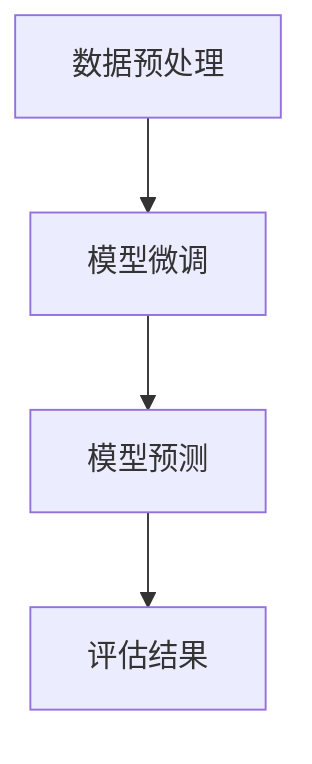
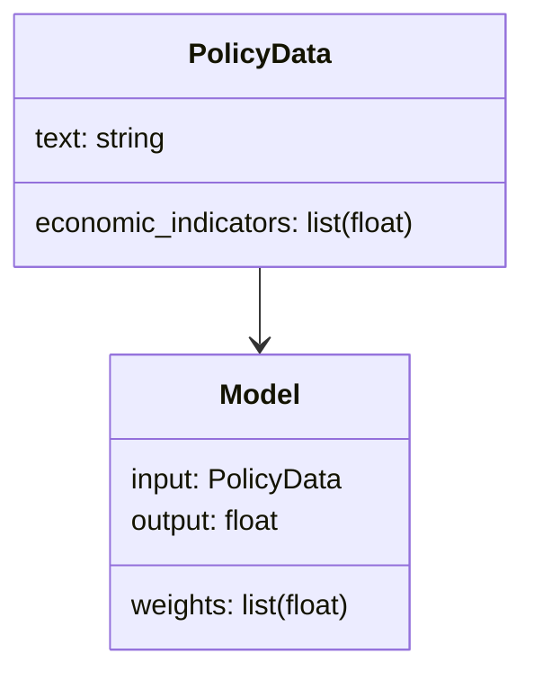
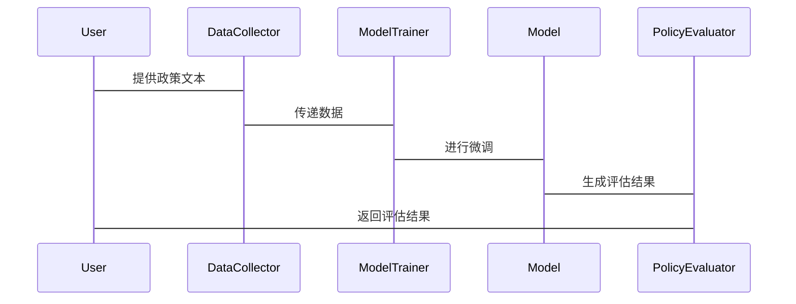

                 


# 第四章: 数学模型与算法原理

## 4.1 数学模型概述

### 4.1.1 模型的输入与输出

在金融政策影响评估中，模型的输入通常是金融政策的文本描述、历史经济数据、市场反应数据等。输出则是政策的影响评估结果，如对GDP增长率的影响、对就业率的影响、对市场波动性的预期等。

### 4.1.2 模型的假设条件

- 数据的充分性：假设输入数据足够全面，能够覆盖政策实施前后的各种经济指标。
- 模型的稳定性：假设模型在不同数据集上表现稳定。
- 政策的可量化性：假设政策的影响可以通过量化指标来衡量。

### 4.1.3 模型的评估

模型的评估通常包括准确率、召回率、F1分数等指标，具体选择根据评估目标而定。

## 4.2 算法实现

### 4.2.1 算法选择

基于大模型的金融政策评估可以采用迁移学习的方法，利用预训练的大模型进行微调。

### 4.2.2 算法实现步骤

1. 数据预处理：
   - 文本清洗：去除无关信息，提取政策关键词。
   - 数据增强：增加数据多样性。
   - 分词处理：将中文文本分割成词语。

2. 模型微调：
   - 加载预训练的大模型。
   - 在金融政策评估任务上进行微调，使用金融相关的数据集。

3. 模型预测：
   - 对新政策进行文本处理。
   - 生成政策影响的评估结果。

### 4.2.3 算法优化

- 调整学习率：使用学习率衰减策略。
- 增加正则化：防止模型过拟合。
- 数据增强：提高模型的泛化能力。

## 4.3 算法流程图



## 4.4 数学模型

### 4.4.1 损失函数

$$ L = \frac{1}{n} \sum_{i=1}^{n} (y_i - \hat{y_i})^2 $$

其中，\( y_i \) 是真实值，\( \hat{y_i} \) 是预测值，\( n \) 是样本数量。

### 4.4.2 优化器

使用Adam优化器，参数更新公式为：

$$ \theta_{t+1} = \theta_t - \eta \frac{\rho_1}{1-\beta_1^t} \frac{g}{1-\beta_2^t} $$

其中，\( \eta \) 是学习率，\( \rho_1 \) 和 \( \rho_2 \) 是动量参数，\( g \) 是梯度。

## 4.5 算法实现代码示例

```python
import tensorflow as tf
from tensorflow.keras.layers import TextVectorization, Dense, Input, Dropout
from tensorflow.keras.models import Model

# 定义模型
input_text = Input(shape=(1,), dtype='string')
text_vectorizer = TextVectorization(max_tokens=10000)(input_text)
dense_layer = Dense(64, activation='relu')(text_vectorizer)
dropout_layer = Dropout(0.5)(dense_layer)
output_layer = Dense(1, activation='sigmoid')(dropout_layer)

model = Model(inputs=input_text, outputs=output_layer)
model.compile(loss='binary_crossentropy', optimizer='adam', metrics=['accuracy'])
```

## 4.6 算法优化策略

- 学习率调整：使用学习率衰减。
- 正则化：添加Dropout层防止过拟合。
- 数据增强：使用文本数据增强技术。

# 第五章: 系统分析与架构设计

## 5.1 问题场景介绍

金融政策评估系统需要处理大量的金融数据和政策文本，要求系统具备高效的处理能力和高精度的评估能力。

## 5.2 系统功能设计

### 5.2.1 领域模型



### 5.2.2 系统架构


## 5.3 接口设计

### 5.3.1 输入接口

- 政策文本输入接口
- 经济指标输入接口

### 5.3.2 输出接口

- 评估结果输出接口
- 模型日志输出接口

## 5.4 交互流程



# 第六章: 项目实战

## 6.1 环境安装

### 6.1.1 安装Python和必要的库

```bash
pip install tensorflow pandas numpy scikit-learn
```

### 6.1.2 安装大模型框架

```bash
pip install tensorflow-transformers
```

## 6.2 核心代码实现

### 6.2.1 数据预处理代码

```python
import pandas as pd
import numpy as np

def preprocess_policy_data(data_frame):
    # 分词处理
    data_frame['tokens'] = data_frame['policy_text'].apply(lambda x: x.split())
    return data_frame
```

### 6.2.2 模型训练代码

```python
from tensorflow.keras.callbacks import EarlyStopping

def train_model(model, x_train, y_train, x_val, y_val):
    es = EarlyStopping(monitor='val_loss', patience=3, verbose=1)
    model.fit(x_train, y_train, epochs=10, batch_size=32, validation_data=(x_val, y_val), callbacks=[es])
```

### 6.2.3 模型评估代码

```python
from sklearn.metrics import accuracy_score

def evaluate_model(model, x_test, y_test):
    y_pred = model.predict(x_test)
    accuracy = accuracy_score(y_test, y_pred.round())
    print(f'Accuracy: {accuracy}')
```

## 6.3 案例分析

### 6.3.1 数据准备

假设有政策文本和对应的经济指标数据，进行清洗和处理。

### 6.3.2 模型训练

使用预处理后的数据训练模型，调整超参数以优化性能。

### 6.3.3 结果分析

分析模型预测结果，评估准确率、召回率等指标，找出模型的优势和不足。

## 6.4 项目总结

通过项目实战，验证了基于大模型的金融政策评估工具的有效性，发现了模型在处理复杂政策时的优势，同时也暴露了一些需要优化的地方，如模型的解释性和实时性。

# 第七章: 总结与展望

## 7.1 总结

本文详细介绍了开发基于大模型的金融政策影响评估工具的过程，从背景分析、算法设计到系统实现，全面阐述了各个步骤的关键点和实现细节。

## 7.2 展望

未来的研究可以集中在以下几个方面：
- 提高模型的解释性，以便更好地理解政策影响的具体机制。
- 实现模型的实时评估功能，适应动态变化的金融市场。
- 探索多模态模型的应用，结合文本、图像等多种数据源进行评估。

# 作者

作者：AI天才研究院 & 禅与计算机程序设计艺术

---

这篇文章详细讲解了开发基于大模型的金融政策影响评估工具的全过程，从理论到实践，帮助读者全面理解并掌握相关技术。

