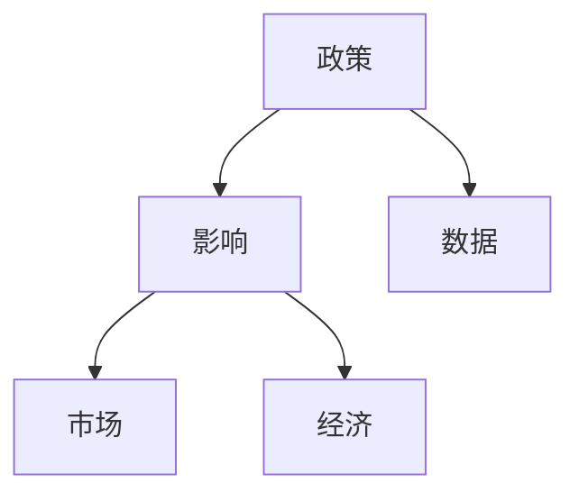
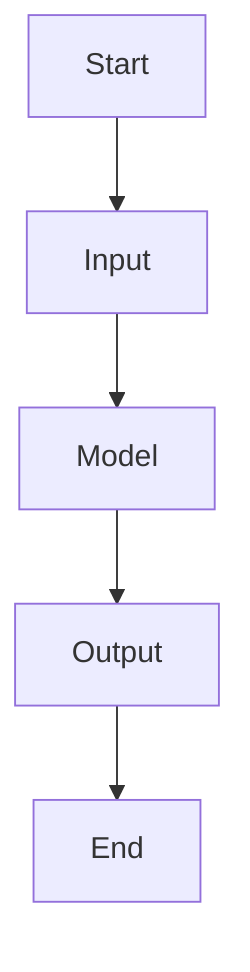
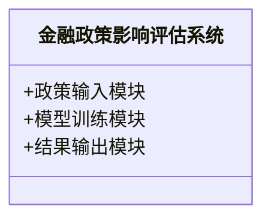
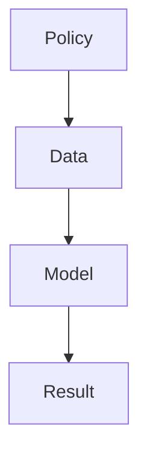
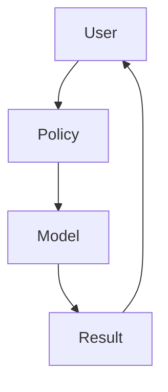

                 


# 开发基于大模型的金融政策影响评估系统

## 关键词：
金融政策，大模型，影响评估，系统开发，人工智能

## 摘要：
本文详细探讨了开发基于大模型的金融政策影响评估系统的各个方面。从系统背景到核心概念，从算法原理到系统架构设计，再到项目实战和总结，本文旨在为读者提供一个全面而系统的开发指南。通过详细的分析和具体的代码实现，本文展示了如何利用大模型技术来提升金融政策影响评估的准确性和效率，为金融领域的决策提供有力支持。

---

# 第1章: 金融政策影响评估系统背景介绍

## 1.1 问题背景与描述
### 1.1.1 金融政策影响的复杂性
金融政策是国家或组织为了实现特定经济目标而制定的策略和措施。这些政策的实施可能对市场、企业、个人等多个层面产生深远的影响。然而，金融政策的影响往往具有复杂性和不确定性，传统的评估方法难以捕捉这些复杂因素。

### 1.1.2 问题描述
传统的金融政策评估方法通常依赖于经验丰富的专家和复杂的统计模型。这种方法不仅耗时，而且在面对复杂多变的金融市场时，往往难以准确预测政策的实际效果。例如，政策的实施可能会引发连锁反应，导致评估结果与实际结果存在较大偏差。

### 1.1.3 问题解决
基于大模型的金融政策影响评估系统通过引入人工智能技术，能够更快速、更准确地分析政策的影响。大模型的强大计算能力和深度学习算法使得系统能够处理海量数据，并捕捉复杂的关系。这种方法不仅提高了评估的效率，还能够发现传统方法难以察觉的潜在影响。

### 1.1.4 系统边界与外延
金融政策影响评估系统的边界包括政策输入、数据处理、模型训练和结果输出。系统外延则包括对政策效果的实时监控和动态调整，以及对政策影响的长期跟踪和评估。

## 1.2 系统的核心要素
金融政策影响评估系统的核心要素包括政策输入模块、数据处理模块、模型训练模块和结果输出模块。这些模块共同协作，确保系统的高效运行和准确评估。

---

# 第2章: 核心概念与联系

## 2.1 核心概念原理
### 2.1.1 金融政策的定义与分类
金融政策可以分为货币政策和财政政策两大类。货币政策主要通过调整利率、货币供应量等手段影响经济，而财政政策则通过政府支出和税收来调节经济。

### 2.1.2 大模型的金融应用原理
大模型（如Transformer、BERT等）通过大规模的数据训练，能够理解复杂的金融数据和文本信息。在金融政策评估中，模型可以分析政策文本、市场反应和历史数据，从而预测政策的潜在影响。

### 2.1.3 系统的核心功能模块
系统的核心功能模块包括数据采集、特征提取、模型训练和结果分析。这些模块协同工作，确保系统能够准确评估金融政策的影响。

## 2.2 核心概念属性对比
### 2.2.1 传统评估方法与大模型方法对比
传统评估方法依赖于人工分析和统计模型，而大模型方法则利用机器学习算法和大数据分析，具有更高的准确性和效率。

### 2.2.2 系统功能模块的属性分析
功能模块包括数据采集、特征提取、模型训练和结果分析。每个模块都有其独特的功能和属性，共同构成系统的整体功能。

### 2.2.3 系统性能指标对比
系统的性能指标包括评估准确率、运行时间、资源消耗等。通过对比不同方法的性能指标，可以得出大模型方法在效率和准确性上的优势。

## 2.3 ER实体关系图
以下是一个简单的ER图，展示了金融政策影响评估系统的主要实体及其关系：



---

# 第3章: 算法原理讲解

## 3.1 算法原理概述
### 3.1.1 大模型的训练流程
大模型的训练流程包括数据预处理、模型构建、损失函数定义、优化算法选择和模型训练。这些步骤共同确保模型能够准确学习金融政策的影响。

### 3.1.2 系统推理机制
推理机制是模型在训练完成后，根据输入数据生成预测结果的过程。推理过程包括特征提取、模型计算和结果输出。

### 3.1.3 算法的数学模型
以下是一个简单的损失函数公式：

$$ L = \frac{1}{n}\sum_{i=1}^{n}(y_i - \hat{y}_i)^2 $$

其中，$y_i$ 是真实值，$\hat{y}_i$ 是预测值，$n$ 是数据点的数量。

## 3.2 算法流程图
以下是一个算法的流程图，展示了模型的训练和推理过程：



## 3.3 核心算法实现
### 3.3.1 损失函数
损失函数用于衡量模型预测值与真实值之间的差异。常见的损失函数包括均方误差（MSE）和交叉熵损失。

### 3.3.2 优化算法
优化算法用于调整模型参数，以最小化损失函数。常见的优化算法包括随机梯度下降（SGD）和Adam优化器。

---

# 第4章: 系统分析与架构设计

## 4.1 项目背景与目标
### 4.1.1 项目背景
随着金融市场的复杂化，传统的评估方法难以满足需求。基于大模型的金融政策影响评估系统能够提供更准确和高效的评估。

### 4.1.2 系统目标
系统的开发目标是实现金融政策的自动评估，提供准确的预测结果，并为决策者提供参考。

## 4.2 系统功能设计
### 4.2.1 领域模型
以下是系统的领域模型类图：



## 4.3 系统架构设计
### 4.3.1 系统架构图
以下是系统的架构图：



## 4.4 系统接口设计
系统接口设计包括数据输入接口、模型训练接口和结果输出接口。这些接口需要与外部系统进行数据交互。

## 4.5 系统交互图
以下是系统的交互图：



---

# 第5章: 项目实战

## 5.1 环境安装
开发基于大模型的金融政策影响评估系统需要以下环境：

- Python 3.8+
- TensorFlow或PyTorch
- 数据库（如MySQL）
- 开发工具（如VS Code）

## 5.2 系统核心实现
以下是系统核心实现的代码示例：

```python
import tensorflow as tf
from tensorflow.keras import layers

# 模型定义
model = tf.keras.Sequential([
    layers.Dense(64, activation='relu'),
    layers.Dense(1, activation='sigmoid')
])

# 损失函数和优化器
loss = tf.keras.losses.BinaryCrossentropy()
optimizer = tf.keras.optimizers.Adam(learning_rate=0.001)

# 编译模型
model.compile(optimizer=optimizer, loss=loss, metrics=['accuracy'])

# 训练模型
model.fit(x_train, y_train, epochs=10, batch_size=32)
```

## 5.3 案例分析
以下是一个实际案例的分析：

假设我们有一个政策，目标是降低企业税负。通过模型训练，我们可以预测该政策对企业利润和市场行为的影响。模型的预测结果可以帮助政策制定者更好地理解政策的实际效果。

---

# 第6章: 总结与展望

## 6.1 系统总结
开发基于大模型的金融政策影响评估系统是一项复杂的任务，涉及多个领域的知识和技术。通过系统的开发和应用，我们可以更准确地评估政策的影响，为决策者提供有力支持。

## 6.2 展望
未来，随着人工智能技术的不断发展，金融政策影响评估系统将更加智能化和高效化。新的算法和技术将不断涌现，推动系统向着更高精度和更广泛应用的方向发展。

---

# 作者：AI天才研究院/AI Genius Institute & 禅与计算机程序设计艺术 /Zen And The Art of Computer Programming

