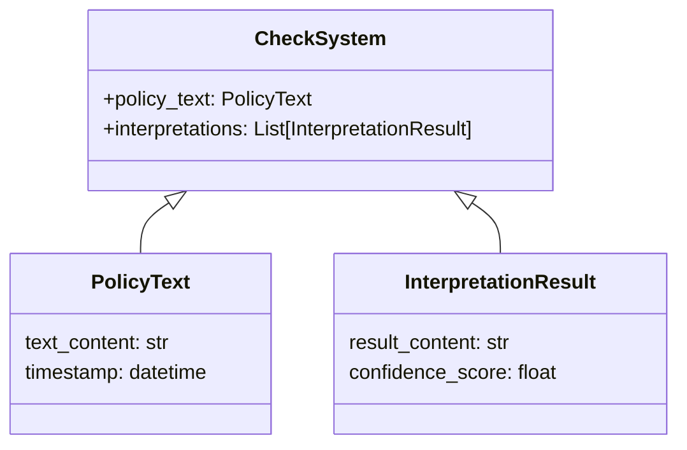
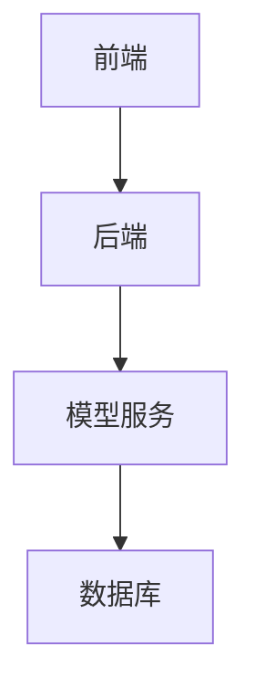

                 


# 开发基于大模型的金融政策解读一致性检查器

> 关键词：大模型，金融政策，NLP，一致性检查，自然语言处理，金融智能

> 摘要：本文系统性地探讨了基于大模型的金融政策解读一致性检查器的开发过程。从问题背景到技术原理，从系统设计到项目实现，结合实际案例，详细阐述了如何利用大模型和自然语言处理技术实现金融政策解读的一致性检查。文章内容涵盖背景介绍、核心概念、算法原理、系统架构、项目实战和最佳实践，旨在为相关领域的研究和实践提供参考。

---

## 第1章: 问题背景与需求分析

### 1.1 问题背景

#### 1.1.1 金融政策解读的复杂性
金融政策解读是一项复杂性极高的任务。政策文本通常包含大量专业术语和隐含含义，需要结合上下文、行业知识和相关法规进行综合分析。政策解读的准确性直接影响到金融机构的决策和执行效果。

#### 1.1.2 传统政策解读的局限性
传统的政策解读方法依赖于人工分析，效率低下且容易受到主观因素的影响。尤其是在面对海量政策文本时，人工解读不仅耗时耗力，还容易出现疏漏和错误。

#### 1.1.3 大模型在金融领域的潜力
大模型（如GPT、BERT等）具有强大的自然语言处理能力，能够通过预训练和微调任务，快速掌握特定领域的知识。在金融领域，大模型可以辅助政策解读、风险评估、市场分析等任务，显著提高效率和准确性。

### 1.2 问题描述

#### 1.2.1 金融政策解读的核心挑战
- **文本复杂性**：政策文本通常涉及复杂的法律术语和多层次的逻辑关系。
- **多样性**：政策解读可能因解读者的经验和视角不同而产生差异。
- **时效性**：政策会随着经济环境和监管要求的变化而频繁更新。

#### 1.2.2 一致性检查的定义与目标
一致性检查是指通过技术手段，确保不同解读结果之间的一致性和准确性。其目标是减少人为错误，提高政策解读的客观性和可靠性。

#### 1.2.3 问题解决的必要性
- **提高效率**：自动化检查可以显著减少人工解读的时间和成本。
- **保证质量**：通过技术手段确保解读结果的准确性，降低错误率。
- **支持决策**：一致的解读结果为金融机构的决策提供可靠依据。

### 1.3 问题解决思路

#### 1.3.1 引入大模型的动机
- **大模型的通用性**：大模型经过海量数据训练，具备强大的语义理解和生成能力。
- **领域适应性**：通过微调任务，大模型可以快速适应金融领域的特定需求。

#### 1.3.2 技术实现的可行性
- **技术基础**：自然语言处理技术的快速发展为政策解读提供技术支持。
- **数据支持**：丰富的金融政策文本数据为模型训练提供了保障。

#### 1.3.3 与现有技术的对比
- **效率提升**：相比人工解读，大模型可以快速处理大量文本。
- **准确性增强**：通过一致性检查，减少人为解读的偏差。

### 1.4 边界与外延

#### 1.4.1 适用场景与限制
- **适用场景**：适用于需要高精度政策解读的金融机构、监管机构等。
- **限制**：目前主要针对文本型政策解读，对非文本型政策（如表格、图表）的支持有限。

#### 1.4.2 与其他任务的区分
- **政策解读与文本摘要**：政策解读注重理解，而文本摘要注重提炼。
- **一致性检查与语法检查**：一致性检查关注内容的一致性，而语法检查关注语言的正确性。

#### 1.4.3 未来可能的扩展方向
- **多模态解读**：结合图像、语音等多种数据源进行政策解读。
- **动态更新**：实时更新模型，适应政策变化。

---

## 第2章: 核心概念与技术原理

### 2.1 大模型的基本原理

#### 2.1.1 大模型的训练机制
大模型通常采用预训练和微调的两阶段训练方式：
1. **预训练**：在通用大规模数据集上进行无监督学习，提取通用语言特征。
2. **微调**：在特定领域数据上进行有监督学习，适应领域需求。

#### 2.1.2 模型的表示能力
大模型通过词嵌入、句向量和段落向量，能够捕捉文本的语义信息，支持复杂的语义理解和生成任务。

#### 2.1.3 模型的可解释性
尽管大模型具有强大的能力，但其可解释性仍然有限。这在金融政策解读中可能带来一定的风险。

### 2.2 自然语言处理技术

#### 2.2.1 NLP的基本概念
NLP是研究人机交互中自然语言处理的技术，涵盖文本分类、信息抽取、机器翻译等任务。

#### 2.2.2 预训练模型的作用
预训练模型通过大规模数据学习语言的规律，为下游任务提供强大的特征表示。

#### 2.2.3 微调模型的策略
在金融领域，通过微调预训练模型，可以提升模型在特定任务上的性能。

### 2.3 金融政策解读的特殊性

#### 2.3.1 金融术语的复杂性
金融术语具有专业性和多样性，需要结合上下文进行准确解读。

#### 2.3.2 政策文本的结构特点
政策文本通常具有固定的结构和格式，便于文本分析和模式识别。

#### 2.3.3 政策解读的多样性
不同解读者对同一政策可能有不同的理解，导致解读结果的多样性。

### 2.4 一致性检查的实现原理

#### 2.4.1 检查器的工作流程
1. **输入文本**：用户输入需要解读的政策文本。
2. **模型推理**：模型对文本进行理解和生成解读结果。
3. **结果对比**：对多个解读结果进行一致性检查。
4. **输出结果**：生成一致的解读报告。

#### 2.4.2 多模型协作的机制
通过结合多个大模型的解读结果，利用投票、加权等方法，提高解读的一致性和准确性。

#### 2.4.3 结果输出的处理方式
解读结果通过可视化界面或API返回给用户，便于后续处理和分析。

---

## 第3章: 算法原理与数学模型

### 3.1 大模型的训练过程

#### 3.1.1 预训练阶段
预训练目标是学习语言的规律，常用任务包括：
- 接下来是什么（Next Sentence Prediction, NSP）
- 文本生成（Text Generation）

#### 3.1.2 微调阶段
在金融领域，微调任务包括：
- 文本分类（如政策类别识别）
- 问答系统（如政策问题解答）

#### 3.1.3 优化策略
使用Adam优化器，学习率逐步衰减，防止过拟合。

### 3.2 检查器的算法流程

#### 3.2.1 文本输入与预处理
输入政策文本，进行分词、去除停用词等预处理。

#### 3.2.2 模型推理过程
模型对预处理后的文本进行编码和解码，生成解读结果。

#### 3.2.3 多模型协作与结果融合
通过多模型协作，利用加权投票等方式，生成一致的解读结果。

---

## 第4章: 系统分析与架构设计

### 4.1 问题场景介绍

#### 4.1.1 项目介绍
开发一个基于大模型的金融政策解读一致性检查器，用于辅助金融机构解读政策文本，确保解读结果一致。

### 4.2 系统功能设计

#### 4.2.1 领域模型


### 4.3 系统架构设计

#### 4.3.1 分层架构


---

## 第5章: 项目实战

### 5.1 环境安装

#### 5.1.1 安装Python和相关库
```bash
pip install numpy
pip install tensorflow
pip install transformers
```

### 5.2 系统核心实现

#### 5.2.1 模型加载与推理
```python
from transformers import AutoTokenizer, AutoModelForMaskedLM

tokenizer = AutoTokenizer.from_pretrained("bert-base-cased")
model = AutoModelForMaskedLM.from_pretrained("bert-base-cased")

def interpret_policy(text):
    inputs = tokenizer(text, return_tensors="pt")
    outputs = model(**inputs)
    # 处理输出，生成解读结果
    return result
```

---

## 第6章: 最佳实践与小结

### 6.1 小结
通过本文的介绍，读者可以系统性地了解基于大模型的金融政策解读一致性检查器的开发过程。从问题背景到技术实现，从系统设计到项目实战，本文提供了全面的指导。

### 6.2 注意事项
- **数据质量**：确保训练数据的多样性和代表性。
- **模型可解释性**：尽量减少模型的黑箱特性，提高可解释性。

### 6.3 拓展阅读
- [《Large Language Models in Computer Vision》](https://arxiv.org/abs/2303.06727)
- [《金融风险管理》](https://www.amazon.com/Financial-Risk-Mangement/dp/0071768531)

---

**作者：AI天才研究院/AI Genius Institute & 禅与计算机程序设计艺术 /Zen And The Art of Computer Programming**

