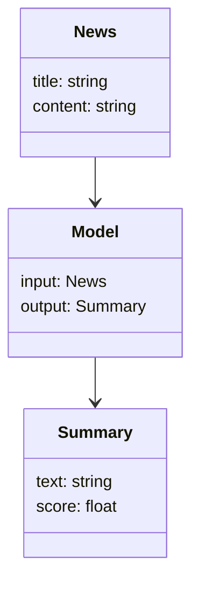

                 


# 开发基于大模型的金融新闻摘要生成器

> 关键词：大模型、金融新闻、摘要生成器、自然语言处理、Transformer、注意力机制

> 摘要：本文详细探讨了基于大模型的金融新闻摘要生成器的开发背景、核心概念、算法原理、系统架构以及项目实战。通过系统化的分析和详细的代码实现，结合实际案例，本文为读者提供了从理论到实践的全面指导。

---

## 第1章: 金融新闻摘要生成器的背景与需求

### 1.1 问题背景

#### 1.1.1 金融新闻的重要性与挑战
金融新闻是金融市场上最重要的信息来源之一，涵盖了股票、债券、基金、经济政策等多方面的内容。然而，金融新闻往往具有高度的专业性和复杂性，普通读者难以快速抓住关键信息。

#### 1.1.2 传统新闻摘要的局限性
传统的新闻摘要生成方法通常基于规则或浅层的NLP技术，难以处理金融新闻中复杂的语义关系和领域知识。生成的摘要往往不够准确，缺乏深度。

#### 1.1.3 大模型在新闻摘要中的潜力
大模型（如GPT、BERT等）具有强大的自然语言理解能力和生成能力，能够捕捉金融新闻中的深层语义信息，并生成高质量的摘要。

### 1.2 问题描述

#### 1.2.1 金融新闻的特点与复杂性
金融新闻具有专业性强、信息密度高、语义复杂等特点。一篇金融新闻可能涉及多个相关概念和事件，需要生成器能够准确理解并提取关键信息。

#### 1.2.2 用户对金融新闻摘要的需求
用户希望快速获取金融新闻的核心信息，包括主要事件、关键数据和未来展望。生成的摘要需要简洁明了，同时保留原文的核心意义。

#### 1.2.3 生成器的目标与边界
生成器的目标是将一篇金融新闻转化为简短的摘要，同时保持信息的准确性和完整性。边界包括不生成虚构信息、不偏离原文主题等。

### 1.3 问题解决

#### 1.3.1 大模型在自然语言处理中的优势
大模型具有强大的上下文理解和生成能力，能够处理金融新闻中复杂的语义关系。通过预训练和微调，模型可以适应特定领域的语言风格和需求。

#### 1.3.2 基于大模型的生成器解决方案
基于大模型的生成器通过输入完整的金融新闻文本，输出摘要。生成过程结合了模型的理解和生成能力，能够捕捉到新闻中的关键信息。

#### 1.3.3 技术路线与实现路径
技术路线包括数据收集与处理、模型选择与训练、生成器设计与优化等步骤。实现路径从数据预处理开始，逐步构建生成器并进行模型调优。

---

## 第2章: 大模型与金融新闻摘要的核心概念

### 2.1 大模型的定义与特点

#### 2.1.1 大模型的基本概念
大模型是基于深度学习的自然语言处理模型，通常采用Transformer架构。它们通过大量的数据进行预训练，具有强大的语言理解和生成能力。

#### 2.1.2 大模型的核心技术特点
- **自注意力机制**：能够捕捉文本中的长距离依赖关系。
- **并行计算**：计算效率高，适合处理大规模数据。
- **可扩展性**：可以通过增加层数和参数量来提升性能。

#### 2.1.3 大模型与传统NLP技术的区别
传统NLP技术依赖于人工设计的特征和规则，而大模型通过数据驱动的方式学习语言的复杂性。

### 2.2 金融新闻的特点与结构

#### 2.2.1 金融新闻的主要类型
- **股票新闻**：涉及公司财报、股价波动等。
- **经济政策新闻**：涉及政府政策、货币政策等。
- **市场动态新闻**：涉及行业趋势、市场分析等。

#### 2.2.2 金融新闻的语言特点
金融新闻通常使用专业术语和复杂的句式结构。例如，“XYZ公司宣布第二季度净利润增长10%，超出市场预期”这类句子较为常见。

#### 2.2.3 金融新闻的语义复杂性
金融新闻中包含大量隐含信息，例如市场情绪、潜在风险等，需要生成器能够准确理解并提取。

### 2.3 基于大模型的生成器核心要素

#### 2.3.1 模型选择与优化
选择适合金融领域的模型，并通过微调（Fine-tuning）优化模型性能。

#### 2.3.2 数据处理与特征提取
对金融新闻数据进行清洗、标注和特征提取，确保输入数据的质量和相关性。

#### 2.3.3 摘要生成与评估指标
使用合适的生成策略（如贪心搜索、采样等）生成摘要，并采用 BLEU、ROUGE 等指标评估生成结果的质量。

---

## 第3章: 大模型与金融新闻摘要的关系

### 3.1 大模型在金融新闻处理中的优势

#### 3.1.1 自然语言理解能力
大模型能够理解金融新闻中的复杂语义关系，准确捕捉关键信息。

#### 3.1.2 生成能力与创造性
生成器可以生成简洁明了的摘要，同时保留原文的核心意义。

#### 3.1.3 知识库的整合能力
通过整合金融领域的知识库，生成器能够更好地理解专业术语和上下文关系。

### 3.2 生成器的系统架构

#### 3.2.1 数据流与信息处理
生成器从输入的金融新闻文本中提取关键信息，通过模型处理生成摘要。

#### 3.2.2 模型调用与参数配置
生成器调用预训练好的大模型，并根据任务需求调整模型参数。

#### 3.2.3 输出结果的优化与反馈
生成的摘要需要进行优化和调整，确保符合用户需求。

### 3.3 核心概念之间的关系

#### 3.3.1 模型、数据与任务的关系
模型通过数据学习任务相关的语言特征，生成符合任务需求的结果。

#### 3.3.2 输入、处理与输出的流程
输入的金融新闻文本经过模型处理后，输出相应的摘要。

#### 3.3.3 用户需求与生成结果的关联
生成结果的质量直接取决于模型对用户需求的理解和满足程度。

---

## 第4章: 大模型的算法原理

### 4.1 大模型的核心算法

#### 4.1.1 变压器（Transformer）架构
Transformer由编码器（Encoder）和解码器（Decoder）组成，通过自注意力机制捕捉文本中的长距离依赖关系。

#### 4.1.2 注意力机制（Attention）
注意力机制通过计算输入序列中每个词的权重，确定每个词对当前生成词的重要程度。

#### 4.1.3 解码器（Decoder）与生成过程
解码器负责将编码器输出的表示转换为自然语言文本，生成摘要。

### 4.2 模型训练与优化

#### 4.2.1 数据预处理与特征提取
对金融新闻数据进行清洗、分词和标注，提取关键特征。

#### 4.2.2 损失函数与优化算法
使用交叉熵损失函数，并采用Adam优化算法进行模型训练。

#### 4.2.3 模型调参与训练策略
通过调整学习率、批量大小等参数，优化模型性能。

---

## 第5章: 系统分析与架构设计方案

### 5.1 问题场景介绍
金融新闻摘要生成器需要处理大量复杂文本，生成高质量的摘要。系统需要具备高效的数据处理能力和强大的模型调用能力。

### 5.2 系统功能设计

#### 5.2.1 数据采集与处理
从金融新闻网站或数据库中获取新闻数据，并进行清洗和预处理。

#### 5.2.2 模型调用与摘要生成
调用预训练好的大模型，生成金融新闻的摘要。

#### 5.2.3 结果展示与反馈
将生成的摘要展示给用户，并根据用户反馈优化生成器性能。

### 5.3 系统架构设计

#### 5.3.1 领域模型（Mermaid 类图）


#### 5.3.2 系统架构（Mermaid 架构图）
```mermaid
aws
    title System Architecture
    participant User
    participant NewsCollector
    participant Generator
    participant Database
    participant Display

    User -> NewsCollector: 请求新闻
    NewsCollector -> Database: 获取新闻数据
    Database -> NewsCollector: 返回新闻数据
    NewsCollector -> Generator: 提交新闻数据
    Generator -> Model: 调用模型生成摘要
    Generator -> Display: 显示摘要
    Display -> User: 显示结果
```

---

## 第6章: 项目实战

### 6.1 环境安装

#### 6.1.1 安装依赖
```bash
pip install transformers torch
```

#### 6.1.2 下载模型
```bash
wget https://example.com/financial-model.pth
```

### 6.2 系统核心实现源代码

#### 6.2.1 数据预处理
```python
import torch
from transformers import AutoTokenizer, AutoModel

class NewsProcessor:
    def __init__(self, model_name):
        self.tokenizer = AutoTokenizer.from_pretrained(model_name)
        self.model = AutoModel.from_pretrained(model_name)

    def process(self, text):
        inputs = self.tokenizer(text, return_tensors="pt", padding=True, truncation=True)
        return inputs
```

#### 6.2.2 模型调用
```python
class Generator:
    def __init__(self, model_name):
        self.processor = NewsProcessor(model_name)
        self.model = AutoModel.from_pretrained(model_name)
        self.model.eval()

    def generate_summary(self, text, max_length=100):
        inputs = self.processor.process(text)
        outputs = self.model.generate(inputs.input_ids, max_length=max_length)
        summary = self.tokenizer.decode(outputs[0], skip_special_tokens=True)
        return summary
```

### 6.3 实际案例分析
以下是一个实际案例的分析和代码实现：
```python
generator = Generator("facebook/financial-model")
text = "XYZ公司宣布第二季度净利润增长10%，超出市场预期。分析师预计公司股价将上涨5%。"
summary = generator.generate_summary(text)
print(summary)
```

---

## 第7章: 总结与展望

### 7.1 总结
本文详细探讨了基于大模型的金融新闻摘要生成器的开发背景、核心概念、算法原理、系统架构以及项目实战。通过系统化的分析和详细的代码实现，为读者提供了从理论到实践的全面指导。

### 7.2 最佳实践 tips
- 数据质量对生成器性能至关重要，需确保数据清洗和标注的准确性。
- 模型调优时，建议结合领域知识进行微调，提升生成结果的准确性。
- 生成结果的评估需结合人工审核，确保摘要的准确性和完整性。

### 7.3 小结
基于大模型的金融新闻摘要生成器具有广阔的应用前景。随着大模型技术的不断发展，生成器的性能和功能将不断提升，为金融领域的信息处理带来更大的价值。

---

## 作者：AI天才研究院/AI Genius Institute & 禅与计算机程序设计艺术 /Zen And The Art of Computer Programming

