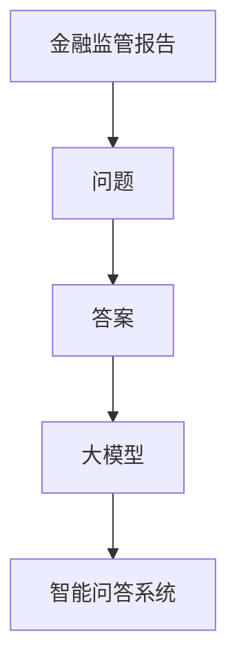
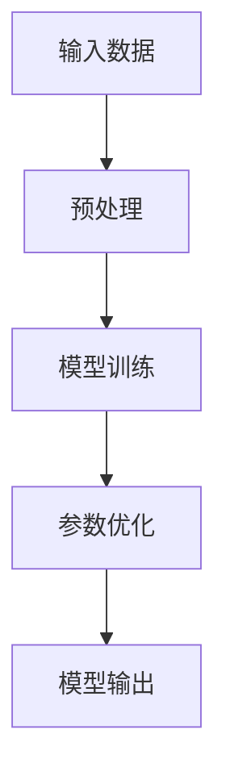
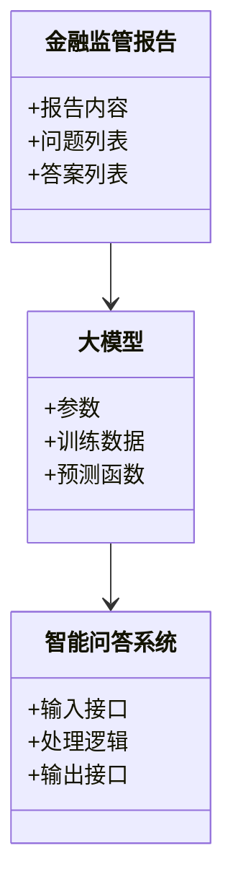
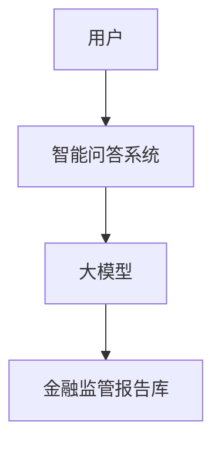
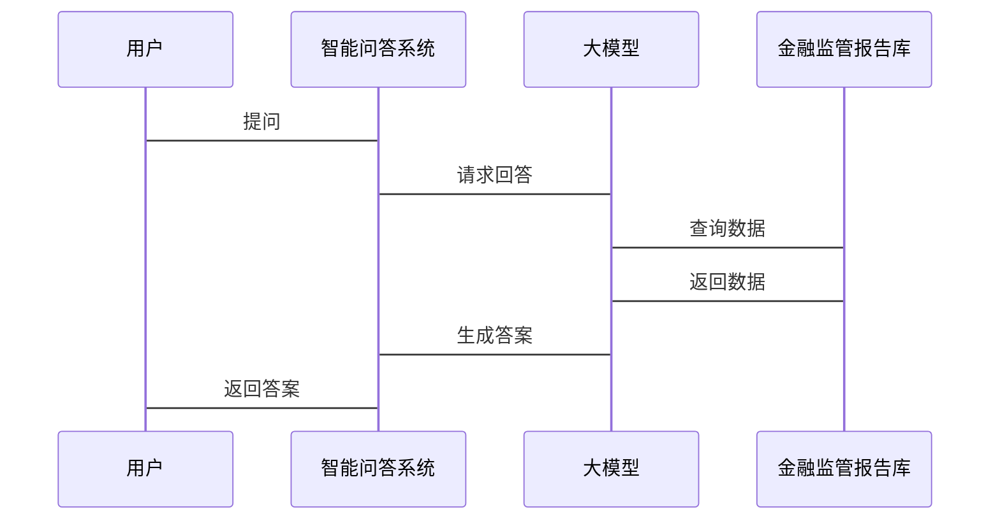

                 


# 开发基于大模型的金融监管报告智能问答助手

> 关键词：大模型、金融监管、智能问答系统、NLP、机器学习、深度学习

> 摘要：本文详细探讨了如何开发基于大模型的金融监管报告智能问答助手。通过分析金融监管报告的复杂性，介绍了大模型在金融监管中的潜力，详细讲解了大模型的算法原理，系统分析与架构设计，提供了项目实战的详细步骤，并总结了最佳实践和注意事项。本文旨在为技术人员提供从理论到实践的全面指导，帮助他们开发高效的金融监管问答系统。

---

## 第一部分: 大模型与金融监管问答系统概述

### 第1章: 问题背景与核心概念

#### 1.1 问题背景

- **金融监管报告的复杂性**：金融监管涉及广泛的法律法规、市场动态和风险管理，报告内容复杂且专业性强，传统问答系统难以应对。
- **传统问答系统的局限性**：传统问答系统依赖于规则和关键词匹配，无法处理复杂的语义理解和上下文推理。
- **大模型在金融监管中的潜力**：大模型具备强大的自然语言处理能力，能够理解和生成复杂的金融内容，适合用于金融监管问答系统。

#### 1.2 核心概念与联系

- **大模型与金融监管问答系统的关系**：大模型作为核心驱动力，提供语义理解和生成能力，金融监管问答系统则作为应用场景。
- **系统核心要素与属性对比**：
  | 核心要素 | 描述 |
  |----------|------|
  | 金融监管报告 | 包含法律法规、市场数据和风险管理等内容 |
  | 问题 | 用户提出的问题，可能涉及复杂金融概念 |
  | 答案 | 基于大模型生成的回答，需符合金融监管要求 |
  | 大模型 | 提供语义理解和生成能力，支持问答系统运行 |
  | 智能问答系统 | 整合大模型和金融数据，提供交互式问答服务 |
- **ER实体关系图**（使用 Mermaid 流程图）：



---

### 第2章: 大模型的算法原理

#### 2.1 大模型的数学模型

- **变量与方程**：$$y = f(x)$$，其中 $x$ 是输入，$y$ 是输出，$f$ 是模型函数。
- **概率分布与损失函数**：$$L = -\sum_{i=1}^{n} \log p(y_i|x_i)$$，损失函数衡量模型预测与真实值的差异。

#### 2.2 算法流程

- **模型训练流程图**（使用 Mermaid 流程图）：



#### 2.3 代码实现

```python
import torch
import torch.nn as nn

class Model(nn.Module):
    def __init__(self, input_dim, output_dim):
        super(Model, self).__init__()
        self.fc = nn.Linear(input_dim, output_dim)
    
    def forward(self, x):
        return self.fc(x)

# 示例训练代码
model = Model(input_dim=100, output_dim=1)
criterion = nn.MSELoss()
optimizer = torch.optim.Adam(model.parameters(), lr=0.001)
```

---

### 第3章: 系统分析与架构设计

#### 3.1 系统功能设计

- **领域模型类图**（使用 Mermaid 类图）：



#### 3.2 系统架构设计

- **系统架构图**（使用 Mermaid 架构图）：



#### 3.3 接口设计与交互流程

- **系统交互流程图**（使用 Mermaid 序列图）：



---

### 第4章: 项目实战

#### 4.1 环境安装

- **安装 Python**：确保安装 Python 3.8 或更高版本。
- **安装依赖库**：使用 pip 安装以下库：
  ```bash
  pip install torch transformers
  ```

#### 4.2 系统核心实现

- **大模型接口实现**：

```python
from transformers import AutoTokenizer, AutoModelForQuestionAnswering

tokenizer = AutoTokenizer.from_pretrained('bert-base-chinese')
model = AutoModelForQuestionAnswering.from_pretrained('bert-base-chinese')

def answer_question(context, question):
    inputs = tokenizer.encode_plus(question=question, context=context, return_tensors='pt')
    outputs = model(**inputs)
    start_logits = outputs.start_logits
    end_logits = outputs.end_logits
    start_index = torch.argmax(start_logits).item()
    end_index = torch.argmax(end_logits).item()
    answer = tokenizer.decode(inputs.input_ids[0][start_index:end_index+1])
    return answer
```

#### 4.3 案例分析

- **示例案例**：
  - **输入**：用户提问：“公司年报中收入增长的原因是什么？”
  - **输出**：智能问答系统结合大模型分析年报内容，生成详细答案。

#### 4.4 代码解读与分析

- **代码解读**：
  - 使用 `AutoTokenizer` 和 `AutoModelForQuestionAnswering` 加载预训练模型。
  - `answer_question` 函数处理用户输入，生成答案。
  - 通过 `tokenizer.decode` 解码模型输出，生成自然语言回答。

---

### 第5章: 最佳实践与总结

#### 5.1 最佳实践

- **数据预处理**：确保金融监管报告数据的清洗和标注，提升模型训练效果。
- **模型调优**：通过微调和参数优化，提升模型在特定领域的表现。
- **系统性能优化**：优化接口设计和缓存机制，提高问答系统的响应速度。

#### 5.2 小结

- 本文详细讲解了开发基于大模型的金融监管报告智能问答助手的全过程，从算法原理到系统实现，为技术人员提供了全面的指导。
- 开发过程中需注意数据质量、模型调优和系统性能优化。

#### 5.3 注意事项

- 数据安全：确保金融数据的安全存储和传输。
- 模型泛化能力：避免过度依赖特定模型，保持系统的灵活性。
- 用户体验：优化交互设计，提升用户体验。

#### 5.4 拓展阅读

- 《深度学习》—— Ian Goodfellow
- 《自然语言处理入门》—— 细菌

---

作者：AI天才研究院/AI Genius Institute & 禅与计算机程序设计艺术 /Zen And The Art of Computer Programming

