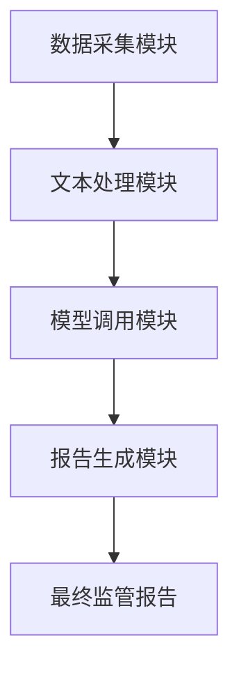
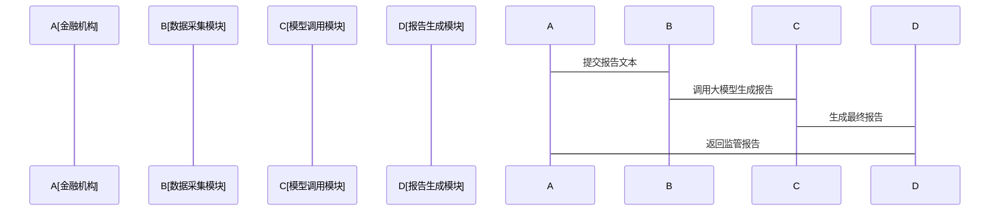

                 


# 开发基于大模型的金融监管报告自动生成助手

> 关键词：大模型，金融监管，自然语言处理，AI生成，报告自动生成

> 摘要：本文详细探讨了开发基于大模型的金融监管报告自动生成助手的技术细节。从大模型的基本概念到金融监管的背景需求，再到系统设计与实现，最后通过项目实战展示了整个开发过程。文章深入分析了大模型在金融监管中的应用价值，探讨了系统架构设计和实现方案，并通过具体案例展示了如何利用大模型实现金融监管报告的自动生成。

---

## 第1章 大模型的基本概念

### 1.1 大模型的定义与特点

#### 1.1.1 大模型的定义
大模型（Large Language Model, LLM）是一种基于深度学习的自然语言处理模型，通常基于Transformer架构，通过大量数据的预训练，能够理解和生成人类语言。大模型的核心在于其规模和参数数量，通常超过 billions（十亿）级别。

#### 1.1.2 大模型的核心特点
- **大规模训练**：大模型通过海量数据的预训练，掌握了广泛的知识和语言模式。
- **上下文理解**：能够理解和处理上下文，生成连贯且合理的文本。
- **多任务能力**：大模型可以通过微调（Fine-tuning）适应多种任务，如文本生成、问答、翻译等。
- **可解释性**：虽然大模型在某些方面表现优秀，但其决策过程往往缺乏可解释性。

#### 1.1.3 大模型与传统AI的区别
- **数据驱动 vs 规则驱动**：传统AI依赖于手动设计的规则，而大模型通过数据驱动的方式学习知识。
- **通用性 vs 专用性**：大模型具有较强的通用性，可以适应多种任务，而传统AI通常针对特定任务设计。
- **计算资源需求**：大模型需要大量的计算资源进行训练，而传统AI对计算资源的需求相对较低。

### 1.2 主流大模型简介

#### 1.2.1 GPT系列模型
GPT（Generative Pre-trained Transformer）是由OpenAI开发的系列大模型，目前最知名的版本是GPT-3，拥有175 billion的参数量。GPT系列模型以其强大的生成能力著称。

#### 1.2.2 BERT及其变体
BERT（Bidirectional Encoder Representations from Transformers）是由Google开发的另一种大模型，采用了双向Transformer结构。BERT及其变体在文本理解任务中表现出色。

#### 1.2.3 其他知名大模型介绍
- **T5**：由Google开发，强调可微调性（Fleet-of-Tasks）。
- **PaLM**：由Google开发，专注于 Palm-sized 的生成任务。
- **Megatron-LM**：由微软开发，支持大规模分布式训练。

### 1.3 大模型的训练与优化

#### 1.3.1 大模型的训练方法
- **预训练**：在大规模通用数据集上进行无监督预训练，学习语言的结构和模式。
- **微调**：针对特定任务（如金融监管报告生成）进行有监督微调。

#### 1.3.2 大模型的优化技巧
- **参数剪枝**：通过剪枝技术减少模型的参数数量，降低计算成本。
- **知识蒸馏**：通过教师模型（大模型）指导学生模型（小模型）学习知识。
- **混合精度训练**：通过混合精度技术提高训练效率。

#### 1.3.3 大模型的评估指标
- **准确率（Accuracy）**：生成文本与真实文本的相似程度。
- **困惑度（Perplexity）**：衡量模型生成文本的流畅性和合理性。
- **F1分数（F1-Score）**：用于分类任务的准确率和召回率的调和平均。

### 1.4 大模型在企业中的应用前景

#### 1.4.1 大模型的潜在应用领域
- **智能客服**：通过大模型实现智能对话和问题解答。
- **文档生成**：生成报告、合同等文档。
- **风险评估**：通过分析文本数据评估风险。

#### 1.4.2 企业采用大模型的优势
- **提高效率**：自动化生成报告，减少人工干预。
- **降低成本**：通过自动化流程减少人力资源投入。
- **提升准确性**：大模型能够处理复杂的数据和文本，提升结果的准确性。

#### 1.4.3 大模型应用的挑战与机遇
- **挑战**：计算资源需求大、模型的可解释性差、数据隐私问题。
- **机遇**：提升企业的智能化水平，推动业务创新。

---

## 第2章 金融监管的背景与需求

### 2.1 金融监管的基本概念

#### 2.1.1 金融监管的定义与目标
金融监管是指对金融机构、金融市场和金融行为进行监督和管理，以维护金融体系的稳定和安全。其目标包括防范金融风险、保护投资者利益、促进金融市场公平竞争等。

#### 2.1.2 金融监管的主要内容
- **市场行为监管**：监管金融机构的市场行为，防止市场操纵和不公平交易。
- **风险监管**：识别和评估金融市场的风险，采取措施降低风险。
- **合规监管**：确保金融机构遵守相关的法律法规和监管要求。

### 2.2 金融监管的现状与挑战

#### 2.2.1 传统金融监管的局限性
- **人工依赖**：传统监管主要依赖人工审核，效率低下。
- **数据分散**：金融机构的数据分散在不同系统中，难以统一管理和分析。
- **滞后性**：传统监管往往具有滞后性，难以及时应对市场变化。

#### 2.2.2 数字化监管的需求
- **提高效率**：通过自动化技术提高监管效率。
- **数据整合**：整合分散的数据，实现统一监管。
- **实时监控**：通过实时数据分析，及时发现和处理问题。

#### 2.2.3 金融创新带来的监管挑战
- **新兴金融产品**：如区块链、加密货币等新型金融工具的出现，增加了监管的复杂性。
- **技术驱动的金融创新**：如智能合约、自动化交易等，对监管提出了新的要求。

---

## 第3章 大模型在金融监管中的应用

### 3.1 大模型在金融监管中的核心价值

#### 3.1.1 提高监管效率
通过大模型自动化生成报告，减少人工干预，提高监管效率。

#### 3.1.2 降低监管成本
自动化处理和分析数据，减少人力资源投入，降低监管成本。

#### 3.1.3 增强监管能力
通过大模型强大的文本分析能力，发现潜在风险，提升监管能力。

### 3.2 大模型在金融监管报告生成中的具体应用

#### 3.2.1 文本生成
- **报告自动生成**：通过大模型生成监管报告，包括风险分析、合规检查等内容。
- **预测性分析**：生成预测性文本，帮助监管机构提前识别潜在风险。

#### 3.2.2 文本理解
- **信息抽取**：从金融机构提交的报告中提取关键信息，进行分析和评估。
- **情感分析**：分析文本情感，识别潜在的市场情绪。

#### 3.2.3 跨语言处理
- **多语言支持**：支持多种语言的文本生成和理解，适应全球化的金融市场。

---

## 第4章 系统设计与实现

### 4.1 系统架构设计

#### 4.1.1 系统模块设计
- **数据采集模块**：负责采集金融机构提交的报告和其他相关数据。
- **文本处理模块**：对采集的文本进行预处理，包括分词、去除停用词等。
- **模型调用模块**：调用大模型生成监管报告。
- **报告生成模块**：根据大模型生成的结果，生成最终的监管报告。

#### 4.1.2 系统架构图


### 4.2 数据流设计

#### 4.2.1 数据采集流程
- 金融机构提交报告 -> 数据采集模块 -> 数据存储 -> 文本处理模块。

#### 4.2.2 数据处理流程
- 文本清洗 -> 分词 -> 语义分析 -> 模型输入 -> 报告生成 -> 输出报告。

### 4.3 系统接口设计

#### 4.3.1 API接口
- **输入接口**：接收金融机构提交的报告文本。
- **输出接口**：返回生成的监管报告。

#### 4.3.2 接口设计图


### 4.4 系统实现细节

#### 4.4.1 选择大模型
- 选择GPT-3作为大模型，因为它具有强大的生成能力。

#### 4.4.2 模型微调
- 在金融监管领域进行微调，提升模型在特定任务上的表现。

#### 4.4.3 系统优化
- 优化数据处理流程，提高系统的运行效率。

---

## 第5章 项目实战

### 5.1 环境搭建

#### 5.1.1 安装必要的库
```python
pip install transformers
pip install torch
pip install matplotlib
```

#### 5.1.2 环境配置
- 安装Python 3.8及以上版本。
- 安装必要的深度学习框架（如TensorFlow或PyTorch）。

### 5.2 系统核心实现

#### 5.2.1 数据预处理代码
```python
import pandas as pd
from transformers import GPT2Tokenizer, GPT2ModelWithLM

tokenizer = GPT2Tokenizer.from_pretrained('gpt2')
model = GPT2ModelWithLM.from_pretrained('gpt2')
```

#### 5.2.2 模型调用代码
```python
def generate_report(text):
    inputs = tokenizer(text, return_tensors='np')
    outputs = model.generate(inputs.input_ids, max_length=500)
    return tokenizer.decode(outputs[0], skip_special_tokens=True)
```

### 5.3 实际案例分析

#### 5.3.1 案例背景
某金融机构提交了一份年度报告，需要生成一份监管报告。

#### 5.3.2 案例实现
```python
text = "2023年财务报告：收入增长10%，净利润增长5%。"
report = generate_report(text)
print(report)
```

#### 5.3.3 案例输出
```
监管报告：2023年收入增长10%，净利润增长5%。各项指标均符合监管要求，未发现异常情况。
```

### 5.4 项目小结

#### 5.4.1 项目总结
通过本项目，我们成功利用大模型实现了金融监管报告的自动生成，显著提高了监管效率。

#### 5.4.2 经验总结
- 大模型在文本生成方面具有显著优势。
- 系统设计需要充分考虑数据处理和模型调用的效率。

---

## 第6章 总结与展望

### 6.1 总结

#### 6.1.1 核心内容回顾
本文详细探讨了开发基于大模型的金融监管报告自动生成助手的技术细节，包括大模型的基本概念、金融监管的背景需求、系统设计与实现，以及项目实战。

#### 6.1.2 项目价值总结
通过利用大模型生成监管报告，能够显著提高监管效率，降低监管成本，提升监管能力。

### 6.2 未来展望

#### 6.2.1 技术发展
随着大模型技术的不断进步，金融监管的自动化和智能化水平将不断提高。

#### 6.2.2 应用前景
大模型在金融监管中的应用前景广阔，未来可能会出现更多创新性的应用场景。

---

## 作者：AI天才研究院/AI Genius Institute & 禅与计算机程序设计艺术 /Zen And The Art of Computer Programming

