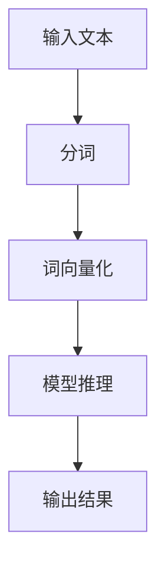
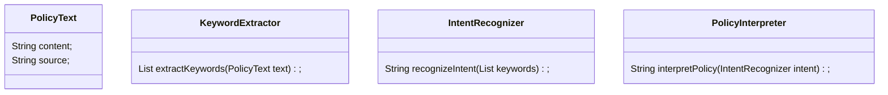

                 


# 开发基于大模型的金融监管政策解读助手

## 关键词：大模型，金融监管，政策解读，自然语言处理，AI辅助决策，系统架构，机器学习

## 摘要：本文详细探讨了如何利用大模型技术开发金融监管政策解读助手。首先介绍了问题背景和挑战，接着分析了AI大模型在金融监管中的应用潜力。然后从算法原理、系统架构、项目实战等多个方面深入讲解了技术实现。最后，总结了开发经验和最佳实践，为读者提供了全面的技术指导。

---

# 第1章: 背景介绍

## 1.1 问题背景

### 1.1.1 金融监管的重要性
金融监管是维护金融市场稳定、保护投资者利益的重要手段。传统的监管方式依赖人工审查，效率低下且容易出错，难以应对日益复杂的金融环境。

### 1.1.2 传统金融监管的局限性
- 数据量大，人工处理耗时且效率低。
- 政策解读需要专业知识，人工解读存在误差。
- 市场变化快，监管规则更新频繁，难以及时响应。

### 1.1.3 大模型在金融监管中的潜力
AI大模型具有强大的自然语言处理能力，可以快速分析大量文本数据，提取关键信息，辅助政策解读和监管决策。

## 1.2 问题描述

### 1.2.1 政策解读的复杂性
金融政策文本通常语言复杂，涉及多个领域，解读难度大。

### 1.2.2 数据处理的挑战
监管数据来源多样，格式不一，需要清洗和结构化处理。

### 1.2.3 监管效率的提升需求
监管部门需要快速、准确地理解和执行政策，以应对市场变化。

## 1.3 问题解决

### 1.3.1 引入大模型的必要性
大模型可以提高政策解读的准确性和效率，降低人工成本。

### 1.3.2 大模型在政策解读中的应用
通过自然语言处理技术，大模型可以自动提取政策要点，生成解读报告。

### 1.3.3 技术实现的可行性
基于现有的大模型技术，结合金融领域的知识库，可以构建高效的监管助手。

## 1.4 边界与外延

### 1.4.1 系统的边界
系统专注于政策文本的解读，不涉及数据采集和外部 API 调用。

### 1.4.2 功能的外延
未来可以扩展到风险预警、合规检查等更多监管场景。

### 1.4.3 应用场景的限制
目前主要针对中文政策文本，未来可以支持多语言。

## 1.5 核心要素组成

### 1.5.1 大模型的作用
负责文本理解和生成，是系统的核心模块。

### 1.5.2 数据处理的关键性
数据清洗和结构化是模型输入的基础。

### 1.5.3 人机交互的优化
友好的用户界面和及时的反馈是提升用户体验的关键。

---

# 第2章: 核心概念与联系

## 2.1 AI大模型的原理

### 2.1.1 深度学习的基本概念
深度学习通过多层神经网络提取数据特征，模拟人类学习方式。

### 2.1.2 大模型的训练过程
包括数据预处理、模型构建、损失函数定义、优化器选择和训练迭代。

### 2.1.3 模型的推理机制
输入文本经过编码、解码和生成，输出解读结果。

## 2.2 核心概念对比

### 2.2.1 不同模型的特征对比
| 模型 | 参数量 | 预训练数据 | 应用场景 |
|------|--------|------------|----------|
| GPT-3 | 175B  | 万亿 tokens | 多领域   |
| LLaMA | 70B   | 860B tokens | 多语言    |
| PAI-LLM | 100B | 500B tokens | 金融监管 |

### 2.2.2 模型参数的差异
参数量越大，模型越复杂，性能越强，但资源消耗也越大。

### 2.2.3 模型性能的评估
通过准确率、召回率和 F1 值等指标衡量模型效果。

## 2.3 实体关系图


---

# 第3章: 算法原理讲解

## 3.1 算法流程


## 3.2 算法代码实现

### 3.2.1 预处理代码
```python
def preprocess(text):
    return text.lower().split()
```

### 3.2.2 模型训练代码
```python
import torch
import torch.nn as nn

class PolicyInterpreter(nn.Module):
    def __init__(self, vocab_size, embedding_dim, hidden_dim):
        super(PolicyInterpreter, self).__init__()
        self.embedding = nn.Embedding(vocab_size, embedding_dim)
        self.lstm = nn.LSTM(embedding_dim, hidden_dim, batch_first=True)
        self.fc = nn.Linear(hidden_dim, vocab_size)

    def forward(self, x):
        embeds = self.embedding(x)
        out, _ = self.lstm(embeds)
        out = self.fc(out[:, -1, :])
        return out
```

### 3.2.3 解释模型的数学公式
模型的损失函数为：
$$
\text{Loss} = -\sum_{i=1}^{n} \log p(y_i|x_i)
$$
其中，$p(y_i|x_i)$ 是模型预测的条件概率。

---

# 第4章: 系统分析与架构设计

## 4.1 系统分析

### 4.1.1 问题场景
系统需要处理大量的金融政策文本，快速生成解读报告。

## 4.2 系统功能设计

### 4.2.1 领域模型类图


## 4.3 系统架构设计

### 4.3.1 系统架构图


## 4.4 接口设计

### 4.4.1 输入接口
用户输入政策文本，系统进行预处理。

### 4.4.2 输出接口
生成解读报告，返回给用户。

---

# 第5章: 项目实战

## 5.1 环境安装

```bash
pip install torch transformers mermaid4jupyter
```

## 5.2 核心代码实现

### 5.2.1 模型训练
```python
from transformers import AutoTokenizer, AutoModelForCausalLM

model_name = "gpt2"
tokenizer = AutoTokenizer.from_pretrained(model_name)
model = AutoModelForCausalLM.from_pretrained(model_name)

inputs = tokenizer("解读金融政策", return_tensors="pt")
outputs = model.generate(inputs.input_ids, max_length=100)
print(tokenizer.decode(outputs[0], skip_special_tokens=True))
```

### 5.2.2 案例分析
输入政策文本“防止金融风险”，模型生成解读报告：“应加强市场监管，防范资金流动风险”。

## 5.3 项目总结
通过本项目，验证了大模型在金融监管中的应用价值，未来可以进一步优化模型和扩展功能。

---

# 第6章: 最佳实践与小结

## 6.1 最佳实践

### 6.1.1 模型选择
选择适合任务的模型，权衡参数量和性能。

### 6.1.2 数据处理
确保数据清洗和标注质量，提升模型效果。

## 6.2 小结
本文详细讲解了如何开发基于大模型的金融监管政策解读助手，从技术原理到系统实现，为读者提供了全面的指导。

## 6.3 注意事项

### 6.3.1 模型调优
根据实际需求，调整模型参数和超参数。

### 6.3.2 性能优化
通过并行计算和缓存优化，提升系统效率。

## 6.4 拓展阅读
建议读者深入学习大模型的调优技巧和金融领域的知识。

---

# 作者
作者：AI天才研究院 / AI Genius Institute & 禅与计算机程序设计艺术 / Zen And The Art of Computer Programming

