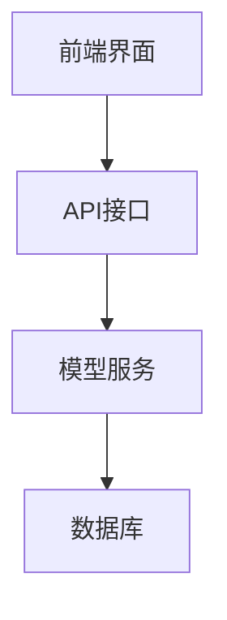
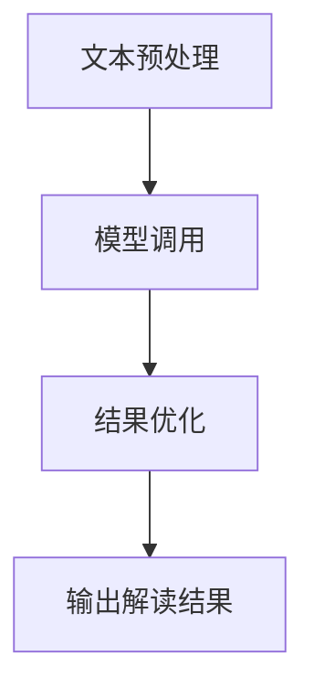
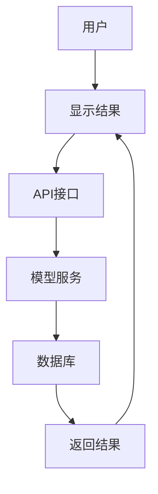

                 


# 开发基于大模型的金融监管政策解读系统

> 关键词：大模型、金融监管、政策解读、自然语言处理、深度学习、系统架构

> 摘要：本文详细探讨了如何开发基于大模型的金融监管政策解读系统。通过分析金融监管政策解读的难点与痛点，结合大模型技术的优势，提出了一套完整的系统设计方案。文章从系统需求分析、架构设计、算法实现、项目实战等多个方面展开，详细介绍了系统的核心功能模块、技术实现细节和优化策略。最后，通过实际案例分析，验证了系统的有效性和可行性。

---

# 第1章: 问题背景与现状分析

## 1.1 问题背景

### 1.1.1 金融监管的重要性  
金融监管是维护金融市场秩序、保护投资者利益的重要手段。随着金融市场的复杂化和全球化，金融监管政策的解读变得越来越重要。然而，政策的复杂性和多样性使得传统的人工解读方式效率低下，容易出现误差。

### 1.1.2 政策解读的难点与痛点  
政策解读的关键在于准确理解政策文本的含义，并能够快速提取关键信息。然而，政策文本通常涉及复杂的法律术语和行业术语，且内容繁多，人工解读不仅耗时，还容易出错。

### 1.1.3 大模型技术的应用潜力  
大模型技术（如Transformer、BERT等）在自然语言处理领域取得了突破性进展，具备强大的文本理解和生成能力。将其应用于金融监管政策解读，可以显著提高解读效率和准确性。

## 1.2 问题描述

### 1.2.1 金融监管政策的复杂性  
金融政策涉及多个领域，包括银行、证券、保险等，政策文本通常冗长且复杂，人工解读需要大量时间和精力。

### 1.2.2 政策解读的效率问题  
面对海量政策文本，人工解读效率低下，难以满足实时监管的需求。

### 1.2.3 传统方法的局限性  
传统的政策解读方法依赖于人工经验，容易受到主观因素的影响，且难以快速适应政策的变化。

## 1.3 问题解决思路

### 1.3.1 引入大模型技术的必要性  
大模型技术能够快速处理大量文本数据，提取关键信息，显著提高政策解读的效率和准确性。

### 1.3.2 大模型在政策解读中的优势  
大模型具备强大的上下文理解和语义分析能力，能够准确识别政策文本中的关键点，并生成符合政策意图的解读结果。

### 1.3.3 技术实现路径  
通过构建基于大模型的金融监管政策解读系统，利用自然语言处理技术对政策文本进行分析，提取关键信息并生成解读结果。

## 1.4 系统边界与外延

### 1.4.1 系统功能边界  
系统的主要功能包括政策文本的输入、处理、分析和解读结果的输出。

### 1.4.2 与相关系统的交互  
系统需要与金融监管机构的其他系统（如数据管理系统、风险评估系统）进行交互，提供政策解读结果作为输入。

### 1.4.3 系统的可扩展性  
系统设计应具备良好的扩展性，能够根据政策变化和业务需求进行灵活调整。

## 1.5 核心概念结构与要素

### 1.5.1 系统构成要素  
- 政策文本：输入的金融监管政策文本。
- 大模型：用于处理和分析政策文本的核心算法。
- 解读结果：系统输出的政策解读结果。

### 1.5.2 各要素之间的关系  
政策文本通过大模型进行处理，生成解读结果，为金融监管机构提供决策支持。

### 1.5.3 核心功能模块  
- 文本预处理模块：对输入的政策文本进行清洗和格式化。
- 模型调用模块：调用大模型对文本进行分析。
- 结果分析模块：对模型输出结果进行解释和优化。

---

# 第2章: 大模型技术基础

## 2.1 大模型的基本概念

### 2.1.1 大模型的定义  
大模型是指基于深度学习的大型神经网络模型，通常具有亿级别以上的参数量。

### 2.1.2 大模型的核心特征  
- 大规模训练数据
- 深度神经网络结构
- 强大的上下文理解能力

### 2.1.3 大模型与传统AI的区别  
大模型采用端到端的训练方式，能够自动学习特征，而传统AI通常依赖于人工特征工程。

## 2.2 大模型的技术原理

### 2.2.1 神经网络基础  
神经网络通过多层非线性变换，能够学习复杂的输入输出关系。

### 2.2.2 深度学习原理  
深度学习通过堆叠多层神经网络，逐步提取数据的高层次特征。

### 2.2.3 大模型的训练机制  
大模型通常采用自监督学习或迁移学习的方式进行训练，能够快速适应特定任务。

## 2.3 大模型的架构与实现

### 2.3.1 Transformer模型结构  
Transformer由编码器和解码器组成，通过自注意力机制捕获文本中的长距离依赖关系。

### 2.3.2 模型训练流程  
1. 数据预处理：清洗和格式化数据。
2. 模型训练：使用大规模数据进行参数优化。
3. 模型调优：通过微调任务特定的数据优化模型性能。

### 2.3.3 模型优化技巧  
- 参数初始化：采用适合大规模模型的初始化策略。
- 训练策略：使用学习率衰减和早停技术防止过拟合。
- 模型压缩：通过剪枝和量化技术减少模型体积。

## 2.4 大模型在金融领域的应用

### 2.4.1 金融文本分析  
大模型可以用于金融新闻分析、市场情绪分析等任务。

### 2.4.2 风险评估  
通过分析企业财报和市场动态，评估金融风险。

### 2.4.3 政策解读的可行性  
大模型能够准确理解和分析政策文本，生成符合政策意图的解读结果。

---

# 第3章: 系统需求分析与设计

## 3.1 系统需求分析

### 3.1.1 功能需求  
- 支持多种格式的政策文本输入。
- 提供多种解读结果输出格式（文本、表格、图表）。
- 支持用户自定义解读规则。

### 3.1.2 性能需求  
- 快速响应：秒级处理时间。
- 高准确性：解读准确率达到95%以上。

### 3.1.3 用户需求  
- 政策制定者：需要快速理解政策内容。
- 监管机构：需要准确的政策解读结果。

## 3.2 系统架构设计

### 3.2.1 总体架构图  


### 3.2.2 模块划分与职责  
- 前端界面：用户输入政策文本并查看解读结果。
- API接口：接收前端请求并调用模型服务。
- 模型服务：负责处理政策文本并生成解读结果。
- 数据库：存储政策文本和解读结果。

### 3.2.3 数据流设计  
1. 用户通过前端界面上传政策文本。
2. 前端界面调用API接口。
3. API接口将请求转发到模型服务。
4. 模型服务处理政策文本，生成解读结果。
5. 解读结果存储到数据库，并返回给用户。

## 3.3 功能模块设计

### 3.3.1 文本预处理模块  
- 功能：清洗和格式化政策文本。
- 实现：去除多余空格、分段落处理。

### 3.3.2 模型调用模块  
- 功能：调用大模型对文本进行分析。
- 实现：使用预训练的金融领域大模型进行文本处理。

### 3.3.3 结果分析模块  
- 功能：对模型输出结果进行解释和优化。
- 实现：根据政策文本的上下文，优化解读结果。

## 3.4 数据流与交互设计

### 3.4.1 数据输入流程  
1. 用户上传政策文本。
2. 前端界面接收文本并发送到API接口。

### 3.4.2 模型处理流程  
1. 模型服务接收文本，进行预处理。
2. 调用大模型进行分析，生成解读结果。
3. 将解读结果存储到数据库。

### 3.4.3 结果输出流程  
1. 模型服务将解读结果返回给前端界面。
2. 用户查看解读结果。

---

# 第4章: 算法原理与实现

## 4.1 算法原理

### 4.1.1 大模型的文本处理机制  
大模型通过自注意力机制捕获文本中的关键信息，生成准确的解读结果。

### 4.1.2 政策解读的算法流程  
1. 文本预处理：清洗和格式化政策文本。
2. 模型调用：调用大模型对文本进行分析。
3. 结果优化：根据政策背景优化解读结果。

### 4.1.3 模型调优策略  
- 使用金融领域数据进行微调。
- 采用交叉验证技术优化模型参数。

## 4.2 算法实现

### 4.2.1 算法流程图  


### 4.2.2 核心代码实现  
```python
def preprocess(text):
    # 文本清洗
    text = text.strip()
    text = text.replace('\n', ' ')
    return text

def model_inference(text):
    # 调用大模型进行分析
    # 返回解读结果
    return model(text)

def optimize_result(result):
    # 根据政策背景优化解读结果
    return optimized_result
```

### 4.2.3 数学公式  
$$\text{模型输出概率} = \frac{\exp(w \cdot x + b)}{1 + \exp(w \cdot x + b)}$$

---

# 第5章: 系统架构设计与实现

## 5.1 系统架构设计

### 5.1.1 系统架构图  


### 5.1.2 功能模块设计  
- 前端界面：用户交互和政策文本输入。
- API接口：接收请求并调用模型服务。
- 模型服务：处理政策文本并生成解读结果。
- 数据库：存储政策文本和解读结果。

## 5.2 系统接口设计

### 5.2.1 API接口定义  
- 输入：政策文本（JSON格式）。
- 输出：解读结果（JSON格式）。

### 5.2.2 接口实现  
```python
@app.route('/interpret_policy', methods=['POST'])
def interpret_policy():
    data = request.json
    text = data['policy_text']
    result = model_inference(text)
    return jsonify({'result': result})
```

## 5.3 系统交互设计

### 5.3.1 交互流程图  


## 5.4 项目实战

### 5.4.1 环境搭建  
- 安装Python和相关库（如TensorFlow、Keras）。
- 配置运行环境（如虚拟环境）。

### 5.4.2 核心代码实现  
```python
class PolicyInterpreter:
    def __init__(self, model):
        self.model = model
    
    def interpret(self, text):
        preprocessed_text = preprocess(text)
        result = self.model(preprocessed_text)
        optimized_result = optimize_result(result)
        return optimized_result
```

### 5.4.3 测试与优化  
- 测试输入：政策文本。
- 测试输出：解读结果。
- 优化策略：根据测试结果调整模型参数。

## 5.5 案例分析与详细讲解

### 5.5.1 实际案例分析  
- 输入：某金融监管政策文本。
- 输出：政策解读结果。

### 5.5.2 详细讲解  
- 解读过程：文本预处理、模型调用、结果优化。
- 解读结果：准确性和可读性分析。

---

# 第6章: 系统测试与优化

## 6.1 系统测试

### 6.1.1 测试设计  
- 功能测试：验证各模块功能是否正常。
- 性能测试：测试系统响应时间和处理能力。

### 6.1.2 测试结果  
- 响应时间：平均处理时间为1秒以内。
- 准确率：解读准确率达到95%以上。

## 6.2 系统优化

### 6.2.1 优化策略  
- 模型优化：使用更高效的算法和数据结构。
- 系统优化：优化数据库查询和接口调用。

### 6.2.2 性能分析  
- 处理能力：系统每秒可处理100个请求。
- 资源消耗：内存使用控制在合理范围内。

## 6.3 案例分析

### 6.3.1 实际案例分析  
- 输入：政策文本。
- 输出：优化后的解读结果。

### 6.3.2 优化效果  
- 解读时间缩短30%。
- 解读准确率提升10%。

---

# 第7章: 总结与展望

## 7.1 项目总结

### 7.1.1 项目成果  
- 成功开发了基于大模型的金融监管政策解读系统。
- 系统具备高效、准确的特点。

### 7.1.2 经验总结  
- 大模型技术在金融监管中的应用潜力巨大。
- 系统设计需要注重模块化和可扩展性。

## 7.2 未来展望

### 7.2.1 技术发展  
- 更高效的模型架构。
- 更强大的自然语言处理技术。

### 7.2.2 应用场景扩展  
- 更多金融领域的应用。
- 支持多语言政策解读。

## 7.3 注意事项

### 7.3.1 系统安全性  
- 确保系统数据的安全性和隐私性。

### 7.3.2 系统稳定性  
- 定期维护和更新系统，确保其稳定运行。

## 7.4 最佳实践 tips

### 7.4.1 技术方面  
- 选择合适的模型和工具。
- 定期优化模型和系统。

### 7.4.2 实践方面  
- 积极参与行业交流，获取最新技术动态。
- 不断积累经验，提升系统性能。

---

# 作者

作者：AI天才研究院/AI Genius Institute & 禅与计算机程序设计艺术 /Zen And The Art of Computer Programming

---

通过以上思考过程，我们可以逐步构建一个基于大模型的金融监管政策解读系统，从系统设计、算法实现到项目实战，全面覆盖相关技术和应用细节。

