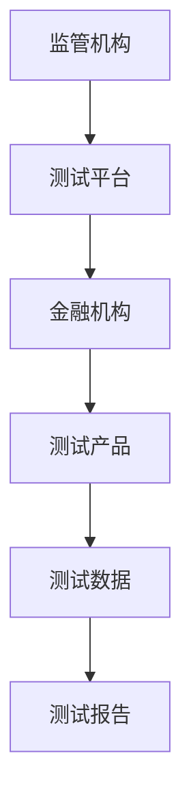
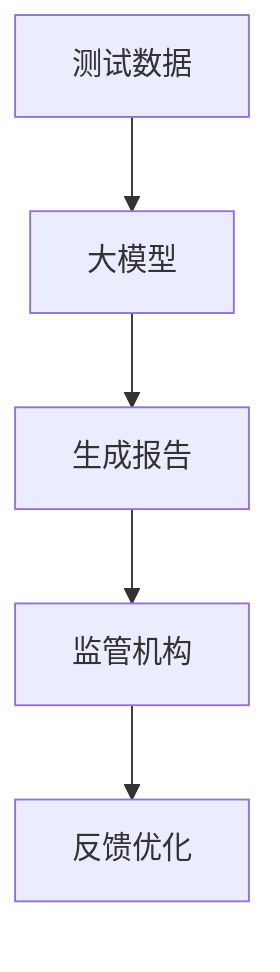
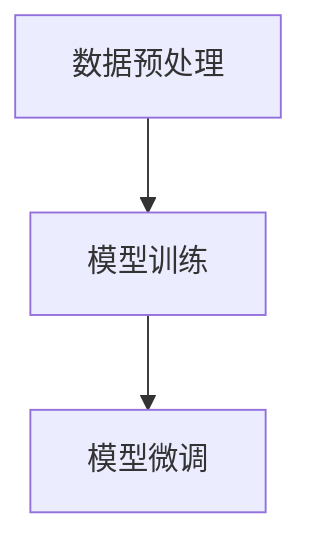
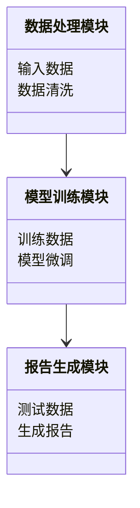
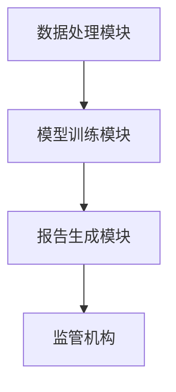

                 


# 开发基于大模型的金融监管沙盒测试报告生成器

## 关键词
金融监管沙盒, 大模型, 人工智能, 生成报告, 测试系统

## 摘要
本文详细探讨了开发基于大模型的金融监管沙盒测试报告生成器的全过程。文章首先介绍了金融监管沙盒的背景及其在现代金融监管中的重要性，然后分析了大模型技术的核心原理和其在金融监管中的应用潜力。接着，文章详细讲解了大模型在金融监管沙盒测试中的具体实现，包括数据预处理、模型训练、报告生成等关键步骤。通过构建领域模型和系统架构图，展示了系统的模块化设计和各部分的协同工作。最后，文章通过一个实际案例分析，验证了该系统的有效性和实用性，并总结了开发经验，提出了未来的发展方向。

---

# 第一部分: 金融监管沙盒与大模型概述

## 第1章: 金融监管沙盒概述

### 1.1 问题背景与描述
#### 1.1.1 金融监管的现状与挑战
现代金融体系日益复杂，金融机构的产品和服务不断创新，监管机构面临更大的挑战。传统的监管方法依赖于人工审查和事后监管，效率低下且难以应对复杂场景。

#### 1.1.2 传统金融监管的局限性
- 人工审核效率低，难以覆盖所有金融产品。
- 监管标准不统一，不同机构的解读可能不同。
- 数据量大，传统方法难以高效处理和分析。

#### 1.1.3 金融监管沙盒的概念与意义
金融监管沙盒是一种创新监管工具，允许金融机构在受控环境中测试新产品和服务，同时确保消费者权益。它帮助监管机构提前识别风险，提高监管效率。

### 1.2 问题解决与边界
#### 1.2.1 金融监管沙盒的目标与作用
- 提供一个安全的环境，允许金融机构测试创新产品。
- 及时发现潜在风险，确保金融稳定。
- 促进金融创新，支持金融科技发展。

#### 1.2.2 问题解决的边界与外延
- 仅限于测试阶段，不适用于正式产品。
- 适用于创新型产品，不取代传统监管方法。

#### 1.2.3 核心概念与要素组成
- 监管机构：负责制定规则和监控。
- 参与机构：金融机构，测试新产品。
- 测试环境：受控的虚拟或真实环境。
- 监管报告：测试结果和风险分析。

---

## 第2章: 大模型在金融监管中的应用

### 2.1 大模型的核心概念与原理
#### 2.1.1 大模型的基本原理
大模型（如GPT系列）基于深度学习，通过多层神经网络处理和生成文本。其核心是通过自注意力机制捕捉文本中的长距离依赖关系，生成连贯且相关的文本。

#### 2.1.2 大模型在金融监管中的优势
- 高效处理大量金融数据。
- 自动生成结构化的报告。
- 快速识别潜在风险点。

### 2.2 大模型与金融监管沙盒的结合
#### 2.2.1 大模型在监管沙盒中的应用场景
- 自动生成测试报告：根据测试数据，生成详细的监管报告。
- 风险预警：识别测试中的潜在风险。
- 优化建议：基于测试结果，提出改进建议。

#### 2.2.2 监管沙盒测试报告生成的需求分析
- 测试报告需要结构化、内容准确。
- 报告需涵盖风险评估、合规性分析等关键内容。
- 支持多种输出格式，如PDF、Word等。

---

## 第3章: 金融监管沙盒测试报告生成器的开发背景

### 3.1 金融监管的数字化转型
#### 3.1.1 数字化监管的趋势
- 数据驱动的监管决策。
- 技术支持的监管工具。
- 人工智能在监管中的应用。

#### 3.1.2 大模型技术的推动作用
- 提高监管效率。
- 实现自动化报告生成。
- 增强风险识别能力。

### 3.2 金融监管沙盒测试的需求
#### 3.2.1 监管沙盒测试的重要性
- 早期识别创新产品风险。
- 确保金融创新的合规性。
- 提高监管透明度。

#### 3.2.2 传统测试方法的不足
- 人工测试效率低。
- 标准化程度不足。
- 数据分析能力有限。

#### 3.2.3 基于大模型的测试报告生成的优势
- 高效生成结构化报告。
- 准确识别潜在风险。
- 支持大规模并行测试。

---

# 第二部分: 大模型的核心概念与联系

## 第4章: 大模型的核心原理与特征

### 4.1 大模型的原理分析
#### 4.1.1 大模型的训练过程
- 数据预处理：清洗、标注、格式转换。
- 模型训练：使用大规模金融数据，优化参数。
- 模型微调：针对监管报告生成任务，调整模型参数。

#### 4.1.2 大模型的推理机制
- 输入测试数据：如金融产品的描述。
- 生成报告：基于模型理解生成结构化报告。
- 反馈优化：根据测试结果调整生成策略。

#### 4.1.3 大模型的可解释性
- 通过注意力权重分析，解释生成报告的依据。
- 提供生成结果的可追溯性。

### 4.2 大模型的特征对比
#### 4.2.1 大模型与传统模型的对比

| 特性           | 大模型             | 传统模型           |
|----------------|--------------------|--------------------|
| 数据需求       | 需要大量数据       | 数据需求较低       |
| 处理能力       | 可处理复杂任务     | 处理能力有限       |
| 可扩展性       | 高                | 低                |
| 可解释性       | 较低              | 较高              |

#### 4.2.2 不同大模型的性能对比
- GPT-3在生成任务中表现优异。
- T5在文本生成方面有优势。
- 根据具体任务选择合适的模型。

#### 4.2.3 大模型的优缺点分析
- 优点：高效、准确。
- 缺点：计算资源需求高、可解释性不足。

---

## 第5章: 金融监管沙盒测试的核心概念

### 5.1 金融监管沙盒的实体关系图


### 5.2 大模型与金融监管沙盒的交互流程


---

# 第三部分: 大模型的算法原理与数学模型

## 第6章: 大模型的算法原理

### 6.1 大模型的训练过程


```python
def preprocess_data(data):
    # 数据清洗和格式转换
    processed_data = []
    for d in data:
        processed_data.append({'text': d['text'], 'label': d['label']})
    return processed_data

def train_model(train_data, val_data):
    # 使用预训练模型进行微调
    model = AutoModelForMaskedLM.from_pretrained('gpt2')
    tokenizer = AutoTokenizer.from_pretrained('gpt2')
    # 定义训练参数
    args = TrainingArguments(...)
    trainer = Trainer(model, args, train_dataset=train_data, val_dataset=val_data)
    trainer.train()
    return model, tokenizer
```

### 6.2 大模型的生成机制
#### 6.2.1 注意力机制
- 通过自注意力机制捕捉文本中的长距离依赖关系。

#### 6.2.2 解码器结构
- 解码器负责生成输出，通过逐步生成文本进行预测。

#### 6.2.3 生成策略
- 使用贪心算法或蒙特卡洛采样生成报告。

---

## 第7章: 大模型的数学模型与公式

### 7.1 大模型的数学基础
- 词嵌入：将词转换为向量表示。
- 自注意力机制：计算每个词对其他词的注意力权重。

#### 7.1.1 词嵌入公式
$$
\text{embed}(x) = W_e x
$$

#### 7.1.2 自注意力机制
$$
\alpha_{ij} = \frac{\exp(s_{ij})}{\sum_{k} \exp(s_{ik})}
$$
其中，$s_{ij} = q_i^T k_j$

---

## 第8章: 金融监管沙盒测试报告生成器的系统架构

### 8.1 系统功能设计
#### 8.1.1 领域模型


### 8.2 系统架构设计


---

## 第9章: 项目实战与案例分析

### 9.1 环境安装
```bash
pip install transformers torch datasets
```

### 9.2 核心代码实现
```python
from transformers import AutoModelForMaskedLM, AutoTokenizer

def generate_report(model, tokenizer, input_text):
    inputs = tokenizer(input_text, return_tensors='np')
    outputs = model.generate(inputs.input_ids, max_length=500)
    report = tokenizer.decode(outputs[0], skip_special_tokens=True)
    return report
```

### 9.3 实际案例分析
- 输入：金融产品的描述。
- 输出：生成的监管报告，包括风险评估和合规性分析。

---

## 第10章: 最佳实践与展望

### 10.1 开发经验总结
- 数据质量对模型性能影响重大。
- 模型微调是关键步骤。
- 可解释性是实际应用中的重要考量。

### 10.2 未来发展方向
- 提高模型的可解释性。
- 实现多模态监管报告生成。
- 探索与其他监管技术的结合。

---

# 小结
本文详细介绍了开发基于大模型的金融监管沙盒测试报告生成器的过程，从背景介绍到系统实现，再到案例分析，全面覆盖了相关知识点。通过本文的讲解，读者可以深入了解大模型在金融监管中的应用，并为实际开发提供参考。

---

# 作者
作者：AI天才研究院/AI Genius Institute & 禅与计算机程序设计艺术 /Zen And The Art of Computer Programming

