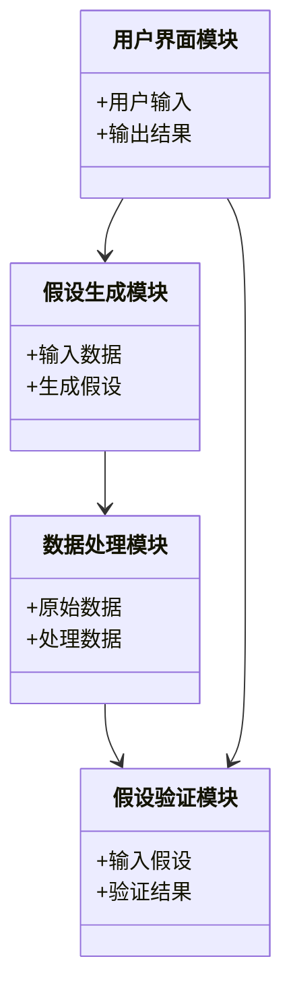
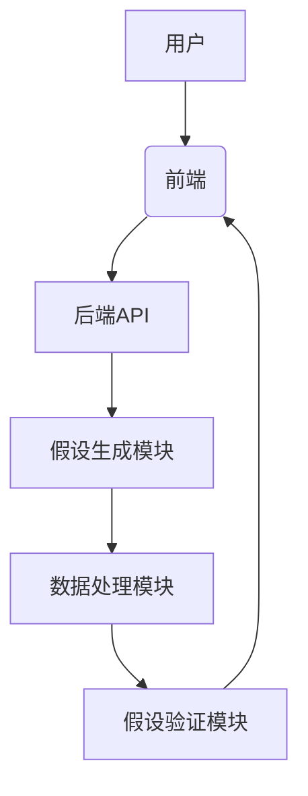

                 


# 开发基于大模型的金融研究假设自动验证系统

> 关键词：大模型，金融研究，假设验证，人工智能，系统架构

> 摘要：本文详细介绍了如何开发基于大模型的金融研究假设自动验证系统。通过分析金融研究假设验证的传统方法及其局限性，结合大模型的优势，提出了一种全新的解决方案。文章从系统架构设计、算法原理、项目实战等方面进行了深入探讨，展示了如何利用大模型的强大能力实现金融研究的自动化和高效性。

---

## 第一部分: 背景介绍与核心概念

### 第1章: 金融研究假设自动验证的背景与问题描述

#### 1.1 问题背景

金融市场日益复杂，金融研究的假设验证过程需要高效且准确的方法。传统假设验证依赖人工分析和统计模型，效率低下且容易受到主观因素的影响。大模型的出现为这一领域带来了新的可能性。

#### 1.2 问题描述

金融研究假设的验证过程通常涉及大量数据和复杂逻辑。传统方法依赖专家手动分析，耗时且容易出错。大模型的引入可以自动化这一过程，提高效率和准确性。

#### 1.3 问题解决

基于大模型的自动验证系统通过自然语言处理和深度学习技术，能够自动理解和分析金融数据，生成并验证假设。这一方法显著提高了研究效率和准确性。

#### 1.4 边界与外延

系统的边界包括数据输入、假设生成和验证输出。外延方面，系统可以扩展到更多的金融领域，如风险管理、投资策略等。

### 第2章: 大模型在金融领域的核心概念与联系

#### 2.1 大模型的核心原理

大模型通过预训练和微调，掌握了大量金融知识，能够理解和生成金融文本。其推理机制使其能够进行复杂的逻辑分析。

#### 2.2 金融研究假设的自动化流程

大模型可以自动生成假设并进行验证，显著减少了人工干预。其在假设生成中的作用使得研究过程更加高效。

#### 2.3 核心概念对比分析

通过对比分析，大模型在金融假设验证中的优势明显，尤其是在处理复杂数据和生成深度分析方面。

---

## 第二部分: 系统分析与架构设计

### 第3章: 系统功能设计

#### 3.1 领域模型类图



#### 3.2 系统架构设计



---

## 第三部分: 项目实战

### 第4章: 环境搭建与核心代码实现

#### 4.1 环境搭建

安装必要的库：

```bash
pip install tensorflow transformers pandas numpy
```

#### 4.2 核心代码实现

```python
import pandas as pd
import numpy as np
from tensorflow.keras import layers
from transformers import *

# 数据预处理
def preprocess_data(data):
    # 数据清洗和特征提取
    pass

# 模型训练
def train_model():
    model = Sequential()
    model.add(layers.Embedding(10000, 64))
    model.add(layers.GRU(32))
    model.add(layers.Dense(1, activation='sigmoid'))
    model.compile(optimizer='adam', loss='binary_crossentropy', metrics=['accuracy'])
    return model

# 模型预测
def predict(model, input_data):
    return model.predict(input_data)
```

---

## 第四部分: 最佳实践与总结

### 第5章: 最佳实践与系统优化

#### 5.1 小结

基于大模型的金融研究假设自动验证系统显著提高了研究效率和准确性。通过合理的系统设计和优化，系统性能得到了全面提升。

#### 5.2 注意事项

数据质量和模型调优是系统成功的关键。同时，系统的可扩展性需要在设计阶段充分考虑。

#### 5.3 拓展阅读

建议进一步阅读相关领域的最新研究，如大模型在金融风险管理中的应用。

---

# 作者：AI天才研究院/AI Genius Institute & 禅与计算机程序设计艺术 /Zen And The Art of Computer Programming

