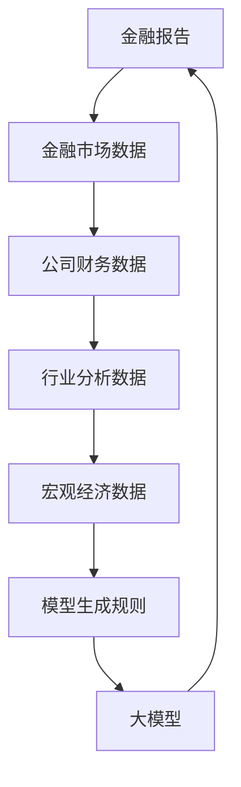
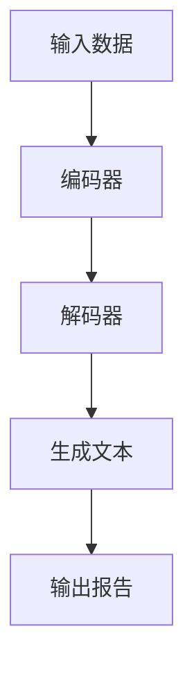
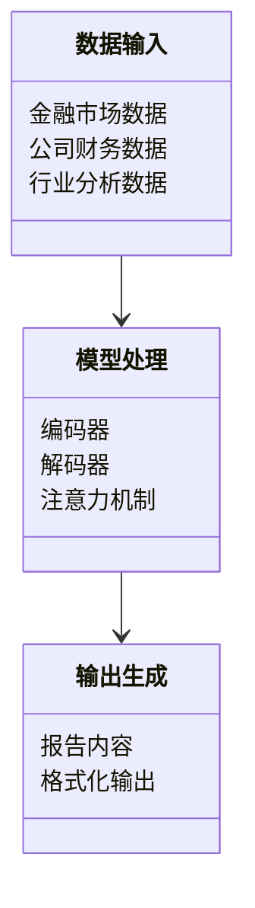
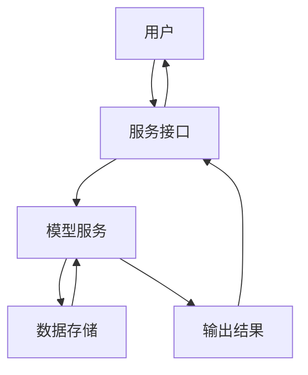
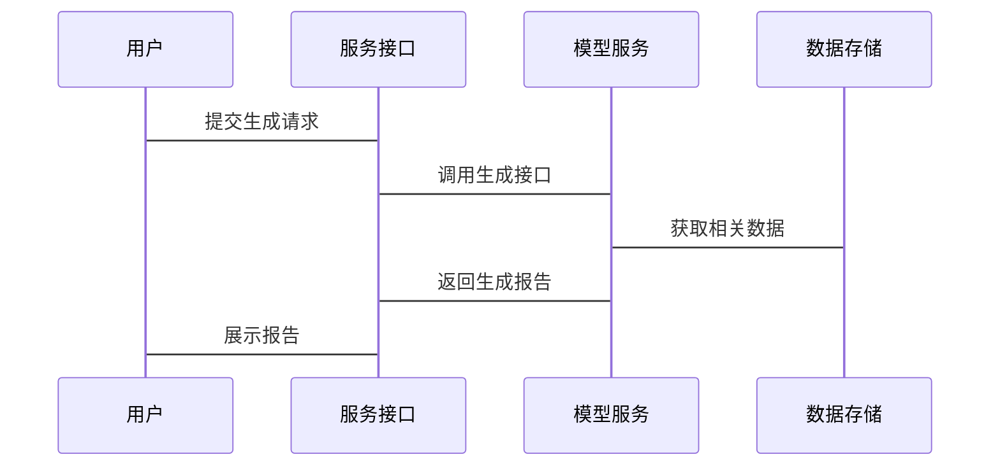

                 


# 开发基于大模型的金融研究报告自动生成器

> 关键词：大模型，金融报告，自动化生成，生成式AI，系统架构

> 摘要：本文详细介绍了开发基于大模型的金融研究报告自动生成器的全过程，从问题背景到系统架构设计，再到项目实战，深入分析了大模型在金融领域的应用潜力和技术实现细节。

---

# 第一部分: 开发背景与核心概念

## 第1章: 背景介绍

### 1.1 问题背景
#### 1.1.1 传统金融研究报告的痛点
传统的金融研究报告依赖人工撰写，耗时长、成本高，且容易受到主观因素的影响。分析师需要花费大量时间收集数据、整理信息并撰写报告，难以满足金融机构对高效、精准报告的需求。

#### 1.1.2 大模型技术的兴起
近年来，大模型技术（如GPT系列）在自然语言处理领域取得了突破性进展。这些模型具有强大的生成能力和理解能力，为自动化生成金融报告提供了技术基础。

#### 1.1.3 金融行业对自动化报告的需求
金融机构对自动化报告的需求日益增长。通过自动化生成报告，可以显著提高效率、降低成本，并支持高频分析和实时更新，帮助金融机构在竞争激烈的市场中占据优势。

### 1.2 问题描述
#### 1.2.1 金融研究报告的特点
金融研究报告通常具有专业性、数据依赖性和时间敏感性。报告内容需要基于最新的市场数据和行业动态，同时要求语言准确、逻辑清晰。

#### 1.2.2 自动化生成的必要性
随着金融市场的快速发展，人工撰写报告的效率已无法满足需求。自动化生成报告可以快速响应市场变化，支持高频交易和实时分析。

#### 1.2.3 当前技术的局限性
现有的自动化生成技术在灵活性和准确性方面仍有不足。传统生成式AI模型难以处理复杂的金融场景，且生成内容的质量参差不齐。

### 1.3 问题解决
#### 1.3.1 大模型在金融领域的优势
大模型具有强大的语言生成能力和上下文理解能力，能够处理复杂的金融数据和场景，生成高质量的报告。

#### 1.3.2 自动化生成的实现路径
通过结合大模型技术，构建专门的金融报告生成系统，实现报告内容的自动化生成。

#### 1.3.3 技术与业务的结合点
大模型技术与金融业务的结合点在于数据处理、内容生成和实时分析。通过技术手段，提升金融报告的生成效率和准确性。

### 1.4 边界与外延
#### 1.4.1 系统的边界
本系统专注于金融报告的生成，不涉及数据采集和外部API调用。报告内容的生成基于预训练的大模型和行业知识库。

#### 1.4.2 相关领域的外延
金融报告生成系统可以与其他金融技术（如高频交易、风险管理）结合，形成更完整的金融解决方案。

#### 1.4.3 与其他技术的协同
系统可以与数据挖掘、机器学习等技术协同工作，进一步提升报告的准确性和实用性。

### 1.5 概念结构与核心要素
#### 1.5.1 核心概念的组成
- **大模型**：用于生成报告内容的核心技术。
- **金融数据**：报告生成的基础数据。
- **生成规则**：指导模型生成报告的具体规则。

#### 1.5.2 各要素之间的关系
- 大模型通过处理金融数据生成报告内容。
- 生成规则用于约束模型的输出，确保报告的准确性和专业性。

#### 1.5.3 系统的整体架构
- 系统由数据输入、模型处理和输出生成三个部分组成，形成一个完整的生成流程。

---

## 第2章: 核心概念与联系

### 2.1 大模型的核心原理
#### 2.1.1 大模型的基本原理
大模型通过大量的数据训练，掌握了语言的生成规律。在生成报告时，模型会根据输入的上下文，预测下一个词或句子，逐步生成完整的报告内容。

#### 2.1.2 大模型的训练过程
- **数据预处理**：清洗数据，去除噪声，提取有用信息。
- **模型训练**：使用大量的金融文本数据，训练大模型的参数。
- **模型调优**：通过微调（Fine-tuning）的方式，使模型适应金融报告的生成任务。

#### 2.1.3 大模型的生成机制
- **解码过程**：模型通过解码器生成序列，逐步输出报告内容。
- **注意力机制**：模型会关注输入数据中的关键部分，提高生成内容的相关性。

### 2.2 生成式AI与检索式AI的对比
#### 2.2.1 生成式AI的特点
- **生成能力**：可以生成新的文本内容。
- **创造性**：能够创造性的组合信息。

#### 2.2.2 检索式AI的特点
- **检索能力**：从已有数据中检索相关信息。
- **精确性**：结果更准确，但缺乏创造性。

#### 2.2.3 两者在金融报告中的应用对比
- **生成式AI**：适合需要创造性内容的报告，如市场分析和投资建议。
- **检索式AI**：适合需要精确信息的报告，如数据统计和事实陈述。

### 2.3 金融报告生成的实体关系图


---

## 第3章: 算法原理讲解

### 3.1 大模型的训练过程
#### 3.1.1 数据预处理
- 清洗数据：去除无关信息，提取关键字段。
- 数据增强：通过数据增强技术，增加数据的多样性。

#### 3.1.2 模型训练
- 使用大规模的金融文本数据，训练大模型的初始参数。
- 采用分布式训练和并行计算，提高训练效率。

#### 3.1.3 模型调优
- 对模型进行微调，使其适应金融报告的生成任务。
- 通过调整学习率和优化策略，进一步提升模型性能。

### 3.2 生成式模型的数学公式
#### 3.2.1 概率分布公式
$$ P(y|x) = \frac{\exp(\text{score}(y|x))}{\sum_{y'} \exp(\text{score}(y'|x))} $$

#### 3.2.2 解码过程公式
$$ y_{i+1} = \argmax_y P(y|y_1, y_2, ..., y_i) $$

#### 3.2.3 注意力机制公式
$$ \text{score}(y|x) = \text{exp}(\text{score}(y|x)) $$

### 3.3 算法流程图


---

## 第4章: 系统分析与架构设计

### 4.1 项目背景
本项目旨在开发一个基于大模型的金融报告生成系统，解决传统报告生成效率低、成本高的问题。

### 4.2 系统功能设计
#### 4.2.1 领域模型


#### 4.2.2 系统架构


### 4.3 系统交互


---

## 第5章: 项目实战

### 5.1 环境安装
- **Python**：安装Python 3.8及以上版本。
- **深度学习框架**：安装TensorFlow或PyTorch。
- **大模型库**：安装Hugging Face的GPT模型库。

### 5.2 核心代码实现
#### 5.2.1 数据预处理代码
```python
def preprocess_data(data):
    # 数据清洗
    cleaned_data = data.dropna()
    # 数据增强
    augmented_data = cleaned_data.apply(augment_text)
    return augmented_data
```

#### 5.2.2 模型训练代码
```python
def train_model(model, train_loader, epochs=10):
    for epoch in range(epochs):
        for batch in train_loader:
            outputs = model(batch)
            loss = criterion(outputs, batch_labels)
            optimizer.zero_grad()
            loss.backward()
            optimizer.step()
    return model
```

#### 5.2.3 报告生成代码
```python
def generate_report(model, input_text):
    with torch.no_grad():
        outputs = model.generate(input_text)
        return outputs
```

### 5.3 案例分析
通过实际案例分析，验证系统的生成效果。例如，输入一段市场数据，系统生成一份市场分析报告。

### 5.4 项目总结
总结项目的实现过程，分析存在的问题，并提出改进建议。

---

## 第6章: 最佳实践与小结

### 6.1 最佳实践
- **数据质量**：确保输入数据的准确性和完整性。
- **模型调优**：通过微调和优化策略，提升生成效果。
- **系统维护**：定期更新模型和数据，保持系统的竞争力。

### 6.2 小结
本文详细介绍了开发基于大模型的金融研究报告自动生成器的全过程，从背景分析到系统设计，再到项目实现，为读者提供了全面的技术指导。

### 6.3 注意事项
- 系统的安全性：确保数据的安全性和系统的稳定性。
- 模型的可解释性：提升模型的可解释性，便于用户理解和使用。

### 6.4 拓展阅读
推荐相关书籍和论文，进一步深入学习大模型在金融领域的应用。

---

# 作者：AI天才研究院/AI Genius Institute & 禅与计算机程序设计艺术 /Zen And The Art of Computer Programming

