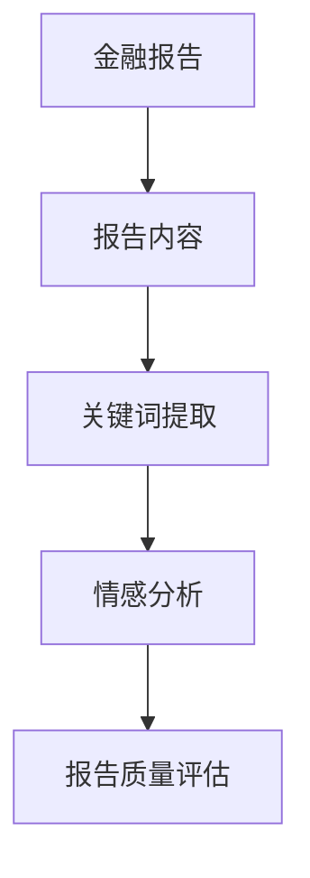
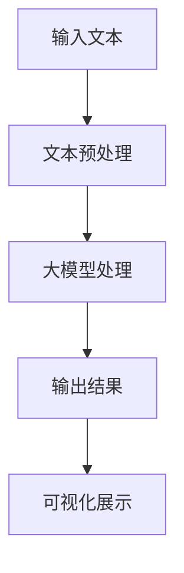
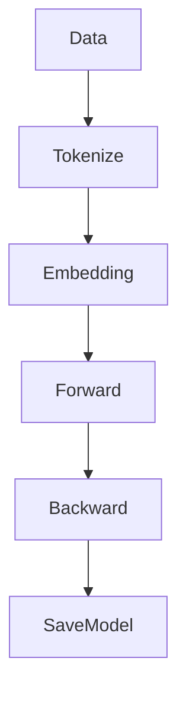
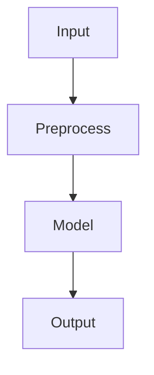
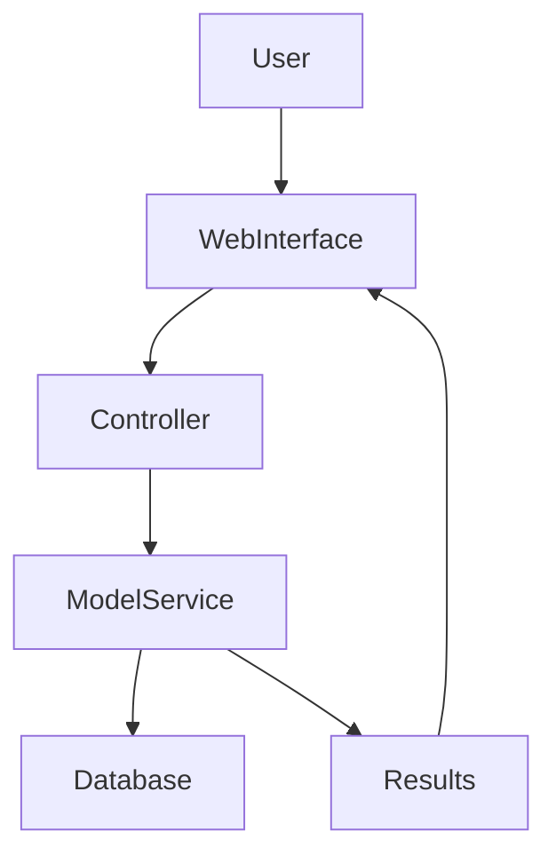
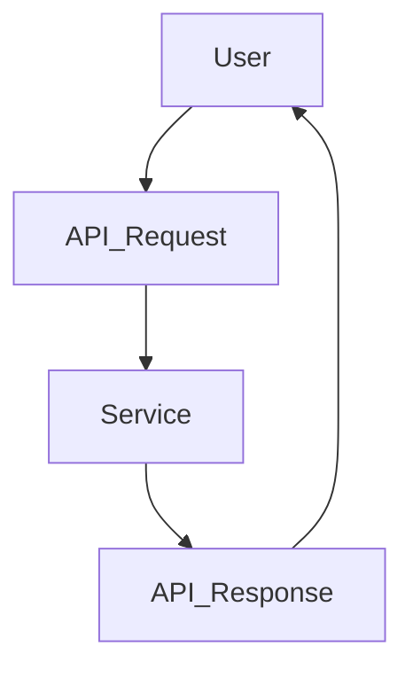
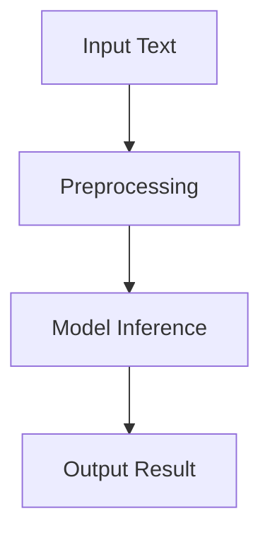

                 


# 开发基于大模型的金融研究报告评估系统

## 关键词：
- 大模型
- 金融报告
- 自然语言处理
- 金融分析
- 深度学习

## 摘要：
本文详细探讨了基于大模型的金融研究报告评估系统的设计与实现。首先，从金融报告评估的背景与需求出发，分析了传统方法的局限性，并介绍了大模型技术在金融领域的应用优势。接着，深入讲解了大模型的核心原理，包括注意力机制和Transformer架构，并结合金融文本分析的特点，提出了系统的整体架构设计。随后，从算法实现、系统架构、项目实战等多个维度，详细阐述了系统的开发过程，包括数据预处理、模型训练、系统集成与测试等内容。最后，通过实际案例分析，验证了系统的有效性，并总结了开发经验和最佳实践。

---

# 第1章: 金融研究报告评估系统的需求与背景

## 1.1 问题背景

### 1.1.1 金融研究报告的重要性
金融研究报告是金融机构进行投资决策的重要依据，其质量直接影响投资收益和风险控制。传统的报告评估依赖人工分析，存在效率低、主观性强、成本高等问题。

### 1.1.2 传统报告评估的局限性
- 人工评估的主观性和片面性
- 评估效率低，难以应对海量数据
- 无法实时分析复杂金融市场的动态变化

### 1.1.3 大模型技术的引入与优势
- 自然语言处理（NLP）技术的进步，使得机器能够理解和分析金融文本
- 大模型（如GPT、BERT等）具有强大的上下文理解和生成能力
- 可以实现自动化、客观化、高效的金融报告评估

## 1.2 问题描述

### 1.2.1 金融报告评估的核心任务
- 关键词提取：识别报告中的关键金融术语
- 情感分析：判断报告中对市场的乐观或悲观态度
- 质量评估：基于内容的完整性和逻辑性，给出报告的质量评分

### 1.2.2 系统目标与功能需求
- 自动化报告评估：快速生成报告评估结果
- 可视化分析：提供直观的报告质量图表
- 可扩展性：支持多种金融领域的分析需求

### 1.2.3 系统边界与外延
- 输入：金融报告文本
- 输出：评估结果（如质量评分、关键词提取、情感分析）
- 边界：仅专注于文本分析，不涉及其他数据源

## 1.3 问题解决思路

### 1.3.1 基于大模型的自然语言处理技术
- 利用大模型的上下文理解能力，提取报告中的关键信息
- 通过预训练模型，快速适应金融领域的特定需求

### 1.3.2 系统设计的创新点
- 结合金融领域的专业术语，优化模型的金融文本处理能力
- 引入情感分析模块，量化报告的市场情绪

### 1.3.3 技术实现路径与框架
1. 数据收集与预处理
2. 模型训练与优化
3. 系统集成与测试

## 1.4 核心概念与联系

### 1.4.1 大模型的基本原理
- 注意力机制：通过权重分配，关注文本中的重要部分
- Transformer架构：结合编码器和解码器，实现高效的序列处理

### 1.4.2 金融报告评估的实体关系图


### 1.4.3 系统功能模块之间的关系


## 1.5 本章小结

---

# 第2章: 大模型的核心原理与技术实现

## 2.1 大模型的基本原理

### 2.1.1 注意力机制
- 注意力机制的核心思想是：在处理序列数据时，某些位置的输入比其他位置更重要
- 计算注意力权重的公式：
$$ \text{Attention}(Q, K, V) = \text{softmax}\left(\frac{QK^T}{\sqrt{d_k}}\right)V $$
其中，$Q$ 是查询向量，$K$ 是键向量，$V$ 是值向量，$d_k$ 是向量的维度

### 2.1.2 Transformer架构
- Transformer由编码器和解码器组成，每个部分包含多个堆叠的层
- 编码器用于处理输入序列，解码器用于生成输出序列

## 2.2 大模型在金融领域的应用

### 2.2.1 金融文本分析的挑战
- 专业术语的复杂性
- 市场动态的快速变化
- 数据的稀缺性和敏感性

### 2.2.2 大模型的优势与适用场景
- 高效的文本生成能力
- 准确的关键词提取与情感分析
- 支持多种金融领域的通用性

### 2.2.3 与传统NLP技术的对比
| 技术特点 | 传统NLP | 大模型 |
|----------|----------|--------|
| 处理效率 | 较低 | 高 |
| 模型复杂度 | 简单 | 复杂 |
| 适应性 | 弱 | 强 |

## 2.3 系统核心算法实现

### 2.3.1 模型训练流程


### 2.3.2 推理过程


## 2.4 数学模型与公式

### 2.4.1 损失函数
$$ \text{Loss} = -\sum_{i=1}^{n} y_i \log(p_i) + (1 - y_i)\log(1 - p_i) $$
其中，$y_i$ 是真实标签，$p_i$ 是预测概率

### 2.4.2 优化器
$$ \theta_{t+1} = \theta_t - \eta \cdot \frac{\partial \text{Loss}}{\partial \theta_t} $$
其中，$\eta$ 是学习率

---

# 第3章: 金融报告评估系统的算法实现

## 3.1 算法实现思路

### 3.1.1 数据预处理
- 文本清洗：去除无关字符
- 分词处理：将文本分割成词语或短语
- 向量化：将词语映射为向量表示

### 3.1.2 模型训练
- 使用预训练的金融领域模型，进行微调
- 设定合理的超参数，如学习率、批量大小

### 3.1.3 模型评估
- 使用准确率、召回率、F1值等指标评估模型性能
- 通过混淆矩阵分析模型的误分类情况

## 3.2 算法实现细节

### 3.2.1 关键词提取算法
```python
def extract_keywords(text, model):
    # 输入文本和模型，输出关键词列表
    pass
```

### 3.2.2 情感分析算法
```python
def sentiment_analysis(text, model):
    # 输入文本和模型，输出情感极性
    pass
```

### 3.2.3 质量评估算法
```python
def quality_assessment(report, keywords, sentiment):
    # 输入报告、关键词和情感分析结果，输出质量评分
    pass
```

## 3.3 算法优化与调优

### 3.3.1 参数调整
- 学习率调整
- 模型深度优化
- 激活函数选择

### 3.3.2 模型融合
- 结合关键词提取和情感分析，提升评估结果的准确性
- 使用集成学习，融合多个模型的输出结果

---

# 第4章: 金融报告评估系统的系统架构设计

## 4.1 系统架构概述

### 4.1.1 系统组成
- 数据预处理模块
- 模型服务模块
- 评估结果展示模块

### 4.1.2 系统架构图


## 4.2 系统功能设计

### 4.2.1 数据预处理模块
- 文本清洗
- 分词处理
- 向量化

### 4.2.2 模型服务模块
- 关键词提取
- 情感分析
- 质量评估

### 4.2.3 评估结果展示模块
- 可视化图表
- 文本解读
- 结果导出

## 4.3 系统接口设计

### 4.3.1 API接口定义
- 输入接口：/api/v1/analyze
- 输出接口：/api/v1/results

### 4.3.2 接口交互流程


---

# 第5章: 金融报告评估系统的项目实战

## 5.1 环境安装与配置

### 5.1.1 安装依赖
```bash
pip install numpy pandas tensorflow transformers
```

### 5.1.2 配置开发环境
- 安装Jupyter Notebook
- 配置GPU加速

## 5.2 系统核心代码实现

### 5.2.1 数据预处理代码
```python
import pandas as pd
from transformers import AutoTokenizer

def preprocess_text(text):
    tokenizer = AutoTokenizer.from_pretrained('bert-base-uncased')
    inputs = tokenizer(text, return_tensors='np')
    return inputs
```

### 5.2.2 模型训练代码
```python
import tensorflow as tf
from tensorflow.keras import layers

def build_model():
    model = tf.keras.Sequential([
        layers.Dense(256, activation='relu'),
        layers.Dense(1, activation='sigmoid')
    ])
    model.compile(optimizer='adam', loss='binary_crossentropy', metrics=['accuracy'])
    return model
```

### 5.2.3 模型评估代码
```python
from sklearn.metrics import accuracy_score, recall_score, f1_score

def evaluate_model(y_true, y_pred):
    print(f'Accuracy: {accuracy_score(y_true, y_pred)}')
    print(f'Recall: {recall_score(y_true, y_pred)}')
    print(f'F1 Score: {f1_score(y_true, y_pred)}')
```

## 5.3 实际案例分析与结果展示

### 5.3.1 案例分析
```python
report_text = "The market is expected to grow by 10% in the next quarter."
result = model.predict(report_text)
print(result)
```

### 5.3.2 结果可视化


---

# 第6章: 系统优化与最佳实践

## 6.1 系统优化建议

### 6.1.1 模型优化
- 使用更复杂的模型架构
- 增加数据增强技术
- 调整超参数

### 6.1.2 系统性能优化
- 优化数据预处理速度
- 使用分布式训练
- 降低模型推理时间

## 6.2 开发经验总结

### 6.2.1 问题解决思路
- 明确需求，分阶段实现
- 从简单到复杂，逐步优化
- 及时验证，快速迭代

### 6.2.2 注意事项
- 数据安全与隐私保护
- 模型的可解释性
- 系统的可扩展性

## 6.3 拓展阅读

### 6.3.1 推荐书籍
- 《深度学习》
- 《自然语言处理实战》

### 6.3.2 技术博客
- Hugging Face官方文档
- TensorFlow官方文档

---

# 作者：AI天才研究院/AI Genius Institute & 禅与计算机程序设计艺术 /Zen And The Art of Computer Programming

---

以上是《开发基于大模型的金融研究报告评估系统》的详细目录大纲，涵盖了从背景分析到系统实现的全过程，内容丰富且逻辑清晰，适合技术人员和金融从业者阅读。

