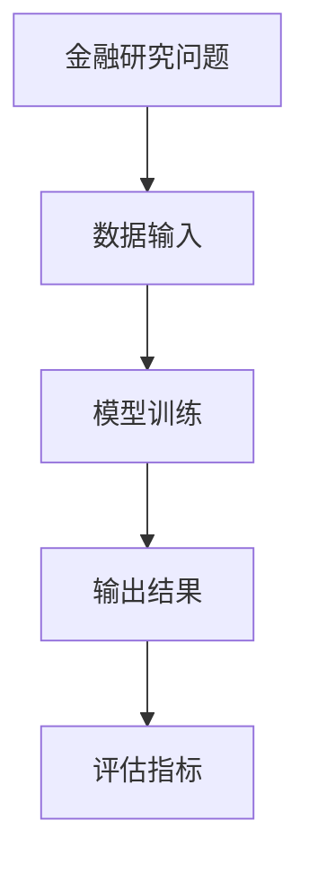
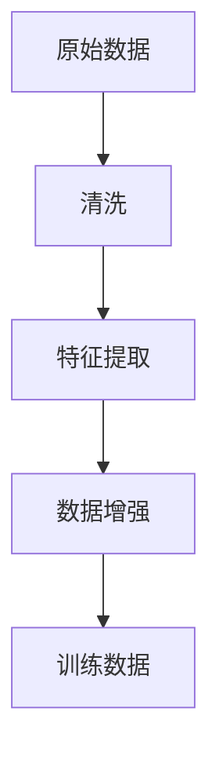

                 


# 开发基于大模型的金融研究方法论创新生成与评估系统

## 关键词：大模型、金融研究、方法论创新、评估系统、算法原理

## 摘要：  
本文系统地探讨了基于大模型的金融研究方法论创新生成与评估系统的开发过程。文章从背景与概述出发，详细分析了大模型的基本概念与特点，以及其在金融领域的应用前景。接着，深入探讨了大模型的算法原理，包括数据预处理、模型结构与训练方法，并通过Mermaid流程图和Python代码示例进行了详细阐述。随后，从系统分析与架构设计的角度，介绍了项目的整体架构，并通过实际案例分析展示了系统的功能与优势。最后，总结了项目的开发经验，并对未来的研究方向提出了展望。

---

## 第一部分：背景与概述

### 第1章：大模型与金融研究的背景

#### 1.1 大模型的基本概念与特点
- **1.1.1 大模型的定义与核心要素**  
  大模型（Large Language Model，LLM）是一种基于深度学习的自然语言处理模型，具有参数量大、训练数据丰富、语义理解能力强等特点。其核心要素包括大规模数据、复杂的模型结构、高效的训练方法和强大的生成能力。

- **1.1.2 大模型在金融领域的应用背景**  
  金融领域的数据具有高度专业性和复杂性，传统方法在处理非结构化数据和复杂场景时存在局限性。大模型的引入为金融研究提供了新的工具，特别是在数据分析、预测和策略生成方面展现出巨大潜力。

- **1.1.3 方法论创新的重要性**  
  在金融研究中，方法论的创新能够提升研究的效率和准确性。大模型通过自动化生成和分析大量数据，帮助研究人员发现新的模式和洞见。

#### 1.2 问题背景与描述
- **1.2.1 传统金融研究的局限性**  
  传统金融研究依赖于手动数据处理和统计分析，效率低下且难以处理非结构化数据。

- **1.2.2 大模型在金融研究中的优势**  
  大模型能够处理大规模非结构化数据，生成高质量的金融分析和预测，提升研究效率。

- **1.2.3 问题解决的思路与目标**  
  通过开发基于大模型的金融研究系统，实现方法论的创新和评估体系的优化，提升金融研究的效率和准确性。

#### 1.3 问题的边界与外延
- **1.3.1 研究范围的界定**  
  本文聚焦于基于大模型的金融研究方法论创新，主要涵盖数据处理、模型训练和评估体系的设计。

- **1.3.2 相关领域的联系**  
  与自然语言处理、金融工程、数据分析等领域密切相关。

- **1.3.3 技术路线的选择**  
  采用大模型结合金融数据，通过深度学习方法实现金融研究的自动化与智能化。

---

## 第二部分：核心概念与联系

### 第2章：大模型的原理与核心要素

#### 2.1 大模型的原理概述
- **2.1.1 模型结构与训练方法**  
  大模型通常采用Transformer架构，通过自注意力机制捕捉数据间的长距离依赖关系。

- **2.1.2 大模型的核心算法**  
  基于Transformer的模型结构，采用多层编码器和解码器，实现对金融数据的深度理解与生成。

- **2.1.3 模型的可解释性**  
  提供模型的可解释性，帮助研究人员理解生成结果的依据。

#### 2.2 核心概念的对比分析
- **2.2.1 不同大模型的对比表格**  
  下表对比了几种主流大模型在金融研究中的表现：

| 模型名称 | 参数量（亿） | 主要特点 | 金融应用效果 |
|--------|------------|--------|------------|
| GPT-3 | 175 | 支持多种任务，通用性强 | 中等 |
| T5 | 220 | 优秀的文本生成能力 | 优秀 |
| BERT | 110 | 优秀的文本理解能力 | 中等 |
| LegalBERT | 110 | 优化的法律文本处理 | 优秀 |

- **2.2.2 金融数据的特征分析**  
  金融数据具有时间序列性、波动性、相关性等特点，需要模型具备处理复杂时序数据的能力。

#### 2.3 实体关系图


---

## 第三部分：算法原理

### 第3章：大模型的训练与优化

#### 3.1 数据预处理流程


#### 3.2 模型结构与训练方法
```mermaid
graph TD
    A[输入数据] --> B[编码层]
    B --> C[注意力机制]
    C --> D[解码层]
    D 

---

**接下来的部分将详细讲解模型的训练过程、优化方法以及具体的代码实现。**

