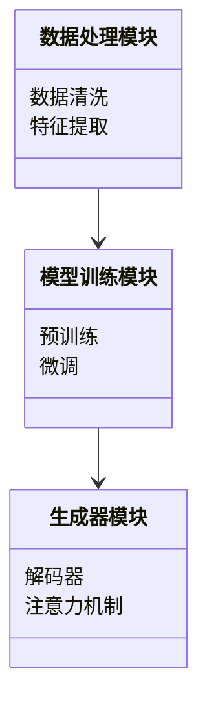
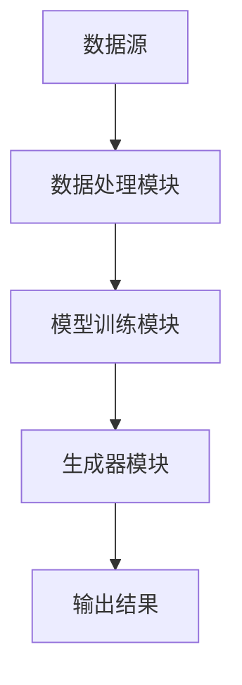
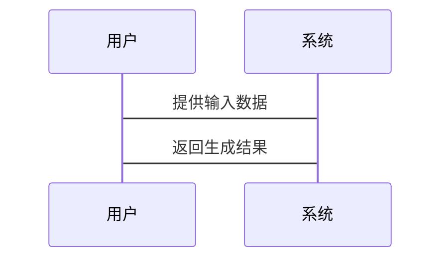

                 


# 开发基于大模型的金融研究方法论生成器

> 关键词：大模型、金融研究、方法论生成器、生成式AI、系统架构

> 摘要：本文详细探讨了开发基于大模型的金融研究方法论生成器的背景、核心概念、算法原理、系统架构、项目实战及最佳实践。通过分析传统金融研究方法的局限性，引出生成式方法论生成器的创新价值，结合大模型的生成机制与训练策略，详细阐述了系统的实现过程，并通过实际案例展示了生成器的应用效果。

---

# 第一部分: 金融研究方法论生成器的背景与核心概念

## 第1章: 金融研究方法论的现状与挑战

### 1.1 传统金融研究方法的局限性

#### 1.1.1 传统金融研究的流程与痛点
传统金融研究依赖大量手动数据分析与模型构建，存在以下痛点：
- 数据处理复杂：需要手动清洗、整理和特征提取。
- 模型构建耗时：从数据预处理到模型训练耗时较长。
- 研究方法单一：主要依赖统计分析和简单机器学习模型。
- 知识更新缓慢：难以快速适应金融市场的变化。

#### 1.1.2 数据分析与模型构建的难点
- 数据维度高，噪声多，难以提取有效特征。
- 模型解释性不足，难以被业务人员理解和应用。
- 数据隐私与安全问题日益突出。

#### 1.1.3 研究方法的局限性与改进方向
传统方法难以应对金融市场的复杂性和不确定性，改进方向包括：
- 引入更高效的算法和工具。
- 利用AI技术提升研究效率和深度。

### 1.2 金融研究方法的数字化转型

#### 1.2.1 数字化转型的背景与趋势
随着AI技术的发展，金融研究逐渐从人工驱动转向技术驱动，生成式AI的应用成为趋势。

#### 1.2.2 AI大模型在金融研究中的应用潜力
- 自动化数据处理与特征提取。
- 自动生成研究报告与策略建议。
- 实时监控与风险预警。

#### 1.2.3 生成式方法论的创新价值
生成式方法论生成器通过大模型的强大生成能力，能够快速构建研究方法，显著提升研究效率。

### 1.3 基于大模型的金融研究方法论生成器的必要性

#### 1.3.1 生成器的核心目标与功能
- 自动生成金融研究的方法论框架。
- 提供数据处理与模型构建的自动化支持。
- 生成研究报告与策略建议。

#### 1.3.2 生成器的优势与应用场景
- 提升研究效率，缩短研究周期。
- 降低技术门槛，让更多业务人员能够使用。
- 支持实时分析与动态调整。

#### 1.3.3 生成器的边界与外延
生成器仅提供方法论框架与初步分析，具体策略仍需结合业务知识进行调整。

## 第2章: 生成式金融研究方法论生成器的核心概念

### 2.1 方法论生成器的输入输出结构

#### 2.1.1 输入数据的类型与格式
- **输入类型**：文本、表格、时间序列数据。
- **格式要求**：结构化数据优先，非结构化数据需预处理。

#### 2.1.2 输出结果的结构与形式
- 文档生成：研究报告、策略建议书。
- 数据分析：图表、关键指标。
- 模型输出：预测结果、风险评估。

#### 2.1.3 输入输出的关联关系
输入数据驱动生成器输出方法论框架，输出结果需与输入数据保持一致性和可验证性。

### 2.2 方法论生成器的模型结构

#### 2.2.1 模型的层次划分
- **编码器**：处理输入数据，提取特征。
- **解码器**：生成方法论框架，输出研究报告。

#### 2.2.2 模型的参数与训练策略
- **参数量**：大规模预训练参数。
- **训练策略**：预训练+微调。

#### 2.2.3 模型的可解释性与验证方法
- 通过注意力机制分析生成过程。
- 使用交叉验证评估模型性能。

### 2.3 方法论生成器的训练与优化

#### 2.3.1 预训练与微调策略
- 预训练：通用语言模型。
- 微调：针对金融领域的数据。

#### 2.3.2 模型评估与优化方法
- 使用准确率、F1分数等指标评估生成结果。
- 优化目标函数，减少生成偏差。

#### 2.3.3 模型的可扩展性与维护性
- 支持新增领域数据的微调。
- 定期更新模型参数，保持生成能力。

---

# 第三部分: 生成式方法论生成器的算法原理与系统架构

## 第3章: 生成式方法论生成器的算法原理

### 3.1 大模型的生成机制

#### 3.1.1 解码器的结构与工作原理
- 解码器采用自注意力机制，逐步生成文本。
- 每一步生成词的概率由上下文决定。

#### 3.1.2 激活函数与损失函数的选择
- **激活函数**：ReLU。
- **损失函数**：交叉熵损失。

#### 3.1.3 梯度下降与优化器的实现
- 优化器：Adam。
- 学习率：动态调整。

### 3.2 方法论生成器的训练流程

#### 3.2.1 数据预处理与特征提取
- 数据清洗：去除噪声。
- 特征提取：提取关键字段。

#### 3.2.2 模型训练的数学公式
- 损失函数：$$L = -\sum_{i=1}^{n} \log P(y_i|x_i)$$
- 优化目标：最小化损失函数。

#### 3.2.3 训练过程中的参数调整
- 动态调整学习率。
- 早停策略防止过拟合。

### 3.3 方法论生成器的推理过程

#### 3.3.1 解码器的推理机制
- 逐步生成词，直到达到预设长度。

#### 3.3.2 推理过程中的注意力机制
- 注意力权重：$$\alpha_{i,j} = \frac{\exp(e_{i,j})}{\sum_{k=1}^{n} \exp(e_{i,k})}$$
- e为查询与键的匹配程度。

#### 3.3.3 推理结果的校验与优化
- 多轮校验，减少生成错误。
- 结合业务规则优化结果。

## 第4章: 方法论生成器的系统架构设计

### 4.1 系统功能模块划分

#### 4.1.1 数据处理模块
- **功能**：数据清洗、特征提取。
- **输入**：原始数据。
- **输出**：结构化数据。

#### 4.1.2 模型训练模块
- **功能**：模型预训练与微调。
- **输入**：训练数据。
- **输出**：训练好的模型。

#### 4.1.3 生成器模块
- **功能**：生成方法论框架。
- **输入**：结构化数据。
- **输出**：生成文本。

### 4.2 系统功能设计

#### 4.2.1 领域模型设计


#### 4.2.2 系统架构设计


#### 4.2.3 系统接口设计
- **输入接口**：JSON格式的结构化数据。
- **输出接口**：文本格式的方法论框架。

#### 4.2.4 系统交互流程


---

# 第五部分: 项目实战与总结

## 第5章: 项目实战

### 5.1 环境配置与安装

```bash
pip install transformers
pip install torch
pip install numpy
pip install matplotlib
```

### 5.2 系统核心实现源代码

```python
import torch
from transformers import AutoTokenizer, AutoModelForCausalLM

class Generator:
    def __init__(self, model_name):
        self.tokenizer = AutoTokenizer.from_pretrained(model_name)
        self.model = AutoModelForCausalLM.from_pretrained(model_name)
        
    def generate(self, input_text, max_length=500):
        inputs = self.tokenizer.encode(input_text, return_tensors="pt")
        outputs = self.model.generate(inputs, max_length=max_length)
        return self.tokenizer.decode(outputs[0], skip_special_tokens=True)
```

### 5.3 代码解读与分析

- **Tokenizer**：处理输入文本，生成token序列。
- **Model**：生成token序列，解码成文本。
- **生成函数**：输入文本，返回生成结果。

### 5.4 实际案例分析

#### 5.4.1 案例背景
分析某金融市场的趋势，生成研究方法论。

#### 5.4.2 案例实现
```python
generator = Generator("gpt2-large")
input_text = "分析某金融市场的趋势，生成研究方法论。"
result = generator.generate(input_text)
print(result)
```

#### 5.4.3 结果解读
生成的结果包括数据收集、分析方法、结论建议。

### 5.5 项目小结

---

## 第6章: 总结与展望

### 6.1 最佳实践 tips
- 定期更新模型参数。
- 结合业务规则优化生成结果。

### 6.2 小结
本文详细介绍了生成式方法论生成器的开发过程，从背景到实现，为金融研究提供了新思路。

### 6.3 注意事项
- 数据隐私问题需严格把控。
- 模型生成结果需结合业务知识进行验证。

### 6.4 拓展阅读
推荐阅读相关领域的最新论文和实践案例。

---

# 作者：AI天才研究院 & 禅与计算机程序设计艺术

感谢您的阅读！

