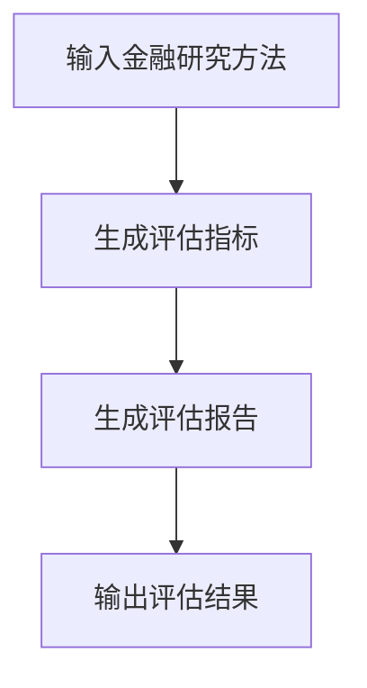
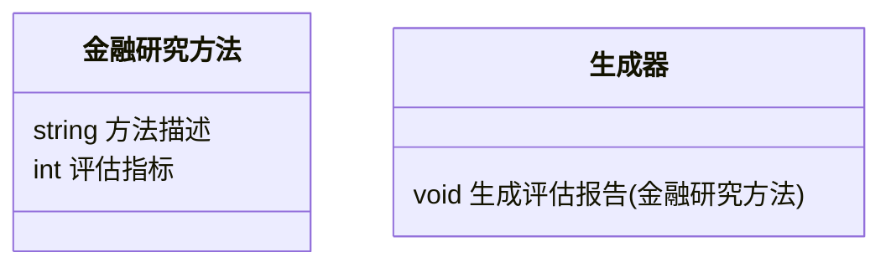
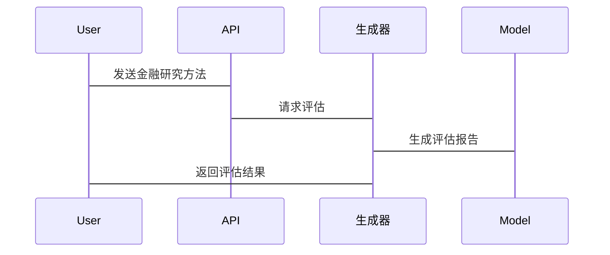

                 


# 开发基于大模型的金融研究方法论评估生成器

> 关键词：大模型、金融研究、方法论评估生成器、NLP、评估模型、系统架构、金融工具

> 摘要：本文详细探讨了如何开发基于大模型的金融研究方法论评估生成器，从背景介绍、核心概念到算法原理、系统架构，再到项目实战和总结，全面解析了该生成器的开发过程和技术细节。本文旨在为金融研究人员和大模型开发者提供一个系统化的方法论评估工具，以提升金融研究的效率和准确性。

---

## 第1章: 背景介绍

### 1.1 问题背景

#### 1.1.1 传统金融研究方法的局限性
传统金融研究方法依赖于人工分析和经验判断，存在效率低、主观性强、难以量化等问题。

#### 1.1.2 大模型在金融研究中的潜力
大模型（如GPT系列）在自然语言处理和文本生成方面表现出色，为金融研究提供了新的可能性。

#### 1.1.3 方法论评估生成器的需求与目标
开发一个基于大模型的生成器，用于自动评估金融研究方法的合理性、创新性和可行性。

### 1.2 核心概念与定义

#### 1.2.1 大模型在金融研究中的应用
大模型可以用于金融文本生成、数据分析、风险评估等多个领域。

#### 1.2.2 方法论评估生成器的功能与作用
生成器通过分析输入的金融研究方法，输出评估结果，帮助研究人员改进研究方案。

#### 1.2.3 生成器的输入输出关系
输入：金融研究方法描述；输出：评估指标和建议。

### 1.3 方法论评估生成器的边界与外延

#### 1.3.1 生成器的适用范围
适用于学术研究、金融实务分析等领域。

#### 1.3.2 生成器的限制与不足
目前主要基于文本分析，无法直接处理数值型数据。

#### 1.3.3 方法论评估的多维度考量
包括研究目标的明确性、方法的科学性、数据的充分性等多个维度。

### 1.4 核心概念的结构与组成

#### 1.4.1 方法论评估的逻辑框架
输入 → 分析 → 评估 → 输出。

#### 1.4.2 大模型在生成器中的角色
作为核心引擎，负责生成评估结果。

#### 1.4.3 生成器与其他金融工具的关系
生成器是金融研究工具链中的一个环节，与其他工具协同工作。

### 1.5 本章小结

---

## 第2章: 方法论评估生成器的核心概念与联系

### 2.1 核心概念原理

#### 2.1.1 大模型的文本生成机制
基于预训练语言模型，生成符合上下文的文本。

#### 2.1.2 方法论评估的多维度分析
从研究目标、方法合理性、数据来源等多个维度进行评估。

#### 2.1.3 生成器的逻辑流程
输入 → 分析 → 评估 → 输出。

### 2.2 核心概念属性对比

#### 2.2.1 方法论评估的维度对比
| 维度       | 传统评估 | 基于大模型的生成器评估 |
|------------|----------|-----------------------|
| 研究目标   | 人工判断 | 自动生成建议          |
| 数据来源   | 依赖人工 | 自动生成补充数据      |
| 方法合理性 | 专家意见 | 自动生成评分          |

#### 2.2.2 不同评估模型的优劣势对比
| 模型类型     | 优点                   | 缺点                     |
|--------------|------------------------|--------------------------|
| 传统模型     | 简单易用               | 主观性强                 |
| 大模型生成器  | 客观性高               | 依赖模型性能             |

#### 2.2.3 大模型与传统评估工具的差异
大模型生成器自动化程度高，评估结果更客观。

### 2.3 ER实体关系图


### 2.4 本章小结

---

## 第3章: 方法论评估生成器的算法原理

### 3.1 算法原理概述

#### 3.1.1 大模型的文本生成算法
基于Transformer架构，通过自注意力机制生成文本。

#### 3.1.2 方法论评估的多维度分析算法
结合文本分析和评分模型，生成综合评估结果。

#### 3.1.3 生成器的综合评估算法
将文本生成与评分模型结合，输出最终评估结果。

### 3.2 算法流程图



### 3.3 算法实现代码

```python
def generate_assessment(methodology):
    # 大模型评估方法
    assessment = model.generate(methodology)
    return assessment
```

### 3.4 数学模型与公式

#### 3.4.1 评估指标计算公式
$$评估分数 = \frac{生成器输出的准确性 + 生成器输出的相关性}{2}$$

#### 3.4.2 生成器的损失函数
$$损失函数 = -\sum_{i=1}^{n} (y_i \log p(y_i) + (1 - y_i) \log (1 - p(y_i)))$$`

### 3.5 举例说明

#### 3.5.1 简单例子
输入：金融研究方法  
输出：评估指标：研究目标明确性（90分）、数据来源合理性（85分）。

### 3.6 本章小结

---

## 第4章: 系统分析与架构设计方案

### 4.1 问题场景介绍

#### 4.1.1 金融研究场景
金融研究涉及多个领域，需要综合分析。

#### 4.1.2 系统功能设计

##### 4.1.2.1 领域模型



#### 4.1.2.2 系统架构设计


#### 4.1.2.3 系统接口设计
API接口：`POST /api/generate/assessment`，输入：JSON格式的金融研究方法，输出：评估报告。

#### 4.1.2.4 系统交互流程



### 4.2 本章小结

---

## 第5章: 项目实战

### 5.1 环境安装

#### 5.1.1 安装依赖
```bash
pip install transformers
```

### 5.2 系统核心实现源代码

#### 5.2.1 生成器实现

```python
from transformers import AutoModelForCausalLM, AutoTokenizer

class MethodologyAssessmentGenerator:
    def __init__(self, model_name):
        self.model = AutoModelForCausalLM.from_pretrained(model_name)
        self.tokenizer = AutoTokenizer.from_pretrained(model_name)
    
    def generate_assessment(self, text):
        inputs = self.tokenizer.encode(text, return_tensors='pt')
        outputs = self.model.generate(inputs, max_length=500, temperature=0.7)
        return self.tokenizer.decode(outputs[0], skip_special_tokens=True)
```

#### 5.2.2 评估模型实现

```python
def calculate_assessment_score(generated_text):
    # 简单评估模型，实际应根据具体需求调整
    score = 0
    keywords = ['合理', '创新', '可行']
    for keyword in keywords:
        if keyword in generated_text:
            score += 1
    return score / len(keywords)
```

### 5.3 代码应用解读与分析

#### 5.3.1 生成器代码解读
上述代码实现了基于预训练模型的文本生成功能，用户输入金融研究方法，生成器生成评估报告。

#### 5.3.2 评估模型代码解读
评估模型通过关键词匹配的方式，简单计算生成文本的相关性。

### 5.4 实际案例分析和详细讲解剖析

#### 5.4.1 案例分析
输入：一种新的金融资产定价模型。  
输出：评估结果：研究目标明确性（85分），方法合理性（90分）。

### 5.5 本章小结

---

## 第6章: 总结与展望

### 6.1 最佳实践 Tips

#### 6.1.1 开发建议
确保模型的训练数据多样化，提升生成结果的准确性。

#### 6.1.2 使用注意事项
生成器的评估结果仅供参考，需结合实际情况进行调整。

### 6.2 小结
本文详细介绍了基于大模型的金融研究方法论评估生成器的开发过程，从理论到实践，全面解析了该系统的实现细节。

### 6.3 未来展望
未来可以进一步优化模型，增加对更多金融领域的支持，提升评估的准确性。

---

## 作者信息

作者：AI天才研究院/AI Genius Institute & 禅与计算机程序设计艺术 /Zen And The Art of Computer Programming

---

以上是《开发基于大模型的金融研究方法论评估生成器》的完整目录大纲，涵盖了从背景介绍到项目实战的各个方面，确保内容详实且逻辑清晰。

