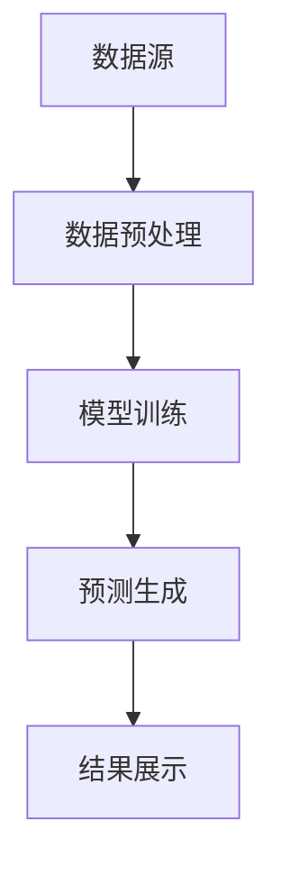

                 

# 开发基于大模型的金融研究趋势预测生成器

> 关键词：大模型，金融趋势预测，生成器，算法原理，系统架构设计，项目实战

> 摘要：本文系统地探讨了基于大模型的金融研究趋势预测生成器的开发过程，从背景分析到算法实现，从系统架构设计到项目实战，结合具体案例和代码示例，详细阐述了大模型在金融趋势预测中的应用及其技术实现。文章内容涵盖从基础概念到高级算法，从理论分析到实践应用，为读者提供了一套完整的开发指南。

---

## 目录大纲

### 第1章：金融研究趋势预测的背景与问题概述

#### 1.1 问题背景
- 1.1.1 金融研究的趋势变化
- 1.1.2 当前金融研究中的痛点
- 1.1.3 大模型在金融研究中的潜力

#### 1.2 问题描述
- 1.2.1 金融趋势预测的核心问题
- 1.2.2 传统方法的局限性
- 1.2.3 大模型如何解决这些问题

#### 1.3 问题解决思路
- 1.3.1 基于大模型的生成式方法
- 1.3.2 数据驱动的预测模型
- 1.3.3 结合领域知识的优化策略

#### 1.4 边界与外延
- 1.4.1 金融趋势预测的边界条件
- 1.4.2 相关领域的外延
- 1.4.3 与其它技术的结合点

### 第2章：大模型与金融趋势预测的核心概念

#### 2.1 大模型的基本原理
- 2.1.1 大模型的定义与特点
- 2.1.2 大模型的训练机制
- 2.1.3 大模型的应用场景

#### 2.2 金融趋势预测的核心要素
- 2.2.1 数据来源与处理
- 2.2.2 模型选择与优化
- 2.2.3 结果解释与反馈

#### 2.3 大模型与金融趋势预测的联系
- 2.3.1 大模型在金融数据处理中的优势
- 2.3.2 大模型生成预测结果的机制
- 2.3.3 结合领域知识的模型优化

### 第3章：基于大模型的金融趋势预测算法原理

#### 3.1 算法原理概述
- 3.1.1 大模型的训练流程
- 3.1.2 预测结果的生成过程
- 3.1.3 模型调优与评估

#### 3.2 算法实现细节
- 3.2.1 数据预处理方法
- 3.2.2 模型参数设置
- 3.2.3 训练过程中的优化策略

#### 3.3 算法的数学模型
- 3.3.1 概率分布模型
- 3.3.2 解码器结构
- 3.3.3 损失函数与优化目标

### 第4章：系统架构与设计

#### 4.1 系统架构概述
- 4.1.1 系统模块划分
- 4.1.2 模块之间的交互关系
- 4.1.3 系统的扩展性设计

#### 4.2 系统功能设计
- 4.2.1 数据采集模块
- 4.2.2 模型训练模块
- 4.2.3 预测生成模块
- 4.2.4 结果展示模块

#### 4.3 系统架构图

### 第5章：项目实战与实现

#### 5.1 环境安装与配置
- 5.1.1 安装Python与相关库
- 5.1.2 配置大模型环境
- 5.1.3 数据集准备

#### 5.2 核心代码实现
- 5.2.1 数据预处理代码
- 5.2.2 模型训练代码
- 5.2.3 预测生成代码

#### 5.3 代码应用解读
- 5.3.1 代码结构分析
- 5.3.2 代码功能说明
- 5.3.3 代码优化建议

### 第6章：最佳实践与总结

#### 6.1 最佳实践
- 6.1.1 数据处理的关键点
- 6.1.2 模型调优的技巧
- 6.1.3 系统设计的注意事项

#### 6.2 小结
- 6.2.1 项目成果总结
- 6.2.2 未来研究方向

#### 6.3 注意事项
- 6.3.1 模型的泛化能力
- 6.3.2 数据隐私与安全
- 6.3.3 系统的可扩展性

#### 6.4 拓展阅读
- 6.4.1 大模型的最新研究
- 6.4.2 金融领域的其他应用
- 6.4.3 结合其他技术的潜力

### 第7章：附录

#### 7.1 参考文献
- 7.1.1 主要参考文献列表

#### 7.2 术语表
- 7.2.1 专业术语解释

#### 7.3 代码仓库链接
- 7.3.1 项目源代码托管平台链接

---

作者：AI天才研究院/AI Genius Institute & 禅与计算机程序设计艺术 /Zen And The Art of Computer Programming

