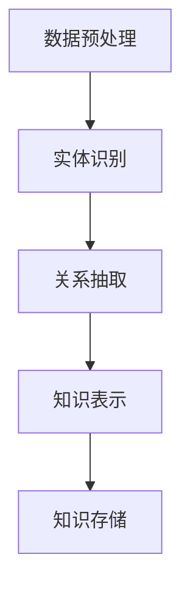
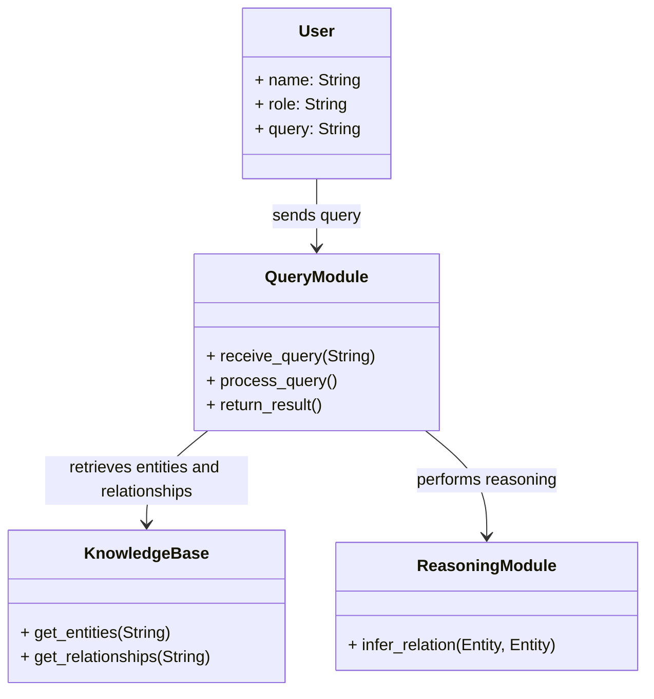
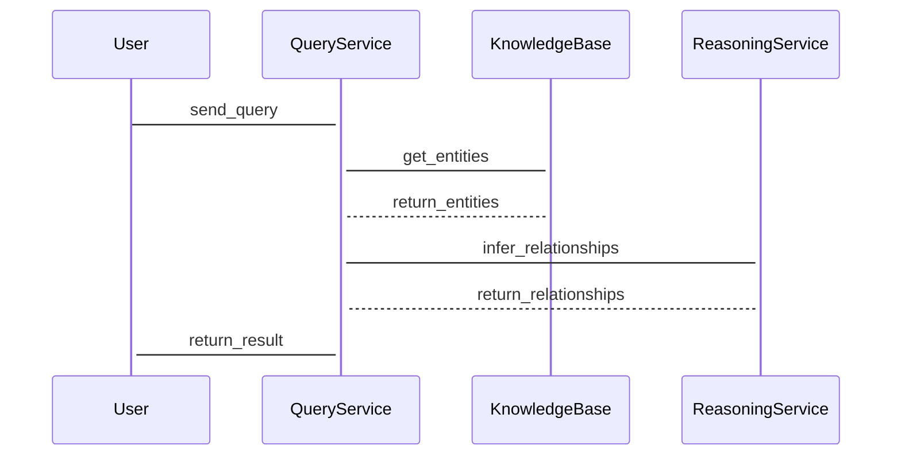

                 


# 开发基于知识图谱的金融咨询系统

## 关键词：
知识图谱、金融咨询系统、实体识别、关系抽取、系统架构设计

## 摘要：
本文详细探讨了基于知识图谱的金融咨询系统的开发过程，从背景介绍到系统实现，全面解析了知识图谱在金融领域的应用。文章通过核心概念的讲解、算法原理的分析、系统架构的设计、项目实战的指导以及最佳实践的总结，为读者提供了从理论到实践的完整指南。

---

# 目录大纲：《开发基于知识图谱的金融咨询系统》

## 第一部分：背景介绍

### 第1章：知识图谱与金融咨询系统概述

#### 1.1 问题背景
- 1.1.1 传统金融咨询系统的局限性
  - 数据孤岛问题
  - 查询响应时间长
  - 知识关联性弱

- 1.1.2 知识图谱技术的兴起
  - 知识图谱的定义
  - 知识图谱的优势

- 1.1.3 金融咨询系统的需求分析
  - 用户需求：多维度、深层次的金融信息检索
  - 系统需求：高效的查询能力、知识关联性

#### 1.2 问题描述
- 1.2.1 金融数据的复杂性
  - 数据来源多样
  - 数据结构复杂

- 1.2.2 用户咨询的多样性
  - 查询范围广
  - 查询方式多样

- 1.2.3 系统响应的实时性要求
  - 实时更新的需求
  - 快速响应的挑战

#### 1.3 解决方案
- 1.3.1 知识图谱的优势
  - 结构化的数据表示
  - 高效的知识关联

- 1.3.2 金融咨询系统的核心目标
  - 提供高效的金融信息检索
  - 实现知识的深度关联

- 1.3.3 知识图谱的应用场景
  - 金融产品推荐
  - 投资组合优化
  - 风险评估

#### 1.4 边界与外延
- 1.4.1 系统的边界
  - 数据范围：仅限于金融领域
  - 功能范围：仅限于咨询和推荐

- 1.4.2 外延的定义
  - 知识图谱的扩展：其他领域的应用
  - 系统功能的扩展：其他服务的集成

- 1.4.3 核心要素的组成
  - 实体：金融产品、公司、市场
  - 关系：投资、影响、关联
  - 属性：价格、风险、收益

---

## 第二部分：核心概念与联系

### 第2章：知识图谱的核心概念

#### 2.1 知识图谱的定义与原理
- 2.1.1 知识图谱的定义
  - 知识图谱是一种图结构，由节点和边组成，节点表示实体，边表示关系。
  - 示例：股票与公司之间的关系。

- 2.1.2 知识图谱的构建过程
  - 数据采集、清洗、抽取、构建和存储。

- 2.1.3 知识图谱的表示方法
  - 使用RDF三元组表示：（主语，谓词，宾语）。

#### 2.2 实体与关系
- 2.2.1 实体的定义
  - 实体是现实世界中的具体事物，例如公司、股票、市场。
  - 示例：苹果公司（Apple）是一个实体。

- 2.2.2 关系的定义
  - 关系描述了实体之间的关联，例如“投资”、“影响”。
  - 示例：苹果公司投资于某家初创公司。

- 2.2.3 实体与关系的对比
  - 实体是独立的，关系是连接实体的桥梁。

#### 2.3 知识图谱的属性特征对比
- 2.3.1 实体的属性特征
  - 名词性：实体通常为名词。
  - 独立性：实体可以独立存在。
  - 关联性：实体之间通过关系连接。

- 2.3.2 关系的属性特征
  - 动词性：关系通常为动词或动词短语。
  - 依赖性：关系依赖于实体。
  - 方向性：关系可能有方向。

#### 2.4 实体关系 ER 图

```mermaid
erDiagram
    company : 公司
    stock : 股票
    market : 市场
    investment : 投资
    influence : 影响

    company --> investment : 投资于
    investment --> stock : 包含
    company --> influence : 影响
    influence --> market : 影响
```

---

## 第三部分：算法原理

### 第3章：知识图谱的构建算法

#### 3.1 实体识别
- 3.1.1 实体识别的定义
  - 从文本中识别出实体。

- 3.1.2 实体识别的算法
  - 基于规则的实体识别。
  - 基于机器学习的实体识别。

- 3.1.3 实体识别的实现步骤
  - 数据预处理：分词、词性标注。
  - 实体识别：使用命名实体识别（NER）模型。

#### 3.2 关系抽取
- 3.2.1 关系抽取的定义
  - 从文本中抽取实体之间的关系。

- 3.2.2 关系抽取的算法
  - 基于规则的关系抽取。
  - 基于模板的关系抽取。
  - 基于深度学习的关系抽取。

- 3.2.3 关系抽取的实现步骤
  - 数据预处理：分词、句法分析。
  - 关系抽取：使用预训练模型进行关系分类。

#### 3.3 知识图谱构建的算法步骤



#### 3.4 实体识别的 Python 实现

```python
import spacy

# 加载预训练模型
nlp = spacy.load("en_core_web_sm")

# 定义实体识别函数
def identify_entities(text):
    doc = nlp(text)
    entities = []
    for ent in doc.ents:
        entities.append((ent.text, ent.label_))
    return entities

# 示例
text = "Apple invests in Tesla."
result = identify_entities(text)
print(result)
```

#### 3.5 关系抽取的数学模型

- 3.5.1 简单的数学模型
  - 示例：计算两个实体之间的相似度。
  - 公式：$similarity(s, o) = \frac{1}{1 + |s - o|}$，其中 $s$ 和 $o$ 是实体的向量表示。

- 3.5.2 使用 Word2Vec 的关系抽取
  - 示例：计算两个实体之间的余弦相似度。
  - 公式：$cos\theta = \frac{\mathbf{u} \cdot \mathbf{v}}{|\mathbf{u}| |\mathbf{v}|}$

---

## 第四部分：系统架构设计

### 第4章：系统架构设计

#### 4.1 项目介绍
- 系统目标：构建一个基于知识图谱的金融咨询系统。
- 项目范围：支持股票、公司、市场等实体的咨询。
- 项目参与者：用户、系统管理员、数据录入员。

#### 4.2 系统功能设计
- 领域模型：用户查询、知识抽取、知识构建、知识存储、知识推理、知识可视化。



#### 4.3 系统架构设计
- 分层架构：数据层、服务层、表现层。


#### 4.4 接口设计与交互



---

## 第五部分：项目实战

### 第5章：项目实战

#### 5.1 环境安装
- 安装 Python 和必要的库：
  ```bash
  pip install spacy transformers
  ```

#### 5.2 核心代码实现
- 知识抽取模块：

```python
from transformers import pipeline

# 初始化NER模型
ner = pipeline("ner")

# 抽取实体
text = "Apple invests in Tesla."
result = ner(text)
entities = [(ent["text"], ent["label"]) for ent in result]
print(entities)
```

- 知识构建模块：

```python
from spacy.lang.en import English

nlp = English()
doc = nlp("Apple invests in Tesla.")
for ent in doc.ents:
    print(f"{ent.text} - {ent.label_}")
```

#### 5.3 代码解读与分析
- 知识抽取模块：
  - 使用预训练的NER模型从文本中抽取实体及其标签。
- 知识构建模块：
  - 使用spaCy进行实体识别，并构建实体之间的关系。

#### 5.4 实际案例分析
- 案例：用户查询“Apple对哪些公司进行了投资？”
  - 系统从知识图谱中提取相关实体和关系，返回结果。

#### 5.5 项目总结
- 项目实现的关键点：
  - 数据预处理。
  - 实体识别与关系抽取。
  - 知识图谱的构建与存储。
  - 系统的查询与推理功能。

---

## 第六部分：最佳实践与总结

### 第6章：最佳实践

#### 6.1 小结
- 知识图谱的优势：
  - 高效的知识关联。
  - 结构化的数据表示。

#### 6.2 注意事项
- 数据质量的重要性：
  - 数据清洗和预处理是关键。
- 算法选择的考虑：
  - 根据具体需求选择合适的算法。
- 系统维护：
  - 定期更新知识图谱。
  - 监控系统性能。

#### 6.3 拓展阅读
- 推荐书籍：
  - 《知识图谱：概念、方法与应用》
- 推荐论文：
  - “Knowledge Graphs for Financial Applications”

---

## 作者：AI天才研究院 & 禅与计算机程序设计艺术

