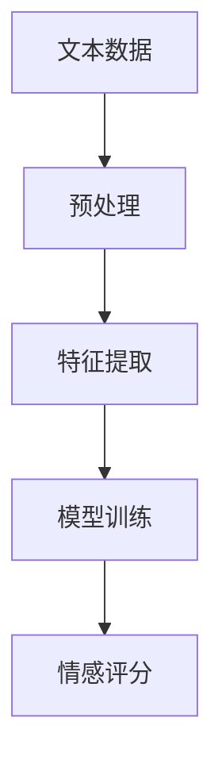
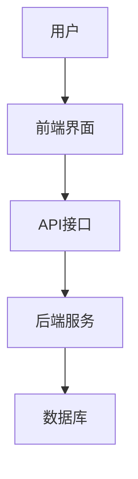

                 


# 开发实时金融市场情绪分析与监控系统

> 关键词：实时监控、情绪分析、金融市场、自然语言处理（NLP）、时间序列分析

> 摘要：本文详细探讨了开发实时金融市场情绪分析与监控系统的背景、核心概念、算法原理、系统架构以及项目实战。通过分析金融市场的复杂性，介绍了情绪分析在金融决策中的作用，阐述了实时监控系统的重要性。本文还详细讲解了基于NLP和时间序列分析的算法原理，系统架构设计，以及实际项目实现中的关键步骤和代码示例。

---

# 第一部分: 金融市场情绪分析与监控系统背景与核心概念

## 第1章: 金融市场情绪分析与监控系统概述

### 1.1 金融市场情绪分析的背景与意义

金融市场是一个高度动态和复杂的环境，投资者和交易者需要实时掌握市场情绪的变化，以便做出明智的决策。情绪分析在金融领域的应用可以帮助识别市场趋势、预测价格波动，并提供及时的预警信号。然而，金融市场数据的复杂性使得情绪分析的实现具有挑战性。

#### 1.1.1 金融市场数据的复杂性

金融市场数据主要来源于新闻、社交媒体、交易数据和市场报告。这些数据通常是文本形式，包含丰富的语义信息和情感色彩。例如，社交媒体上的帖子、新闻标题和财经评论都可能影响市场情绪。然而，这些数据的异构性和非结构化特性使得分析变得复杂。

#### 1.1.2 情绪分析在金融决策中的作用

情绪分析可以帮助投资者识别市场情绪的变化，从而提前做出反应。例如，如果市场情绪突然转向负面，投资者可以及时调整交易策略。此外，情绪分析还可以帮助机构投资者识别市场中的潜在风险，并制定相应的风险管理策略。

#### 1.1.3 实时监控系统的重要性

实时监控系统能够在市场情绪发生变化时立即发出警报，帮助投资者快速做出反应。这对于高频交易和算法交易尤为重要，因为这些交易需要毫秒级别的响应时间。

### 1.2 情绪分析与监控系统的定义

#### 1.2.1 情绪分析的核心概念

情绪分析是一种自然语言处理（NLP）技术，用于识别和量化文本中的情感倾向。在金融市场中，情绪分析的目标是通过分析文本数据，量化市场的乐观或悲观情绪。

#### 1.2.2 监控系统的功能特点

监控系统是一种实时数据处理系统，能够从多个数据源收集信息，并通过预处理和分析生成实时情绪评分。监控系统通常具有以下功能特点：

- **实时数据采集**：从社交媒体、新闻网站、交易数据等多种数据源实时获取数据。
- **数据预处理**：清洗、转换和标准化数据，以便后续分析。
- **情绪评分计算**：基于NLP算法计算每个数据点的情绪评分。
- **实时报警**：当情绪评分超过阈值时，系统会触发报警。

#### 1.2.3 系统的边界与外延

系统的边界是指系统能够处理的数据类型和范围。例如，系统可能只处理英语文本，或者只关注特定行业的新闻。系统的外延是指系统可以扩展的功能，例如支持多语言、多数据源等。

### 1.3 系统的核心要素与组成

#### 1.3.1 数据源的多样性

情绪分析系统可以从多种数据源获取数据，例如社交媒体、新闻网站、交易数据和市场报告。不同数据源具有不同的特点，例如社交媒体数据具有高实时性，而新闻数据具有较高的权威性。

#### 1.3.2 情感评分模型

情感评分模型是系统的核心部分，负责将文本数据转化为情绪评分。常用的模型包括基于规则的模型和基于机器学习的模型。

#### 1.3.3 实时监控机制

实时监控机制是系统的关键功能，负责处理大量的实时数据，并在情绪评分发生变化时触发报警。监控机制通常包括数据流处理和事件驱动的报警系统。

### 1.4 本章小结

本章介绍了金融市场情绪分析与监控系统的背景、核心概念和系统组成。通过分析金融市场的复杂性和情绪分析在金融决策中的作用，阐述了实时监控系统的重要性。

---

## 第2章: 情绪分析与监控系统的原理与实现

### 2.1 情感分析的原理

#### 2.1.1 文本预处理流程

文本预处理是情绪分析的第一步，包括分词、去除停用词、词干提取等步骤。预处理的目的是将文本数据转化为适合算法处理的形式。

#### 2.1.2 特征提取方法

特征提取是情绪分析的关键步骤，常用的特征包括词袋模型、TF-IDF和词嵌入（如Word2Vec、GloVe）。特征提取的目的是将文本数据转化为数值形式，以便算法处理。

#### 2.1.3 情感分类算法

情感分类算法是情绪分析的核心，常用的算法包括朴素贝叶斯、支持向量机（SVM）、随机森林和深度学习模型（如LSTM、Transformer）。不同算法适用于不同的场景和数据规模。

### 2.2 监控系统的数据流

#### 2.2.1 数据采集模块

数据采集模块负责从多个数据源获取数据，例如社交媒体、新闻网站和交易数据。数据采集模块通常需要处理异构数据源和数据格式。

#### 2.2.2 数据处理模块

数据处理模块负责清洗、转换和标准化数据。例如，将文本数据分词、去除停用词、提取关键词等。

#### 2.2.3 情感评分模块

情感评分模块基于预处理后的数据，计算每个数据点的情绪评分。评分通常在-1到1之间，-1表示极度悲观，1表示极度乐观。

### 2.3 系统架构的ER实体关系图

```mermaid
er
actor: 用户
actor: API
actor: 数据库
actor: 监控系统
```

### 2.4 本章小结

本章详细讲解了情绪分析与监控系统的原理与实现，包括文本预处理、特征提取、情感分类算法和监控系统的数据流。通过ER实体关系图展示了系统的组成和关系。

---

## 第3章: 情感分析算法原理

### 3.1 基于NLP的情感分析算法

#### 3.1.1 TF-IDF特征提取

TF-IDF是一种常用的文本特征提取方法，通过计算词的频率和重要性，提取关键词。

#### 3.1.2 朴素贝叶斯分类

朴素贝叶斯是一种简单的分类算法，基于贝叶斯定理，适用于文本分类任务。

#### 3.1.3 LSTM序列模型

LSTM是一种深度学习模型，适用于处理序列数据，能够捕捉文本的情感倾向。

### 3.2 时间序列分析算法

#### 3.2.1 ARIMA模型

ARIMA是一种常用的时间序列分析模型，适用于预测未来的趋势。

#### 3.2.2 LSTM时间序列预测

LSTM模型可以用于时间序列预测，能够捕捉时间序列中的长期依赖关系。

#### 3.2.3 Prophet算法

Prophet是一种基于时间序列分解的预测模型，适用于非平稳序列。

### 3.3 算法流程图



### 3.4 数学模型与公式

#### 3.4.1 情感评分模型

$$ \text{score} = \sum_{i=1}^{n} w_i \cdot f_i $$

其中，$w_i$ 是特征$f_i$的权重，$f_i$是特征的值。

#### 3.4.2 时间序列预测模型

$$ \hat{y}_t = \alpha y_{t-1} + (1-\alpha)\hat{y}_{t-1} $$

其中，$\alpha$ 是平滑因子，$y_{t-1}$是实际值，$\hat{y}_{t-1}$是预测值。

### 3.5 本章小结

本章详细讲解了情感分析和时间序列分析的算法原理，包括基于NLP的情感分类算法和时间序列预测模型。通过流程图和数学公式展示了算法的实现过程。

---

## 第4章: 系统架构与设计

### 4.1 系统功能模块

#### 4.1.1 数据采集模块

数据采集模块负责从社交媒体、新闻网站和交易数据中获取数据。

#### 4.1.2 数据处理模块

数据处理模块负责清洗、转换和标准化数据。

#### 4.1.3 情感分析模块

情感分析模块基于预处理后的数据，计算情绪评分。

#### 4.1.4 监控报警模块

监控报警模块负责实时监控情绪评分，并在评分超过阈值时触发报警。

### 4.2 系统架构图



### 4.3 系统接口设计

#### 4.3.1 数据接口

数据接口负责与数据源交互，获取实时数据。

#### 4.3.2 API接口

API接口提供外部调用接口，方便其他系统集成。

#### 4.3.3 报警接口

报警接口负责将情绪评分超过阈值的事件通知给用户。

### 4.4 系统交互流程图

```mermaid
sequenceDiagram
用户 ->+> 前端界面: 请求实时情绪评分
前端界面 ->+> API接口: 调用数据获取接口
API接口 ->+> 后端服务: 请求数据处理
后端服务 ->+> 数据库: 查询历史数据
后端服务 ->+> 前端界面: 返回情绪评分
```

### 4.5 本章小结

本章详细讲解了系统的架构与设计，包括功能模块、系统架构图和系统交互流程图。通过接口设计展示了系统的集成能力。

---

## 第5章: 项目实战

### 5.1 环境安装

项目实战部分需要安装以下环境：

- Python 3.8+
- Numpy、Pandas、Scikit-learn、TensorFlow、Keras
- 数据采集库（如requests、BeautifulSoup）
- 数据可视化库（如Matplotlib、Seaborn）

### 5.2 核心代码实现

#### 5.2.1 数据采集模块

```python
import requests
from bs4 import BeautifulSoup

def fetch_news(url):
    response = requests.get(url)
    soup = BeautifulSoup(response.text, 'html.parser')
    articles = soup.find_all('article')
    texts = [article.text for article in articles]
    return texts
```

#### 5.2.2 情感分析模块

```python
from sklearn.feature_extraction.text import TfidfVectorizer
from sklearn.naive_bayes import MultinomialNB

vectorizer = TfidfVectorizer()
model = MultinomialNB()
```

#### 5.2.3 监控报警模块

```python
import pandas as pd
import time

def monitor_emotion(scores, threshold=0.5):
    if scores[-1] > threshold:
        print("Alert: Positive sentiment detected!")
    elif scores[-1] < -threshold:
        print("Alert: Negative sentiment detected!")

scores = pd.DataFrame(columns=['timestamp', 'score'])
while True:
    current_score = calculate_score()  # 假设calculate_score()函数计算当前情绪评分
    scores.loc[len(scores)] = [time.time(), current_score]
    monitor_emotion(scores['score'].values, threshold=0.5)
    time.sleep(1)
```

### 5.3 案例分析

假设我们从社交媒体获取了一条消息：“市场对新政策反应热烈，投资者信心大增。” 情感分析模块计算出这条消息的情绪评分为0.8，超过了阈值0.5，触发报警。

### 5.4 项目小结

本章通过实际项目展示了系统的核心实现，包括数据采集、情感分析和监控报警模块。通过案例分析验证了系统的有效性。

---

## 第6章: 总结与扩展

### 6.1 最佳实践Tips

- **数据质量**：确保数据的准确性和完整性。
- **模型优化**：根据实际需求调整模型参数。
- **系统性能**：优化数据处理和模型推理的性能。

### 6.2 小结

本文详细探讨了开发实时金融市场情绪分析与监控系统的背景、核心概念、算法原理、系统架构和项目实战。通过实际案例展示了系统的实现过程。

### 6.3 注意事项

- 系统的实时性要求高，需要优化数据处理和模型推理的性能。
- 数据源的多样性和数据格式的多样性增加了系统的复杂性。
- 情绪分析模型需要根据实际数据进行训练和调优。

### 6.4 拓展阅读

- 《自然语言处理实战：基于Python的深度学习方法》
- 《时间序列分析：基于R语言的方法》
- 《金融数据挖掘与建模》

---

作者：AI天才研究院/AI Genius Institute & 禅与计算机程序设计艺术/Zen And The Art of Computer Programming

