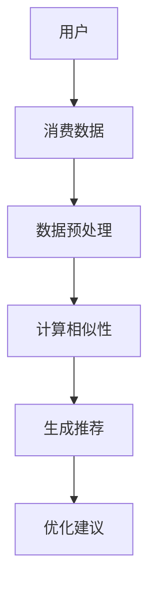
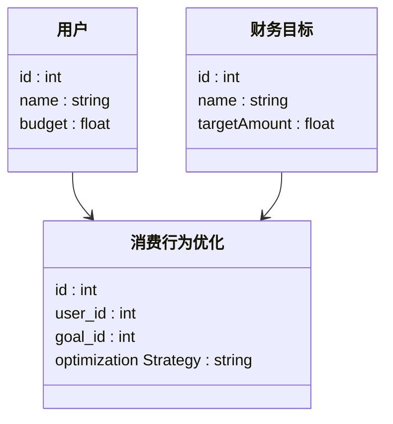
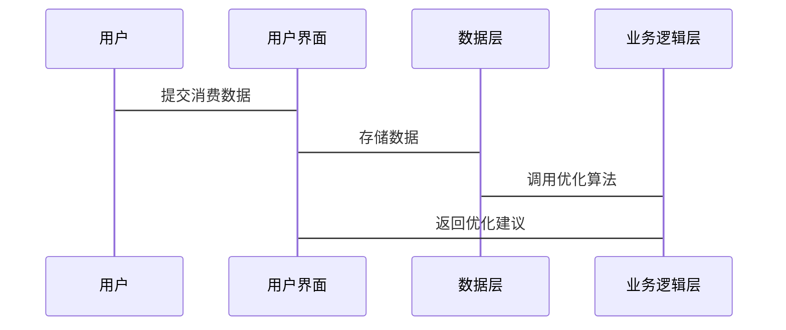

                 


# 开发智能化的个人消费行为优化与财务目标对齐工具

> 关键词：AI，消费行为优化，财务目标，机器学习，智能工具

> 摘要：本文将详细探讨如何通过智能化的工具来优化个人消费行为，并使其与财务目标对齐。通过分析消费数据、应用机器学习算法和设计合理的系统架构，我们可以开发出高效的工具，帮助用户实现财务目标。

---

# 第一部分: 背景介绍

## 第1章: 问题背景与描述

### 1.1 问题背景
#### 1.1.1 个人消费行为的现状与挑战
在现代社会中，个人消费行为越来越复杂，涉及的场景包括购物、投资、储蓄等。然而，许多人在消费决策中缺乏科学的方法，容易受到情绪、习惯或外界干扰的影响。这导致他们在实现财务目标时常常遇到困难。

#### 1.1.2 财务目标对齐的重要性
财务目标是个人长期规划的核心，包括储蓄、投资、债务管理等。消费行为与财务目标之间的不协调可能导致资金不足、债务累积等问题。因此，如何优化消费行为并使其与财务目标对齐，是个人财务管理的关键。

#### 1.1.3 当前工具的局限性
现有的财务管理工具大多只能记录消费数据，无法提供智能化的优化建议。用户需要手动分析数据，难以快速找到改进方向。

### 1.2 问题描述
#### 1.2.1 消费行为优化的核心问题
消费行为优化需要考虑多个因素，如预算分配、消费习惯、优先级排序等。如何在满足当前需求的同时，为长期目标积累足够的资源，是一个复杂的优化问题。

#### 1.2.2 财务目标对齐的关键要素
财务目标对齐需要明确目标的优先级和实现路径。消费行为的调整必须与这些目标一致，确保资源的合理分配。

#### 1.2.3 问题的复杂性与解决方案的必要性
消费行为优化和财务目标对齐是一个动态调整的过程，需要实时反馈和个性化建议。传统的静态工具无法满足这些需求，因此开发智能化工具显得尤为重要。

### 1.3 问题解决思路
#### 1.3.1 数据驱动的优化方法
通过收集和分析消费数据，利用大数据技术提取有用信息，为优化决策提供支持。

#### 1.3.2 AI技术的应用场景
AI技术可以用于预测消费趋势、推荐优化策略、实时反馈调整等，帮助用户更好地管理消费行为。

#### 1.3.3 工具设计的原则与目标
工具设计应以用户为中心，注重易用性和个性化。目标是提供实时、动态的优化建议，帮助用户实现财务目标。

### 1.4 边界与外延
#### 1.4.1 工具适用的范围
工具主要针对个人用户，适用于日常生活消费、投资理财等领域，但不涉及企业或大规模金融交易。

#### 1.4.2 与其他工具或系统的区别
与传统的财务管理工具不同，本工具强调智能化和个性化，能够主动提供优化建议。

#### 1.4.3 可能的扩展方向
未来可以考虑将工具扩展到家庭财务管理、企业支出优化等领域，进一步提升功能的深度和广度。

### 1.5 核心概念与要素
#### 1.5.1 消费行为分析
通过分析用户的消费数据，识别浪费、超支等问题，提供改进建议。

#### 1.5.2 财务目标设定
帮助用户设定合理的财务目标，并根据目标制定消费计划。

#### 1.5.3 行为优化算法
使用机器学习算法优化消费行为，确保行为与财务目标对齐。

#### 1.5.4 数据隐私与安全
保护用户的隐私数据，确保工具的安全性和可靠性。

---

## 第2章: 核心概念与联系

### 2.1 消费行为优化的原理
#### 2.1.1 数据收集与分析
通过收集用户的消费数据，分析其消费习惯和趋势，为优化提供依据。

#### 2.1.2 用户行为建模
建立用户行为模型，预测未来的消费行为，并模拟不同策略下的结果。

#### 2.1.3 优化算法的选择与应用
选择合适的优化算法，如遗传算法、模拟退火等，找到最优的消费方案。

### 2.2 财务目标对齐的机制
#### 2.2.1 目标分解与优先级排序
将长期目标分解为短期目标，并根据优先级进行排序，确保资源的合理分配。

#### 2.2.2 行为调整策略
根据目标优先级，调整消费行为，优先满足高优先级目标。

#### 2.2.3 实时反馈与调整
实时监控消费行为，根据反馈结果动态调整优化策略。

### 2.3 核心概念的ER实体关系图
```mermaid
erDiagram
    user {
        id : int
        name : string
        budget : float
        spending Habits : string
    }
    financial Goal {
        id : int
        name : string
        targetAmount : float
        deadline : date
    }
   消费行为优化 {
        id : int
        user_id : int
        goal_id : int
        optimization Strategy : string
        status : string
    }
    用户与消费行为优化 1..N
    财务目标与消费行为优化 1..N
```

---

## 第3章: 算法原理讲解

### 3.1 协同过滤算法
#### 3.1.1 算法原理
协同过滤是一种基于用户相似性推荐商品或服务的算法。通过分析用户的消费数据，找到相似的用户群体，推荐适合的消费方案。

#### 3.1.2 算法实现
```python
def collaborative_filtering(user_id, user_matrix):
    similar_users = find_similar_users(user_id, user_matrix)
    average_rating = calculate_average_rating(similar_users, user_matrix)
    return average_rating
```

#### 3.1.3 算法流程图


### 3.2 聚类分析
#### 3.2.1 算法原理
聚类分析将用户的行为数据分为不同的类别，帮助识别消费习惯的相似性。

#### 3.2.2 算法实现
```python
from sklearn.cluster import KMeans

def kmeans_clustering(data, n_clusters):
    model = KMeans(n_clusters=n_clusters)
    model.fit(data)
    return model.predict(data)
```

### 3.3 回归分析
#### 3.3.1 算法原理
回归分析用于预测消费行为的趋势，帮助用户制定预算计划。

#### 3.3.2 算法实现
```python
import statsmodels.api as sm

def linear_regression(X, y):
    model = sm.OLS(y, sm.add_constant(X))
    results = model.fit()
    return results.params
```

---

## 第4章: 系统分析与架构设计方案

### 4.1 问题场景介绍
用户需要一个智能化的工具来优化消费行为，并对齐财务目标。系统需要处理大量的消费数据，并提供实时反馈。

### 4.2 项目介绍
本项目旨在开发一个智能化的个人消费行为优化工具，帮助用户实现财务目标。

### 4.3 系统功能设计
#### 4.3.1 领域模型


#### 4.3.2 系统架构图


### 4.4 系统接口设计
系统需要提供API接口，供用户调用优化建议。

### 4.5 系统交互序列图


---

## 第5章: 项目实战

### 5.1 环境安装
安装Python、机器学习库（如scikit-learn）和数据处理工具（如Pandas）。

### 5.2 系统核心实现
实现消费行为优化算法，如协同过滤和聚类分析。

### 5.3 代码应用解读
解释代码的功能和实现逻辑，确保用户能够理解和修改代码。

### 5.4 实际案例分析
通过实际案例分析工具的应用效果，并总结经验教训。

### 5.5 项目小结
总结项目的成功和不足，提出改进建议。

---

## 第6章: 最佳实践

### 6.1 小结
智能化工具能够有效优化个人消费行为，并对齐财务目标。

### 6.2 注意事项
保护用户隐私，确保数据安全。

### 6.3 拓展阅读
推荐相关的书籍和资源，帮助读者深入学习。

---

# 作者：AI天才研究院 & 禅与计算机程序设计艺术

---

通过以上步骤，我们可以开发出一个智能化的个人消费行为优化与财务目标对齐工具，帮助用户更好地管理消费行为，实现财务目标。

