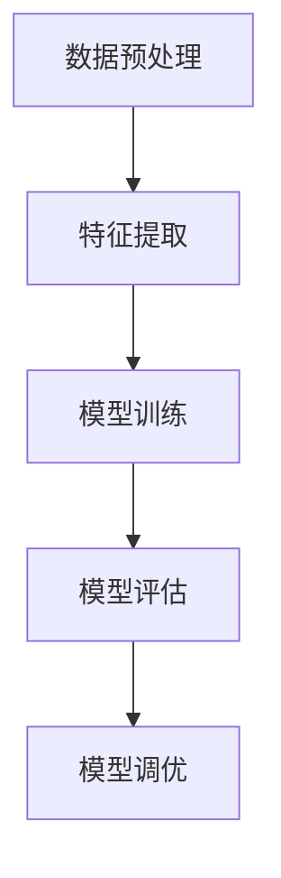
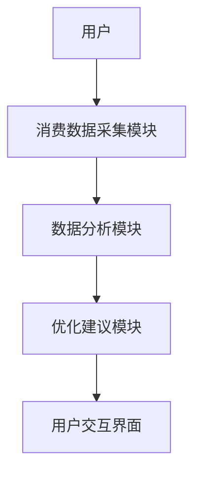

                 


# 开发智能化的个人消费行为优化建议工具

> 关键词：个人消费行为优化，人工智能，机器学习，消费数据分析，智能化工具开发

> 摘要：本文详细探讨了开发智能化的个人消费行为优化建议工具的背景、核心概念、算法原理、系统设计及项目实现。通过分析消费行为优化的必要性，结合数学模型和机器学习算法，提出了一套完整的工具开发方案，旨在帮助个人用户实现更高效的消费管理。

---

# 第一部分：背景介绍

## 第1章：个人消费行为优化的背景与问题背景

### 1.1 问题背景

#### 1.1.1 当前个人消费行为的特点
在现代社会，个人消费行为呈现出多样化和复杂化的趋势。随着经济的发展和科技的进步，人们的消费方式也在不断演变，从传统的实体消费到线上购物，从单一的购买行为到注重体验的消费模式，个人消费行为的复杂性显著增加。

#### 1.1.2 消费行为优化的必要性
随着生活水平的提高，个人消费行为的优化变得越来越重要。通过优化消费行为，个人可以更好地管理自己的财务状况，提高生活质量。例如，避免冲动消费、合理分配消费预算、优化消费结构等。

#### 1.1.3 传统消费行为优化的局限性
传统的消费行为优化方法主要依赖于个人的自我约束和简单的记账工具。这些方法存在以下问题：
- 数据收集和分析效率低。
- 优化建议缺乏个性化。
- 方法缺乏科学性和系统性。

### 1.2 问题描述

#### 1.2.1 个人消费行为中的主要问题
- 消费预算失控。
- 消费结构不合理。
- 缺乏长期规划。

#### 1.2.2 消费数据获取与分析的难点
- 数据分散：消费数据可能分布在不同的平台和工具中，难以统一收集。
- 数据量大：随着消费行为的多样化，数据量迅速增加，人工分析效率低下。
- 数据复杂性：消费数据中包含大量非结构化数据，如文本、图片等，增加了分析的难度。

#### 1.2.3 消费行为优化的目标与边界
消费行为优化的目标是帮助个人在满足基本需求的前提下，最大化消费效用，同时实现财务健康。其边界包括：
- 仅关注个人消费行为，不涉及投资和理财。
- 优化建议基于历史消费数据和当前行为分析。
- 不考虑社会和经济环境的剧烈变化。

---

## 第2章：智能化消费行为优化工具的核心概念

### 2.1 核心概念的定义与属性

#### 2.1.1 智能化消费行为优化工具的定义
智能化消费行为优化工具是一种基于人工智能和大数据分析技术，帮助个人用户优化消费行为的智能化系统。它通过分析用户的消费数据，提供个性化的消费建议和优化方案。

#### 2.1.2 核心概念的属性对比

| 核心概念 | 属性 | 描述 |
|----------|------|------|
| 消费数据 | 数据来源 | 包括银行流水、信用卡记录、购物平台数据等 |
| 数据分析 | 方法 | 基于机器学习的分析方法，如线性回归、聚类分析等 |
| 优化建议 | 类型 | 包括预算调整、消费结构优化、消费习惯改善等 |
| 用户交互 | 方式 | 图形化界面、语音交互、自动化建议等 |

#### 2.1.3 核心概念的ER实体关系图

```mermaid
erd
    节点 用户消费行为优化工具
    节点 消费数据
    节点 数据分析模块
    节点 优化建议模块
    节点 用户交互界面

    消费数据 --> 数据分析模块
    数据分析模块 --> 优化建议模块
    优化建议模块 --> 用户交互界面
```

---

## 第3章：消费行为优化的算法原理

### 3.1 算法原理概述

#### 3.1.1 线性回归模型在消费预测中的应用
线性回归是一种简单而有效的预测模型，可以用于消费预测。例如，通过历史消费数据，预测未来的消费趋势。

$$ y = \beta_0 + \beta_1x + \epsilon $$

其中：
- $y$ 是消费金额。
- $x$ 是时间变量。
- $\beta_0$ 和 $\beta_1$ 是回归系数。
- $\epsilon$ 是误差项。

#### 3.1.2 机器学习算法在消费行为分析中的应用
机器学习算法（如随机森林、支持向量机）可以用于消费行为的分类和聚类分析，帮助识别用户的消费模式。

#### 3.1.3 基于规则的消费优化策略
基于规则的策略通过预定义的规则（如“每月娱乐消费不超过总收入的20%”）提供优化建议。

### 3.2 算法实现流程



---

## 第4章：消费行为优化的数学模型与公式

### 4.1 线性回归模型

#### 4.1.1 线性回归的基本公式
$$ y = \beta_0 + \beta_1x + \epsilon $$

其中：
- $y$ 是消费金额。
- $x$ 是时间变量。
- $\beta_0$ 和 $\beta_1$ 是回归系数。
- $\epsilon$ 是误差项。

#### 4.1.2 最小二乘法的数学

最小二乘法用于估计回归系数，公式如下：
$$ \hat{\beta_1} = \frac{\sum (x_i - \bar{x})(y_i - \bar{y})}{\sum (x_i - \bar{x})^2} $$

其中：
- $\bar{x}$ 和 $\bar{y}$ 是 $x$ 和 $y$ 的平均值。

---

## 第5章：系统分析与架构设计

### 5.1 问题场景介绍

#### 5.1.1 系统功能设计
系统功能包括：
- 数据采集与处理。
- 消费行为分析。
- 优化建议生成。
- 用户交互与反馈。

#### 5.1.2 系统架构设计



---

## 第6章：项目实战

### 6.1 环境安装

#### 6.1.1 安装Python和相关库
- Python：3.8+
- 库：pandas、numpy、scikit-learn

### 6.2 核心实现

#### 6.2.1 数据预处理代码

```python
import pandas as pd
import numpy as np

# 加载数据
data = pd.read_csv('消费数据.csv')

# 数据清洗
data.dropna(inplace=True)
data['消费日期'] = pd.to_datetime(data['消费日期'])
data.set_index('消费日期', inplace=True)
```

#### 6.2.2 模型训练代码

```python
from sklearn.linear_model import LinearRegression

# 特征矩阵
X = data[['收入', '支出']]

# 标签向量
y = data['消费金额']

# 训练模型
model = LinearRegression()
model.fit(X, y)
```

### 6.3 案例分析

#### 6.3.1 消费结构优化案例

假设某用户的月收入为10,000元，消费数据如下：

| 月份 | 支出项目 | 支出金额 |
|------|----------|----------|
| 1    | 餐饮     | 2,000    |
| 2    | 交通     | 1,500    |
| 3    | 娱乐     | 1,000    |

优化建议：将娱乐支出减少到总收入的10%，即1,000元。

---

## 第7章：总结与展望

### 7.1 最佳实践 tips

- 数据的准确性和完整性是优化的基础。
- 模型的可解释性是优化建议的重要因素。
- 用户的反馈是优化工具改进的重要依据。

### 7.2 小结

本文详细介绍了开发智能化个人消费行为优化建议工具的背景、核心概念、算法原理、系统设计和项目实现。通过结合数学模型和机器学习算法，提出了一套完整的工具开发方案。

### 7.3 注意事项

- 数据隐私保护是开发过程中需要重点关注的问题。
- 模型的泛化能力需要通过不断优化和测试来提升。

### 7.4 拓展阅读

- 《机器学习实战》
- 《数据挖掘导论》
- 《个人财务管理入门》

---

# 作者：AI天才研究院/AI Genius Institute & 禅与计算机程序设计艺术/Zen And The Art of Computer Programming

