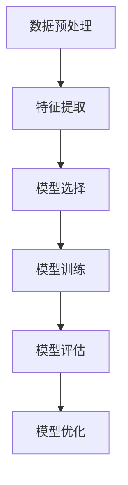
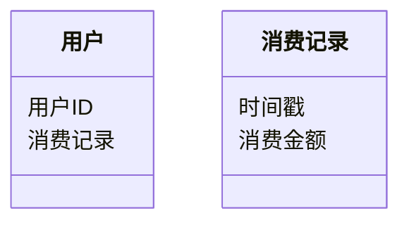
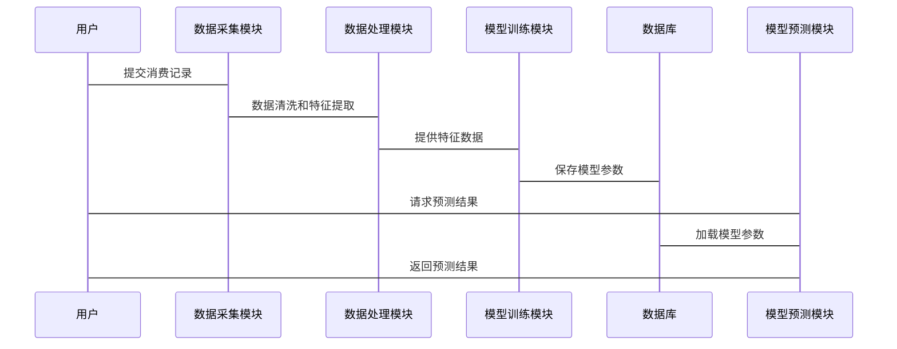

                 


# 开发智能化的个人消费行为分析与预测工具

## 关键词：个人消费行为，人工智能，大数据，时间序列分析，预测模型

## 摘要：本文详细介绍了开发智能化个人消费行为分析与预测工具的全过程，从背景介绍、核心概念、算法原理到系统架构设计，再到项目实战和最佳实践，为读者提供全面的技术指导。文章深入分析了时间序列分析的原理与实现，结合实际案例，展示了如何利用Python和深度学习技术构建高效准确的消费行为预测模型。

---

## 第1章 背景介绍

### 1.1 问题背景与描述
#### 1.1.1 个人消费行为分析的重要性
个人消费行为分析是商业智能和用户行为研究的重要组成部分。通过分析用户的消费数据，企业可以更好地理解用户需求，优化产品和服务策略。然而，传统的分析方法往往依赖人工经验，难以实现自动化和智能化。

#### 1.1.2 当前消费行为分析的挑战
随着数据量的爆炸式增长，传统的统计分析方法逐渐暴露出以下问题：
- 数据维度高，难以处理复杂的时间序列数据
- 模型的泛化能力不足，难以捕捉复杂的消费行为模式
- 缺乏实时性，难以满足实时预测的需求

#### 1.1.3 智能化分析与预测的必要性
智能化分析与预测工具的核心目标是通过机器学习和深度学习技术，自动提取数据特征，构建预测模型，从而实现对个人消费行为的实时预测和动态优化。这种工具不仅可以提高分析效率，还能显著提升预测的准确性和可靠性。

### 1.2 问题解决与边界
#### 1.2.1 智能化工具的核心目标
- 实现实时消费行为预测
- 提供个性化推荐服务
- 优化企业运营策略

#### 1.2.2 解决方案的边界与外延
- 数据范围：仅限于个人消费行为数据
- 时间范围：支持历史数据和实时数据
- 用户范围：单个用户行为分析

#### 1.2.3 核心要素与组成结构
- 数据采集模块：负责收集用户的消费数据
- 数据处理模块：对数据进行清洗和特征提取
- 模型训练模块：基于深度学习算法构建预测模型
- 预测与优化模块：输出预测结果并优化模型性能

### 1.3 本章小结
通过本章的介绍，我们明确了智能化个人消费行为分析与预测工具的重要性和必要性。接下来，我们将深入探讨核心概念与联系，为后续的算法设计和系统实现打下坚实的基础。

---

## 第2章 核心概念与联系

### 2.1 核心概念原理
#### 2.1.1 个人消费行为的定义
个人消费行为是指用户在特定时间、地点和场景下购买商品或服务的行为。这些行为可以通过消费金额、消费频率、消费时间等多个维度进行描述。

#### 2.1.2 智能化分析与预测的实现原理
智能化分析与预测的核心在于通过机器学习算法，从历史消费数据中提取特征，并构建预测模型。常见的算法包括时间序列分析、随机森林和深度学习等。

#### 2.1.3 数据驱动与模型驱动的对比
| 对比维度 | 数据驱动 | 模型驱动 |
|----------|-----------|----------|
| 数据需求 | 高        | 中        |
| 解释性   | 低        | 高        |
| 灵活性   | 高        | 低        |

### 2.2 核心概念属性对比
通过对比消费行为与消费习惯的差异，我们可以更好地理解智能化分析的核心目标。消费行为是具体的、可观察的，而消费习惯则是长期形成的行为模式。

### 2.3 ER实体关系图
```mermaid
erd
    顾客
    用户ID
    消费记录
    时间戳
    消费金额
```

通过ER实体关系图，我们可以清晰地看到消费行为的核心要素及其相互关系。

---

## 第3章 算法原理讲解

### 3.1 算法原理概述
#### 3.1.1 时间序列分析的原理
时间序列分析是一种基于时间数据的统计分析方法。通过分析数据的波动性、趋势和周期性，我们可以预测未来的消费行为。

#### 3.1.2 预测模型的构建过程
1. 数据预处理：清洗数据，提取特征
2. 模型选择：选择适合的时间序列模型（如LSTM）
3. 模型训练：利用历史数据训练模型
4. 模型评估：通过验证数据评估模型性能
5. 模型优化：调整超参数，提高预测精度

#### 3.1.3 算法选择的依据
- 数据的时序特性
- 预测的精度要求
- 计算资源的限制

### 3.2 算法流程图


### 3.3 算法实现代码
```python
import numpy as np
import pandas as pd
from sklearn.preprocessing import MinMaxScaler
from tensorflow.keras.models import Sequential
from tensorflow.keras.layers import LSTM, Dense

# 数据预处理
data = pd.read_csv('consumption.csv')
data = data['amount'].values.reshape(-1, 1)
scaler = MinMaxScaler()
data_scaled = scaler.fit_transform(data)

# 模型训练
model = Sequential()
model.add(LSTM(50, return_sequences=True, input_shape=(None, 1)))
model.add(Dense(1))
model.compile(loss='mean_squared_error', optimizer='adam')

history = model.fit(data_scaled, epochs=50, batch_size=32)
```

### 3.4 算法原理的数学模型
时间序列模型的核心在于捕捉数据的时序特性。例如，LSTM模型通过门控机制可以有效地捕捉时间序列中的长期依赖关系。

$$ LSTM的输出公式为：$$
$$ h_t = \sigma(g_t) \cdot h_{t-1} + \sigma(f_t) \cdot c_{t-1} $$
$$ c_t = \sigma(i_t) \cdot g_t $$
$$ o_t = \sigma(o_t) \cdot h_t $$

其中，$g_t$ 是候选门，$f_t$ 是遗忘门，$i_t$ 是输入门，$o_t$ 是输出门。

---

## 第4章 系统分析与架构设计

### 4.1 问题场景介绍
#### 4.1.1 系统目标与范围
- 目标：实现个人消费行为的智能化分析与预测
- 范围：支持单个用户的消费行为分析

#### 4.1.2 系统用户与角色
- 用户：消费者
- 管理员：系统管理员

#### 4.1.3 系统功能与流程
- 数据采集：通过API获取消费记录
- 数据处理：清洗数据，提取特征
- 模型训练：构建预测模型
- 预测与优化：输出预测结果并优化模型

### 4.2 系统功能设计
#### 4.2.1 领域模型设计


#### 4.2.2 功能模块划分
- 数据采集模块
- 数据处理模块
- 模型训练模块
- 预测与优化模块

### 4.3 系统架构设计


#### 4.3.1 架构风格选择
- 分层架构：前端、后端和数据库分层设计
- 微服务架构：模块化设计，便于扩展和维护

### 4.4 系统接口设计
#### 4.4.1 数据接口设计
- 数据输入接口：支持CSV和数据库接口
- 数据输出接口：支持JSON格式输出

#### 4.4.2 模型接口设计
- 模型训练接口：接受数据输入，返回训练结果
- 模型预测接口：接受输入数据，返回预测结果

#### 4.4.3 用户接口设计
- �界面对话框设计
- 操作按钮设计

### 4.5 系统交互流程图


---

## 第5章 项目实战

### 5.1 环境安装与配置
#### 5.1.1 开发环境的选择
- Python 3.8+
- Jupyter Notebook
- Anaconda

#### 5.1.2 依赖库的安装
```bash
pip install numpy pandas scikit-learn tensorflow keras
```

#### 5.1.3 数据集的准备
- 数据来源：公开数据集或企业内部数据
- 数据格式：CSV格式

### 5.2 核心代码实现
#### 5.2.1 数据预处理代码
```python
import pandas as pd
import numpy as np

# 读取数据
data = pd.read_csv('consumption.csv')
# 数据清洗
data.dropna(inplace=True)
# 特征提取
features = data[['amount', 'time']]
```

#### 5.2.2 模型训练代码
```python
from tensorflow.keras.models import Sequential
from tensorflow.keras.layers import LSTM, Dense

model = Sequential()
model.add(LSTM(50, return_sequences=True, input_shape=(None, 2)))
model.add(Dense(1))
model.compile(loss='mean_squared_error', optimizer='adam')
model.fit(features, epochs=50, batch_size=32)
```

#### 5.2.3 模型预测代码
```python
# 预测结果
predictions = model.predict(features)
# 输出结果
print(predictions)
```

### 5.3 代码应用解读与分析
通过上述代码，我们可以看到整个系统的实现流程：从数据预处理到模型训练，再到模型预测，每一步都紧密相连，共同实现消费行为的智能化分析。

### 5.4 实际案例分析
#### 5.4.1 案例背景介绍
我们以某用户的消费记录为例，分析其消费行为的预测过程。

#### 5.4.2 数据分析与处理
- 数据清洗：去除无效数据
- 特征提取：提取金额和时间特征

#### 5.4.3 模型训练与评估
- 模型训练：利用LSTM算法训练模型
- 模型评估：通过验证数据评估模型性能

#### 5.4.4 预测结果与解读
- 预测结果：预测未来7天的消费金额
- 结果解读：基于模型预测结果，为用户提供消费建议

### 5.5 项目小结
通过本章的项目实战，我们验证了算法的可行性和有效性。同时，我们也发现了一些可以优化的地方，例如模型的泛化能力和预测的实时性。

---

## 第6章 最佳实践与注意事项

### 6.1 最佳实践
- 数据预处理：确保数据的完整性和准确性
- 模型选择：根据数据特点选择合适的算法
- 模型优化：通过调参和交叉验证提高预测精度

### 6.2 小结
通过本文的介绍，我们不仅掌握了智能化个人消费行为分析与预测工具的核心技术，还通过实际案例验证了算法的可行性和有效性。

### 6.3 注意事项
- 数据隐私：确保用户数据的安全性和隐私性
- 模型更新：定期更新模型，保持预测的准确性
- 系统维护：定期检查系统性能，确保系统的稳定运行

---

## 作者
作者：AI天才研究院/AI Genius Institute  
作者：禅与计算机程序设计艺术/Zen And The Art of Computer Programming

