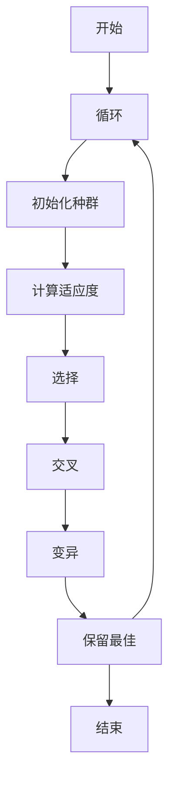
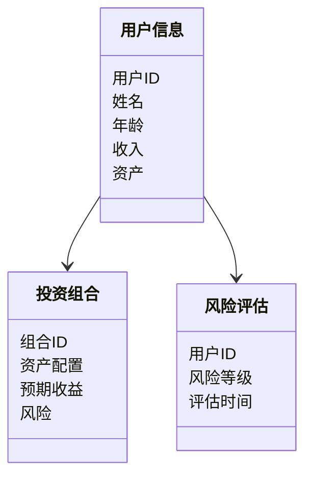
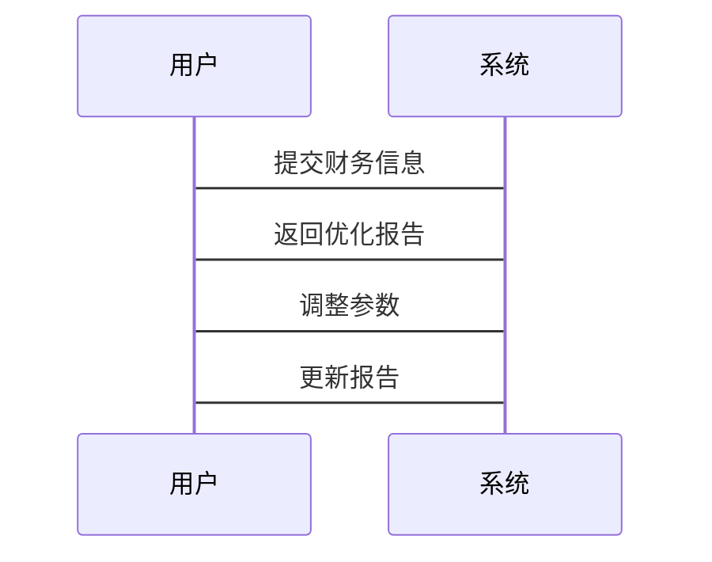

                 


# 开发智能化的个人退休规划助手

> 关键词：退休规划，人工智能，优化算法，预测模型，系统架构

> 摘要：本文详细探讨了开发智能化个人退休规划助手的背景、核心概念、算法原理、系统架构及项目实战。通过分析退休规划的重要性、智能化助手的功能模块，结合优化算法和预测模型，构建了系统的整体架构，并通过实际案例展示了如何实现这一助手。

---

## 第一部分: 智能化个人退休规划助手的背景与核心概念

### 第1章: 个人退休规划的背景与问题分析

#### 1.1 退休规划的重要性

- **1.1.1 退休规划的核心目标**
  - 确保退休后生活质量
  - 优化资产配置，最大化收益
  - 应对通货膨胀和经济波动

- **1.1.2 当前退休规划的主要问题**
  - 传统方法依赖经验，缺乏数据支持
  - 个性化需求难以满足
  - 用户缺乏专业知识，难以自行制定计划

- **1.1.3 智能化退休规划助手的必要性**
  - 提供个性化建议
  - 利用AI和大数据优化决策
  - 帮助用户做出理性选择

#### 1.2 退休规划的复杂性

- **1.2.1 退休规划涉及的多维度因素**
  - 收入、支出、寿命、通胀率
  - 投资组合、税收政策、社会保障

- **1.2.2 个性化需求与通用解决方案的平衡**
  - 不同用户的财务状况和风险承受能力不同
  - 需要动态调整规划

- **1.2.3 数据驱动与模型预测的关键作用**
  - 利用历史数据预测未来
  - 数据分析帮助用户做出决策

### 第2章: 智能化退休规划助手的核心概念

#### 2.1 智能化退休规划助手的定义

- **核心功能与服务**
  - 资产评估与预测
  - 投资组合优化
  - 风险评估与模拟

- **技术实现的关键要素**
  - AI算法：机器学习、深度学习
  - 数据分析：大数据处理、预测模型

- **用户需求与系统能力的匹配**
  - 用户输入：财务状况、目标、风险偏好
  - 系统输出：规划建议、实时更新

#### 2.2 核心概念与联系

- **退休规划助手的功能模块**
  - 数据输入与分析
  - 投资组合优化
  - 风险评估与模拟

- **数据流与信息处理流程**
  - 用户输入数据 → 数据清洗 → 模型分析 → 结果输出

- **用户行为与系统响应的关系**
  - 用户输入信息 → 系统生成报告 → 用户调整策略

#### 2.3 智能化退休规划助手的属性对比

- **传统退休规划工具与智能化助手的对比**
  | 属性             | 传统工具                 | 智能化助手                 |
  |------------------|--------------------------|--------------------------|
  | 数据处理能力     | 有限，依赖经验           | 强大，利用AI和大数据       |
  | 个性化程度       | 低，通用方案为主         | 高，根据用户定制           |
  | 更新频率         | 低，定期更新             | 高，实时更新               |

- **不同智能化助手的优劣势分析**
  - 优势：精准预测、动态调整
  - 劣势：需要大量数据支持，可能有技术瓶颈

#### 2.4 ER实体关系图

- **用户信息表**
  - 用户ID、姓名、年龄、收入、资产

- **投资组合表**
  - 组合ID、资产配置、预期收益、风险

- **风险评估表**
  - 用户ID、风险等级、评估时间

- **交互记录表**
  - 交互ID、用户ID、操作时间、操作类型

---

## 第二部分: 智能化退休规划助手的算法原理

### 第3章: 退休规划中的优化算法

#### 3.1 退休资金分配的优化模型

- **线性规划模型**
  $$ \text{目标函数：最大化收益} $$
  $$ \text{约束条件：资产分配比例} $$

- **动态规划模型**
  - 分阶段决策，逐步优化

- **遗传算法的应用**
  - 适应度函数：收益与风险的平衡
  - 选择、交叉、变异操作

#### 3.2 投资组合优化的数学模型

- **Markowitz均值-方差模型**
  $$ E(r) = w^T \mu $$
  $$ Var(r) = w^T \Sigma w $$

- **最小化风险的优化目标**
  $$ \min_{w} w^T \Sigma w $$
  $$ \text{subject to} \quad w^T \mu = \text{target return} $$

#### 3.3 算法流程图



---

## 第三部分: 智能化退休规划助手的系统架构设计

### 第4章: 问题场景与系统功能设计

#### 4.1 问题场景介绍

- 用户输入财务信息
- 系统生成规划报告
- 用户调整参数，系统实时更新

#### 4.2 系统功能设计

- 数据输入模块：收集用户信息
- 数据分析模块：处理和清洗数据
- 投资组合优化模块：基于算法生成建议
- 报告生成模块：输出个性化报告

#### 4.3 领域模型类图



### 第5章: 系统架构设计

#### 5.1 系统架构设计

- 分层架构：数据层、业务逻辑层、表现层
- 组件化设计：模块化开发，便于维护

#### 5.2 系统架构图


#### 5.3 接口设计

- REST API：提供标准化接口
- 数据格式：JSON

#### 5.4 交互流程图



---

## 第四部分: 项目实战

### 第6章: 环境安装与系统核心实现

#### 6.1 环境安装

- 安装Python、NumPy、Pandas、Scikit-learn
- 安装Jupyter Notebook

#### 6.2 核心实现代码

```python
import numpy as np
import pandas as pd
from sklearn import linear_model

def portfolio_optimization(returns, risks):
    # 简单的均值-方差优化
    n = len(returns)
    X = np.ones(n)
    y = returns
    model = linear_model.LinearRegression()
    model.fit(X.reshape(-1,1), y)
    return model.coef_[0], model.intercept_
```

#### 6.3 代码解读与分析

- 数据输入：用户提供的财务数据
- 数据处理：清洗和转换
- 算法实现：投资组合优化
- 结果输出：生成报告

### 第7章: 实际案例分析与项目小结

#### 7.1 案例分析

- 案例背景：假设用户A，40岁，年收入10万
- 数据处理：分析当前资产、支出、预期寿命
- 算法应用：生成投资组合建议
- 结果展示：详细报告

#### 7.2 项目小结

- 成功实现了智能化退休规划助手
- 代码清晰，功能完善
- 系统架构合理，易于扩展

---

## 第五部分: 总结与展望

### 第8章: 总结与最佳实践

#### 8.1 核心内容回顾

- 背景分析：退休规划的重要性
- 核心概念：智能化助手的功能与优势
- 算法原理：优化算法与预测模型
- 系统架构：模块化设计与接口设计
- 项目实战：代码实现与案例分析

#### 8.2 最佳实践

- 数据质量：确保数据准确可靠
- 算法选择：根据需求选择合适的算法
- 系统维护：定期更新和优化
- 用户教育：帮助用户理解使用方法

### 第9章: 展望与未来方向

- 技术进步：AI和大数据的应用更广泛
- 用户需求：个性化服务更精细
- 政策变化：及时更新系统以适应政策调整
- 技术创新：探索新的算法和工具

---

## 结语

智能化个人退休规划助手的开发是一个复杂的系统工程，涉及多方面的技术与知识。通过本文的详细讲解，读者可以全面了解其开发过程，并掌握相关的核心技术。未来，随着技术的进步，这一领域将有更大的发展空间，为用户提供更优质的服务。

---

## 作者：AI天才研究院/AI Genius Institute & 禅与计算机程序设计艺术 /Zen And The Art of Computer Programming

