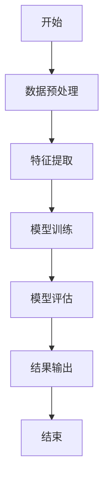
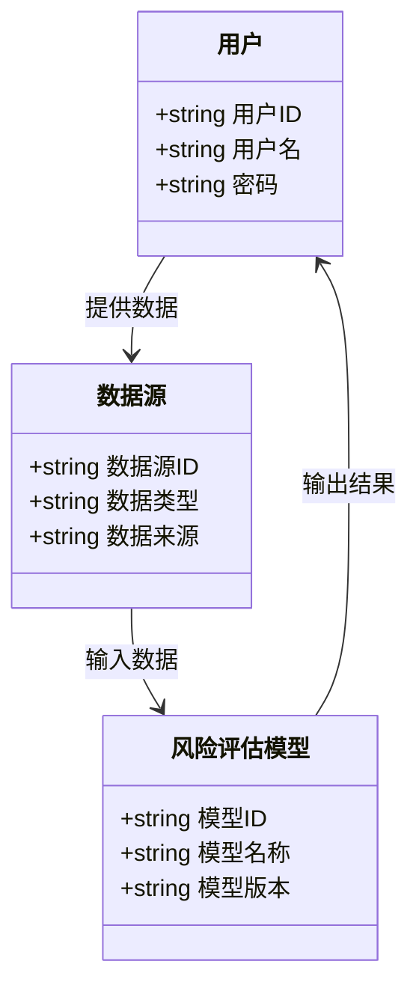
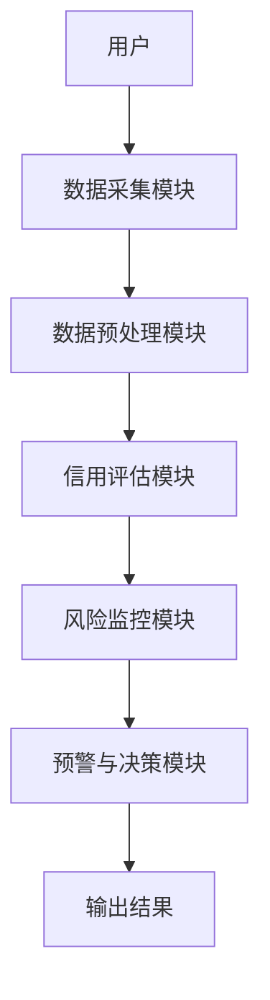
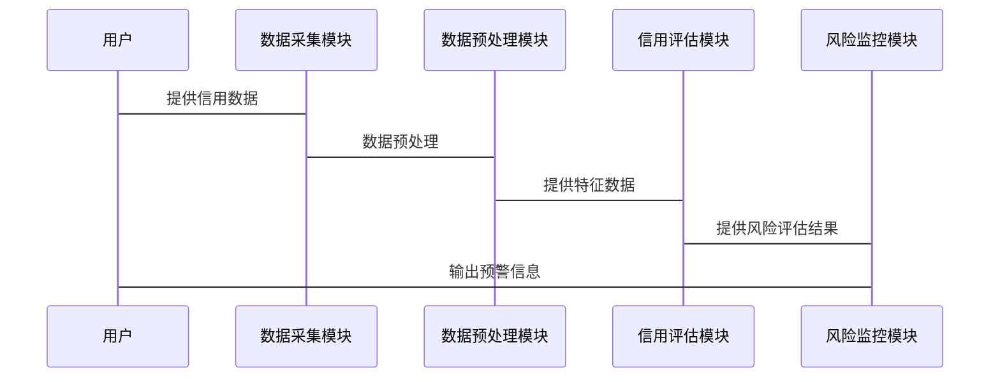

                 

<think>
好的，现在我需要完成用户的需求：撰写一篇关于《开发智能化的企业信用风险敞口管理系统》的技术博客文章，按照用户提供的目录大纲结构进行。首先，我需要仔细理解用户的需求，并按照用户的要求，确保每个部分都详细且符合逻辑。

### 关键词
企业信用风险，智能化管理，机器学习，信用评估，系统架构，风险管理

### 摘要
在当今的商业环境中，信用风险敞口管理是企业风险管理的重要组成部分。随着数据科学和人工智能技术的快速发展，智能化的企业信用风险敞口管理系统能够帮助企业更准确地评估和管理信用风险。本文将详细探讨该系统的开发背景、核心概念、算法原理、系统架构设计以及实际应用案例，为读者提供全面的指导。

---

# 开发智能化的企业信用风险敞口管理系统

> 关键词：企业信用风险，智能化管理，机器学习，信用评估，系统架构，风险管理

> 摘要：本文探讨了智能化企业信用风险敞口管理系统的开发背景、核心概念、算法原理、系统架构设计及实际应用案例，为企业风险管理提供全面指导。

---

## 第一部分: 企业信用风险敞口管理系统的背景与概念

### 第1章: 信用风险敞口管理概述

#### 1.1 信用风险敞口管理的背景
企业信用风险敞口管理是企业在经营过程中对客户或供应商的信用风险进行评估、监控和管理的重要环节。随着全球经济的快速发展和市场竞争的加剧，企业面临的信用风险日益复杂。传统的信用风险管理方法依赖于人工审核和经验判断，效率低下且容易受到主观因素的影响。而智能化的信用风险敞口管理系统通过引入大数据分析和人工智能技术，能够显著提高风险管理的效率和准确性。

#### 1.2 信用风险敞口管理的重要性
信用风险敞口管理是企业财务管理和风险管理的核心内容之一。通过科学的信用评估和风险监控，企业可以有效降低因客户或供应商信用问题带来的损失，优化资产负债表，提升整体财务健康状况。特别是在全球化和数字化的今天，企业需要更加敏捷和精准的信用风险管理工具，以应对复杂的市场环境。

#### 1.3 智能化管理的必要性与优势
传统的信用风险管理方法存在效率低、成本高、覆盖面窄等问题。智能化信用风险敞口管理系统通过自动化数据收集、分析和决策，能够实时监控信用风险，快速响应市场变化，帮助企业做出更明智的信用决策。此外，智能化系统还能够处理海量数据，挖掘数据中的潜在风险，提供更全面的信用评估。

---

### 第2章: 信用风险敞口管理的核心概念

#### 2.1 信用风险敞口的定义与计算
信用风险敞口是指企业在交易中可能面临的信用损失。计算信用风险敞口的核心在于准确评估客户的信用状况，包括客户的还款能力、还款意愿和财务健康状况。智能化系统可以通过机器学习算法，结合客户的财务数据、行业数据和市场数据，进行多维度的信用评估。

#### 2.2 智能化管理的关键要素
智能化信用风险敞口管理系统的关键要素包括：
1. **数据源**：收集客户的基本信息、财务数据、交易记录等。
2. **特征工程**：对数据进行清洗、转换和特征提取，为模型提供高质量的输入。
3. **模型选择**：选择合适的机器学习模型，如逻辑回归、决策树、随机森林等，进行信用评估。
4. **风险监控**：实时监控信用风险敞口的变化，及时发出预警信号。

#### 2.3 系统架构与功能模块
智能化信用风险敞口管理系统的架构通常包括以下几个功能模块：
1. **数据采集模块**：负责收集和整理信用相关数据。
2. **数据预处理模块**：对数据进行清洗和特征提取。
3. **信用评估模块**：基于机器学习模型进行信用评分。
4. **风险监控模块**：实时监控信用风险敞口的变化。
5. **预警与决策模块**：根据风险评估结果，提供预警和决策支持。

---

## 第二部分: 信用风险敞口管理的核心概念与联系

### 第3章: 信用风险评估模型

#### 3.1 常见信用风险评估模型对比
以下是几种常见的信用风险评估模型及其优缺点对比：

| 模型名称       | 优点                               | 缺点                               |
|----------------|------------------------------------|------------------------------------|
| 线性回归       | 简单易懂，适合线性关系             | 非线性关系表现较差                 |
| 决策树         | 高准确性，适合复杂数据             | � prone to overfitting               |
| 随机森林       | 高准确性，抗过拟合能力强             | 计算复杂，适合大数据               |
| 支持向量机（SVM）| 高准确性，适合小样本数据           | 不适合高维数据                     |

#### 3.2 线性回归模型与决策树模型的优缺点
- **线性回归模型**：适用于信用风险评估中存在明显的线性关系的情况。优点是简单易懂，缺点是无法捕捉复杂的数据关系。
- **决策树模型**：适用于数据特征较多且复杂的场景。优点是易于解释，缺点是容易过拟合。

#### 3.3 基于机器学习的信用风险预测
基于机器学习的信用风险预测模型可以通过训练数据，自动学习客户的信用特征，并预测客户的信用风险。以下是一个简单的逻辑回归模型示例：

$$\text{logit}(p) = \beta_0 + \beta_1x_1 + \beta_2x_2 + ... + \beta_nx_n$$

其中，$p$ 是客户违约的概率，$x_i$ 是客户的相关特征，$\beta_i$ 是模型的系数。

---

## 第三部分: 算法原理与数学模型

### 第4章: 信用风险评估算法原理

#### 4.1 信用风险评估的数学模型
信用风险评估模型可以通过多种数学方法实现，以下是几种常见的模型及其公式：

1. **线性回归模型**：
$$y = \beta_0 + \beta_1x_1 + \beta_2x_2 + ... + \beta_nx_n + \epsilon$$
其中，$y$ 是目标变量（如违约概率），$x_i$ 是特征变量，$\beta_i$ 是系数，$\epsilon$ 是误差项。

2. **逻辑回归模型**：
$$p = \frac{1}{1 + e^{-(\beta_0 + \beta_1x_1 + \beta_2x_2 + ... + \beta_nx_n)}}$$

3. **支持向量机（SVM）模型**：
$$\text{max} \quad \frac{1}{2}\|w\|^2$$
$$\text{subject to} \quad y_i(w \cdot x_i + b) \geq 1, \forall i$$

#### 4.2 算法实现与流程
以下是一个基于逻辑回归模型的信用风险评估算法的流程图：



以下是一个简单的Python代码示例：

```python
import pandas as pd
from sklearn.linear_model import LogisticRegression
from sklearn.metrics import accuracy_score

# 数据预处理
data = pd.read_csv('credit_data.csv')
X = data[['income', 'debt', 'age']]
y = data['default']

# 模型训练
model = LogisticRegression()
model.fit(X, y)

# 模型评估
predictions = model.predict(X)
print("准确率:", accuracy_score(y, predictions))
```

---

## 第四部分: 系统分析与架构设计

### 第5章: 系统架构设计

#### 5.1 问题场景介绍
企业信用风险敞口管理系统需要解决的主要问题包括：
1. 如何高效地收集和处理信用相关数据。
2. 如何选择合适的机器学习模型进行信用评估。
3. 如何实时监控信用风险敞口的变化并提供预警。

#### 5.2 项目介绍
本项目旨在开发一个智能化的企业信用风险敞口管理系统，通过大数据分析和机器学习技术，帮助企业更准确地评估和管理信用风险。

#### 5.3 系统功能设计
以下是系统的功能模块划分：



#### 5.4 系统架构设计
以下是系统的架构图：



#### 5.5 系统接口设计
以下是系统的接口设计：



---

## 第五部分: 项目实战

### 第6章: 项目实战

#### 6.1 环境安装
开发智能化信用风险敞口管理系统需要以下环境：
1. Python 3.8+
2. Jupyter Notebook
3. 数据库（如MySQL）
4. 机器学习库（如Scikit-learn、XGBoost）

#### 6.2 系统核心实现源代码
以下是一个简单的信用风险评估模型的Python代码示例：

```python
import pandas as pd
from sklearn.ensemble import RandomForestClassifier
from sklearn.metrics import accuracy_score

# 数据预处理
data = pd.read_csv('credit_data.csv')
X = data.drop('default', axis=1)
y = data['default']

# 模型训练
model = RandomForestClassifier()
model.fit(X, y)

# 模型评估
predictions = model.predict(X)
print("准确率:", accuracy_score(y, predictions))
```

#### 6.3 代码应用解读与分析
以上代码展示了如何使用随机森林模型进行信用风险评估。数据预处理阶段包括数据清洗和特征提取，模型训练阶段使用随机森林算法，模型评估阶段计算准确率。

#### 6.4 实际案例分析
以下是一个实际案例的分析：

假设我们有一个客户数据集，包含客户的收入、债务、年龄等信息，我们需要评估客户的违约概率。

1. 数据预处理：
   - 去除缺失值
   - 标准化数据
2. 特征提取：
   - 收入、债务、年龄
3. 模型训练：
   - 使用随机森林模型进行训练
4. 模型评估：
   - 计算准确率、召回率、F1分数等指标
5. 风险监控：
   - 实时监控客户的信用风险变化

#### 6.5 项目小结
通过以上步骤，我们可以开发一个智能化的企业信用风险敞口管理系统，实现信用风险的自动化评估和监控。

---

## 第六部分: 最佳实践与小结

### 第7章: 最佳实践

#### 7.1 小结
智能化的企业信用风险敞口管理系统通过大数据分析和机器学习技术，能够显著提高信用风险管理的效率和准确性。本文详细探讨了系统的开发背景、核心概念、算法原理、系统架构设计以及实际应用案例。

#### 7.2 注意事项
在开发信用风险敞口管理系统时，需要注意以下几点：
1. 数据的准确性和完整性
2. 模型的可解释性和鲁棒性
3. 系统的实时性和可扩展性

#### 7.3 拓展阅读
1. 《机器学习实战》
2. 《信用评分模型开发与应用》
3. 《大数据风险管理》

---

## 作者

作者：AI天才研究院/AI Genius Institute & 禅与计算机程序设计艺术 /Zen And The Art of Computer Programming

---

希望以上内容能满足您的需求。如果需要进一步调整或补充，请随时告诉我。

