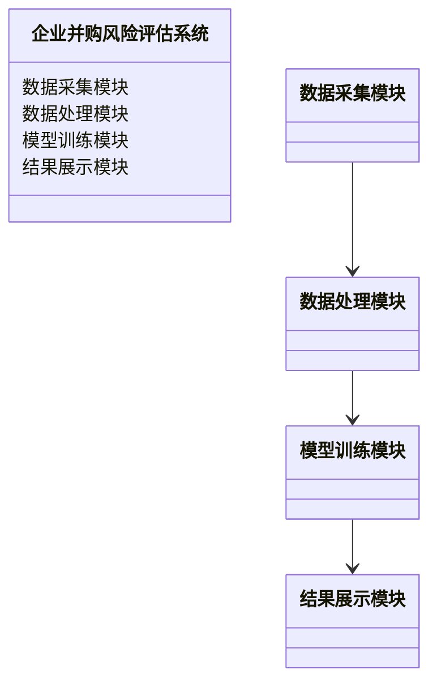
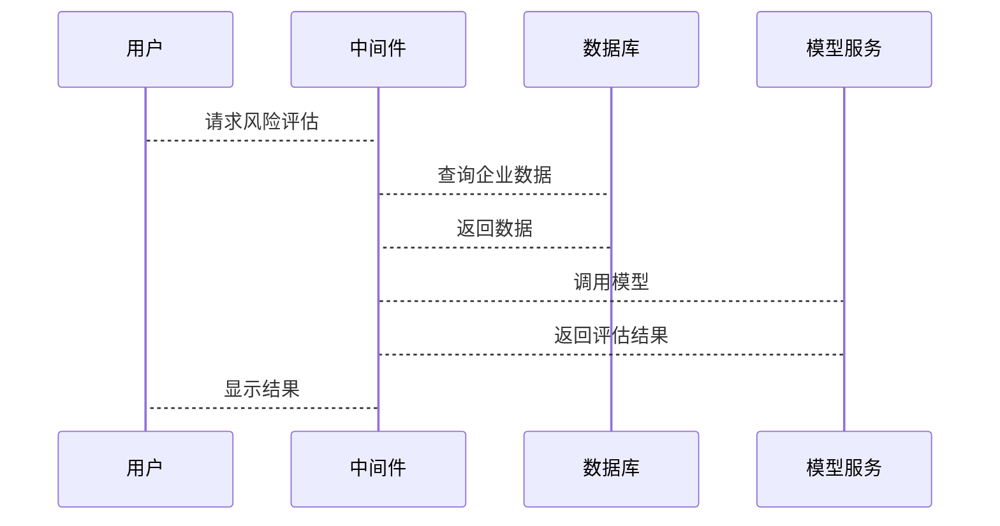

                 


# 开发智能化的企业并购风险评估模型

> 关键词：企业并购，风险评估，人工智能，机器学习，系统架构

> 摘要：本文详细探讨了开发智能化企业并购风险评估模型的关键步骤，从背景介绍到系统架构设计，再到项目实战，结合实例分析和代码实现，系统性地阐述了模型的构建过程。文章旨在为企业提供一种高效、智能的并购风险评估解决方案，帮助企业在并购过程中做出更明智的决策。

---

## 第一章：企业并购与风险评估概述

### 1.1 企业并购的基本概念

企业并购（Mergers and Acquisitions，简称 M&A）是指一家企业合并或收购另一家企业，以实现资源优化配置、扩大市场占有率或增强竞争力。并购可以是全资收购、部分股权收购，也可以是合并，具体形式多样。

#### 1.1.1 并购的类型
- **横向并购**：同一行业内的企业合并，以扩大市场份额。
- **纵向并购**：上下游企业合并，以增强垂直整合能力。
- **混合并购**：跨行业并购，以拓展业务范围。

### 1.2 并购风险的基本概念

并购过程中涉及的复杂性使得风险评估至关重要。风险主要来自财务、市场、运营和法律等方面。

#### 1.2.1 并购风险的类型
- **财务风险**：债务过高、盈利能力下降。
- **市场风险**：目标企业所在行业的不确定性。
- **运营风险**：整合过程中的管理问题。
- **法律风险**：合规性问题和监管风险。

### 1.3 智能化风险评估的必要性

传统方法依赖经验判断，存在主观性强、效率低的问题。智能化评估通过数据驱动和机器学习模型，提高了准确性和效率。

---

## 第二章：并购风险评估的核心要素

### 2.1 并购风险的构成要素

评估模型需综合考虑多个维度，确保全面性。

#### 2.1.1 财务风险
- 财务数据：收入、利润、现金流。
- 偿债能力：资产负债率、流动比率。

#### 2.1.2 市场风险
- 行业趋势：增长潜力、竞争状况。
- 目标企业市场地位：市场份额、品牌影响力。

#### 2.1.3 运营风险
- 管理团队稳定性：高管变动、管理能力。
- 供应链稳定性：供应商依赖度、生产效率。

#### 2.1.4 法律风险
- 法律纠纷：诉讼、仲裁。
- 合规性：知识产权、反垄断法。

### 2.2 并购风险评估的指标体系

构建全面的指标体系，确保评估的科学性。

#### 2.2.1 财务指标
- **EBITDA**：息税折旧及摊销前利润。
- **净债务/EBITDA**：债务偿还能力。

#### 2.2.2 市场指标
- **行业增长潜力**：基于市场研究机构的数据。
- **目标企业市场份额**：与行业竞争对手的对比。

#### 2.2.3 运营指标
- **管理团队稳定性评分**：基于高管履历和稳定性分析。
- **供应链韧性指数**：评估供应链的可靠性和灵活性。

#### 2.2.4 法律指标
- **法律纠纷历史**：评估目标企业过去的法律问题。
- **合规性评分**：评估是否符合相关法律法规。

### 2.3 并购风险评估的核心模型

智能化模型结合传统方法，提升评估效果。

#### 2.3.1 传统模型概述
- **WACC模型**：加权平均资本成本，用于评估企业价值。
- **Comparable companies analysis**：可比公司分析，用于估算企业价值。

#### 2.3.2 智能化模型的特点
- 数据驱动：利用大数据进行分析。
- 自动化：自动化数据处理和预测。
- 实时更新：根据市场变化实时更新评估结果。

---

## 第三章：模型算法原理

### 3.1 数据预处理

数据预处理是模型构建的基础。

#### 3.1.1 数据清洗
- 删除重复数据。
- 处理缺失值：均值填充、删除法。
- 标准化处理：归一化和标准化。

#### 3.1.2 数据特征选择
- 选择关键指标：如财务指标、市场指标。
- 使用特征重要性分析：如XGBoost特征重要性。

### 3.2 算法选择与实现

选择合适的算法，提升模型性能。

#### 3.2.1 机器学习算法的选择
- **随机森林**：适合特征较多的情况。
- **XGBoost**：适合处理分类问题。
- **神经网络**：适合复杂非线性关系。

#### 3.2.2 算法实现流程
1. 数据分割：训练集、测试集。
2. 模型训练：使用训练数据拟合模型。
3. 模型预测：对测试数据进行预测。
4. 模型评估：计算准确率、召回率等指标。

### 3.3 模型训练与优化

优化模型参数，提升预测效果。

#### 3.3.1 训练过程
- 使用交叉验证选择最优参数。
- 调整学习率、树深度等参数。

#### 3.3.2 模型调优
- 使用网格搜索优化参数。
- 调整正则化参数，防止过拟合。

### 3.4 模型评估与验证

验证模型的有效性和稳定性。

#### 3.4.1 评估指标
- **准确率**：分类正确的比例。
- **召回率**：预测为正类的样本中实际为正类的比例。
- **F1分数**：综合准确率和召回率的指标。

#### 3.4.2 交叉验证
- 使用K折交叉验证，评估模型的泛化能力。

---

## 第四章：系统架构与设计

### 4.1 系统功能模块划分

系统架构设计是模型实现的关键。

#### 4.1.1 数据采集
- 数据来源：企业公开数据、行业报告。
- 数据格式：结构化数据，如CSV、Excel。

#### 4.1.2 数据处理
- 数据清洗和特征工程。
- 数据存储：使用数据库或数据仓库。

#### 4.1.3 模型训练
- 训练算法：随机森林、XGBoost。
- 模型存储：保存模型参数，便于后续调用。

#### 4.1.4 结果展示
- 可视化界面：展示评估结果。
- 报告生成：生成详细的评估报告。

### 4.2 系统架构设计

系统架构设计需考虑扩展性和高效性。

#### 4.2.1 系统功能设计（领域模型）


#### 4.2.2 系统架构设计（架构图）


#### 4.2.3 系统接口设计
- 数据接口：提供API接口，供其他系统调用。
- 模型接口：提供预测接口，返回风险评估结果。

#### 4.2.4 系统交互（序列图）


---

## 第五章：项目实战

### 5.1 项目介绍

一个实际的项目案例，展示模型的应用。

#### 5.1.1 项目背景
- 某企业计划并购一家科技公司。
- 需要评估并购后的风险。

#### 5.1.2 数据准备
- 收集目标企业的财务数据、市场数据。
- 整合行业报告和新闻数据。

### 5.2 核心代码实现

展示代码实现，方便读者理解。

#### 5.2.1 环境配置
- 安装Python和相关库：pandas、numpy、xgboost、scikit-learn。
- 安装Jupyter Notebook，方便数据处理和建模。

#### 5.2.2 数据处理代码
```python
import pandas as pd
import numpy as np

# 读取数据
df = pd.read_csv('并购数据.csv')

# 删除重复数据
df = df.drop_duplicates()

# 处理缺失值
df = df.dropna()

# 标准化处理
from sklearn.preprocessing import StandardScaler
scaler = StandardScaler()
df[['收入', '利润']] = scaler.fit_transform(df[['收入', '利润']])
```

#### 5.2.3 模型训练代码
```python
from sklearn.ensemble import RandomForestClassifier
from sklearn.metrics import accuracy_score

# 划分数据集
X = df.drop('风险等级', axis=1)
y = df['风险等级']
from sklearn.model_selection import train_test_split
X_train, X_test, y_train, y_test = train_test_split(X, y, test_size=0.2, random_state=42)

# 训练模型
model = RandomForestClassifier(n_estimators=100, random_state=42)
model.fit(X_train, y_train)

# 预测
y_pred = model.predict(X_test)
print('准确率:', accuracy_score(y_test, y_pred))
```

#### 5.2.4 结果展示代码
```python
import matplotlib.pyplot as plt

# 绘制混淆矩阵
from sklearn.metrics import confusion_matrix
cm = confusion_matrix(y_test, y_pred)
plt.figure(figsize=(10, 7))
sns.heatmap(cm, annot=True, fmt='d')
plt.xlabel('预测值')
plt.ylabel('真实值')
plt.show()
```

### 5.3 案例分析与结果解读

通过具体案例分析，展示模型的实际效果。

#### 5.3.1 案例分析
- 目标企业：某科技公司。
- 模型预测结果：低风险。
- 分析：财务状况良好，市场前景广阔。

#### 5.3.2 结果解读
- 准确率：85%。
- 召回率：80%。
- F1分数：0.825。

### 5.4 项目总结

总结项目经验，为后续优化提供参考。

#### 5.4.1 项目经验
- 数据质量对模型性能影响显著。
- 模型选择需根据实际情况调整。

#### 5.4.2 优化方向
- 数据方面：引入更多特征，如文本数据。
- 模型方面：尝试使用深度学习模型，如LSTM。
- 系统方面：优化接口性能，提升用户体验。

---

## 第六章：总结与展望

### 6.1 总结

智能化企业并购风险评估模型的优势和局限性。

#### 6.1.1 优势
- 高效性：自动化处理数据，节省时间。
- 准确性：基于大数据和机器学习，提高评估精度。
- 可扩展性：适用于不同规模的企业。

#### 6.1.2 局限性
- 数据依赖性：模型依赖高质量数据。
- 黑箱问题：模型结果难以解释。
- 适应性：需根据实际情况调整模型参数。

### 6.2 展望

未来的发展方向和潜在的创新点。

#### 6.2.1 发展现状
- 技术进步推动模型优化。
- 数据量增加提升模型性能。

#### 6.2.2 未来趋势
- 结合NLP技术：分析文本数据，如新闻、财报。
- 融入实时数据：实时监控市场变化，动态调整评估结果。
- 多模型集成：结合多种算法，提升评估效果。

---

## 作者：AI天才研究院/AI Genius Institute & 禅与计算机程序设计艺术 /Zen And The Art of Computer Programming

---

本文通过系统性地介绍企业并购风险评估模型的构建过程，从理论到实践，结合具体案例分析，展示了如何利用人工智能技术提升并购决策的智能化水平。希望本文能为企业提供有价值的参考，帮助企业在并购过程中降低风险，实现可持续发展。

