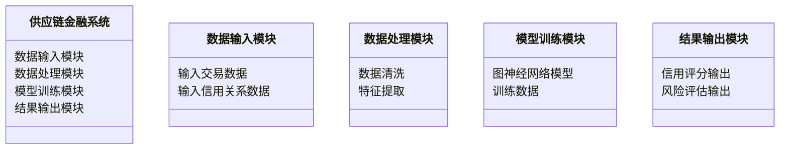

                 


# 开发智能化的供应链金融信用网络分析模型

## 关键词：供应链金融，信用网络，图神经网络，风险评估，智能化分析

## 摘要：供应链金融在现代商业中扮演着关键角色，而信用网络分析模型是其智能化的核心。本文详细探讨了供应链金融的背景与挑战，介绍了信用网络分析模型的基本概念与原理，并基于图神经网络提出了智能化分析算法。通过实际案例分析和系统架构设计，展示了模型的实现与应用，为供应链金融的智能化转型提供了理论支持与实践指导。

---

## 第1章: 供应链金融与信用网络分析模型的背景介绍

### 1.1 供应链金融的定义与现状

#### 1.1.1 供应链金融的核心概念
供应链金融是指通过整合供应链上下游企业，为核心企业及其供应商提供融资服务，优化资金流，降低运营成本。其核心在于通过企业间的信任和协作，实现资金的有效分配。

#### 1.1.2 供应链金融的现状与挑战
随着全球经济的快速发展，供应链金融在企业运营中占据重要地位。然而，传统供应链金融面临信息不对称、信用风险高等问题，亟需智能化解决方案。

#### 1.1.3 供应链金融的数字化转型趋势
数字化技术的应用（如大数据、人工智能）正在改变供应链金融的运作模式，智能化分析模型成为提升效率和降低风险的关键工具。

### 1.2 信用网络分析模型的定义与特点

#### 1.2.1 信用网络的基本概念
信用网络是指由企业之间的信用关系构成的网络，通过分析这些关系，可以评估企业的信用状况和风险。

#### 1.2.2 信用网络分析模型的核心特点
- 数据驱动：基于企业间的交易数据构建信用网络。
- 智能化：利用机器学习和图神经网络进行信用评估和风险预测。
- 实时性：能够实时更新信用评分和风险等级。

#### 1.2.3 信用网络与供应链金融的结合
信用网络分析模型能够帮助供应链金融参与者更好地评估信用风险，优化融资决策，提高整体供应链的稳定性。

---

## 第2章: 智能化供应链金融信用网络分析模型的核心概念与联系

### 2.1 核心概念原理

#### 2.1.1 供应链网络的构建原理
通过收集企业间的交易数据，构建供应链网络，并分析网络中的节点（企业）和边（信用关系）。

#### 2.1.2 信用评估的基本原理
基于供应链网络的拓扑结构和交易数据，利用图神经网络模型对节点的信用评分进行评估。

#### 2.1.3 智能化分析模型的算法原理
智能化分析模型通过图神经网络对信用网络进行建模，提取节点特征并预测信用风险。

### 2.2 核心概念属性特征对比表格

表2-1: 核心概念属性特征对比

| 特征 | 供应链网络 | 信用网络 |
|------|------------|----------|
| 数据源 | 企业间交易数据 | 企业间信用关系数据 |
| 分析目标 | 网络结构分析 | 信用评分评估 |
| 关键指标 | 节点度数、网络密度 | 信用评分、风险等级 |

### 2.3 ER实体关系图架构

```mermaid
er
    entity 供应链节点 {
        key 企业ID
        attribute 企业名称, 企业规模
    }
    entity 信用关系 {
        key 关系ID
        attribute 信用评分, 风险等级
        --> 供应链节点 企业A
        --> 供应链节点 企业B
    }
```

---

## 第3章: 基于图神经网络的信用网络分析算法

### 3.1 图神经网络的基本原理

#### 3.1.1 图神经网络的定义
图神经网络是一种适用于图数据的深度学习模型，能够有效捕捉节点间的复杂关系。

#### 3.1.2 图神经网络的核心算法
- **GAT（Graph Attention Networks）**：通过注意力机制捕捉节点间的相关性。
- **GCN（Graph Convolutional Networks）**：基于图卷积操作进行特征提取。

#### 3.1.3 图神经网络的应用场景
- 信用评分预测
- 风险评估
- 网络异常检测

### 3.2 信用网络分析的算法流程

#### 3.2.1 数据预处理
- 数据清洗：去除异常值和缺失数据。
- 特征提取：从企业交易数据中提取特征（如交易金额、交易频率）。

#### 3.2.2 图结构构建
- 构建企业间的信用关系图，节点为企业，边为企业间的信用关系。

#### 3.2.3 算法实现
- 使用GAT模型对图数据进行训练，提取节点特征并预测信用评分。

#### 3.2.4 结果分析
- 对模型预测结果进行评估，分析其准确性和鲁棒性。

### 3.3 算法实现的数学模型

#### 3.3.1 图神经网络的数学公式
$$
h_i^{(l+1)} = \sum_{j \in N(i)} \alpha_{i,j} h_j^{(l)}
$$
其中，$h_i$ 表示节点i在第l层的特征向量，$N(i)$ 表示节点i的邻居节点集合，$\alpha_{i,j}$ 表示注意力权重。

#### 3.3.2 信用评分的计算公式
$$
\text{信用评分} = \sum_{i=1}^{n} w_i x_i
$$
其中，$w_i$ 是特征权重，$x_i$ 是特征变量。

---

## 第4章: 系统架构设计

### 4.1 系统功能设计

#### 4.1.1 领域模型


### 4.2 系统架构设计

#### 4.2.1 系统架构图


### 4.3 接口设计与交互流程

#### 4.3.1 系统交互流程
1. 用户输入企业交易数据。
2. 数据处理模块清洗数据并提取特征。
3. 模型训练模块基于图神经网络模型训练模型。
4. 结果输出模块生成信用评分和风险评估结果。

#### 4.3.2 接口设计
- 数据输入接口：接收企业交易数据和信用关系数据。
- 数据处理接口：清洗数据并提取特征。
- 模型训练接口：训练图神经网络模型。
- 结果输出接口：输出信用评分和风险评估结果。

---

## 第5章: 项目实战

### 5.1 环境安装

```bash
pip install tensorflow
pip install keras
pip install networkx
pip install pymermaid
```

### 5.2 系统核心实现源代码

```python
import tensorflow as tf
from tensorflow.keras import layers
import networkx as nx

# 数据预处理
def preprocess_data(data):
    # 数据清洗
    data = data.dropna()
    # 特征提取
    features = data[['交易金额', '交易频率']]
    return features

# 图结构构建
def build_graph(data):
    G = nx.Graph()
    for index, row in data.iterrows():
        G.add_edge(row['企业A'], row['企业B'])
    return G

# 图神经网络模型
class GAT(tf.keras.Model):
    def __init__(self, input_dim, hidden_dim):
        super(GAT, self).__init__()
        self.gat_layer = layers.Dense(input_dim, activation='relu')
        self.dense_layer = layers.Dense(hidden_dim, activation='relu')

    def call(self, inputs, training=None):
        x = self.gat_layer(inputs)
        x = self.dense_layer(x)
        return x

# 模型训练
def train_model(G, features, labels):
    model = GAT(features.shape[1], 64)
    optimizer = tf.keras.optimizers.Adam(lr=0.001)
    model.compile(optimizer=optimizer, loss='binary_crossentropy', metrics=['accuracy'])
    model.fit(features, labels, epochs=100, batch_size=32)
    return model

# 模型预测
def predict(model, features):
    predictions = model.predict(features)
    return predictions
```

### 5.3 案例分析与解读

#### 5.3.1 数据分析
通过对某供应链企业的交易数据进行分析，构建信用关系图，并使用GAT模型进行训练，最终得到企业的信用评分和风险等级。

#### 5.3.2 模型优化
根据实际结果，调整模型参数和优化算法，提高预测准确率。

### 5.4 项目小结

通过实际案例的分析和模型的实现，验证了智能化供应链金融信用网络分析模型的有效性和实用性。

---

## 第6章: 最佳实践与小结

### 6.1 最佳实践 tips
- 数据质量是模型准确性的关键，需确保数据的完整性和准确性。
- 模型的可解释性是实际应用的重要因素，需注重模型的透明性和可解释性。
- 定期更新模型数据和参数，以适应市场变化和企业需求。

### 6.2 小结
本文详细探讨了智能化供应链金融信用网络分析模型的开发过程，从理论到实践，为供应链金融的智能化转型提供了可行的解决方案。

### 6.3 注意事项
- 数据隐私保护：在处理企业数据时，需遵守相关法律法规，保护数据隐私。
- 模型的实时性：在实际应用中，需确保模型能够实时更新和响应。

### 6.4 拓展阅读
- 《图神经网络：理论与应用》
- 《供应链金融：数字化转型的实践与创新》

---

## 作者：AI天才研究院/AI Genius Institute & 禅与计算机程序设计艺术 /Zen And The Art of Computer Programming

