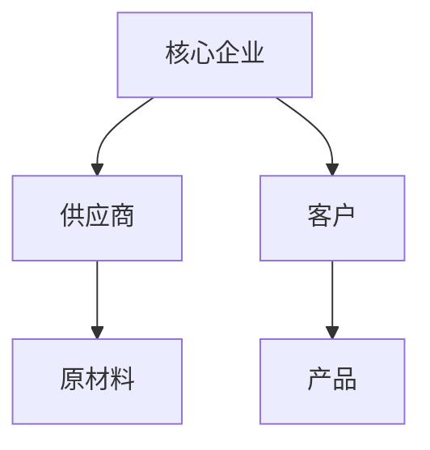
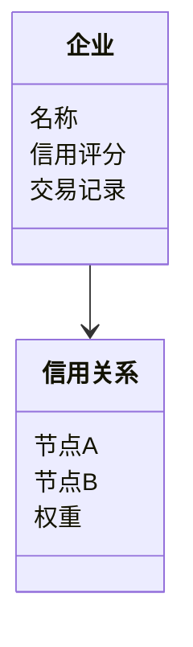
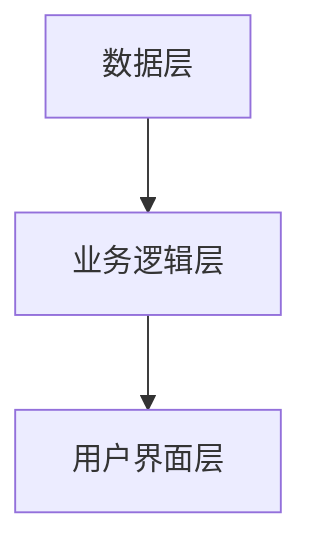
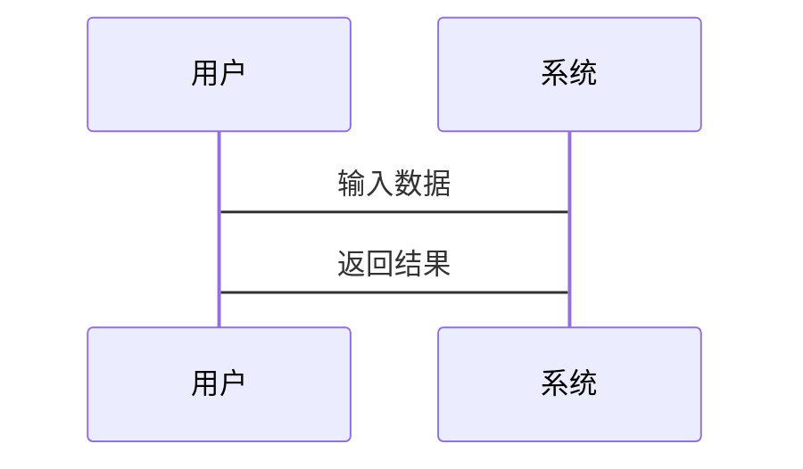

                 

# 开发智能化的供应链金融信用网络抗压能力分析模型

> 关键词：供应链金融，信用网络，抗压能力，人工智能，网络流，聚类分析

> 摘要：本文详细介绍了如何开发一个智能化的供应链金融信用网络抗压能力分析模型。通过分析供应链金融的核心概念、信用网络的结构与属性、抗压能力分析的数学模型、算法原理及系统架构设计，结合实际案例，展示了如何利用人工智能和图论方法构建和优化信用网络，以提高其抗压能力。文章还提供了详细的代码实现和系统架构设计，帮助读者理解并应用该模型。

---

## 第1章: 供应链金融与信用网络概述

### 1.1 供应链金融的背景与概念
#### 1.1.1 供应链金融的定义
供应链金融是指通过整合供应链上的资金流、物流和信息流，为企业提供融资支持的一种金融模式。它以供应链上的真实交易为背景，基于交易中产生的应收账款、存货和预付款等资产，为供应链中的企业提供资金支持。

#### 1.1.2 供应链金融的核心要素
供应链金融的核心要素包括：核心企业、供应商、客户、金融机构、物流企业和技术平台。这些要素通过信息流、资金流和物流的整合，形成一个闭环的金融生态系统。

#### 1.1.3 供应链金融的业务流程
供应链金融的业务流程通常包括：需求分析、信用评估、融资申请、资金发放和后续管理。通过这些流程，企业可以在供应链的不同环节获得所需的融资支持。

### 1.2 信用网络在供应链金融中的作用
#### 1.2.1 信用网络的基本概念
信用网络是指供应链中的各个参与方通过信用关系形成的网络结构。信用网络的节点代表供应链中的企业，边代表企业之间的信用关系。

#### 1.2.2 信用网络的构建原理
信用网络的构建基于供应链中的交易数据和信用评估结果。通过分析企业的信用状况、交易历史和财务数据，构建一个反映企业之间信用关系的网络模型。

#### 1.2.3 信用网络的抗压能力定义
信用网络的抗压能力是指网络在面对外部冲击（如市场波动、企业违约等）时，能够保持稳定并继续支持供应链运作的能力。

### 1.3 供应链金融信用网络抗压能力分析的背景
#### 1.3.1 当前供应链金融面临的挑战
当前供应链金融面临的主要挑战包括：中小企业融资难、供应链的复杂性增加、金融风险加剧等。

#### 1.3.2 抗压能力分析的必要性
抗压能力分析的必要性在于：通过评估信用网络的抗压能力，可以帮助企业提前识别和应对潜在的风险，确保供应链的稳定性。

#### 1.3.3 抗压能力分析的目标与意义
抗压能力分析的目标是通过优化信用网络的结构和信用关系，提高其抗压能力。其意义在于：降低供应链金融风险，提高供应链的整体效率和竞争力。

### 1.4 本章小结
#### 1.4.1 核心概念总结
供应链金融和信用网络是本文的核心概念。供应链金融通过整合供应链资源为企业提供融资支持，而信用网络则反映了供应链中企业的信用关系。

#### 1.4.2 下一章的预览
下一章将详细探讨供应链金融信用网络抗压能力分析的核心概念，包括信用网络的结构与属性、抗压能力分析的原理与方法等。

---

## 第2章: 供应链金融信用网络抗压能力分析的核心概念

### 2.1 供应链金融信用网络的结构与属性
#### 2.1.1 供应链金融信用网络的结构特征
供应链金融信用网络的结构特征包括：节点的分布、边的权重、网络的密度等。这些特征反映了信用网络的复杂性和稳定性。

#### 2.1.2 信用网络的属性分析
信用网络的属性分析包括：节点的度数、边的权重、网络的连通性等。这些属性可以帮助我们评估信用网络的抗压能力。

#### 2.1.3 信用网络的核心要素
信用网络的核心要素包括：节点（企业）、边（信用关系）、权重（信用评分）和网络结构（如树状结构、网状结构等）。

### 2.2 抗压能力分析的原理与方法
#### 2.2.1 抗压能力的定义与度量
抗压能力的定义是网络在面对外部冲击时的稳定性和恢复能力。抗压能力的度量可以通过网络的流量、节点的重要性、网络的冗余性等指标来衡量。

#### 2.2.2 抗压能力分析的数学模型
抗压能力分析的数学模型通常包括：网络流模型、聚类分析模型、最大流最小割定理等。这些模型可以帮助我们评估信用网络的抗压能力。

#### 2.2.3 抗压能力分析的方法论
抗压能力分析的方法论包括：网络流分析、聚类分析、鲁棒性分析等。这些方法可以帮助我们识别信用网络中的薄弱环节，并提出优化建议。

### 2.3 信用网络抗压能力分析的边界与外延
#### 2.3.1 分析的边界条件
抗压能力分析的边界条件包括：供应链的范围、信用网络的规模、外部冲击的类型和强度等。

#### 2.3.2 抗压能力分析的外延范围
抗压能力分析的外延范围包括：信用网络的局部优化、全局优化、动态优化等。

#### 2.3.3 抗压能力分析的适用场景
抗压能力分析的适用场景包括：供应链金融中的风险评估、信用网络的优化设计、企业间的信用风险管理等。

### 2.4 核心概念与联系
#### 2.4.1 供应链金融与信用网络的关系
供应链金融是信用网络的背景和应用场景，而信用网络则是供应链金融的核心支撑。

#### 2.4.2 信用网络抗压能力分析的实体关系图
信用网络抗压能力分析的实体关系图如下：

---

## 第3章: 供应链金融信用网络抗压能力分析的算法原理

### 3.1 网络流与抗压能力分析
#### 3.1.1 网络流的基本概念
网络流是指在有向图中，从源节点到汇节点的流量，且满足每个节点的入流等于出流。网络流模型可以帮助我们分析信用网络的流量分布和瓶颈。

#### 3.1.2 最大流最小割定理
最大流最小割定理指出，在一个网络中，最大流的值等于最小割的容量。该定理可以用于评估信用网络的抗压能力，识别网络中的瓶颈。

#### 3.1.3 网络流的算法实现
网络流的算法实现包括：Ford-Fulkerson算法、Dinic算法等。这些算法可以帮助我们计算网络的最大流和最小割，从而评估信用网络的抗压能力。

### 3.2 聚类分析与信用网络优化
#### 3.2.1 聚类分析的基本概念
聚类分析是一种无监督学习方法，用于将数据点划分为若干个簇，使得簇内的数据点具有较高的相似性。

#### 3.2.2 聚类分析在信用网络中的应用
聚类分析可以用于信用网络的节点分组，识别具有相似信用风险的企业，从而优化信用网络的结构。

#### 3.2.3 聚类算法的实现
聚类算法的实现包括：K-means算法、层次聚类算法等。这些算法可以帮助我们识别信用网络中的高风险区域，并提出优化建议。

### 3.3 抗压能力分析的数学模型
#### 3.3.1 数学模型的构建
抗压能力分析的数学模型通常包括：网络流模型、聚类分析模型、鲁棒性模型等。这些模型可以帮助我们评估信用网络的抗压能力。

#### 3.3.2 数学模型的优化
数学模型的优化可以通过调整参数、引入约束条件等方法实现。优化后的模型可以更准确地反映信用网络的抗压能力。

#### 3.3.3 数学模型的实例分析
通过实例分析，我们可以验证数学模型的有效性和准确性。例如，我们可以分析某供应链信用网络在面对供应商违约时的抗压能力。

---

## 第4章: 系统分析与架构设计

### 4.1 问题场景介绍
#### 4.1.1 供应链金融中的信用网络抗压能力分析
我们需要分析供应链金融中的信用网络在面对外部冲击时的抗压能力，识别网络中的薄弱环节，并提出优化建议。

### 4.2 系统功能设计
#### 4.2.1 领域模型设计
领域模型设计包括：供应链中的企业、信用关系、交易数据等。领域模型的类图如下：

#### 4.2.2 系统功能模块
系统功能模块包括：数据采集、信用评估、抗压能力分析、优化建议等。

### 4.3 系统架构设计
#### 4.3.1 系统架构设计
系统架构采用分层架构，包括：数据层、业务逻辑层、用户界面层。系统架构的流程图如下：

#### 4.3.2 接口设计
接口设计包括：数据接口、算法接口、用户接口等。接口设计需要确保系统的可扩展性和可维护性。

#### 4.3.3 系统交互流程
系统交互流程包括：用户输入、数据处理、算法计算、结果展示等。系统交互的序列图如下：

---

## 第5章: 项目实战

### 5.1 环境安装与配置
#### 5.1.1 开发环境
开发环境包括：Python、Jupyter Notebook、Git等。

#### 5.1.2 依赖库安装
依赖库包括：networkx、numpy、scipy、matplotlib等。

### 5.2 核心代码实现
#### 5.2.1 数据采集与预处理
数据采集与预处理包括：数据清洗、特征提取等。

#### 5.2.2 信用网络构建
信用网络构建包括：节点的表示、边的权重计算、网络的可视化等。

#### 5.2.3 抗压能力分析
抗压能力分析包括：网络流计算、聚类分析、鲁棒性评估等。

### 5.3 实际案例分析
#### 5.3.1 案例背景
通过分析某供应链金融案例，我们可以验证模型的有效性。

#### 5.3.2 案例分析
通过案例分析，我们可以识别信用网络中的薄弱环节，并提出优化建议。

#### 5.3.3 结果解读
结果解读包括：抗压能力的评估结果、优化建议的实施效果等。

### 5.4 项目小结
#### 5.4.1 项目总结
通过项目实战，我们可以验证模型的有效性和准确性。

#### 5.4.2 经验与教训
项目中的一些经验教训，如数据质量的重要性、算法选择的合理性等。

---

## 第6章: 最佳实践与小结

### 6.1 最佳实践
#### 6.1.1 数据质量管理
数据质量是模型准确性的基础，需要高度重视。

#### 6.1.2 模型优化
模型优化包括：参数调整、算法改进、模型集成等。

#### 6.1.3 系统维护
系统维护包括：数据更新、模型复盘、系统升级等。

### 6.2 小结
#### 6.2.1 核心概念总结
本文详细介绍了供应链金融信用网络抗压能力分析的核心概念、算法原理和系统架构设计。

#### 6.2.2 未来展望
未来的研究方向包括：更复杂的网络结构、更智能的算法、更广泛的应用场景等。

---

## 附录

### 附录A: 关键词解释
- 供应链金融：通过整合供应链资源为企业提供融资支持的金融模式。
- 信用网络：供应链中企业之间的信用关系形成的网络结构。
- 抗压能力：网络在面对外部冲击时的稳定性和恢复能力。
- 网络流：有向图中从源节点到汇节点的流量，且满足每个节点的入流等于出流。

### 附录B: 参考文献
- [1] 禅与计算机程序设计艺术
- [2] AI天才研究院的技术博客

---

## 作者

作者：AI天才研究院/AI Genius Institute & 禅与计算机程序设计艺术/Zen And The Art of Computer Programming

