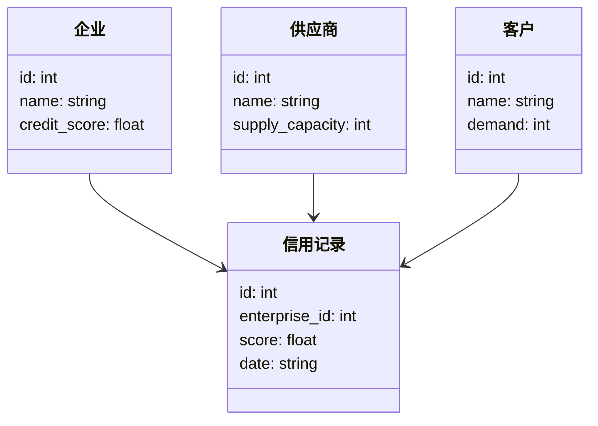
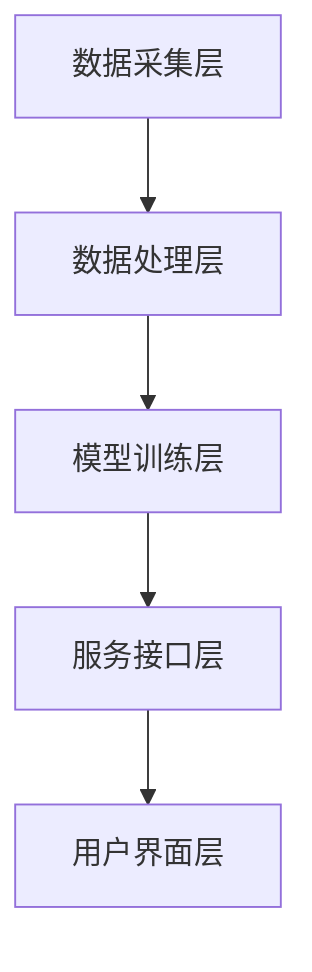
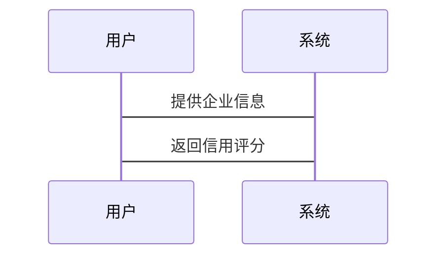

                 


# 第四部分: 供应链金融信用评级模型的系统分析与架构设计方案

# 第4章: 系统分析与架构设计方案

## 4.1 系统分析
### 4.1.1 问题场景介绍
### 4.1.2 项目介绍
### 4.1.3 领域模型设计


## 4.2 系统架构设计
### 4.2.1 架构设计


## 4.3 系统接口设计
### 4.3.1 API接口设计
- RESTful API
- 输入输出格式

## 4.4 系统交互设计
### 4.4.1 交互流程


## 4.5 本章小结
...

# 第五部分: 供应链金融信用评级模型的项目实战

# 第5章: 项目实战

## 5.1 项目环境安装
### 5.1.1 安装Python
### 5.1.2 安装相关库
- `pip install pandas`
- `pip install scikit-learn`

## 5.2 系统核心代码实现
### 5.2.1 数据预处理
```python
import pandas as pd

def preprocess_data(data):
    # 假设data是 DataFrame
    data.dropna(inplace=True)
    data['total_sales'] = data['sales'].fillna(0)
    return data
```

### 5.2.2 特征提取
```python
from sklearn.feature_selection import SelectKBest

def extract_features(data, target):
    X = data.drop(target, axis=1)
    y = data[target]
    selector = SelectKBest(k=10)
    X_selected = selector.fit_transform(X, y)
    return X_selected, y
```

### 5.2.3 模型训练
```python
from sklearn.model import ModelName

def train_model(X_train, y_train):
    model = ModelName()
    model.fit(X_train, y_train)
    return model
```

## 5.3 实际案例分析
### 5.3.1 案例背景
### 5.3.2 数据分析
### 5.3.3 模型评估
- 准确率
- 召回率
- F1分数

## 5.4 项目小结
...

# 第六部分: 最佳实践

# 第6章: 最佳实践与模型优化

## 6.1 模型优化技巧
### 6.1.1 参数调优
### 6.1.2 特征工程
### 6.1.3 模型融合

## 6.2 项目部署与维护
### 6.2.1 模型部署
### 6.2.2 监控与维护
### 6.2.3 定期更新

## 6.3 注意事项
### 6.3.1 数据隐私
### 6.3.2 模型解释性
### 6.3.3 抗干扰能力

## 6.4 拓展阅读
### 6.4.1 相关技术
### 6.4.2 领域知识
### 6.4.3 前沿动态

## 6.5 本章小结
...

# 作者

作者：AI天才研究院/AI Genius Institute  
& 禅与计算机程序设计艺术 /Zen And The Art of Computer Programming

