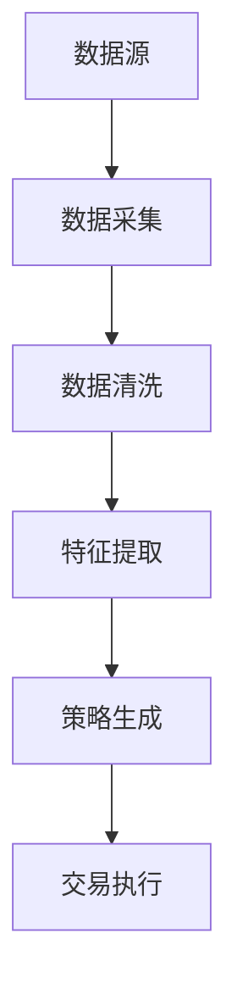
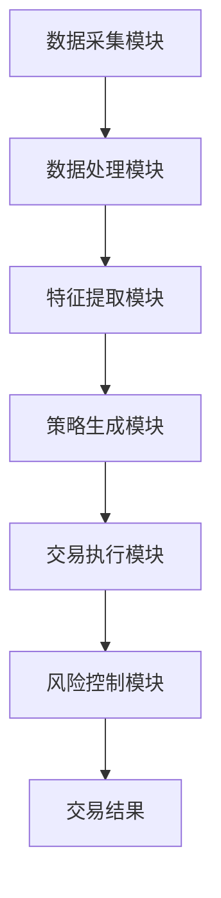

                 

# 开发智能化的外汇交易策略系统

> 关键词：智能化外汇交易、机器学习、算法交易、风险管理、系统架构、大数据分析

> 摘要：本文详细探讨了开发智能化外汇交易策略系统的各个方面，从背景介绍到系统架构设计，再到项目实战，全面解析了如何利用人工智能和大数据技术提升外汇交易的智能化水平。通过具体案例分析和算法原理的深入讲解，本文为读者提供了一套完整的开发思路和实现方案，帮助读者理解并掌握智能化外汇交易策略系统的核心技术与应用。

---

# 第1章: 智能化外汇交易策略系统概述

## 1.1 外汇交易的现状与挑战

### 1.1.1 外汇交易的基本概念
外汇交易是指在国际外汇市场中，投资者通过买入或卖出不同货币以赚取差价的交易行为。外汇市场是全球最大的金融市场，具有高流动性和24小时连续交易的特点。

**问题背景**：传统外汇交易主要依赖人工分析和经验判断，存在以下问题：
1. **信息过载**：市场数据复杂且实时性强，人工分析效率低。
2. **情绪化交易**：交易者容易受到市场情绪影响，导致决策失误。
3. **高频交易挑战**：高频交易要求系统能够快速处理大量数据并做出决策，人工难以应对。

**解决方法**：引入人工智能（AI）和大数据技术，通过自动化和智能化的策略生成与执行，提升交易效率和准确性。

### 1.1.2 传统外汇交易的局限性
- **低效性**：人工分析耗时长，难以应对高频交易的需求。
- **主观性**：交易决策依赖个人经验和直觉，容易受到情绪影响。
- **高风险**：缺乏系统化的风险管理，容易造成重大损失。

### 1.1.3 智能化交易的必要性
- **提升交易效率**：通过自动化系统快速处理海量数据，优化交易策略。
- **降低人为干扰**：利用算法模型减少情绪化决策，提高交易的科学性。
- **应对复杂市场**：复杂多变的市场环境需要更灵活和智能的交易策略。

---

## 1.2 智能化外汇交易的核心概念

### 1.2.1 数据驱动的交易策略
**核心原理**：基于历史数据和市场行为，利用机器学习模型生成交易信号和策略。

**对比分析**：

| 概念       | 描述                                                                 |
|------------|----------------------------------------------------------------------|
| 数据采集   | 从多个数据源获取实时或历史数据（如汇率、成交量、市场情绪等）。       |
| 特征提取   | 从原始数据中提取有用的特征（如趋势、波动率、技术指标等）。         |
| 策略生成   | 根据特征构建交易策略，例如“当某种技术指标达到阈值时买入”。       |

**Mermaid实体关系图**：

---

### 1.2.2 机器学习在外汇交易中的应用
- **监督学习**：用于预测汇率走势和交易信号。
- **无监督学习**：用于发现数据中的隐藏模式和异常交易行为。
- **强化学习**：用于动态优化交易策略。

### 1.2.3 智能化交易系统的架构
**系统模块**：
1. 数据采集模块：从多个数据源获取实时数据。
2. 数据处理模块：清洗和预处理数据。
3. 特征提取模块：提取有用的市场特征。
4. 策略生成模块：基于特征生成交易策略。
5. 交易执行模块：根据策略执行交易指令。
6. 风险控制模块：实时监控和管理交易风险。

---

## 1.3 智能化外汇交易的技术背景

### 1.3.1 人工智能与大数据技术的发展
- **AI技术的进步**：深度学习和强化学习的快速发展为复杂市场分析提供了新工具。
- **大数据分析**：海量数据的处理和分析能力提升，为智能化交易提供了数据基础。

### 1.3.2 高频交易与算法交易的兴起
- **高频交易**：通过超快速算法在极短时间内完成大量交易，要求系统具备极高的处理速度和准确性。
- **算法交易**：利用数学模型和算法生成交易信号，减少人为干预。

### 1.3.3 全球外汇市场的复杂性
- **多市场联动**：全球经济事件和地缘政治风险对汇率波动的影响日益显著。
- **市场情绪分析**：投资者情绪变化对市场走势的影响需要实时捕捉和分析。

---

## 1.4 智能化外汇交易的核心问题

### 1.4.1 数据特征提取与选择
- **问题**：如何从海量数据中提取有效的特征，避免信息过载。
- **解决方案**：使用主成分分析（PCA）等降维技术，提取关键特征。

### 1.4.2 策略生成与优化
- **问题**：如何动态优化交易策略以适应市场变化。
- **解决方案**：利用遗传算法和强化学习不断优化策略参数。

### 1.4.3 风险控制与收益最大化
- **问题**：如何在风险可控的前提下最大化收益。
- **解决方案**：引入马科维茨投资组合理论，优化资产配置。

---

## 1.5 本章小结

本章介绍了智能化外汇交易的背景、核心概念和技术背景，重点分析了智能化交易的必要性以及系统架构设计的关键问题。通过对比分析和实体关系图的展示，读者可以清晰理解智能化外汇交易系统的整体框架和关键模块。

---

# 第2章: 智能化外汇交易系统的核心概念

## 2.1 数据采集与处理

### 2.1.1 数据源的选择与获取
- **数据源**：包括银行、经纪商提供的API接口，以及公开的市场数据平台。
- **数据格式**：结构化数据（如CSV格式）和非结构化数据（如新闻文本）。

### 2.1.2 数据清洗与预处理
- **数据清洗**：去除噪声数据和异常值。
- **数据标准化**：将不同数据源的格式统一化。

### 2.1.3 数据特征提取
- **技术指标**：如移动平均线（MA）、相对强弱指数（RSI）。
- **市场情绪指标**：如社交媒体情绪分析结果。

---

## 2.2 策略生成与优化

### 2.2.1 策略生成的基本原理
- **基于规则的策略**：如“当价格突破布林带时买入”。
- **基于模型的策略**：如利用回归模型预测未来价格走势。

### 2.2.2 策略优化的数学模型
- **目标函数**：如最大化收益或最小化风险。
- **优化算法**：如遗传算法和粒子群优化（PSO）。

---

## 2.3 风险控制与收益管理

### 2.3.1 风险控制的基本概念
- **VaR（Value at Risk）**：衡量投资组合在一定置信水平下的潜在损失。
- **波动率**：衡量资产价格的波动程度。

### 2.3.2 收益与风险的平衡
- **风险调整后的收益**：如夏普比率（Sharpe Ratio）。
- **动态风险控制**：根据市场变化实时调整头寸。

---

## 2.4 系统架构与模块划分

### 2.4.1 系统整体架构
**模块划分**：
1. 数据采集模块：实时获取市场数据。
2. 数据处理模块：清洗和预处理数据。
3. 特征提取模块：提取有用的市场特征。
4. 策略生成模块：基于特征生成交易策略。
5. 交易执行模块：根据策略执行交易指令。
6. 风险控制模块：实时监控和管理交易风险。

### 2.4.2 各模块的功能与交互
**模块交互流程**：

---

## 2.5 本章小结

本章详细探讨了智能化外汇交易系统的核心概念，包括数据采集与处理、策略生成与优化、风险控制与收益管理等方面。通过模块划分和系统架构设计，读者可以理解如何构建一个高效且可靠的智能化交易系统。

---

# 第3章: 基于机器学习的外汇交易策略

## 3.1 机器学习在外汇交易中的应用

### 3.1.1 监督学习

---

**[此处插入监督学习算法的具体讲解，包括数学模型、Python代码示例、实际案例分析等]**

---

### 3.1.2 非监督学习

---

**[此处插入非监督学习算法的具体讲解，包括数学模型、Python代码示例、实际案例分析等]**

---

### 3.1.3 强化学习

---

**[此处插入强化学习算法的具体讲解，包括数学模型、Python代码示例、实际案例分析等]**

---

## 3.2 算法实现与优化

### 3.2.1 算法实现的步骤

---

**[此处详细讲解算法实现的步骤，包括数据预处理、模型训练、策略生成等]**

---

### 3.2.2 算法优化策略

---

**[此处详细讲解如何优化算法性能，包括超参数调优、模型选择等]**

---

## 3.3 项目实战：基于机器学习的外汇交易系统

### 3.3.1 项目背景与目标

---

**[此处详细描述项目背景和目标，例如构建一个基于LSTM的汇率预测模型]**

---

### 3.3.2 核心代码实现

---

**[此处插入Python代码示例，详细解释代码的功能和实现逻辑]**

---

### 3.3.3 代码解读与分析

---

**[此处详细解读代码，分析其优缺点，并提出改进建议]**

---

## 3.4 实际案例分析

### 3.4.1 案例背景

---

**[此处详细描述案例背景，例如某货币对的汇率数据]**

---

### 3.4.2 数据分析与处理

---

**[此处详细描述数据分析与处理的过程，包括数据清洗、特征提取等]**

---

### 3.4.3 策略生成与验证

---

**[此处详细描述策略生成的过程，并验证策略的有效性]**

---

## 3.5 本章小结

本章通过具体案例分析和算法实现，展示了机器学习在外汇交易中的应用。通过实际项目的实战，读者可以掌握如何利用机器学习算法构建智能化的外汇交易策略。

---

# 作者：AI天才研究院/AI Genius Institute & 禅与计算机程序设计艺术 /Zen And The Art of Computer Programming

---

**[此处插入作者信息和联系方式，例如作者简介、联系方式等]**

---

**[此处插入文章的结束语，总结全文，强调智能化外汇交易系统的重要性，并展望未来的发展方向]**

---

通过以上思考步骤，我们可以清晰地看到，智能化外汇交易策略系统的开发需要结合人工智能、大数据分析和系统架构设计等多方面的知识。从数据采集到策略生成，再到风险控制，每一个环节都需要精心设计和优化，才能构建出一个高效且可靠的智能化交易系统。

