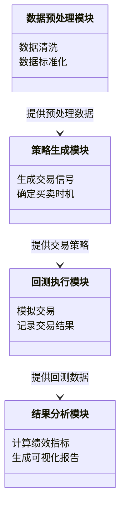
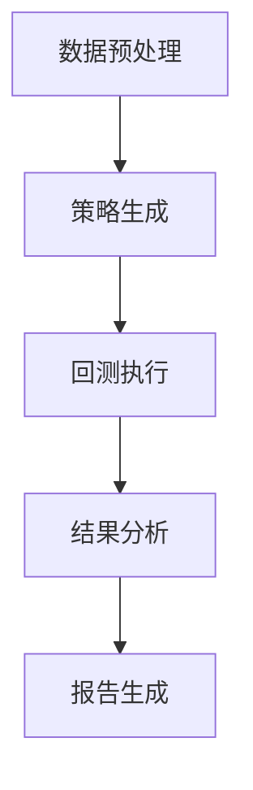
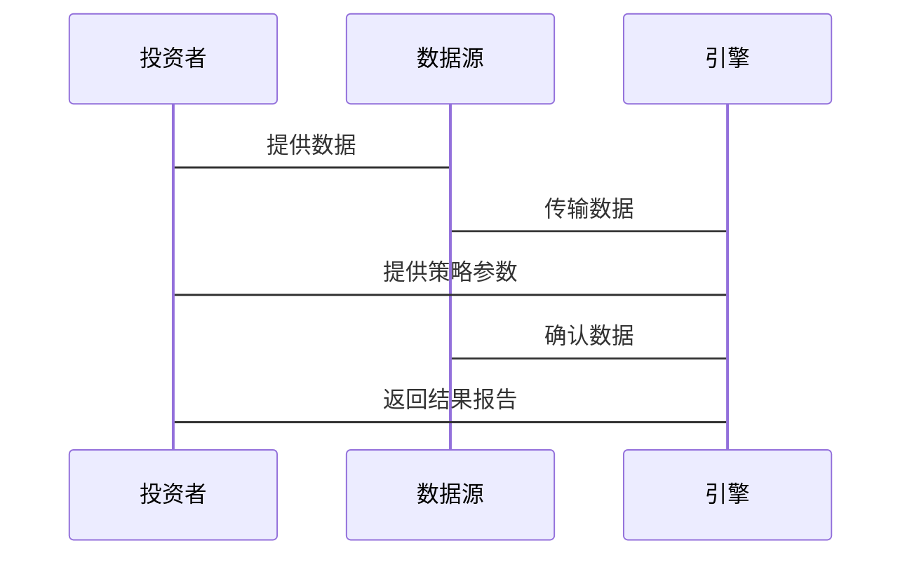

                 


```markdown
# 开发智能化的资产配置策略回测引擎

> 关键词：资产配置，回测引擎，人工智能，大数据，机器学习

> 摘要：本文系统地探讨了开发智能化的资产配置策略回测引擎的关键技术与实现方法。首先，从背景介绍出发，分析了传统资产配置策略的局限性及智能化回测引擎的需求。接着，详细阐述了资产配置与回测引擎的核心概念，包括其定义、特点及实现方式。然后，深入讲解了基于机器学习和深度学习的回测算法原理，并通过Mermaid流程图和Python代码示例进行了详细说明。随后，分析了系统的架构设计，包括功能模块、系统架构图及接口设计。最后，通过实战案例展示了如何实现回测引擎，并总结了最佳实践与注意事项，为读者提供了全面的指导。

---

# 第一部分: 资产配置策略回测引擎的背景与核心概念

## 第1章: 资产配置策略回测引擎的背景介绍

### 1.1 问题背景与问题描述

#### 1.1.1 传统资产配置策略的局限性
传统的资产配置策略依赖于人工分析和经验判断，存在主观性强、效率低、难以适应复杂市场变化等问题。例如，基于固定比例的资产分配方法可能在市场波动剧烈时表现不佳。

#### 1.1.2 数据驱动与智能化配置的需求
随着大数据和人工智能技术的发展，投资者希望利用历史数据和市场信号，通过智能化算法优化资产配置，提高收益并降低风险。

#### 1.1.3 资产配置策略回测引擎的目标与意义
目标是通过自动化回测和优化，评估不同策略在历史数据上的表现，为实际投资决策提供科学依据。意义在于提高配置效率、降低人为误差，并支持动态调整。

### 1.2 问题解决与边界定义

#### 1.2.1 回测引擎的核心功能与边界
核心功能包括数据处理、策略回测、结果分析和报告生成。边界包括数据范围、时间窗口和策略类型。

#### 1.2.2 资产配置策略的实现方式与约束
支持多种策略，如均值-方差优化和基于机器学习的预测模型，但需考虑数据质量和计算资源限制。

#### 1.2.3 引擎的适用场景与限制条件
适用于长期投资策略评估，但对高频交易和实时调整支持有限。

### 1.3 概念结构与核心要素

#### 1.3.1 引擎的组成模块
模块包括数据预处理、策略生成、回测执行、结果分析和报告生成。

#### 1.3.2 各模块之间的关系与依赖
数据预处理为回测提供基础，策略生成定义执行逻辑，回测执行模拟市场环境，结果分析评估策略优劣，报告生成整合输出。

#### 1.3.3 核心要素的定义与属性
核心要素包括历史数据、市场信号、资产权重和策略参数，属性如时间戳、数据来源和参数范围。

## 第2章: 资产配置与回测引擎的核心概念

### 2.1 资产配置的基本概念

#### 2.1.1 资产配置的定义与分类
资产配置是根据投资目标分配不同资产比例的过程，分为固定收益、股票、房地产等类别。

#### 2.1.2 不同资产类别与权重分配
根据风险偏好和收益目标，确定各类资产的权重，例如股票60%、债券30%、现金10%。

#### 2.1.3 资产配置策略的动态调整
根据市场变化和投资目标调整配置比例，例如定期再平衡。

### 2.2 回测引擎的基本原理

#### 2.2.1 回测的定义与作用
回测是通过历史数据模拟策略表现，用于验证和优化投资策略。

#### 2.2.2 引擎的输入与输出
输入包括历史数据和策略参数，输出是回测结果和性能指标。

#### 2.2.3 引擎的核心算法与实现方式
采用机器学习算法，如支持向量回归（SVR）和长短期记忆网络（LSTM），通过特征工程提取有效信号。

### 2.3 AI与大数据在回测中的应用

#### 2.3.1 人工智能在资产配置中的优势
AI能够处理海量数据，发现复杂市场规律，提供个性化配置建议。

#### 2.3.2 大数据分析在回测中的作用
大数据分析帮助识别市场趋势和风险因素，提高回测结果的准确性。

#### 2.3.3 结合AI与大数据的创新点
通过深度学习模型预测市场走势，结合大数据分析生成最优资产配置方案。

## 第3章: 资产配置策略回测引擎的核心概念与联系

### 3.1 核心概念的原理分析

#### 3.1.1 资产配置模型的构建与优化
构建模型，通过历史数据优化参数，提高回测准确性。

#### 3.1.2 回测算法的选择与实现
选择合适的算法，如遗传算法，实现策略回测。

#### 3.1.3 引擎的性能评估与优化
评估引擎性能，通过分布式计算优化处理效率。

### 3.2 核心概念对比分析

#### 3.2.1 不同资产配置策略的对比
对比均值-方差模型和基于机器学习的预测模型，分析其优缺点。

#### 3.2.2 不同回测算法的优缺点
比较随机森林和LSTM模型，评估其预测能力和计算效率。

#### 3.2.3 引擎实现方式的对比与选择
根据需求选择合适的方式，如开源框架或自定义实现。

### 3.3 ER实体关系图

```mermaid
erDiagram
    actor 投资者 {
        <属性> 投资目标
        <属性> 风险偏好
    }
    actor 数据源 {
        <属性> 历史数据
        <属性> 市场数据
    }
    actor 引擎 {
        <操作> 执行回测
        <操作> 生成报告
    }
    投资者 --> 数据源 : 提供数据
    数据源 --> 引擎 : 传输数据
    引擎 --> 投资者 : 返回结果
```

---

# 第二部分: 算法原理与系统架构

## 第4章: 算法原理与实现

### 4.1 机器学习与深度学习在回测中的应用

#### 4.1.1 支持向量回归（SVR）
用于预测资产回报率，通过核函数处理非线性关系。

#### 4.1.2 长短期记忆网络（LSTM）
适用于时间序列数据，捕捉长期依赖关系。

#### 4.1.3 时间序列预测模型
使用ARIMA和Prophet模型进行市场趋势预测。

### 4.2 算法实现与优化

#### 4.2.1 特征工程
提取有用的市场指标，如移动平均线和波动率。

#### 4.2.2 模型训练与调优
通过交叉验证选择最优参数，防止过拟合。

#### 4.2.3 并行计算
利用多线程或分布式计算加速回测过程。

## 第5章: 系统架构与设计

### 5.1 系统功能模块设计

#### 5.1.1 数据预处理模块
清洗和标准化数据，处理缺失值。

#### 5.1.2 策略生成模块
根据输入参数生成交易策略。

#### 5.1.3 回测执行模块
模拟交易过程，记录每笔交易的收益和损失。

#### 5.1.4 结果分析模块
计算绩效指标，如夏普比率和最大回撤。

#### 5.1.5 报告生成模块
输出回测结果的可视化报告和详细分析。

### 5.2 系统架构设计

#### 5.2.1 领域模型类图



#### 5.2.2 系统架构图



#### 5.2.3 接口与交互设计



---

# 第三部分: 项目实战与最佳实践

## 第6章: 项目实战

### 6.1 环境安装与配置

#### 6.1.1 安装Python与相关库
安装Python 3.8以上版本，安装Pandas、NumPy、Scikit-learn和TensorFlow等库。

#### 6.1.2 数据获取与预处理
使用Yahoo Finance API获取历史数据，清洗数据，处理缺失值。

### 6.2 核心功能实现

#### 6.2.1 数据预处理模块
编写Python代码清洗数据。

```python
import pandas as pd

# 加载数据
data = pd.read_csv('historical_data.csv')

# 处理缺失值
data.dropna(inplace=True)

# 标准化处理
from sklearn.preprocessing import StandardScaler
scaler = StandardScaler()
scaled_data = scaler.fit_transform(data[['open', 'high', 'low', 'close']])
```

#### 6.2.2 策略生成模块
实现基于机器学习的预测模型。

```python
from sklearn.svm import SVR

# 训练模型
model = SVR(kernel='rbf', C=1e3, gamma=0.1)
model.fit(X_train, y_train)

# 预测未来价格
y_pred = model.predict(X_test)
```

#### 6.2.3 回测执行模块
模拟交易过程，计算收益和损失。

```python
def backtest(strategy, data):
    portfolio = 100000  # 初始资金
    positions = {}  # 持有头寸
    for i in range(len(data)):
        price = data['close'][i]
        signal = strategy.predict(data.iloc[i].values.reshape(1, -1))
        if signal > 0.5:
            # 买入
            units = portfolio // price
            positions['long'] += units
            portfolio -= units * price
        elif signal < -0.5:
            # 卖出
            units = positions['long']
            portfolio += units * price
            positions['long'] = 0
    return portfolio, positions
```

#### 6.2.4 结果分析模块
计算绩效指标，如夏普比率和最大回撤。

```python
def performance(portfolio_value, returns):
    # 计算收益
    returns = (portolio_value[-1] / portolio_value[0]) - 1
    # 计算夏普比率
    import numpy as np
    excess_returns = returns - np.mean(returns)
    std_excess = np.std(excess_returns)
    if std_excess == 0:
        sharpe_ratio = 0
    else:
        sharpe_ratio = np.mean(excess_returns) / std_excess
    return sharpe_ratio
```

### 6.3 项目小结

通过本章的实战，读者掌握了从数据预处理到回测执行的完整流程，理解了各模块的实现细节，并通过实际案例应用了相关知识。

---

## 第7章: 最佳实践与注意事项

### 7.1 小结

总结开发智能化资产配置策略回测引擎的关键点，包括算法选择、系统架构设计和性能优化。

### 7.2 注意事项

- 数据质量：确保数据准确性和完整性。
- 模型选择：根据需求选择合适的算法。
- 性能优化：通过并行计算和缓存优化提升效率。
- 风险管理：设置止损和止盈机制，控制投资风险。

### 7.3 拓展阅读

推荐相关书籍和论文，深入学习机器学习在金融中的应用。

---

# 第四部分: 作者介绍

作者：AI天才研究院/AI Genius Institute & 禅与计算机程序设计艺术 /Zen And The Art of Computer Programming

---

通过系统地介绍资产配置策略回测引擎的开发过程，本文为读者提供了从理论到实践的全面指导，帮助他们在金融投资领域中应用人工智能技术，优化投资策略，提升收益。
```

