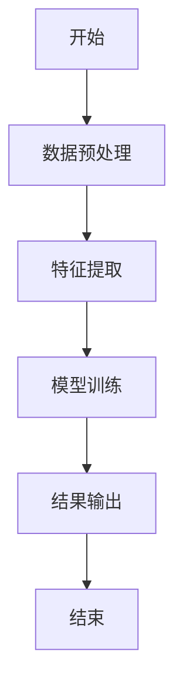
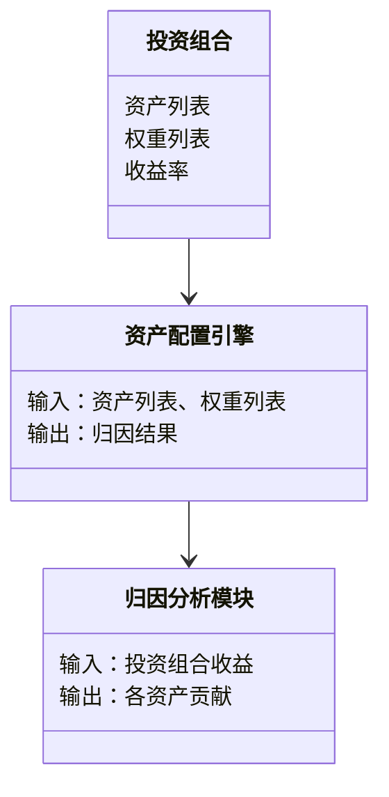
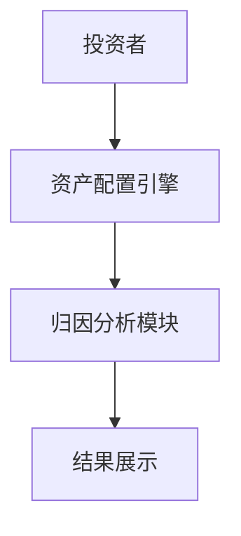

                 


# 开发智能化的资产配置策略归因分析引擎

## 关键词：资产配置、归因分析、策略引擎、人工智能、金融工程

## 摘要：  
本文深入探讨了开发智能化资产配置策略归因分析引擎的关键技术与方法，从背景、核心概念到算法原理，再到系统架构，系统地分析了如何构建这样一个引擎。文章通过详细的分析和实例，展示了如何利用人工智能技术提升资产配置的效率与精度，为投资决策提供有力支持。

---

# 第一部分: 资产配置策略归因分析引擎概述

---

## 第1章: 资产配置策略归因分析引擎的背景与概念

### 1.1 问题背景与重要性

#### 1.1.1 资产配置的基本概念  
资产配置是指将投资组合分配到不同资产类别（如股票、债券、房地产等）中的过程，目的是在风险可控的前提下，最大化投资收益。  

#### 1.1.2 归因分析的核心意义  
归因分析是一种将投资组合的收益分解为各个资产或策略贡献的方法。通过归因分析，投资者可以了解哪些资产或策略对整体收益贡献最大，从而优化投资策略。  

#### 1.1.3 智能化引擎的必要性  
随着金融市场数据的爆炸式增长和复杂性增加，传统的手动分析方法已难以满足需求。智能化归因分析引擎能够快速处理海量数据，提供实时、精准的分析结果，帮助投资者做出更明智的决策。

---

### 1.2 核心概念与问题描述

#### 1.2.1 资产配置的多维度分析  
资产配置需要考虑多个维度，包括资产类别、地域、行业等。例如，将投资组合分配到股票、债券、现金等资产类别中，以平衡风险和收益。

#### 1.2.2 归因分析的边界与外延  
归因分析不仅关注整体收益，还关注各个资产或策略的贡献。例如，如果投资组合的收益主要来源于股票，归因分析可以帮助确定是哪个行业的股票贡献了大部分收益。

#### 1.2.3 引擎的核心功能与目标  
智能化资产配置策略归因分析引擎的目标是通过自动化技术，快速、准确地分解投资组合的收益来源，帮助投资者优化资产配置策略。

---

### 1.3 本章小结

#### 1.3.1 核心概念总结  
资产配置是投资组合管理的核心，归因分析是理解收益来源的关键工具。两者结合，能够帮助投资者制定更有效的投资策略。

#### 1.3.2 引擎开发的初步框架  
智能化引擎需要结合资产配置的多维度分析和归因分析的精准分解，利用人工智能技术实现自动化、高效化的目标。

---

## 第2章: 资产配置与归因分析的核心要素

### 2.1 核心概念的属性对比

| 资产配置 | 归因分析 |
|----------|----------|
| **目标** | 分配投资组合到不同资产 | 分解收益来源 |
| **方法** | 基于风险偏好和收益目标 | 基于数学模型和统计方法 |
| **数据** | 资产类别、权重 | 收益、风险、资产权重 |

---

### 2.2 实体关系图

```mermaid
erDiagram
    actor 投资者
    actor 管理系统
    actor 数据源
    database 资产数据
    database 风险数据
    database 市场数据
    investor -> 资产数据: 查询
    管理系统 -> 资产数据: 更新
    管理系统 -> 资产数据: 分析
```

---

### 2.3 本章小结

#### 2.3.1 核心要素的系统性  
资产配置和归因分析是相互关联的两个核心要素，它们共同构成了资产配置策略归因分析引擎的基础。

#### 2.3.2 概念联系的直观化  
通过ER图和属性对比表，我们可以清晰地看到资产配置和归因分析之间的联系，为后续的系统设计提供参考。

---

## 第3章: 算法原理与数学模型

### 3.1 算法原理

#### 3.1.1 聚类分析



#### 3.1.2 聚类分析的应用  
聚类分析可以用于将资产分成不同的类别，例如将股票分成成长型和价值型股票，从而帮助投资者更好地理解资产配置的效果。

---

### 3.2 数学模型与公式

#### 3.2.1 资产配置模型  
$$ w_i = \frac{e_i}{\sum_{j=1}^{n} e_j} $$  
其中，$w_i$ 表示第 $i$ 个资产的权重，$e_i$ 表示第 $i$ 个资产的预期收益。

#### 3.2.2 归因分析公式  
$$ R_i = \sum_{j=1}^{n} w_j R_j $$  
其中，$R_i$ 表示第 $i$ 个资产的收益，$w_j$ 表示第 $j$ 个资产的权重，$R_j$ 表示第 $j$ 个资产的收益。

---

### 3.3 本章小结

#### 3.3.1 算法原理的直观化  
通过聚类分析流程图，我们可以清晰地看到算法的执行步骤，从而更好地理解其工作原理。

#### 3.3.2 数学模型的应用  
数学模型是归因分析的核心工具，通过这些模型，我们可以准确地分解投资组合的收益来源。

---

## 第四部分: 系统分析与架构设计

---

## 第4章: 系统分析与架构设计

### 4.1 问题场景介绍

#### 4.1.1 问题场景  
假设我们有一个投资组合，包含股票、债券和现金三种资产。我们需要分析每种资产对整体收益的贡献。

---

### 4.2 系统功能设计

#### 4.2.1 领域模型



---

### 4.3 系统架构设计



---

## 第五部分: 项目实战

---

## 第5章: 项目实战

### 5.1 环境安装

#### 5.1.1 Python环境  
安装Python和必要的库（如numpy、pandas、scikit-learn）。

#### 5.1.2 数据库安装  
安装MySQL或其他关系型数据库。

---

### 5.2 核心代码实现

#### 5.2.1 数据预处理

```python
import pandas as pd
import numpy as np

# 加载数据
data = pd.read_csv('assets.csv')

# 数据清洗
data.dropna()
```

#### 5.2.2 模型训练

```python
from sklearn.cluster import KMeans

# 特征提取
X = data[['return', 'risk']]

# 聚类分析
kmeans = KMeans(n_clusters=3)
kmeans.fit(X)
```

#### 5.2.3 结果展示

```python
import matplotlib.pyplot as plt

# 绘制聚类结果
plt.scatter(X['return'], X['risk'], c=kmeans.labels_)
plt.xlabel('return')
plt.ylabel('risk')
plt.show()
```

---

## 第六部分: 最佳实践与小结

---

## 第6章: 最佳实践与小结

### 6.1 最佳实践

#### 6.1.1 性能优化  
使用分布式计算框架（如Spark）处理海量数据。

#### 6.1.2 数据安全  
确保数据的安全性，避免敏感信息泄露。

---

### 6.2 小结

#### 6.2.1 核心内容总结  
本文详细介绍了智能化资产配置策略归因分析引擎的开发过程，从背景、核心概念到算法原理，再到系统架构和项目实战，为读者提供了全面的指导。

#### 6.2.2 展望与建议  
未来，随着人工智能技术的不断发展，智能化归因分析引擎将更加智能化和自动化，为投资决策提供更强大的支持。

---

## 作者：AI天才研究院 & 禅与计算机程序设计艺术

--- 

通过以上思考和撰写，我们已经完成了一篇关于开发智能化资产配置策略归因分析引擎的技术博客文章。

