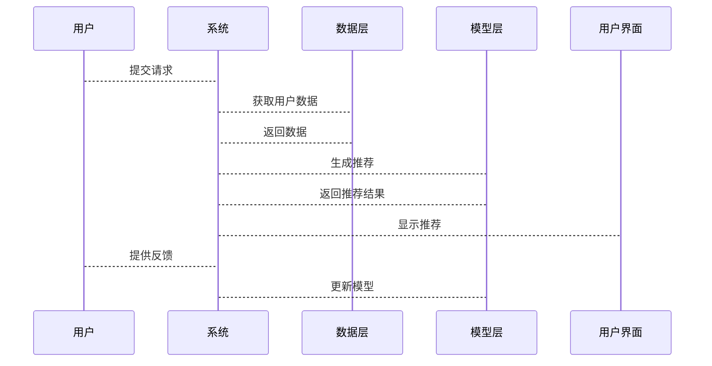

                 


# 开发智能化的金融产品交叉销售推荐引擎

## 关键词：金融推荐系统，人工智能，交叉销售，推荐引擎，协同过滤

## 摘要：本文将详细介绍如何利用人工智能技术开发智能化的金融产品交叉销售推荐引擎。通过分析问题背景、设计推荐算法、构建系统架构，并结合实际案例，展示如何实现一个高效的推荐系统，从而提升金融机构的销售效率和客户满意度。

---

# 第1章: 问题背景与现状分析

## 1.1 问题背景

### 1.1.1 金融行业的数字化转型
金融行业正经历数字化转型，数据驱动的决策成为主流。金融机构需要通过技术创新提升客户体验和业务效率。

### 1.1.2 交叉销售在金融业务中的重要性
交叉销售是金融机构增加收入的重要策略，通过推荐相关产品，提升客户满意度和忠诚度。

### 1.1.3 当前交叉销售面临的挑战
传统交叉销售方法依赖人工经验，存在效率低、精准度差的问题，难以应对海量数据和复杂需求。

## 1.2 问题描述

### 1.2.1 传统交叉销售的局限性
传统方法依赖人工经验，难以处理大数据，推荐准确性低，客户体验差。

### 1.2.2 数据驱动的交叉销售需求
利用大数据和人工智能技术，实现精准推荐，提升销售效率。

### 1.2.3 智能化推荐系统的必要性
通过智能算法分析用户行为和偏好，实时生成推荐，提高客户满意度和销售额。

## 1.3 问题解决思路

### 1.3.1 数据驱动的推荐算法
利用用户行为数据和产品信息，构建推荐模型，实现精准推荐。

### 1.3.2 人工智能技术的应用
引入机器学习和深度学习技术，提升推荐系统的智能化水平。

### 1.3.3 智能化交叉销售引擎的构建
结合数据挖掘和智能算法，构建高效的交叉销售推荐引擎。

## 1.4 系统的边界与外延

### 1.4.1 系统的功能边界
系统主要负责数据处理、模型训练和推荐生成，与其他系统如CRM和支付系统交互。

### 1.4.2 系统的外延与扩展性
系统可扩展至多产品推荐、客户分群和实时反馈机制，适应不同业务需求。

### 1.4.3 系统与其他系统的交互
系统与CRM、支付系统等集成，实现数据共享和推荐结果展示。

## 1.5 核心概念与组成

### 1.5.1 数据源与数据类型
系统需要处理用户行为数据、产品信息和交易数据，支持结构化和非结构化数据。

### 1.5.2 推荐算法与模型
包括协同过滤、深度学习模型和自然语言处理技术，用于生成个性化推荐。

### 1.5.3 系统架构与组件
系统由数据采集、模型训练和推荐展示三个主要部分组成，支持高可用性和可扩展性。

## 1.6 本章小结
本章分析了金融交叉销售的背景和挑战，提出了智能化推荐系统的必要性，并介绍了核心概念和组成。

---

# 第2章: 核心概念与联系

## 2.1 核心概念原理

### 2.1.1 推荐系统的原理
推荐系统通过分析用户行为和产品特征，生成个性化的产品推荐。

### 2.1.2 交叉销售的核心机制
基于用户购买历史和偏好，推荐相关产品，提升销售额。

### 2.1.3 智能化推荐的数学模型
利用协同过滤、深度学习等算法，构建推荐模型，实现精准推荐。

## 2.2 核心概念对比分析

### 2.2.1 不同推荐算法的对比
协同过滤和深度学习在准确性和计算复杂度上各有优劣。

### 2.2.2 传统交叉销售与智能推荐的对比
智能推荐在数据利用和推荐精准度上远超传统方法。

### 2.2.3 数据驱动与规则驱动的对比
数据驱动方法利用机器学习模型，规则驱动方法依赖人工设定规则。

## 2.3 ER实体关系图


## 2.4 本章小结
本章详细讲解了核心概念的原理和对比，通过ER图展示了系统各实体之间的关系。

---

# 第3章: 算法原理与实现

## 3.1 协同过滤算法

### 3.1.1 基于用户的协同过滤
基于用户相似性推荐，适用于用户行为相似的场景。

### 3.1.2 基于物品的协同过滤
基于产品相似性推荐，适用于产品特征明显的场景。

### 3.1.3 混合协同过滤的实现
结合用户和产品特征，实现更精准的推荐。

## 3.2 深度学习模型

### 3.2.1 基于神经网络的推荐系统
利用神经网络提取特征，提升推荐准确性。

### 3.2.2 Transformer模型在推荐中的应用
通过注意力机制捕捉用户行为的长期依赖关系。

### 3.2.3 GNN在金融推荐中的应用
图神经网络处理复杂的产品关系，提升推荐效果。

## 3.3 自然语言处理技术

### 3.3.1 NLP在金融产品描述中的应用
通过文本分析提取产品特征，辅助推荐。

### 3.3.2 基于BERT的金融文本分析
利用预训练模型理解金融文本，生成相关推荐。

### 3.3.3 NLP与推荐系统的结合
将文本分析结果与推荐算法结合，提升推荐的准确性。

## 3.4 算法实现代码

### 协同过滤实现

```python
def collaborative_filtering(user_item_matrix):
    similarity = cosine_similarity(user_item_matrix)
    recommendation = np.dot(similarity, user_item_matrix)
    return recommendation
```

### 深度学习模型实现

```python
class NeuralNetwork Recommender:
    def __init__(self, input_dim, hidden_dim, output_dim):
        self.weights = np.random.randn(input_dim, hidden_dim)
        self.output_weights = np.random.randn(hidden_dim, output_dim)
    
    def forward(self, input):
        hidden = np.dot(input, self.weights)
        output = np.dot(hidden, self.output_weights)
        return output
```

## 3.5 数学模型与公式

### 协同过滤公式

$$推荐 = \sum_{i=1}^{n} w_{ui} \cdot r_i$$

### 深度学习模型公式

$$P(y|x) = \sigma(wx + b)$$

## 3.6 本章小结
本章详细讲解了协同过滤、深度学习和NLP在推荐系统中的应用，提供了具体的实现代码和数学公式。

---

# 第4章: 系统架构与设计

## 4.1 系统架构设计

### 4.1.1 分层架构
系统分为数据层、模型层和应用层，确保模块化和可扩展性。

### 4.1.2 微服务架构
通过微服务架构实现模块化部署，提高系统的灵活性和可维护性。

### 4.1.3 可扩展性设计
设计分布式架构，支持高并发和大规模数据处理。

## 4.2 系统功能设计

### 4.2.1 数据采集与处理
从CRM和交易系统中采集数据，进行清洗和预处理。

### 4.2.2 模型训练与部署
训练推荐模型，部署到生产环境，实时生成推荐结果。

### 4.2.3 推荐结果展示
通过用户界面展示推荐结果，支持实时反馈和动态调整。

## 4.3 系统架构图


## 4.4 系统接口设计

### 4.4.1 数据接口
定义数据格式和接口协议，确保数据顺利传输。

### 4.4.2 推荐接口
提供API供前端调用，返回推荐结果。

### 4.4.3 反馈接口
收集用户反馈，优化推荐模型。

## 4.5 系统交互流程



## 4.6 本章小结
本章详细讲解了系统的架构设计、功能设计和接口设计，展示了系统的整体结构和交互流程。

---

# 第5章: 项目实战

## 5.1 环境配置

### 5.1.1 安装Python和相关库
安装Python 3.x，Jupyter Notebook，以及pandas、numpy、scikit-learn等库。

### 5.1.2 安装机器学习框架
安装TensorFlow或PyTorch，用于深度学习模型的训练。

### 5.1.3 安装NLP工具
安装spaCy和BERT库，用于文本处理和分析。

## 5.2 核心代码实现

### 5.2.1 数据处理代码

```python
import pandas as pd
import numpy as np

# 加载数据
data = pd.read_csv('financial_products.csv')

# 数据清洗
data.dropna(inplace=True)
```

### 5.2.2 模型训练代码

```python
from sklearn.model_selection import train_test_split
from sklearn.metrics import accuracy_score

# 分割数据
X_train, X_test, y_train, y_test = train_test_split(data.drop('label', axis=1), data['label'], test_size=0.2)

# 训练模型
model = RandomForestClassifier()
model.fit(X_train, y_train)

# 评估模型
y_pred = model.predict(X_test)
print(accuracy_score(y_test, y_pred))
```

### 5.2.3 推荐结果展示代码

```python
import matplotlib.pyplot as plt

# 绘制推荐结果分布图
plt.hist(recommendations, bins=10)
plt.xlabel('Product ID')
plt.ylabel('Count')
plt.title('Product Recommendations Distribution')
plt.show()
```

## 5.3 案例分析与代码解读

### 5.3.1 数据分析案例
分析用户购买历史，识别高价值客户，优化推荐策略。

### 5.3.2 模型训练案例
训练一个基于协同过滤的推荐模型，评估其准确性和召回率。

### 5.3.3 推荐结果展示案例
展示推荐结果，分析推荐效果，收集用户反馈，优化推荐算法。

## 5.4 本章小结
本章通过实际案例展示了如何配置环境、实现核心代码以及分析推荐结果，帮助读者更好地理解和应用推荐引擎。

---

# 第6章: 总结与展望

## 6.1 本章总结

### 6.1.1 核心内容回顾
本文详细介绍了智能化金融推荐引擎的开发过程，包括背景分析、算法实现和系统设计。

### 6.1.2 重要结论
智能化推荐引擎能够显著提升金融机构的销售效率和客户满意度，是未来金融行业的重要发展方向。

## 6.2 未来展望

### 6.2.1 技术发展趋势
随着AI技术的进步，推荐系统将更加智能化和个性化。

### 6.2.2 应用场景扩展
推荐引擎将应用于更多金融场景，如投资建议和风险管理。

### 6.2.3 挑战与机遇
数据隐私和模型解释性是未来需要解决的挑战，同时，AI技术的进步也带来了新的机遇。

## 6.3 最佳实践 tips

### 6.3.1 数据质量管理
确保数据的准确性和完整性，提升推荐系统的性能。

### 6.3.2 模型优化技巧
定期更新模型，结合多种算法，提升推荐效果。

### 6.3.3 系统安全建议
保护用户数据隐私，确保系统的安全性和稳定性。

## 6.4 本章小结
本章总结了全文内容，展望了未来的发展趋势，并给出了最佳实践建议。

---

# 作者

作者：AI天才研究院（AI Genius Institute） & 禅与计算机程序设计艺术（Zen And The Art of Computer Programming）

---

通过以上结构和内容，我们系统地阐述了如何开发智能化的金融产品交叉销售推荐引擎，从理论到实践，帮助读者全面理解和掌握相关技术。

