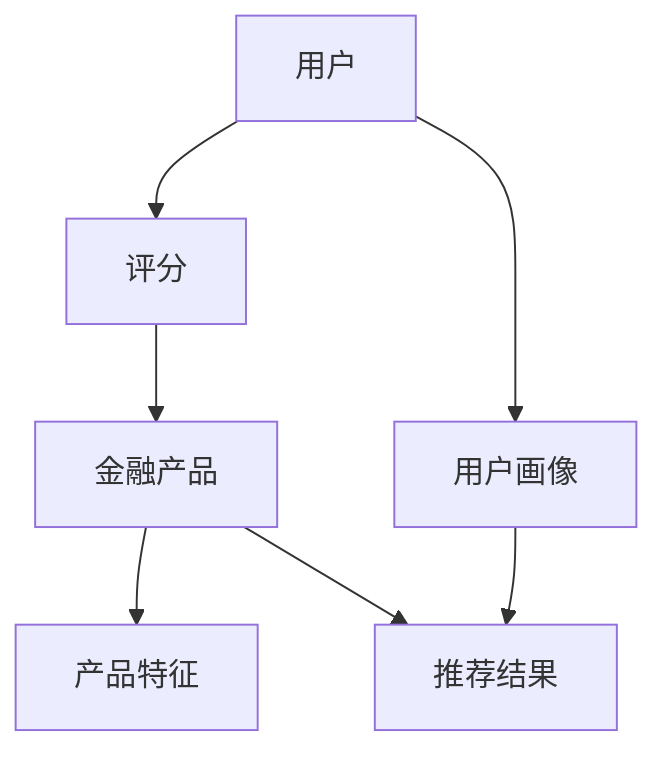

                 


# 开发智能化的金融产品推荐个性化引擎

> 关键词：金融推荐系统、个性化推荐、机器学习、协同过滤、深度学习

> 摘要：本文将详细介绍如何开发一个智能化的金融产品推荐个性化引擎。文章从背景介绍出发，分析金融推荐系统的核心问题与挑战，深入探讨个性化推荐引擎的实现原理，结合具体案例展示系统设计与实现过程，最后总结开发中的注意事项与未来发展方向。

---

## 第1章: 背景介绍与问题背景

### 1.1 金融产品推荐系统概述

#### 1.1.1 金融推荐系统的定义与作用
金融推荐系统是一种基于用户行为和市场数据，利用算法和模型为用户提供个性化金融产品建议的系统。其作用在于帮助用户在海量金融产品中快速找到适合自己的投资选择，同时提高金融机构的销售效率和用户满意度。

#### 1.1.2 个性化推荐引擎的必要性
传统的金融产品推荐系统往往依赖人工经验或简单的规则过滤，这种方式难以满足用户多样化的投资需求。个性化推荐引擎通过机器学习和数据挖掘技术，能够实时分析用户的交易行为、风险偏好和市场趋势，从而提供精准的推荐。

#### 1.1.3 金融推荐系统的应用场景
- **财富管理**：根据用户的资产规模和风险偏好推荐理财产品。
- **证券交易**：基于用户的历史交易行为推荐股票或基金。
- **保险产品推荐**：根据用户的年龄、职业和健康状况推荐保险产品。

### 1.2 问题背景与挑战

#### 1.2.1 传统金融推荐系统的局限性
- 数据维度单一，难以捕捉用户复杂的投资需求。
- 推荐结果缺乏个性化，难以满足不同用户的差异化需求。
- 计算效率低下，难以应对海量数据和实时推荐的需求。

#### 1.2.2 数据量与用户行为分析的挑战
- 金融数据的实时性和准确性要求高。
- 用户行为数据的稀疏性和噪声干扰问题。
- 如何平衡推荐的实时性与准确性。

#### 1.2.3 竞争与用户需求的多样性
- 金融机构之间的竞争日益激烈，推荐系统的差异化成为核心竞争力。
- 用户需求多样化，如何在推荐中兼顾短期收益与长期投资目标。

### 1.3 问题描述与目标

#### 1.3.1 金融产品推荐的核心问题
如何通过算法和模型，从海量金融数据中提取有用信息，为用户提供个性化的产品推荐。

#### 1.3.2 个性化推荐引擎的目标
- 提高推荐的准确性和用户满意度。
- 实现实时推荐，适应市场变化。
- 支持多种金融产品的推荐，满足用户多样化需求。

#### 1.3.3 系统边界与外延
- 系统边界：用户行为数据采集、推荐算法实现、推荐结果展示。
- 系统外延：市场数据接口、用户画像构建、推荐效果评估。

### 1.4 核心概念与结构

#### 1.4.1 用户画像与行为分析
用户画像是基于用户的基本信息、交易行为、市场互动等数据构建的用户特征模型。行为分析则通过挖掘用户的历史交易记录、点击行为、搜索关键词等，提取用户的兴趣和偏好。

#### 1.4.2 产品特征与属性
金融产品的特征包括风险等级、收益预期、产品类型（如股票、基金、债券等）、发行机构、产品期限等。推荐系统需要将这些特征与用户需求进行匹配。

#### 1.4.3 推荐算法与模型
推荐算法是个性化推荐引擎的核心，包括协同过滤、基于内容的推荐、混合推荐等多种方法。模型的选择和优化直接影响推荐效果。

---

## 第2章: 核心概念与联系

### 2.1 推荐系统的核心原理

#### 2.1.1 协同过滤推荐
协同过滤是一种基于用户相似性或产品相似性的推荐方法。用户协同过滤通过分析用户的行为数据，找到相似用户的偏好，从而推荐相似产品。产品协同过滤则是通过分析产品的特征数据，找到相似产品，推荐给目标用户。

#### 2.1.2 基于内容的推荐
基于内容的推荐依赖于产品的描述信息，如产品类型、风险等级等。通过计算产品之间的相似性，推荐给用户相关产品。这种方法的优点是可解释性高，但依赖于产品描述的准确性和完整性。

#### 2.1.3 混合推荐模型
混合推荐模型结合了协同过滤和基于内容的推荐方法，通过集成多种推荐算法，提高推荐的准确性和多样性。

### 2.2 核心概念对比分析

#### 2.2.1 不同推荐算法的特征对比
| 算法类型 | 基于协同过滤 | 基于内容的推荐 | 混合推荐 |
|----------|--------------|----------------|----------|
| 特征     | 用户行为数据 | 产品特征数据 | 综合数据 |
| 优势     | 高准确性     | 高可解释性     | 高灵活性 |
| 劣势     | 计算复杂     | 依赖产品描述   | 实现难度大 |

### 2.3 实体关系图

#### 2.3.1 用户、产品和推荐的关系


---

## 第3章: 算法原理讲解

### 3.1 协同过滤算法的实现

#### 3.1.1 协同过滤的数学模型
协同过滤的核心是计算用户或产品之间的相似性，常用余弦相似度或皮尔逊相关系数来衡量相似性。

#### 3.1.2 协同过滤的实现步骤
1. 数据预处理：对用户行为数据进行清洗和归一化处理。
2. 相似度计算：计算用户或产品的相似度矩阵。
3. 推荐生成：基于相似度矩阵，计算目标用户的推荐列表。

#### 3.1.3 代码实现示例
```python
import numpy as np

def cosine_similarity(user_profile, product_profile):
    numerator = np.dot(user_profile, product_profile)
    denominator = np.linalg.norm(user_profile) * np.linalg.norm(product_profile)
    return numerator / denominator

# 示例数据
user_profiles = {
    'user1': [1, 2, 3],
    'user2': [4, 5, 6]
}
product_profiles = {
    'product1': [2, 4, 6],
    'product2': [3, 5, 7]
}

# 计算相似度
similarity = cosine_similarity(user_profiles['user1'], product_profiles['product1'])
print(f"余弦相似度为: {similarity}")
```

---

## 第4章: 系统分析与架构设计

### 4.1 系统分析

#### 4.1.1 系统目标
设计一个智能化的金融产品推荐引擎，能够实时分析用户行为和市场数据，提供个性化的产品推荐。

#### 4.1.2 功能模块划分
- 用户数据采集模块：采集用户的交易行为、点击数据等。
- 数据处理模块：对数据进行清洗、特征提取和归一化处理。
- 推荐算法模块：实现协同过滤、基于内容的推荐算法。
- 推荐结果展示模块：将推荐结果以可视化的方式呈现给用户。

### 4.2 系统架构设计

#### 4.2.1 系统架构图


#### 4.2.2 关键模块设计
- 数据采集模块：通过API接口获取用户的交易数据和市场数据。
- 数据预处理模块：对数据进行清洗、特征提取和归一化处理。
- 推荐算法模块：实现协同过滤、基于内容的推荐算法，并进行模型优化。
- 结果展示模块：将推荐结果以图表或列表形式展示给用户。

---

## 第5章: 项目实战

### 5.1 环境安装与配置

#### 5.1.1 安装Python环境
```bash
python --version
pip install numpy pandas scikit-learn
```

#### 5.1.2 数据集准备
使用公开的金融数据集，如Yahoo Finance的股票数据或Kaggle上的金融产品数据。

### 5.2 核心代码实现

#### 5.2.1 数据预处理
```python
import pandas as pd
import numpy as np

# 数据加载
data = pd.read_csv('financial_products.csv')

# 数据清洗
data.dropna(inplace=True)
data['user_id'] = data['user_id'].astype(int)
```

#### 5.2.2 协同过滤算法实现
```python
from sklearn.metrics.pairwise import cosine_similarity

def collaborative_filtering(user_id, data):
    # 提取用户数据
    user_data = data[data['user_id'] == user_id]
    # 计算相似度
    similarity = cosine_similarity(user_data[['feature1', 'feature2']], 
                                 data[['feature1', 'feature2']])
    # 返回相似用户
    similar_users = data.iloc[np.argsort(similarity, axis=0)[-2:]]
    return similar_users

# 示例调用
result = collaborative_filtering(1, data)
print(result)
```

#### 5.2.3 推荐结果展示
```python
import matplotlib.pyplot as plt

def visualize_recommendations(products):
    plt.figure(figsize=(10, 6))
    plt.bar(products['product_name'], products['score'])
    plt.title('推荐结果')
    plt.xlabel('产品名称')
    plt.ylabel('推荐分数')
    plt.show()

visualize_recommendations(result)
```

---

## 第6章: 最佳实践与总结

### 6.1 开发中的注意事项

#### 6.1.1 数据隐私与安全
在处理用户数据时，必须遵守数据隐私法规，确保用户数据的安全性。

#### 6.1.2 模型调优与优化
通过A/B测试和交叉验证，不断优化推荐算法，提高推荐的准确性和效率。

#### 6.1.3 系统性能优化
优化数据处理流程，减少计算复杂度，提高系统的实时性。

### 6.2 小结与展望

#### 6.2.1 小结
本文详细介绍了金融产品推荐系统的开发过程，从背景分析到系统设计，再到代码实现，全面覆盖了推荐引擎的核心内容。

#### 6.2.2 展望
未来，随着人工智能和大数据技术的发展，金融推荐系统将更加智能化和个性化。深度学习技术的应用将进一步提升推荐的准确性和多样性。

---

## 作者：AI天才研究院/AI Genius Institute & 禅与计算机程序设计艺术 /Zen And The Art of Computer Programming

