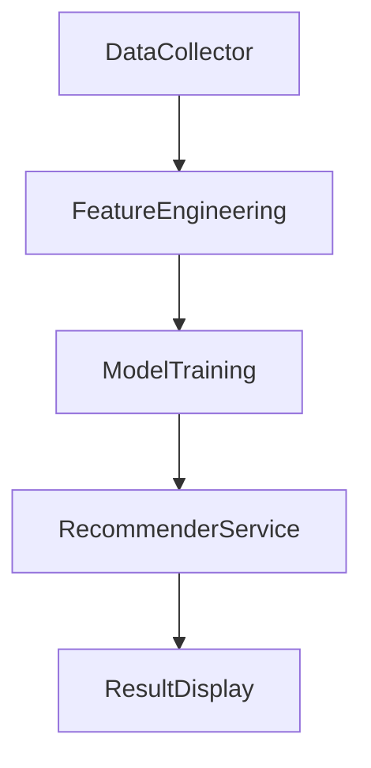

                 


# 开发智能化的金融产品推荐引擎

## 关键词：
- 人工智能，机器学习，推荐系统，金融产品，深度学习

## 摘要：
本文将指导读者从零开始构建一个智能金融产品推荐引擎。通过详细分析推荐系统的背景、核心概念、算法原理、系统架构设计和项目实战，读者将能够掌握开发高效、智能的金融推荐系统所需的理论知识和实践技能。文章还提供了最佳实践和注意事项，帮助读者在实际项目中避免常见错误并优化系统性能。

---

# 第一部分: 金融产品推荐引擎的背景与核心概念

## 第1章: 金融产品推荐引擎的背景介绍

### 1.1 问题背景与目标
#### 1.1.1 传统金融产品推荐的局限性
- 传统推荐方法的不足：基于规则的推荐、简单统计分析的局限性
- 用户需求多样性与产品复杂性
- 数据稀疏性与实时性需求

#### 1.1.2 智能化推荐的需求与目标
- 用户行为分析与个性化需求
- 精准营销与风险管理
- 提升用户体验与投资效率

#### 1.1.3 金融推荐引擎的核心价值
- 帮助用户发现潜在投资机会
- 提高金融机构的推荐效率
- 实现风险控制与收益平衡

### 1.2 问题描述与边界
#### 1.2.1 金融产品推荐的典型场景
- 股票、基金、保险、理财产品推荐
- 用户分层与定制化推荐
- 实时更新与动态调整

#### 1.2.2 用户行为与产品特征的分析
- 用户行为数据：点击、浏览、购买、收藏
- 产品特征：风险等级、收益预期、投资期限、产品类型
- 用户画像：风险偏好、投资周期、资金规模

#### 1.2.3 推荐系统的边界与外延
- 数据范围：内部数据与外部数据的结合
- 推荐范围：个性化推荐与群体推荐
- 推荐频率：实时推荐与定期推荐

### 1.3 核心概念与系统架构
#### 1.3.1 推荐系统的组成要素
- 数据层：用户数据、产品数据、交互数据
- 模型层：协同过滤、基于内容的推荐、混合推荐
- 服务层：推荐引擎、结果展示、反馈机制

#### 1.3.2 系统的输入输出定义
- 输入：用户信息、产品信息、交互数据
- 输出：推荐列表、推荐评分、推荐理由

#### 1.3.3 核心概念的ER实体关系图
```mermaid
er
    User {
        id: int
        name: string
        age: int
        risk_level: string
    }
    Product {
        id: int
        name: string
        type: string
        risk_rating: int
        return_rate: float
    }
    Recommendation {
        user_id: int
        product_id: int
        score: float
        timestamp: datetime
    }
    User-Product {
        user_id: int
        product_id: int
        interaction_type: string
        interaction_time: datetime
    }
```

### 1.4 核心概念对比与分析
#### 1.4.1 不同推荐算法的对比
| 算法类型       | 特点               | 优缺点                   |
|----------------|--------------------|--------------------------|
| 协同过滤       | 基于用户相似性     | 计算简单，但数据稀疏性高 |
| 基于内容的推荐 | 基于产品特征       | 内容丰富，但冷启动问题   |
| 混合推荐模型     | 综合多种方法       | 结果更准确，但计算复杂    |

---

## 第2章: 推荐系统的核心算法与实现

### 2.1 协同过滤算法
#### 2.1.1 基于用户的协同过滤
- 计算用户相似性：余弦相似度、皮尔逊相关系数
- 推荐生成：基于相似用户的评分平均值

#### 2.1.2 基于物品的协同过滤
- 计算物品相似性：余弦相似度、Jaccard系数
- 推荐生成：基于相似物品的评分加权

#### 2.1.3 协同过滤的实现步骤
1. 收集用户-产品交互数据
2. 计算用户或物品的相似性矩阵
3. 基于相似性生成推荐列表

### 2.2 基于内容的推荐算法
#### 2.2.1 文本挖掘与特征提取
- TF-IDF、Word2Vec、BERT
- 产品描述、标签、类别特征提取

#### 2.2.2 基于内容的推荐实现
1. 提取产品特征向量
2. 计算用户偏好向量
3. 基于相似度生成推荐

### 2.3 混合推荐模型
#### 2.3.1 混合推荐的优势
- 结合协同过滤和基于内容的优势
- 提高推荐准确性和多样性

#### 2.3.2 混合推荐的实现
1. 分别生成协同过滤和基于内容的推荐列表
2. 通过加权融合生成最终推荐

---

## 第3章: 深度学习在金融推荐中的应用

### 3.1 基于神经网络的推荐系统
#### 3.1.1 简单的神经网络结构
- 输入层、隐藏层、输出层
- 用于用户-产品交互预测

#### 3.1.2 基于深度学习的推荐模型
- 多层感知机（MLP）
- 卷积神经网络（CNN）
- 循环神经网络（RNN）

#### 3.1.3 深度学习的优势
- 处理高维数据能力强
- 捕捉非线性关系

### 3.2 基于注意力机制的推荐
#### 3.2.1 注意力机制简介
- 通过权重分配捕捉关键特征

#### 3.2.2 在推荐系统中的应用
- 用户行为序列分析
- 产品特征的重要性排序

---

## 第4章: 系统架构与实现方案

### 4.1 系统架构设计
#### 4.1.1 整体架构
- 数据采集模块
- 特征工程模块
- 模型训练模块
- 推荐服务模块
- 结果展示模块

#### 4.1.2 模块间关系


### 4.2 系统接口设计
#### 4.2.1 数据接口
- 数据输入格式：JSON、CSV
- 数据清洗与预处理

#### 4.2.2 模型接口
- 模型训练接口
- 推荐结果输出接口

### 4.3 系统交互流程
#### 4.3.1 用户请求处理
1. 用户输入查询
2. 系统分析用户特征
3. 生成推荐列表
4. 返回推荐结果

#### 4.3.2 实时更新机制
- 定时更新模型
- 动态调整推荐策略

---

## 第5章: 项目实战与优化

### 5.1 环境安装与配置
#### 5.1.1 环境搭建
- 安装Python、Jupyter Notebook、Pandas、Scikit-learn、TensorFlow

#### 5.1.2 数据准备
- 数据下载
- 数据清洗
- 数据预处理

### 5.2 核心代码实现
#### 5.2.1 协同过滤算法实现
```python
import numpy as np
from sklearn.metrics.pairwise import cosine_similarity

# 示例数据：用户-产品评分矩阵
user_product_matrix = np.array([
    [4, 3, 0, 0],
    [3, 4, 2, 0],
    [0, 2, 4, 3],
    [0, 0, 3, 4]
])

# 计算余弦相似度
similarity = cosine_similarity(user_product_matrix)
print(similarity)
```

#### 5.2.2 基于内容的推荐实现
```python
from sklearn.feature_extraction.text import TfidfVectorizer

# 示例产品描述
product_descriptions = [
    "股票 投资 高风险",
    "基金 稳定 收益",
    "保险 保障 长期",
    "理财产品 短期 高流动性"
]

# 提取TF-IDF特征
vectorizer = TfidfVectorizer()
tfidf_matrix = vectorizer.fit_transform(product_descriptions)
print(tfidf_matrix.shape)
```

### 5.3 案例分析与优化
#### 5.3.1 案例分析
- 系统性能测试
- 推荐结果分析

#### 5.3.2 优化方向
- 模型调优
- 系统性能优化
- 用户反馈机制优化

---

## 第6章: 最佳实践与注意事项

### 6.1 开发中的注意事项
- 数据质量与清洗的重要性
- 模型选择与优化
- 系统性能与扩展性

### 6.2 最佳实践
#### 6.2.1 数据处理
- 数据归一化
- 数据增强

#### 6.2.2 模型部署
- 使用容器化技术
- 实施持续集成和持续部署（CI/CD）

### 6.3 未来研究方向
- 多模态推荐
- 联邦学习
- 解释性推荐

---

## 第7章: 总结与展望

### 7.1 本文总结
- 介绍了金融推荐引擎的核心概念与算法
- 推荐系统架构与实现方案
- 提供了项目实战与最佳实践

### 7.2 未来展望
- 推荐系统与人工智能的结合
- 高效算法与分布式计算
- 用户隐私与数据安全

---

## 参考文献

---

## 作者信息

作者：AI天才研究院/AI Genius Institute & 禅与计算机程序设计艺术 /Zen And The Art of Computer Programming

