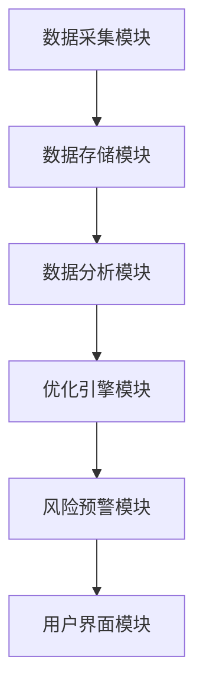

                 

# 开发智能化的金融产品生命周期管理与优化引擎

## 关键词：金融产品生命周期、优化引擎、智能化管理、机器学习、知识图谱

## 摘要：  
随着金融行业的快速发展，金融产品的生命周期管理变得日益复杂。为了提高管理效率、降低风险并提升客户体验，智能化的金融产品生命周期管理与优化引擎成为必然趋势。本文将详细探讨如何利用机器学习、深度学习和知识图谱等技术，构建智能化的优化引擎，实现金融产品的全生命周期智能化管理。

---

## 第一部分: 金融产品生命周期管理与优化引擎概述

### 第1章: 金融产品生命周期管理概述

#### 1.1 金融产品生命周期的定义与特点
##### 1.1.1 金融产品生命周期的定义
金融产品生命周期是指从产品设计、开发、上线、运营到退市的全过程。它涵盖了产品的整个生命周期，包括市场需求分析、产品设计、开发、测试、上线、监控、优化和退市等阶段。

##### 1.1.2 金融产品生命周期的核心特点
1. **动态性**：金融市场的环境变化迅速，产品生命周期需要实时调整。
2. **复杂性**：金融产品涉及多种因素，如市场波动、政策变化、客户需求等。
3. **风险管理**：在产品生命周期的每个阶段，都需要进行风险评估和管理。

##### 1.1.3 金融产品生命周期的阶段划分
1. **设计阶段**：需求分析、产品设计、风险评估。
2. **开发阶段**：产品开发、测试、上线。
3. **运营阶段**：监控、优化、客户反馈收集。
4. **退市阶段**：产品下架、资产清算。

#### 1.2 智能化管理的必要性
##### 1.2.1 传统金融产品管理的局限性
传统金融产品管理依赖人工操作，效率低、风险高，难以应对复杂多变的市场环境。

##### 1.2.2 智能化管理的优势与价值
1. **提高效率**：通过自动化技术，缩短产品开发和优化周期。
2. **降低风险**：利用机器学习和大数据分析，提前识别和规避风险。
3. **提升客户体验**：通过个性化推荐和实时反馈，提高客户满意度。

##### 1.2.3 金融行业智能化转型的趋势
随着人工智能和大数据技术的发展，金融行业正在加速智能化转型，智能化管理成为行业趋势。

### 第2章: 优化引擎的核心概念与目标

#### 2.1 优化引擎的定义与功能
##### 2.1.1 优化引擎的定义
优化引擎是一种基于人工智能和大数据技术的系统，用于优化金融产品的全生命周期管理。

##### 2.1.2 优化引擎的主要功能
1. **数据采集与分析**：实时采集和分析金融市场数据，为产品优化提供依据。
2. **智能推荐**：根据客户需求和市场趋势，推荐最优的产品设计方案。
3. **风险预警**：通过机器学习模型，实时预警潜在风险。
4. **自动化优化**：根据实时数据和反馈，自动调整产品策略。

##### 2.1.3 优化引擎的关键技术
1. **机器学习**：用于数据分析和预测。
2. **深度学习**：用于复杂模式识别。
3. **知识图谱**：用于构建金融知识库，支持智能决策。

#### 2.2 优化引擎的目标与应用场景
##### 2.2.1 提高金融产品管理效率
通过自动化技术，缩短产品开发和优化周期，提高管理效率。

##### 2.2.2 降低风险与成本
利用机器学习和大数据分析，提前识别和规避风险，降低管理成本。

##### 2.2.3 提升客户体验与满意度
通过个性化推荐和实时反馈，提高客户满意度和产品粘性。

---

## 第二部分: 优化引擎的核心技术与算法原理

### 第3章: 数据驱动的优化方法

#### 3.1 数据采集与处理
##### 3.1.1 数据源的多样性
优化引擎需要采集多种数据源，包括市场数据、客户数据、产品数据等。

##### 3.1.2 数据清洗与预处理
对采集到的数据进行清洗和预处理，确保数据质量和一致性。

##### 3.1.3 数据存储与管理
使用数据库和大数据平台，对数据进行存储和管理，支持高效的查询和分析。

#### 3.2 数据分析与建模
##### 3.2.1 数据分析方法
包括描述性分析、诊断性分析、预测性分析和规范性分析。

##### 3.2.2 数据建模的步骤与方法
1. **数据准备**：清洗、特征选择。
2. **模型训练**：选择合适的算法，训练模型。
3. **模型评估**：验证模型的准确性和稳定性。
4. **模型部署**：将模型应用于实际业务场景。

##### 3.2.3 常见的数据分析工具与技术
包括Python（Pandas、NumPy）、R、SQL、Excel等。

### 第4章: 机器学习与深度学习在优化中的应用

#### 4.1 机器学习基础
##### 4.1.1 机器学习的定义与分类
1. **监督学习**：根据标记数据进行学习，如回归、分类。
2. **无监督学习**：在无标记数据中发现模式，如聚类。
3. **强化学习**：通过与环境互动，学习最优策略。

##### 4.1.2 常见的机器学习算法
1. **线性回归**：用于预测连续型变量。
2. **支持向量机（SVM）**：用于分类和回归。
3. **随机森林**：用于分类和回归，基于决策树的集成方法。

#### 4.2 深度学习在金融产品优化中的应用
##### 4.2.1 深度学习的基本原理
深度学习通过多层神经网络，自动提取数据特征，适用于复杂模式识别。

##### 4.2.2 深度学习在金融时间序列分析中的应用
1. **LSTM网络**：用于时间序列预测，捕捉长期依赖关系。
2. **GRU网络**：用于时间序列预测，计算速度更快。

##### 4.2.3 深度学习在风险评估中的应用
1. **信用评分模型**：基于深度学习，评估客户的信用风险。
2. **市场风险模型**：预测市场波动，评估投资组合风险。

### 第5章: 知识图谱与规则引擎

#### 5.1 知识图谱的构建与应用
##### 5.1.1 知识图谱的定义与构建方法
知识图谱是一种图结构，用于表示实体及其关系。构建方法包括数据抽取、实体识别、关系抽取等。

##### 5.1.2 知识图谱在金融产品管理中的应用
1. **产品推荐**：基于知识图谱，推荐相关产品。
2. **风险评估**：通过知识图谱，识别潜在风险。

##### 5.1.3 知识图谱的可视化与分析
使用工具如Neo4j、Graphviz，对知识图谱进行可视化和分析。

#### 5.2 规则引擎的原理与应用
##### 5.2.1 规则引擎的定义与原理
规则引擎是一种用于执行业务规则的系统，通过配置规则，实现自动化决策。

##### 5.2.2 规则引擎在金融产品管理中的应用
1. **风险控制**：根据预设规则，自动触发风险预警。
2. **自动化审批**：基于规则，自动审批产品申请。

##### 5.2.3 规则引擎的开发与管理
1. **规则定义**：使用规则语言（如Drools）定义规则。
2. **规则部署**：将规则部署到规则引擎中。
3. **规则监控**：监控规则的执行情况，及时调整规则。

---

## 第三部分: 系统分析与架构设计方案

### 第6章: 系统分析与架构设计

#### 6.1 系统分析与功能设计
##### 6.1.1 系统目标
构建智能化的金融产品生命周期管理与优化引擎，实现产品全生命周期的智能化管理。

##### 6.1.2 系统功能需求
1. **数据采集与处理**：实时采集市场数据、客户数据等。
2. **数据分析与建模**：对数据进行分析和建模，生成优化方案。
3. **智能推荐**：根据分析结果，推荐最优产品设计方案。
4. **风险预警**：实时监控风险，触发预警。
5. **自动化优化**：根据实时反馈，自动调整产品策略。

##### 6.1.3 系统功能模块划分
1. **数据采集模块**：负责数据的采集和预处理。
2. **数据分析模块**：负责数据分析和建模。
3. **优化引擎模块**：负责生成优化方案。
4. **风险预警模块**：负责实时风险监控和预警。
5. **用户界面模块**：提供友好的用户界面，方便用户操作。

#### 6.2 系统架构设计
##### 6.2.1 系统架构设计
1. **数据层**：存储数据，支持高效查询。
2. **计算层**：进行数据分析和建模。
3. **应用层**：实现系统功能，包括数据采集、优化引擎、风险预警等。
4. **用户层**：提供用户界面，与用户交互。

##### 6.2.2 系统架构图（使用Mermaid）

#### 6.3 接口设计与交互设计
##### 6.3.1 接口设计
1. **数据接口**：与外部数据源对接，获取实时数据。
2. **API接口**：提供RESTful API，供其他系统调用。
3. **用户接口**：提供图形化界面，方便用户操作。

##### 6.3.2 交互设计
1. **用户登录与权限管理**：实现用户身份验证和权限管理。
2. **数据可视化**：通过图表展示数据分析结果。
3. **优化方案展示**：展示优化引擎生成的优化方案。

---

## 第四部分: 项目实战与案例分析

### 第7章: 项目实战

#### 7.1 环境搭建与数据准备
##### 7.1.1 环境搭建
1. **安装Python**：推荐使用Anaconda，安装Jupyter Notebook。
2. **安装相关库**：如Pandas、NumPy、Scikit-learn、TensorFlow、Keras、Drools等。

##### 7.1.2 数据准备
1. **数据来源**：可以从金融数据提供商获取，如Yahoo Finance、Alpha Vantage等。
2. **数据清洗**：去除缺失值、异常值，标准化数据。

#### 7.2 核心功能实现
##### 7.2.1 数据采集与处理
编写Python代码，使用requests库获取实时数据，使用Pandas进行数据清洗和预处理。

##### 7.2.2 数据分析与建模
使用Scikit-learn进行机器学习模型训练，使用TensorFlow进行深度学习模型训练。

##### 7.2.3 优化引擎实现
基于机器学习和深度学习模型，构建优化引擎，生成优化方案。

##### 7.2.4 风险预警实现
使用Drools规则引擎，设置风险预警规则，实时监控风险。

#### 7.3 系统测试与优化
##### 7.3.1 功能测试
测试系统功能，确保各模块正常运行。

##### 7.3.2 性能测试
测试系统性能，优化系统架构，提升处理速度。

##### 7.3.3 用户测试
邀请用户进行测试，收集反馈，优化用户界面和功能。

### 第8章: 案例分析

#### 8.1 案例背景与需求分析
##### 8.1.1 案例背景
某金融机构希望优化其金融产品的生命周期管理，提高管理效率和客户满意度。

##### 8.1.2 案例需求
1. **数据采集与分析**：实时采集市场数据和客户数据，进行分析和建模。
2. **智能推荐**：根据客户需求和市场趋势，推荐最优产品设计方案。
3. **风险预警**：实时监控风险，触发预警。
4. **自动化优化**：根据实时反馈，自动调整产品策略。

#### 8.2 系统实现与结果展示
##### 8.2.1 系统实现
基于优化引擎，实现数据采集、分析、优化和预警功能。

##### 8.2.2 结果展示
1. **数据分析结果**：通过图表展示数据分析结果。
2. **优化方案展示**：展示优化引擎生成的优化方案。
3. **风险预警结果**：展示风险预警结果，提供预警信息。

#### 8.3 优化效果与经验总结
##### 8.3.1 优化效果
1. **效率提升**：产品开发和优化周期缩短。
2. **风险降低**：通过风险预警，有效规避潜在风险。
3. **客户满意度提高**：通过个性化推荐，提高客户满意度。

##### 8.3.2 经验总结
1. **数据质量**：数据质量是优化引擎的关键，需要确保数据的准确性和完整性。
2. **模型选择**：根据实际需求，选择合适的机器学习和深度学习算法，提高模型准确性和稳定性。
3. **规则引擎**：通过规则引擎，实现自动化决策，提高系统效率和准确性。

---

## 第五部分: 最佳实践与总结

### 第9章: 最佳实践与注意事项

#### 9.1 开发过程中的注意事项
1. **数据安全**：确保数据的安全性，防止数据泄露。
2. **模型更新**：定期更新模型，保持模型的准确性和有效性。
3. **系统维护**：定期维护系统，确保系统的稳定性和高效性。

#### 9.2 系统维护与优化建议
1. **监控系统性能**：实时监控系统性能，及时发现和解决问题。
2. **优化算法**：根据实际需求，优化机器学习和深度学习算法，提高模型性能。
3. **更新规则**：根据市场变化，及时更新规则引擎中的规则，确保规则的有效性。

### 第10章: 总结与展望

#### 10.1 文章总结
本文详细探讨了开发智能化的金融产品生命周期管理与优化引擎的核心技术与实现方法，结合实际案例，展示了优化引擎在金融产品管理中的应用价值。

#### 10.2 未来的发展方向
1. **多模态数据融合**：将文本、图像等多种数据类型融合，提高数据分析的准确性。
2. **联邦学习**：在保证数据隐私的前提下，进行跨机构数据协作，提高模型的泛化能力。
3. **实时决策**：通过边缘计算和实时数据分析，实现金融产品的实时优化和决策。

---

## 作者：AI天才研究院/AI Genius Institute & 禅与计算机程序设计艺术 /Zen And The Art of Computer Programming

