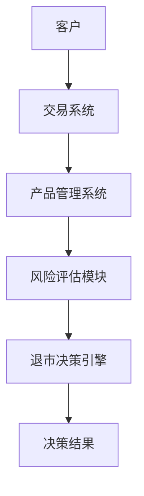
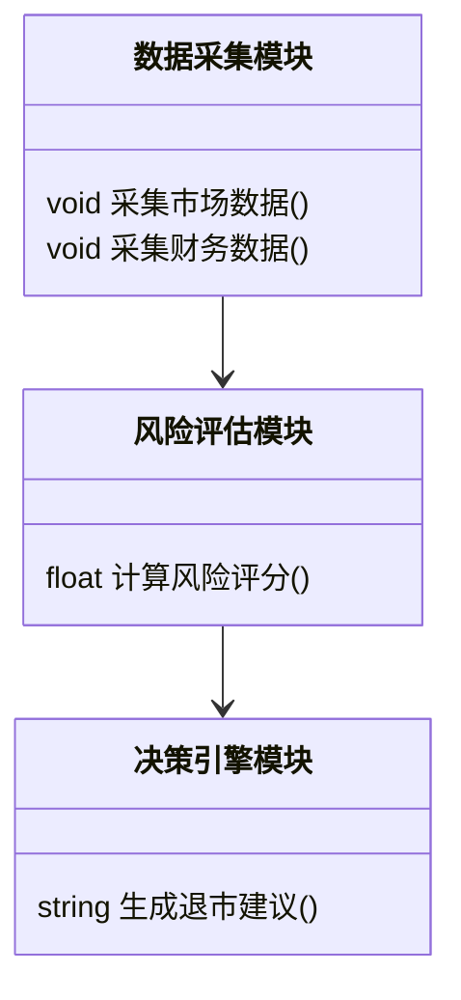
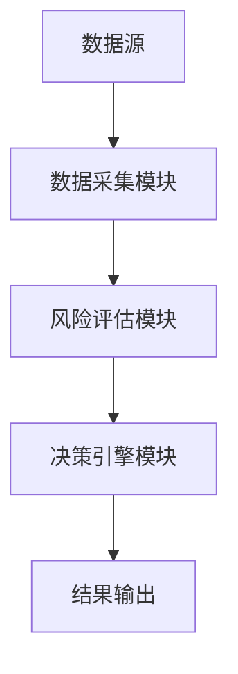
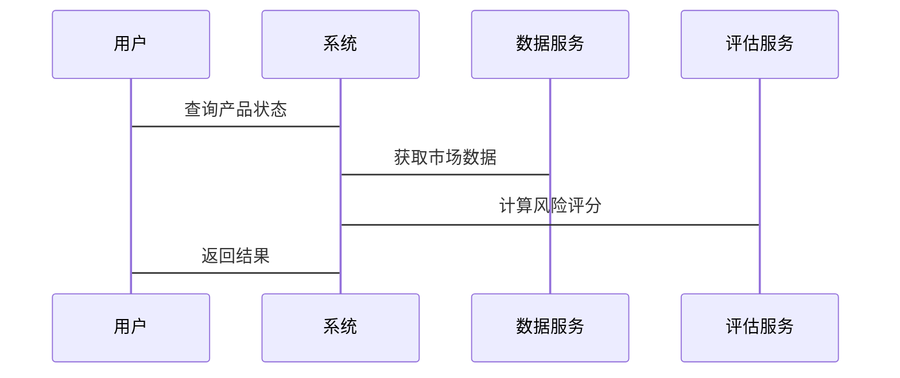

                 


# 开发智能化的金融产品生命周期管理与退市决策引擎

**关键词：** 金融产品生命周期，退市决策，人工智能，机器学习，系统架构设计

**摘要：**  
随着金融市场日益复杂化，传统的金融产品管理方式已难以应对多样化的市场需求和风险挑战。本文章详细探讨如何通过智能化的金融产品生命周期管理与退市决策引擎，结合先进的机器学习算法和系统架构设计，实现精准的风险评估和高效决策。文章内容涵盖背景分析、核心概念、算法原理、系统设计、项目实战及最佳实践，旨在为金融机构提供可参考的技术方案。

---

## 第1章：金融产品生命周期管理与退市决策引擎概述

### 1.1 问题背景

#### 1.1.1 金融产品的生命周期管理
金融产品的生命周期通常包括**上市、运行和退市**三个阶段。传统的退市决策主要依赖人工判断，容易受到主观因素、市场波动和信息不全的影响，存在效率低、风险高的问题。

#### 1.1.2 退市决策的重要性
退市决策是金融产品管理的核心环节，直接影响企业的资本结构和市场风险。准确的退市决策能够降低金融风险，优化资源配置，提升企业运营效率。

#### 1.1.3 传统退市决策的局限性
- 依赖人工经验，主观性较强。
- 数据处理能力有限，难以应对海量数据。
- 市场波动快，决策滞后风险高。

#### 1.1.4 智能化退市决策的必要性
通过智能化的退市决策引擎，利用机器学习和大数据分析技术，可以提高决策的准确性和效率，降低人为错误和市场风险。

### 1.2 核心概念与问题描述

#### 1.2.1 金融产品生命周期的定义
金融产品生命周期包括**上市、运行和退市**三个阶段，每个阶段都有不同的管理目标和风险特征。

#### 1.2.2 退市决策的关键因素
- 市场表现（如股价波动、成交量变化）。
- 财务状况（如盈利能力、资产负债情况）。
- 政策因素（如监管政策变化）。

#### 1.2.3 智能化退市决策的目标与边界
- **目标**：实现精准的风险评估和高效的退市决策。
- **边界**：仅关注产品的退市阶段，不涉及产品设计和上市阶段。

#### 1.2.4 核心要素与系统架构
- **核心要素**：市场数据、财务数据、政策数据。
- **系统架构**：包括数据采集、风险评估、决策引擎和结果输出四个模块。

---

## 第2章：核心概念与联系

### 2.1 实体关系分析

```mermaid
erDiagram
    customer[客户] {
        id : integer
        name : string
    }
    product[金融产品] {
        id : integer
        name : string
        status : string
    }
    transaction[交易] {
        id : integer
        date : date
        amount : float
    }
    risk[风险评估] {
        id : integer
        score : float
        status : string
    }
    customer --> transaction : 进行
    product --> transaction : 关联
    product --> risk : 评估
```

### 2.2 核心概念属性特征对比

| 概念       | 属性       | 特征                           |
|------------|------------|--------------------------------|
| 金融产品   | 生命周期阶段 | 上市、运行、退市               |
| 退市决策   | 关键指标   | 市场表现、财务状况、政策因素   |
| 智能引擎   | 输入       | 历史数据、实时数据、外部事件   |
| 输出       | 退市建议   | 风险评估、决策支持             |

### 2.3 系统架构



---

## 第3章：算法原理讲解

### 3.1 机器学习模型

#### 3.1.1 决策树模型
- **原理**：通过特征选择构建决策树，对产品进行分类（退市或不退市）。
- **代码示例**：

```python
from sklearn.tree import DecisionTreeClassifier
from sklearn.model_selection import train_test_split
import pandas as pd

# 数据加载与预处理
data = pd.read_csv('退市数据.csv')
X = data[['市盈率', '营收增长率', '净利润率']]
y = data['退市标志']

# 数据分割
X_train, X_test, y_train, y_test = train_test_split(X, y, test_size=0.2)

# 模型训练
model = DecisionTreeClassifier()
model.fit(X_train, y_train)

# 预测与评估
print(model.score(X_test, y_test))
```

#### 3.1.2 深度学习模型
- **原理**：使用LSTM网络分析时间序列数据，预测市场趋势。
- **代码示例**：

```python
import keras
from keras.layers import LSTM, Dense
from keras.models import Sequential

# 模型构建
model = Sequential()
model.add(LSTM(64, input_shape=(None, 5)))
model.add(Dense(1, activation='sigmoid'))
model.compile(loss='binary_crossentropy', optimizer='adam', metrics=['accuracy'])
```

### 3.2 算法实现

- **数据预处理**：包括数据清洗、特征选择和标准化。
- **模型训练**：使用训练数据拟合模型，调整超参数优化性能。
- **结果分析**：通过混淆矩阵和ROC曲线评估模型效果。

---

## 第4章：系统分析与架构设计

### 4.1 问题场景介绍
描述一个典型金融产品管理场景，如某公司股票面临退市风险，系统需通过分析市场数据、财务指标和政策变化，做出退市决策。

### 4.2 项目介绍
本项目旨在开发一个智能化的退市决策引擎，帮助金融机构优化退市决策流程，降低风险。

### 4.3 系统功能设计



### 4.4 系统架构设计



### 4.5 接口设计和交互流程



---

## 第5章：项目实战

### 5.1 环境安装

```bash
pip install scikit-learn keras pandas
```

### 5.2 核心实现

```python
import pandas as pd
from sklearn.ensemble import RandomForestClassifier

# 数据加载
data = pd.read_csv('退市数据.csv')

# 特征选择
features = ['市盈率', '营收增长率', '净利润率', '行业风险']
target = '退市标志'

# 数据分割
X = data[features]
y = data[target]

# 模型训练
model = RandomForestClassifier(n_estimators=100)
model.fit(X, y)

# 预测
print(model.predict(X))
```

### 5.3 案例分析
通过具体案例，展示如何利用模型预测退市风险，评估结果的准确性，并优化模型参数。

---

## 第6章：最佳实践与总结

### 6.1 最佳实践 tips

- 数据清洗和特征工程是关键。
- 使用多种模型进行对比，选择最优方案。
- 定期更新模型，适应市场变化。

### 6.2 小结
智能化的退市决策引擎能够显著提高决策效率和准确性，帮助金融机构更好地应对市场风险。

### 6.3 注意事项

- 数据隐私和安全问题需重视。
- 模型解释性需增强，便于业务人员理解。
- 系统需具备良好的可扩展性。

### 6.4 拓展阅读

- 《机器学习实战》
- 《深度学习入门》
- 《系统架构设计》

---

**作者：AI天才研究院/AI Genius Institute & 禅与计算机程序设计艺术/Zen And The Art of Computer Programming**

---

感谢您的阅读！希望这篇文章能为您提供开发智能化金融产品管理系统的有益参考。

